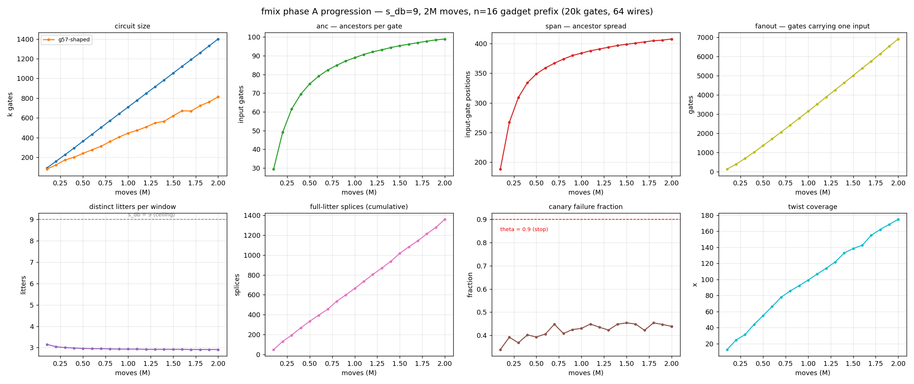
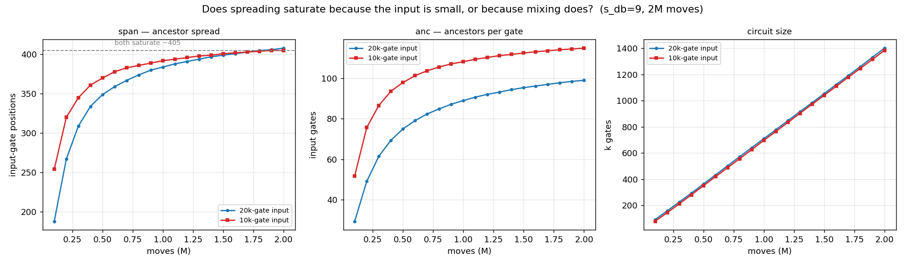
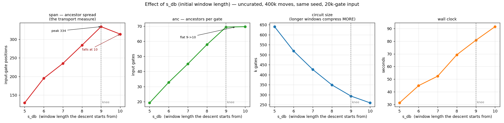
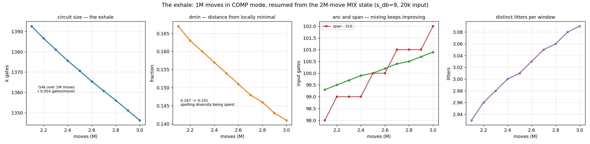
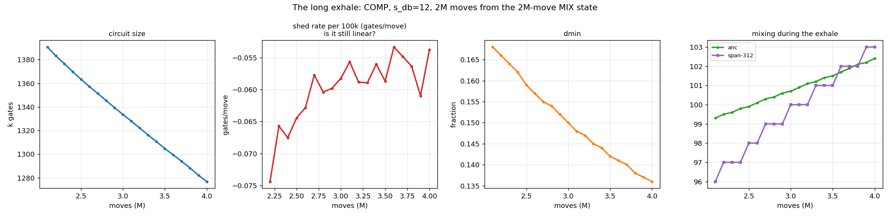

# Ancestry instrumentation for fmix

*2026-07-28. Why the origin-based transport meters stopped working, what
replaced them, and what the replacement measured.*

Figures: `reports/ancestry_20260728/`.

---

## 1. The meters that broke

`fmix` has carried three positional-mixing meters since the directional-walk
work: `odiff` (per-origin-family spread), `oadj` (adjacent-origin
autocorrelation) and `disp` (mean normalised displacement). All three read from
the per-gate `origin` tag — the index of the input gate a gate descends from.

On the restructured menu they all read "nothing has moved": `odiff = 0.0001`,
`oadj = 1.0000` after 40M moves and 2.58× growth. Taken at face value that says
the circuit is still, in ancestry layout, the original gate order.

It does not say that. A DB splice over a window spanning **mixed lineage**
stamps its products `ORIGIN_SYNTH` ([`mix.rs`](../src/postmix/mix.rs), splice
path), and `origin_diffusion`, `adjacent_origin_autocorr` and
`origin_displacement` all **skip** those gates. So the three meters are computed
over the material mixing has *failed to touch*, and they get more selective the
better the mixing works — survivorship bias pointing exactly the wrong way.

`osyn` was added to make the bias visible rather than argue about it. It is the
fraction of gates whose ancestry label has been destroyed:

| moves | 250k | 1M | 1.75M | 2.5M | 3M |
|---|---|---|---|---|---|
| `osyn` | 22.9% | **50.7%** | 63.3% | 72.3% | **77.0%** |

Half the circuit by 1M moves. On the small-circuit runs below it reaches
**1.000** — every gate has lost its label, so `odiff`/`oadj`/`disp` are not
degraded there but *undefined*.

**Rule: read `osyn` first. Once it is high, the three origin meters carry no
information.**

---

## 2. What replaced them

A set union has no such failure mode: merging two lineages *adds* information
where a scalar label has to discard it.

Each **litter** — the set of gates one replacement emitted — carries the set of
original input gates that contributed to it: the union of the sets of the
litters its outgoing window drew on. Splits already propagate the parent's
litter id, so they inherit the set for free, which is why this hooks four places
rather than the thirteen that assign gate metadata:

- a **splice** unions its outgoing window's litters into a fresh litter;
- a **merge** unions both parents (ancestry comes from both, even though
  provenance picks a side);
- **born-random** material (twist bracket packets) has none;
- input gate `i` is litter `i`.

Two implementation choices keep it affordable. **Singleton sets are not
stored**: any litter id below the input count with no map entry denotes `{id}`,
which makes initialisation O(1) instead of O(input²). And sets are **pruned to
live litters** at each report, so the map is bounded by live litters rather than
by total splices.

Cost is `|input|` bits per live litter, so the instrument **refuses above 20,000
input gates** and is small-input by construction. All runs below use a 20,000-
or 10,000-gate prefix of an n=16 Gray-fold gadget (64 wires).

### The three readouts

| meter | per | units | question |
|---|---|---|---|
| **`anc`** | current gate | input gates | how many original gates does this gate descend from? |
| **`span`** | current gate | input-gate positions | how far apart in the input were they? |
| **`fanout`** | *input* gate | current gates | how many gates carry information about this input gate? |

`anc` and `span` are reported with log-bucketed histograms, since the means hide
the shape: `anc` is tight and unimodal (mixing is uniform, not a few gates doing
all the work) while `span` is broad with a heavy tail.

### Two corrections made along the way

**A normalised span was the wrong measure.** Reporting span as a fraction of the
circuit implies 1.0 is the target — that information should reach across the
whole circuit — and that was never the goal. Span is reported in absolute
input-gate positions. What "enough" is still needs a reference scale from the
construction, not from the circuit's length.

**`fanout` is redundant given `anc` and size.** Both sum the same incidence
relation, so `mean_fanout = mean_anc × gates / inputs` exactly:

| `s_db` | anc | gates | predicted | reported |
|---|---|---|---|---|
| 9 | 69.4 | 293,341 | 1018 | 1015 |
| 10 | 69.7 | 259,335 | 904 | 900 |

So a fan-out *turnover* can be a size effect wearing a spreading costume — and
in the sweep below, it was. **`span` is the one that carries independent
information**, because it describes the geometry of the ancestor sets rather
than their size, and it is also the quantity that bounds how well an adversary
can localise which part of the original computation a gate came from.

---

## 3. Results

### 3.1 Progression — 2M moves at `s_db = 9`

20k-gate input, 100k-move samples.

| | start | 2M |
|---|---|---|
| size | 92k | 1,401k |
| `anc` | 29.4 | 99.0 |
| `span` | 188 | 408 |
| `fanout` | 135 | 6,909 |
| distinct litters/window | 3.15 | 2.91 |
| canary | 0.339 | 0.439 |
| `osyn` | 0.983 | **1.000** |

Ancestry climbs throughout but **decelerates**: Δ`anc` per 100k falls from +32
early to +0.5 at the end, Δ`span` from +121 to +2. Both approach an asymptote
(`anc` ≈ 105, `span` ≈ 415).

**Litter diversity is flat and low — 3.15 → 2.91 against a ceiling of 9** — and
full-litter splices accrue at a dead-constant ~70 per 100k moves from the first
interval to the last. That is an equilibrium reached almost immediately, not a
transient: windows keep being drawn from ~3 replacement events even though they
span 9 gates. Two-thirds of each window's potential diversity is unused, which
is an argument for the (built, untested) `--litter-samples` diversity
preference.

The canary is healthy and stable against θ = 0.9, drifting up as the pool
concentrates on harder gates, as designed.

### 3.2 Is saturation the input's fault? — 10k vs 20k

Halving the input should roughly halve the reachable span if input size is the
binding constraint.

| at 2M moves | 20k input | 10k input |
|---|---|---|
| **span** | **408** | **405** |
| `anc` | 99.0 | 114.9 |
| size | 1,401k | 1,384k |
| growth ratio | 70× | **138×** |

**Span lands on the same value from a halved input.** The two runs differ on
everything that could plausibly drive it — half the input, twice the growth
ratio — and span does not move. So saturation is a property of the **mixing**,
not a ceiling from the original circuit.

`anc` being *higher* on the smaller input fits: same span in absolute positions,
but 138× versus 70× growth means more splices per input gate, so more of the
gates inside that ~405-position window actually get combined. **Growth drives
`anc`; something else pins `span`.**

### 3.3 What pins span — the `s_db` sweep

Uncurated, 400k moves, same seed, 20k input.

| `s_db` | anc | span | fanout | size | wall |
|---|---|---|---|---|---|
| 5 | 19.2 | 129 | 614 | 640,596 | 31.3 s |
| 6 | 32.8 | 195 | 848 | 518,594 | 44.9 s |
| 7 | 45.0 | 235 | 956 | 426,263 | 52.4 s |
| 8 | 57.8 | 284 | 1006 | 349,262 | 69.3 s |
| 9 | 69.4 | **334** | 1015 | 293,341 | 80.8 s |
| 10 | 69.7 | 314 | 900 | 259,335 | 91.5 s |

**Span rises ~+51 positions per extra gate of window, then turns at 10.** `anc`
goes flat exactly where span turns (69.4 → 69.7) — same number of ancestors,
packed tighter. So **span is a tunable, not a limit**: the reach of the mixing
operator is set by how much a window spans, and information travels only as far
as overlapping windows carry it. Running longer buys `anc`; it buys almost no
`span` after the first ~500k moves.

**Size falls 60% across the sweep and keeps falling past the knee.** Longer
windows find free (non-growing) matches far more often — the splice histogram
gives the free fraction as 0% / 10.5% / 23.1% / 39.9% / 68.8% at lengths 1–5 —
so they pay less. Past the knee that extra length is spent on *compression*
rather than combination: the 10-rung behaves like a COMP move embedded in MIX,
pulling toward local minimality. A built-in damper.

Wall clock rises 192% monotonically, so `s_db = 10` is strictly worse than 9:
more time, less spreading.

**Recommendation: `s_db` 8–9 rather than the spec's 5** — 3.6× the `anc`, 2.6×
the span, and a circuit 2.2× smaller, for 2.6× the wall clock. Caveat: this is
n=16 material at 64 wires, and the store's decay with window length is
material-dependent, so the knee should be re-measured on the n=128 gadget before
any production default changes.

### 3.4 The exhale — COMP mode

1M moves in COMP resumed from the 2M-move MIX state, `s_db = 9`:

| | 2.1M | 3.0M |
|---|---|---|
| size | 1,393k | 1,346k |
| `dmin` | 0.167 | 0.141 |
| `anc` | 99.3 | 100.9 |
| span | 408 | 412 |

2M moves in COMP, `s_db = 12`, from the same state:

| | start | 2M later |
|---|---|---|
| size | 1,400,600 | 1,276,860 |
| shed rate | −0.074 → | −0.056 (flat) |
| `dmin` | 0.168 | 0.136 |
| `anc` | 99.3 | 102.4 |
| span | 408 | 415 |
| distinct litters | 2.97 | **3.54** |

**COMP wants a longer window than MIX**: −0.060 gates/move at `s_db = 12`
against −0.054 at 9. Consistent with the sweep, where size kept falling past the
mixing knee.

**Mixing does not degrade during an exhale.** `anc` and `span` both *rise*, and
litter diversity makes its largest move of any run (2.97 → 3.54). COMP-DB
splices are still re-encodings — they combine ancestry and stamp generations —
so compression is not idle time.

**The cost is entirely in `dmin`**, which falls steadily (0.168 → 0.136, ~19% of
the way to zero) and does not decelerate. That is spelling diversity being spent:
the circuit moving toward the locally-minimal form `fcompress`, which is
attacker-computable, would reach anyway.

**No bend yet at 2M moves of exhale.** The shed rate decays ~20% early then goes
flat, so by the "bend marks the natural inhale point" criterion there is a long
way still to go.

---

## 4. What this changes

1. **`odiff`, `oadj` and `disp` should not be quoted** without `osyn` beside
   them, and not at all once `osyn` is high. Any earlier transport conclusion
   drawn from them — including "transport is exactly zero after 2.58× growth" —
   is unsupported.
2. **`span` is the transport measure**; `fanout` is `anc` × size ratio and adds
   nothing; normalised span encodes a target we do not have.
3. **Span saturates for reasons internal to the mixing**, and the lever is
   window length, not run length.
4. **`s_db` should be larger than the spec's 5**, with the knee at 8–9 on this
   material, and COMP plausibly wanting more than MIX.
5. **Litter diversity is the untouched lever**: windows draw from ~3 replacement
   events against a ceiling of `s_db`, at equilibrium from the start.

## 5. Open

- Re-measure the `s_db` knee on the n=128 gadget (689k gates) — the store's
  window-length decay is material-dependent.
- Locate the shed-rate bend with a long exhale, and test whether the other
  statistics turn at the same point.
- `--litter-samples` (diversity preference) and `--litter-ban` are built and
  untested against these baselines.
- Contiguous versus convex sampling has never been separated: `p_convex = 0.5`
  in every run here, and COMP and MIX may want different geometry.
- `p_mingen` has been 0.8 throughout, including in COMP where weaker pool
  targeting may serve better.
- What counts as "enough" span needs a reference scale from the construction.

---

# Addendum, 2026-07-29 — mode schedules, effective work, and the twist cost

New machinery since §1–5, all on the 20k-gate n=16 prefix, seed 101, ancestry on:

- **Slot-0 mode overlay** (`--p-mix`): each round picks MIX-DB w.p. `p_mix` else
  COMP-DB, with per-mode knobs (`--s-db-comp` / `--p-convex-comp` /
  `--p-mingen-comp`). Lets a single run interleave growth and compression per
  move instead of phasing them.
- **`--twist-neg-p`**: probability each swapped wire is negated. 0.5 is the
  swap-family default; 0.0 is pure positive swaps (CNOT brackets, no polarity
  flips) — the control used in §10 below.
- **`g57_census`** report split: `shaped` (polarity-blind g57 shape =
  DB-effectiveness) vs `polf` (same-polarity fraction = twist odometer).

## 6. `anc` is `incidence / size`; total incidence is the invariant

Three 2M-move schedules of the same MIX/COMP budget: **A** = 200k MIX then 1.8M
COMP (phased); **B** = steady `p_mix=0.2`; **C** = steady `p_mix=0.1`. MIX uses
`s_db=9, p_convex=1, p_mingen=0.8`; COMP uses `s_db=12, p_convex=0.5,
p_mingen=0`; no twists.

| end of run | size | `anc` | `span` | `fanout` |
|---|---|---|---|---|
| A phased | 64k | 2649 | 3260 | 8521 |
| B 20% MIX | 122k | 3165 | 3820 | 19282 |
| C 10% MIX | 48k | 7941 | 8626 | 19255 |

`anc` per gate is **not** a pure mixing measure — it is `incidence / size`, so
compression inflates it. The schedule-invariant quantity is **total ancestry
incidence `anc × size` = the gate×input incidence relation**, which the report
exposes as `fanout/input`. By that measure **B ≈ C (~386M, fanout ~19,300) ≫ A
(~170M)**: steady interleave spreads far more than a single front-loaded breath,
because a short inhale is spent before compression locks it in. B and C reach
the *same* total but distribute it oppositely — C compresses into 48k gates so
each reaches 43% of the input (`span` 8626), B holds 122k gates at half that.

This retires the §3.2 "span saturates ~408" claim as an artifact of
MIX-dominated large circuits: under compression `span` climbs past 8000.

## 7. The effective-work rescale (moves per gate)

Plotting against cumulative **moves-per-gate** (`∫ dm / size`, trapezoidal)
instead of raw moves removes the fact that a move on a small circuit does more
per-gate work. The runs reach very different effective work in 2M moves —
~25× (A), ~33× (B), ~56× (C) — and **on this axis the transport curves nearly
collapse**: at 20 moves/gate, `anc` = 2.0k / 2.3k / 1.9k and `span` =
2.6k / 3.1k / 2.7k (within ~20%). So C's raw-move lead was mostly that a small
circuit buys more per-gate work per move. Residual schedule signal: A leads at
*low* work (front-loaded MIX), B's `span` genuinely saturates once its circuit
grows large (window reach diluted, not just `anc`/size), and `dmin` does **not**
collapse — B (growth) holds ~0.11 while COMP-heavy A/C decay to ~0.065, so
growth keeps the circuit farther from the `fcompress`-minimal form per unit work.

## 8. `--db-advance` rescues contiguous sampling

Repeating the §3-era convex-vs-contiguous A/B with `--db-advance` on (ballistic
birth-advance floats splice products apart):

| end `anc` | db-advance OFF | db-advance ON |
|---|---|---|
| convex | 155 | 230 |
| **contiguous** | **12** | **216** |

Contiguous sampling transported almost nothing (products born adjacent, never
moved); db-advance takes it from `anc` 12 → 216 (18×), `span` 20 → 580 (29×) —
nearly to convex parity. It is the built litter-spread, and it is what makes
contiguous windows viable.

## 9. Twists crater ancestry transport

A/B/C re-run at swap-family twist rates 0, 0.002, 0.01. Each twist rate step
drops `anc`/`span`/`fanout` by roughly an order of magnitude, **even at matched
effective work** (so not a size artifact), while `polf` climbs to its ~0.5
ceiling and `dmin` drifts *down*. Example (C): `anc` 7941 → 425 → 62;
`polf` 0 → 0.42 → 0.49. The odometer `polf` is nearly saturated already at
0.002, so **0.002 buys almost all the polarity scrambling of 0.01 at a fraction
of the ancestry cost** — if twists are wanted at all.

Mechanism: twist brackets are born-random (zero input ancestry), and a DB window
that gathers them unions less ancestry, so the DB keeps minting a large
low-ancestry population that drags the per-gate mean down. Non-comp (foreign
CNOT) material also does **not** breed — surviving foreign gates are *fewer* than
the brackets inserted (ratio 0.5–0.9); the merge/COMP machinery even removes some.

## 10. It is the CNOT brackets, not the polarity flips

Schedule B at 1% twist, isolating the two effects with `--twist-neg-p 0` (pure
positive swaps: the 3-CNOT brackets are inserted but no wire is negated):

| B, 1% twist | `anc` | `span` | `polf` | foreign CNOT |
|---|---|---|---|---|
| no twist | 3165 | 3820 | 0 | 0.3% |
| pure swap (CNOTs, no flips) | 304 | 840 | **0.000** | 22.8% |
| full family (CNOTs + flips) | 80 | 451 | 0.489 | 21.0% |

`polf=0.000` confirms the control flipped no polarities. The **foreign CNOTs
alone** collapse `anc` 3165 → 304 (**10.4×**) at the same ~22% contamination;
the polarity flips add a further 304 → 80 (3.8×). Multiplicatively
10.4 × 3.8 ≈ 39.6 = the full collapse. So blocking-by-foreign-CNOTs is the
**dominant** cost of twists and is independent of the negations — every
swap-family twist pays it. `--twist-neg-p 0` recovers only the 3.8× flip
component; the 10.4× bracket cost is structural.

## 11. What this changes

- **Report `anc × size` (or `fanout`), not `anc` alone**, when comparing
  schedules of different size — `anc`/gate is a ratio and compression inflates it.
- **Steady interleave beats a single phased breath** at equal MIX budget; the
  `p_mix` overlay is the knob. Whether *cyclic* breathing (a size band) beats
  steady C — C-like span at B-like `dmin` under bounded size — is the open test.
- **`p_convex=1` for inhale, `--db-advance` for contiguous**: both materially
  increase transport; the old `p_convex=0.5` default halved it.
- **Twists are expensive for ancestry** at any negation setting, because the
  3-CNOT brackets block mixing as foreign objects (§10). Reserve them for when
  affine/distance-gauge resistance (the `polf` axis) is worth a large ancestry
  hit, and prefer the lowest rate that moves `polf` (≈0.002).
