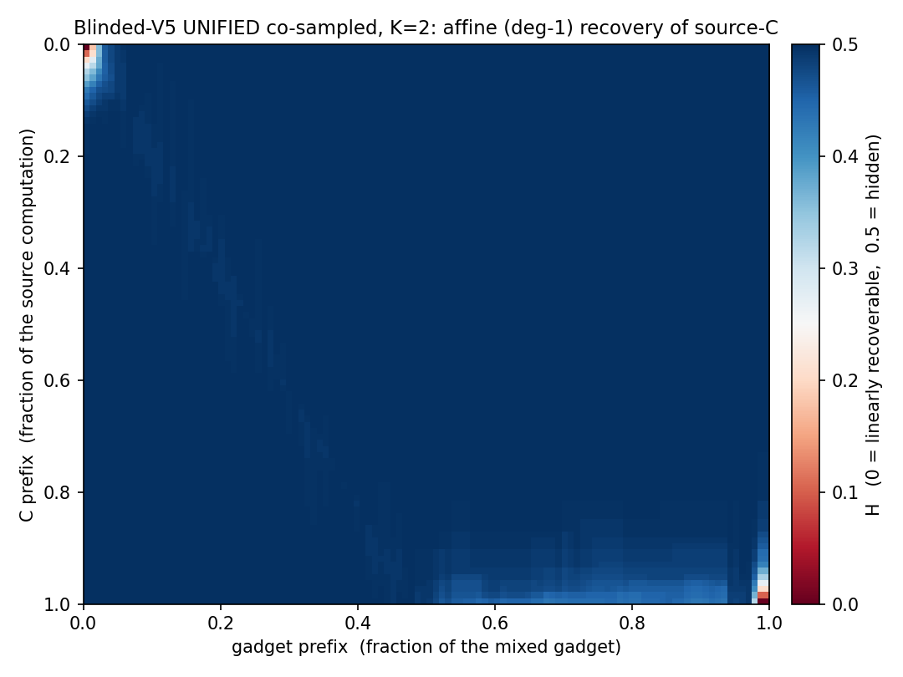
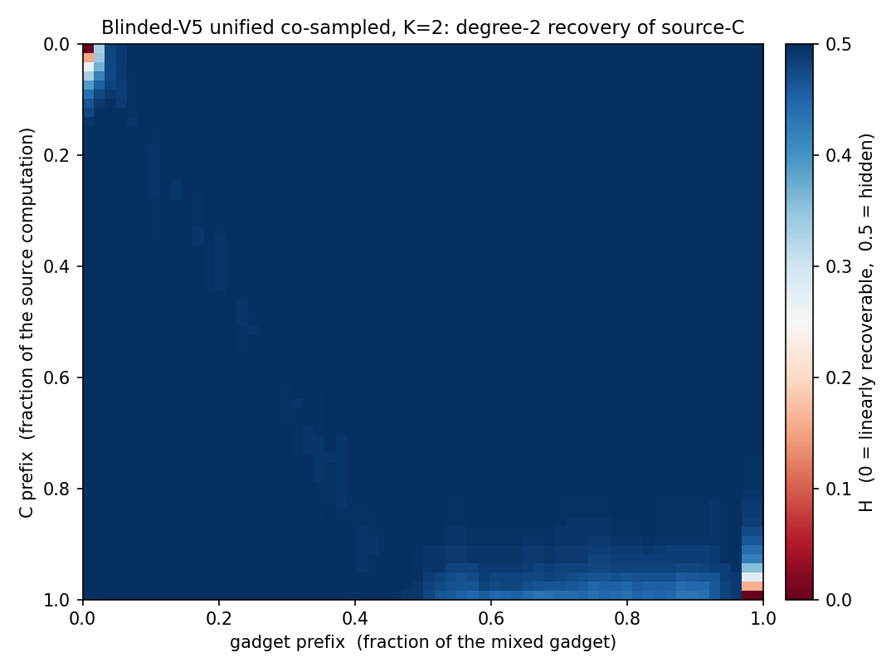

# Blinded-V5: the LGI-based compute module

*Design rationale, construction, parameters, and measurements for the
locally-geodesic-identity (LGI) computation stage.*

## Where it fits in the pipeline

The GSS gadgetization of a secret circuit `C` on `n` wires is a **5-stage**
sandwich, each stage on `2n` wires (data `0..n`, band/junk `n..2n`):

1. **slice** — a junk-guard zero-slice keyed on the band (dead at the input
   port, where the band is 0);
2. **seed the band wires** — each band wire set to `x_i ∧ ¬x_j` from the honest
   inputs;
3. **compute** — the circuit `A` (the sliced sandwich of `C`) is realised on the
   `2n` wires so that the data half carries `A`'s output and the band is only
   read;
4. **re-seed / re-randomise the band wires** — band turnover interleaved with
   the compute;
5. **re-slice** — the closing junk-guard slice (fires at the output port).

**Blinded-V5 is a drop-in alternative for stages 3–4** (the compute and its band
re-randomisation) — a replacement for the drip `route_fire` compute. It takes
`A` on `n` wires and emits an equivalent circuit `A'` on `2n` wires whose body is
a cloud of long masking identities with `A`'s gates threaded through it by a
masked read. Stages 1, 2 and 5 are unchanged.

Source: [`src/preprocessing/blinded_v5.rs`](../src/preprocessing/blinded_v5.rs).
Driver: `gen_sandwich_gadget … blinded-v5`; pipeline:
`gss_mix.sh --gadgetization-mode blinded-v5`.

---

## 1. Why this design — the rationale

The compute stage must move the circuit's intermediate state as far as possible
from the plaintext computation `A`, while keeping `A'` exactly equivalent to `A`
on the data wires. The design is a chain of forced moves.

**(a) Long identities are the only thing that moves the state substantially.**
Across the HD (Hamming-distance) and affine heatmaps, short local edits barely
displace the state: the ridge of recoverable structure only recedes when the
masking identity woven through a wire is *long* — comparable to the circuit
itself. Short masks are peeled off locally; a long identity has no local seam.

**(b) The only long identity we know that actually moves the state is the
commutative structure of an identity with a single active wire.** Take one data
("active") wire `w` and a set of control wires; a run of gates that all target
`w` and read only the controls is an identity iff the per-gate increments XOR to
zero, and — crucially — *all of its gates commute*. Commutativity is what lets
the identity be arbitrarily long and be reordered or interleaved freely; a single
active wire makes the whole run a clean identity on that wire.

**(c) We entangle identities on different active wires by separating the control
wires from the active wires and sharing the same control wires across many
identities — again via commutativity.** Every identity targets a data wire and
reads only the common **band** (`n..2n`), so identities on *different* active
wires also commute. The scaffold is one large commuting cloud — many long
identities, on many active wires, sharing controls — and a band wire's value
participates in the masks of many data wires at once.

**(d) After entangling by commutation, we add random updates of the control
wires from the active wires.** Sprinkled band updates — half controlled by live
data (`b ^= data ∧ aux`), half by other band wires (`b ^= aux ∧ aux`) — serve
two purposes: they **re-randomise** the control wires (fresh band entropy
throughout the run, not just at the seed), and they **break naive
commutation-back** (once a band wire is updated mid-run, the identities reading
it before and after no longer commute past it) — *without ruining correctness*,
because each identity is either closed before the update (STRADDLE) or re-derived
across it (REPAIR).

**(e) We build one identity longer than the whole input circuit and embed `A`
inside it via a hidden unmasking of the control wires.** The scaffold is, in
effect, a single enormous LGI over all wires. `A`'s gates fire *from inside the
mask*: at each gate the operands are momentarily and reversibly **unmasked** into
a linear combination of band wires (never bare), the gate fires as an expansion
over those masked wires, and re-masks.

**(f) The masking, the band updates, and the placement of `A`'s gates are
CO-SAMPLED together** (RC, 2026-09-04). Building them in one pass — rather than
laying a fixed scaffold and threading `A` through it afterwards — lets every
`A`-gate be straddled by a *real*, rerand-protected LGI opened exactly when that
gate needs it (see §3). This is what makes the firing-hiding complete at no cost.

---

## 2. The construction

`A` has `n` wires and `m` gates. `A'` has `2n` wires. Let `u_w` be the number of
times wire `w` is used (target or control) in `A`, and `w_w` the number of times
it is written (a target).

**Masking atom.** `g57(w,x,y) = w ^= 1 ^ (¬x ∧ y)` (comp = 1; data target, band
controls). A **disjoint-pair LGI** on `w` is `⊕ᵢ g57(w, cy[2i], cy[2i+1])`, a
deg-2 mask (the optimal sparse shape). A `g57` and its reverse **linearise**:
`g57(w,r1,r2) ⊕ g57(w,r2,r1) = w ⊕ r1 ⊕ r2` — the read exploits this (AND
monomials are symmetric and do *not* linearise). A K-*cycle* would telescope to 0
under the read's pair-completion (a bare operand), so disjoint **pairs** are used;
`K ≥ 2`.

**Co-sampled forward pass.** The LGIs, the band updates, and `A`'s gates are
emitted together. Each active wire `w` is given `u_w+1` LGIs, with at most
`max_open` open at once — the *same* masking budget as a fixed scaffold, so the
same statistics, at no cost. Of `w`'s opens, `w_w` are **STRADDLE opens**
generated on demand as `A`'s gates on `w` are placed, and the remaining
(`reads_w + 1`) are **FILLER opens** that keep `w` masked during its reads.
`A`'s gates are placed in a data-hazard-valid order (`compute_deps`: a read after
every earlier write of the wire, a write after every earlier read — same-target
XOR writes commute, so no write-after-write edge).

At each `A`-gate on active wire `c`:

- **Masked read.** For each control, LINEARISE the net-open masks (emit the
  reverse `g57` of each so the wire carries `operand ⊕ ρ`, `ρ` a linear XOR of
  band wires; a fresh-pair top-up keeps `ρ` non-empty, guaranteeing no bare
  read), realise `c ^= comp ⊕ lit(a)∧lit(b)` as `(a'⊕ρ_a)(b'⊕ρ_b)` over ONLY the
  masked control wires and band wires — never bare `a`, `b`, or `a⊕b` (0/1/2
  controls and all polarities; the 0-control fire is `¬comp`), then DE-LINEARISE.
- **Hidden firing** (§3). The fire is split and one of `c`'s LGIs is
  **straddle-opened between the halves**.

**Band re-randomisation** is woven through the same pass: `rerand_level` STRADDLE
updates (close the masks reading the updated band wire first — thins masking past
a ≈1024 knee) and `rerand_repair` REPAIR updates (emit each such mask's b-reading
`g57` with the old `b`, the update, then again with the new `b`, so the mask
stays open — no thinning). Because it runs in the same pass, it protects the
straddle opens automatically.

**Correctness** is verified exhaustively over all `2^n` inputs × many band
settings for `n ≤ 6`, `K ∈ 2..=5`, all `max_open` and both rerand kinds
(`scratchpad/v6`, 891 gadgets, 0 mismatches — plus a 360-case check that the
gate reordering preserves `A`), and end-to-end in `gen_sandwich_gadget` (forward
+ reverse-honesty sample-verify PASS).

---

## 3. Hidden firing

An **atomic**, mask-restoring gate module would leak *which gate fired*: the
active wire's before/after XOR across it equals the true gate increment
`Δ = comp ⊕ lit(a)∧lit(b)`. That per-module increment is a robust invariant
(it survives the downstream mixing), so an adversary who segments the mixed
circuit at the module boundaries reads off `A`'s gate list one gate at a time.

The fix uses the abundant masking gates on the **same active wire**: split the
gate's fire and emit one of `c`'s LGI **opens between the halves**. That mask
toggles `c` mid-fire and stays open past the module, so the module's net XOR on
`c` is `Δ ⊕ (that LGI's secret band-mask)` — never the bare increment. Because
the LGIs, rerand, and placement are co-sampled, the straddling LGI is a *real*
scaffold LGI (rerand-protected) opened exactly when the gate is placed, so
**every** gate is covered, and it reuses the wire's existing `u_w+1` LGI budget,
so there is **no size cost**. (Measured on the n=128 sandwich: 7920/7920 gates'
firing hidden.)

Earlier attempts and why they were dropped: same-active-wire *A-gate* weaving
(only ~23% of gates have a woven partner); an *injected* per-wire firing mask
(100% coverage but +43% size, because it keeps every wire extra-masked and needs
its own rerand repair); straddling *pre-existing fixed-scaffold* slots (60–70% —
the tail of each wire is slot-starved). Generating the slot on demand in a
co-sampled pass is what makes coverage complete at no cost.

---

## 4. Parameters and why

| knob | prod. | meaning | why this value |
|---|---|---|---|
| `K` | **2** | band wires per LGI = per-LGI **mask width** (⌊K/2⌋ disjoint pairs; `\|ρ\| ≈ max_open·K`) — *not* the identity's temporal length | affine- and deg-2-neutral across `K` (§5); smallest is best. Size grows ~linearly in `K`, read cost quadratically in `\|ρ\|`, so large `K` explodes (K16 ≈ 18M). Odd `K` wastes a wire (K3 ≡ K2). |
| `max_open` | **3** | rolling cap on simultaneously-open LGIs per wire; also the read-mask width floor | wider `ρ` = more local hiding, but read cost is quadratic in `\|ρ\|`; 3 is the knee. |
| `rerand_level` (straddle) | **1000** | close-straddling-masks band updates | at the safe side of the ≈1024 thinning knee. |
| `rerand_repair` (repair) | **3000** | re-derive-across-update band updates (no thinning) | stacks band turnover on top of straddle at no masking cost. |

`K` sets each LGI's **mask width** (control wires per LGI), *not* its temporal
length — the identity's circuit-spanning length is a property of the whole
scaffold (§1e), which is on by construction.

---

## 5. Measurements

All measurements are on the current co-sampled build (n=128, `|C|=|D|=3000`,
K=2), and match the pre-firing-fix baseline — the hidden-firing change did not
move them.

### 5.1 Affine ridge (linear recovery of source-C segments)

Adversary: least-squares recovery of each source-`C` wire-segment from a bounded
set of gadget wires (`hmap_affine --degree 1`; `meanH`: 0 = recoverable, 0.5 =
hidden).



- **`meanH ≈ 0.498`; ridge depth ≈ 0.05** — C-segments hidden overall.
- The **interior (~78% of rows) is fully hidden** (`H ≈ 0.49`). The only recovery
  is a thin fringe at the two **endpoints**.

### 5.2 The exposed fringe is public I/O — input segments are *not* leaked

The `≈ 6–10%` of source-C segments that are linearly exposed
(`min-H < 0.25–0.35`) are **not scattered**: they are the two corners of the
diagonal. The **input side is masked as soon as the compute begins** — the plate
shows the top rows almost entirely blue, with recovery confined to the extreme
top-left corner, i.e. the raw **input port** where `x` is public *before* any
masking is applied. The output side (bottom-right) is the necessarily-delivered
`C(x)`. In other words, the input **wire segments show a lack of linear
exposure** beyond the trivial public input; the boundary-cushion knobs measured
no effect because the fringe is unavoidable public I/O, not a leak.

### 5.3 Degree-2 recovery

A quadratic adversary (`hmap_affine --degree 2`, products over a data+band slice
— a lower bound on the deg-2 leak):



- **`meanH ≈ 0.497`; depth ≈ 0.05.** The quadratic adversary reaches only ~0.01
  deeper than affine, and only into the same low-degree I/O fringe; the interior
  stays fully hidden. Degree-2 is flat across `K`, like affine.

### 5.4 Rerand: repair vs straddle (n_A = 256, affine deg-1)

Same total dose, straddle vs repair:

| straddle | repair | gadget | meanH | affDepth |
|---|---|---|---|---|
| 0 | 0 | 670k | 0.4979 | 0.0550 |
| **1000** | **3000** | 668k | 0.4959 | **0.0514** |
| 8000 | 0 | 607k | **0.4878** | **0.0681** |
| 0 | 8000 | 780k | 0.4985 | 0.0549 |

Heavy **straddle thins** (meanH ↓, ridge ↑, gadget *shrinks* as masks close);
heavy **repair does not** (both = baseline, gadget *grows* from the pre/post
pairs). Production `1000 + 3000` sits at the baseline floor.

### 5.5 Through the GSS pipeline (K = 2 vs K = 4)

*Pending — from the `gss_mix.sh --gadgetization-mode blinded-v5` runs
(n = 128, half-size |C| = |D| = 3000; phase-A grow-to-2× then hold ≈ 10 effs,
2-eff snapshot; then split, crossing, fcompress), K = 2 and K = 4. To be
appended: affine ridge and exposed-C count at the 2-eff snapshot and at the end
of the pipeline, with the stage sizes.*

---

## 6. Tradeoffs and the current choices

- **Mask width `K` vs size.** Larger `K` widens each per-LGI mask
  (`|ρ| ≈ max_open·K`), not the temporal length. Hiding is **flat in `K`** while
  size grows ~linearly and the masked-read cost grows quadratically in `|ρ|`, so
  **K = 2** wins; K = 4 only for a wider read-mask.
- **Band turnover vs size (straddle vs repair).** More updates = more band
  entropy and stronger resistance to commutation-back, but STRADDLE thins the
  masking past ≈1024 and REPAIR grows the gadget. **1000 straddle + 3000 repair**
  balances the two at the baseline floor.
- **Firing-hiding is free** in the co-sampled build (it reuses the existing LGI
  budget); the earlier fixed-scaffold approaches paid either coverage (23–70%)
  or +43% size for it.
- **The residual fringe is I/O, not a knob.** The ~6–10% exposed segments are the
  public input/output boundary; no parameter removes them.

---

## 7. Running it

```bash
# one pipeline arm, LGI compute, K=2, half-size n=128 sandwich
scripts/gss_mix.sh -n 128 --mcd 3000 \
  --gadgetization-mode blinded-v5 --bv5-k 2 \
  --expand 2 --hold 10 -o RUNDIR
# (K=4: --bv5-k 4). fmix stages require FROZEN_DB_DIR (+ FROZEN_CURATED_DIR).

# just the gadget (stage 2), or the standalone driver:
scripts/gss_mix.sh -n 128 --mcd 3000 --gadgetization-mode blinded-v5 \
  --bv5-k 2 --stop-after 2 -o RUNDIR
blinded_v5_gadgetize src.mpmct1 out.mpmct1 <K> 0 <seed> \
  <straddle> 3 <active> <extra_lgis> <repair>
```
