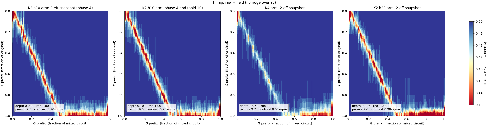
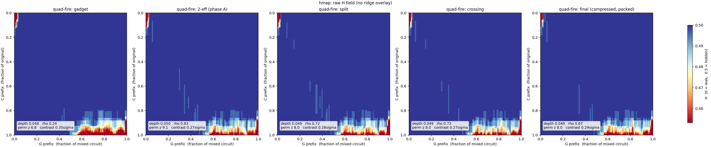
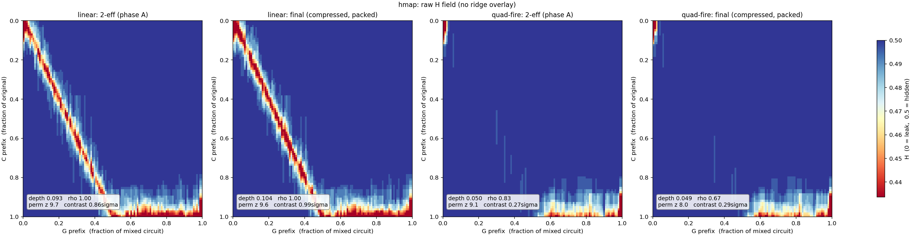

# Blinded-V5: the LGI-based compute module

*Design rationale, construction, parameters, and measurements for the
locally-geodesic-identity (LGI) computation stage.*

## Where it fits in the pipeline

A secret circuit `C` on `n` wires is protected in two steps: it is first
**gadgetized** into an equivalent but structurally-scrambled circuit on `2n`
wires, which is then **mixed** (fmix). Blinded-V5 lives inside the gadgetizer,
and this document assumes you know the earlier gadgetize designs but nothing
about V5.

The **gadgetize module** is a **5-stage** pipeline, each stage on `2n` wires
(data `0..n`, band/junk `n..2n`):

1. **slice** — a junk-guard zero-slice keyed on the band (dead at the input
   port, where the band is 0);
2. **seed the band wires** — each band wire set to `x_i ⊕ x_j` (balanced masks,
   the default) or `x_i ∧ ¬x_j` (plain masks) from the honest
   inputs;
3. **compute** — realise the input circuit `A` on the `2n` wires so the data
   half carries `A`'s output and the band is only read;
4. **re-seed / re-randomise the band wires** — band turnover; a *separate*
   module, emitted after the compute (the compute's own rerand bursts are
   masking hygiene and do not discharge it), so the band is junk at both ports;
5. **re-slice** — the closing junk-guard slice (fires at the output port).

One term to keep straight: the circuit `A` that the gadgetizer computes is **not
`C` itself**. It is the **sliced sandwich of `C`** — the output of a *separate*
**sandwich module** that wraps `C` (with a random `D`, interleaved slice blocks,
a floated column) into a `2n`-wire circuit with `A(x,0) = (junk, C(x))`. The
sandwich *generates* the circuit that the gadgetize module then computes and
mixes; it is a different module and is not one of the five stages above.

**Blinded-V5 is a drop-in replacement for stage 3 — the compute.** Where the
earlier compute stages (the drip `route_fire`, the product-share carriers)
realise `A` by *routing* each operand into position and firing a gadget there,
Blinded-V5 instead embeds `A` **inside one enormous masking identity**: the
compute's body is a cloud of long masking identities on the band, and `A`'s gates
fire from *within* the mask by a momentary, reversible unmasking of their
operands. It takes `A` and emits an equivalent `A'` on the `2n` wires; the other
four stages are unchanged. (V5 re-randomises the band *internally* as part of its
own masking hygiene — §2 — which is distinct from the separate stage-4 re-seed.)

Source: [`src/preprocessing/blinded_v5.rs`](../src/preprocessing/blinded_v5.rs).
Driver: `gen_sandwich_gadget … blinded-v5`; pipeline:
`gss_mix.sh --gadgetization-mode blinded-v5`.

---

## 1. Why this design — the rationale

The compute stage must move the circuit's intermediate state as far as possible
from the plaintext computation `A`, while keeping `A'` exactly equivalent to `A`
on the data wires. The design is a chain of forced moves.

**(a) Long identities are the only thing that moves the state substantially.**
Across the HD (Hamming-distance) and affine heatmaps, short local edits barely
displace the state: the ridge of recoverable structure only recedes when the
masking identity woven through a wire is *long* — comparable to the circuit
itself. Short masks are peeled off locally; a long identity has no local seam.

**(b) The only long identity we know that actually moves the state is the
commutative structure of an identity with a single active wire.** Take one data
("active") wire `w` and a set of control wires; a run of gates that all target
`w` and read only the controls is an identity iff the per-gate increments XOR to
zero, and — crucially — *all of its gates commute*. Commutativity is what lets
the identity be arbitrarily long and be reordered or interleaved freely; a single
active wire makes the whole run a clean identity on that wire.

**(c) We entangle identities on different active wires by separating the control
wires from the active wires and sharing the same control wires across many
identities — again via commutativity.** Every identity targets a data wire and
reads only the common **band** (`n..2n`), so identities on *different* active
wires also commute. The scaffold is one large commuting cloud — many long
identities, on many active wires, sharing controls — and a band wire's value
participates in the masks of many data wires at once.

**(d) After entangling by commutation, we add random updates of the control
wires from the active wires — in bursts.** Band updates **re-randomise** the
control wires (fresh band entropy throughout the run, not just at the seed) and
**break naive commutation-back** (once a band wire is updated mid-run, the
identities reading it before and after no longer commute past it) — *without
ruining correctness*, because each straddling identity is either closed before
the update (STRADDLE) or re-derived across it (REPAIR). The updates are emitted
in **bursts**: one *slot* is `F ≈ 8K` gates all targeting a single band wire `b`,
each control drawn independently as a live-data or a band wire (so a burst spans
all of `b ^= data ∧ aux`, `b ^= aux ∧ aux`, `b ^= data ∧ data`). Bursting serves
two ends beyond a lone update: it **concentrates** the band mixing into few slots
— so fewer straddle-closures interfere with the LGIs — and it gives each band
wire a **data-wire-like burst-of-activity signature** (a data wire fires in a
burst of tens of gates whenever it is written; a single band update would not).

**(e) We build one identity longer than the whole input circuit and embed `A`
inside it via a hidden unmasking of the control wires.** The scaffold is, in
effect, a single enormous LGI over all wires. `A`'s gates fire *from inside the
mask*: at each gate the operands are momentarily and reversibly **unmasked** into
a linear combination of band wires (never bare), the gate fires as an expansion
over those masked wires, and re-masks.

That is the whole design: a long, entangled, self-updating masking cloud with
`A` firing from inside it. Everything in §2 is *how* to realise (a)–(e) as a
single correct circuit.

---

## 2. The construction

`A` has `n` wires and `m` gates. `A'` has `2n` wires. Let `u_w` be the number of
times wire `w` is used (target or control) in `A`, and `w_w` the number of times
it is written (a target).

**Masking atom.** `g57(w,x,y) = w ^= 1 ^ (¬x ∧ y)` (comp = 1; data target, band
controls), i.e. the mask term `1 ⊕ y ⊕ x·y`. A **disjoint-pair LGI** on `w` is
`⊕ᵢ g57(w, cy[2i], cy[2i+1])`, a deg-2 mask (the optimal sparse shape). A `g57`
and its reverse **linearise**: `g57(w,r1,r2) ⊕ g57(w,r2,r1) = w ⊕ r1 ⊕ r2` — the
original read exploited this; the current read (**quad-fire**, §2 step 2, default
since 2026-09-06) deliberately does *not*, because a linearised operand is exactly
affine in band wires for a window that the pipeline's reordering stages stretch
into a leak (§5.0). A K-*cycle* would telescope to 0 under pair-completion (a bare
operand), so disjoint **pairs** are used; `K ≥ 2`.

**Why one pass — co-sampling.** The masks, the band updates, and `A`'s gates are
**co-sampled**: produced together in a single forward pass, rather than laying a
fixed masking scaffold first and threading `A` through it afterwards. The reason
is hidden firing (§3): every `A`-gate must be straddled by a *real*,
rerand-protected masking identity opened at the exact instant the gate fires.
Only a co-sampled pass can open that identity on demand, so the firing-hiding is
complete while reusing the wire's existing mask budget — at no size cost. (A
fixed scaffold, filled in afterwards, starves at the tail and covers only 60–70%
of gates; §3.)

**The algorithm.** A cheap setup, then a forward pass.

*Setup.*

1. **Mask budget.** Give each active wire `w` exactly `u_w+1` masking identities,
   split into `w_w` **straddle opens** (one per write to `w`, opened *on demand*
   at the gate that writes it — for hidden firing) and `reads_w+1` **filler
   opens** (opened between gates to keep `w` masked while it is read). At most
   `max_open` are open on a wire at once. This is the same budget a fixed
   scaffold would use, so the statistics are unchanged.
2. **Order.** Build the data-hazard DAG of `A` (`compute_deps`): a read is
   ordered after every earlier write of the wire, and a write after every earlier
   read — but same-target XOR writes commute, so there is *no* write-after-write
   edge. Any linear extension preserves `A`'s function; a Kahn **ready queue**
   holds the gates whose predecessors are all placed.
3. **Rerand plan.** A shuffled list of `straddle_slots + repair_slots` band-update
   *slots* (§1d; auto `straddle_slots ≈ m/(4K)`, `repair_slots = 0`).
4. **Rate.** Fire one rerand slot every `total_steps / #slots` primitive steps (a
   *step* = one `A`-gate placement or one filler open; `total_steps = m + Σ
   filler`), so the slots spread evenly and the last lands *during* the pass — no
   end-flush (a surplus of requested slots over `total_steps` warns rather than
   truncating silently).

*Forward pass* — repeat until all `m` gates are placed:

1. **Pop** a ready `A`-gate `g` (target wire `c`).
2. **Masked read (quad-fire).** The operand is only *read*, under whatever masks
   it currently carries: a wire under masks `m_i = 1 ⊕ y_i ⊕ x_i·y_i ⊕ z_i` holds
   `w' = w ⊕ Σ m_i`, i.e.
   `w = w' ⊕ c_w ⊕ s_w ⊕ Q_w` with the **constant** `c_w` (one per open `g57`
   pair, plus one for a negative literal), the **linear** band sum
   `s_w = Σ (y_i ⊕ z_i)` and the **quadratic** part `Q_w = Σ x_i·y_i`. A thin
   operand is first brought up to `min_open` real masks (`ensure_min_open`, §5.6),
   so no wire is ever read bare or under a single mask; there are no read-time
   top-ups to undo any more. *(Legacy linear read,
   `BV5_QUAD_FIRE=0`: complete each open `g57` with its reverse so the wire carries
   `operand ⊕ ρ`, `ρ` a linear XOR of band wires, top up with pairs until
   `|ρ| ≥ min_mask`, and undo the reverses after the fire — see §5.0 for why this
   was replaced.)*
3. **Fire from inside the mask — two-control gates only, no clean ancillas
   (§5.8).** The fire `c ^= comp ⊕ lit(a)∧lit(b)` is the product of the two
   operand polynomials. Expanding it into monomials would emit gates of degree
   up to 4, which the **frozen store cannot digest**: it is a ball of `g57`
   2-control identities, so a wider gate is never spliced and would carry `C`'s
   structure through the whole mixing pipeline verbatim. The product is
   therefore realised with 2-control gates only, using **borrowed dirty wires**
   for the partial products — never clean ancillas, which would be 0 at every
   instant outside a fire, a function-level invariant that no rewriting can hide
   and whose non-zero stretches delimit the fire blocks. The identity used is

   `t ^= h∧y ; h ^= P∧x ; t ^= h∧y ; h ^= P∧x`

   whose net effect is `t ^= P·x·y` for **any** prior value of `h`
   (`h₀·y ⊕ (h₀⊕Px)·y = Pxy`) and which leaves `h` restored; the prior value
   also blinds the intermediate for free. A degree-4 term `x_iy_i · x'_jy'_j`
   uses the same telescoping trick on two borrowed wires in 8 gates. Every term
   whose factors are wires or single band literals is one gate; the `s` sums are
   expanded term by term, so no mask aggregate is ever materialised.

   Four rules keep the borrowing safe, each of them found by measurement: the
   ancilla is drawn **per term**, excluding the target, the gate's operands and
   the term's own wires; it is never a wire whose **own open masks contain the
   pair being XORed** (that cancels the mask outright — phi 0.134 when it
   happened); the degree-4 groupings are **cross-operand** and are checked
   against the pairs open on any data wire, so no ancilla ever holds a mask's own
   quadratic term; and the pool is the **band** (`BV5_ANC_POOL=all` also allows
   data wires, but a product XORed onto a masked data wire can partially cancel
   that wire's mask, since band wires are not mutually independent).

4. **Straddle (hidden firing, §3).** Split the monomial batch into two halves,
   shuffle each **independently** (they all target `c` and commute), emit the
   first half, **open a fresh LGI on `c` here** (one of its straddle opens,
   generated on demand), then emit the second half. The mid-fire open makes the
   module's net XOR on `c` equal `Δ ⊕ secret-mask`, not the bare increment `Δ`.
   The whole block is **bracketed by a temporary cover mask on `c`** drawn
   away from every band wire of the operands' polynomials (opened before the
   first monomial, closed after the last; the straddle open is drawn away from
   those wires too): a band wire shared between one of `c`'s masks and a fire
   monomial would cancel or fold that mask's uniform term and leave the
   mid-fire segments biased toward `c_new` (§5.7; ~6 gates per fire, ≈3%).
5. **Undo** — emit the top-up gates again (each is an involution), restoring
   the operands' original mask set.
6. **Maybe rerand** — if the calibrated rate says so, emit one band-update slot
   (below).
7. **Release & fill** — decrement the in-degree of `g`'s dependents, moving any
   that reach zero into the ready queue; then open a few **filler** LGIs on wires
   chosen by remaining filler budget.

*Finish.* Drain any remaining filler opens, then close every still-open LGI so
the data wires end holding `A`'s true output.

**The rerand slot** (step 6) is a §1d burst: one band wire `b`, `F ≈ 8K` updates.
A STRADDLE slot first **closes** the masks reading `b` (this is what thins masking
past the ≈1024 knee — hence keeping `straddle_slots` at that budget); a REPAIR
slot brackets the burst with each such mask's `b`-reading `g57` (old `b` cancels,
new `b` re-adds, so the mask stays open — no thinning). Running in the same pass,
the band updates protect the straddle opens automatically. **Coverage across the
burst is a rule, not a statistic:** when the masks reading `b` are *all* of a
wire's open masks, the slot first opens a *replacement* LGI on that wire (sampled
away from `b`) and only then closes them — same-target XOR writes commute, so
open-then-close never leaves an instant with no mask on the wire. Without it the
wire sat bare, holding its plaintext value, until its next filler (§5.6: every
interior bare interval of the earlier builds came from this — ~450 per build,
median ~10⁴ gates). The same guard keeps every wire at **`min_open`** (2) masks,
not just one: a burst opens as many replacements as needed before its closes, a
filler or straddle open on a thin wire is followed by further opens, and a read on
a thin operand keeps that many of its top-ups as real masks (§4). Every LGI sample (fillers, straddle opens, replacements,
read top-ups) also draws its band wires **disjoint from every band wire already
used by the wire's open masks**. Any shared wire biases the mask sum: two
identical pairs cancel (`1⊕y⊕xy` twice is 0 — the wire is functionally bare
while the bookkeeping counts two masks), two identical balancing wires cancel
(`z⊕z = 0`, no uniform term left), and a balancing wire equal to another open
pair's wire folds the linear and the quadratic term into an OR (`x ⊕ ¬x∧y =
x∨y`, biased 3:1). Each of these showed up as a phi ≈ 0.25 segment population
in the gauntlet at 32 band wires (§5.7); at 256 the last one still hits ~10% of
opens. The same discipline applies to the **burst gates**: a burst
`b ^= lit(c1) ∧ lit(c2)` with a data control reads that wire under its masks, so
its other control is drawn away from that wire's mask wires (and two data
controls may not share a mask wire) — otherwise the product strips a mask's
uniform term and the burst's flip correlates with the plaintext (phi 0.14–0.26,
seen at `max_open` 2, §5.7).

**Correctness** is verified exhaustively over all `2^n` inputs × many band
settings for `n ≤ 6`, `K ∈ 2..=5`, all `max_open` and both rerand kinds
(`scratchpad/v6`, 891 gadgets, 0 mismatches — plus a 360-case check that the
gate reordering preserves `A`; the linear read), by the unit test in
`blinded_v5.rs` (`n = 6`, all `2^n` inputs × 8 band states × 6 seeds, **both read
modes**), and end-to-end in `gen_sandwich_gadget` (forward + reverse-honesty
sample-verify PASS in both modes).

---

## 3. Hidden firing

An **atomic**, mask-restoring gate module would leak *which gate fired*: the
active wire's before/after XOR across it equals the true gate increment
`Δ = comp ⊕ lit(a)∧lit(b)`. That per-module increment is a robust invariant
(it survives the downstream mixing), so an adversary who segments the mixed
circuit at the module boundaries reads off `A`'s gate list one gate at a time.

The fix uses the abundant masking gates on the **same active wire**: split the
gate's fire and emit one of `c`'s LGI **opens between the halves**. That mask
toggles `c` mid-fire and stays open past the module, so the module's net XOR on
`c` is `Δ ⊕ (that LGI's secret band-mask)` — never the bare increment. Because
the LGIs, rerand, and placement are co-sampled, the straddling LGI is a *real*
scaffold LGI (rerand-protected) opened exactly when the gate is placed, so
**every** gate is covered, and it reuses the wire's existing `u_w+1` LGI budget,
so there is **no size cost**. (Measured on the n=128 sandwich: 7920/7920 gates'
firing hidden.)

Earlier attempts and why they were dropped: same-active-wire *A-gate* weaving
(only ~23% of gates have a woven partner); an *injected* per-wire firing mask
(100% coverage but +43% size, because it keeps every wire extra-masked and needs
its own rerand repair); straddling *pre-existing fixed-scaffold* slots (60–70% —
the tail of each wire is slot-starved). Generating the slot on demand in a
co-sampled pass is what makes coverage complete at no cost.

---

## 4. Parameters and why

| knob | prod. | meaning | why this value |
|---|---|---|---|
| `K` | **2** | band wires per LGI = per-LGI **mask width** (⌊K/2⌋ disjoint pairs; `\|ρ\| ≈ max_open·K`) — *not* the identity's temporal length | affine- and deg-2-neutral across `K` (§5); smallest is best. Size grows ~linearly in `K`, read cost quadratically in `\|ρ\|`, so large `K` explodes (K16 ≈ 18M). Odd `K` wastes a wire (K3 ≡ K2). |
| `max_open` | **3** | rolling cap on simultaneously-open LGIs per wire | wider `ρ` = more local hiding, but read cost is quadratic in `\|ρ\|`; 3 is the knee. |
| `quad_fire` | **on** (2026-09-06; two-control emission since 2026-09-07) | read operands from inside their quadratic masks, never linearise; emit the product through scratch wires as 2-control gates (§2 step 3, §5.8) | the linearised read leaves the operand exactly affine in band wires for a window that every reordering stage stretches into the C-vs-G ridge (§5.0); quad-fire has no such window and keeps the ridge at the I/O fringe through the whole pipeline. The wide-monomial emission it first used was undigestible by the store (37% of gates at 3–4 controls); the scratch-wire product is 2-control throughout, and smaller. `BV5_QUAD_FIRE=0` = legacy. |
| `balanced` | **on** (2026-09-07; `BV5_BALANCED=0` = plain masks) | every LGI (and every read top-up) adds one CNOT `w ^= z` from a fresh band wire, so each mask term is `z ⊕ 1 ⊕ ¬x∧y` — unbiased, still quadratic; band seed `x_i ⊕ x_j` | a bare `g57` mask term is 1 three times in four, so a wire under one open mask is *linearly correlated* with its plaintext (phi 0.29 with the C gate's firing predicate; §5.6). Balanced masks take that channel to the null floor (median phi 0.08) at +92% gates (K=2, `max_open` 3: read polynomial 8×8 → 11×11 monomials); it is what passes the gauntlet's w1/w2/w3 (§5.7). `max_open` 2 balanced is the +10% variant, weaker against two-feature scans. |
| `min_open` | **2** (2026-09-07) | minimum open masks per data wire at *every* instant between its first and last mask; enforced at every place the count can drop or start low (burst replacements, filler/straddle opens, read top-ups kept) | one open mask is one uniform term, which one visible monomial cancels (§5.7); before the rule 26.5% of covered wire-time (3% on the payload half; 2,398 interior one-mask stretches, median 10.8k gates) sat at one mask. At 2: 0.0% and no interior stretch, for +0.03% gates (extra opens are offset by reads that need no top-up). Must be `< max_open`. |
| `min_mask` | **auto = `max_open` = 3** | **hard floor** per operand read: quadratic mask terms (quad-fire) / masking wires `\|ρ\|` (legacy) | guarantees no operand is ever read under fewer than 3 masks, even in a rare draw where the open pairs cancel (legacy: measured worst read `\|ρ\|` rises 2 → 4; mean `\|ρ\|` ≈ 5.9 unchanged; +0.2% gates). |
| `rerand_level` (straddle slots) | **auto = `m/(4K)`** (≈875) | close-straddling-masks band-update **slots** | at the safe side of the ≈1024 thinning knee; the *slot* count (not the gate count) is what thins. |
| `rerand_repair` (repair slots) | **0** | re-derive-across-update band-update slots (no thinning) | off by default; add slots for extra band turnover at no masking cost. |
| `rerand_burst` (`F`) | **auto = `8K`** (=16 at K=2) | band-update gates **per slot** (the burst) | comparable to a data wire's write-burst (tens of gates), so band wires carry a data-wire-like activity signature; `slots × F ≈ 2m`. |

`K` sets each LGI's **mask width** (control wires per LGI), *not* its temporal
length — the identity's circuit-spanning length is a property of the whole
scaffold (§1e), which is on by construction.

---

## 5. Measurements

All measurements are on the current co-sampled build with **burst rerand + the
masking floor** (n=128, `|C|=|D|=3000`, K=2). They match the pre-firing-fix
baseline to within noise — neither the hidden-firing redesign nor the burst/floor
refinements moved them (the burst change touches only the band wires, so it
cannot move the data-wire ridge): degree-1 `meanH = 0.4966`, degree-2
`meanH = 0.4967`, exposed-C `< 0.35` ≈ 5.6–5.7%.

### 5.0 The affine ridge through the pipeline, and why the read mode changed (2026-09-06)

The figures in §5.1–§5.5 below were read by **mean H** and by the count of
**exposed rows** (segments with a cell below 0.25/0.35). Both are blind to a ridge
made of *exact* affine relations at a few bits per cell, and the ridge statistic of
`plot_hmap_ridge.py` (depth, median-row depth, rho) had never been computed for the
pipeline circuits. Computing it showed a full-strength diagonal in every mixed
circuit of the linear-read design: the raw gadget has ≈500–800 exact relations
(median-row depth 0.008, the "depth ≈ 0.05" of §5.1, which is the I/O fringe plus a
faint trace), the 2-eff snapshot ≈6,000 (median-row depth 0.07, rho 1.00, permutation
z 9.6), and the compressed, packed final ≈7,000 (depth 0.10). Each relation is one C
bit equal to the XOR of the data wire and its ~6 linearised band wires: a
**masked-read window**. The undo of a read is a write to the operand wire, pinned only
by that wire's next read, so every reordering stage — the DB splice moves of phase A,
fmix's final uniform float, the crossing walk — stretches the window to the operand's
idle interval (isolated: reordering-only moves 503 → 601 in snapshots, the final
float alone → 4,555; DB moves saturate by ≈1 move/gate). No parameter fixes it;
extra filler LGIs or repair slots dilute it by ≈÷2 at +35–55% gates, mask width is
irrelevant, and `max_open = 2` is worse (full tables in
`RIDGE_QUADFIRE_20260906.md`).



**Quad-fire** (§2 step 2) removes the window instead of diluting it. Same recipe,
2-eff pipelines, exact relations per stage (depth / median-row depth in parentheses):

| stage | linear read | quad-fire |
|---|---|---|
| gadget | 563,356 g, 834 (0.049 / 0.008) | 497,548 g, 500 (0.048 / 0.000) |
| 2-eff phase A | 962,429 g, 6,032 (0.093 / 0.066) | 898,416 g, 443 (0.050 / 0.004) |
| split | 1,839,248 g, 5,984 (0.096 / 0.070) | 1,507,931 g, 478 (0.049 / 0.004) |
| crossing | 3,345,382 g, 4,574 (0.081 / 0.051) | 2,738,434 g, 368 (0.049 / 0.004) |
| final (fcompress + pack) | 337,194 packed, 7,179 (0.104 / 0.082, rho 1.00) | 311,285 packed, 400 (0.049 / 0.004) |





The residual 150–500 relations of quad-fire are single-wire identities in the
delivered-output rows and at the raw input port — the public I/O fringe of §5.2 —
and they do not grow with mixing (flat from the gadget to 3 moves/gate in phase A
and through split, crossing and compression). The degree-2 adversary of §5.3
(products over a 24-data + 24-band slice) is likewise flat for quad-fire (141 →
102 after a float) where the linear read goes 481 → 4,978; a full degree-2
adversary with every band-pair product would cancel three open quadratic masks in
either design (the existing sample-count-bounded posture), so quad-fire closes the
affine channel, which was the open one.

### 5.1 Affine ridge (linear recovery of source-C segments) — raw gadget, linear read

Adversary: least-squares recovery of each source-`C` wire-segment from a bounded
set of gadget wires (`hmap_affine --degree 1`; `meanH`: 0 = recoverable, 0.5 =
hidden).


- **`meanH ≈ 0.498`; ridge depth ≈ 0.05** — C-segments hidden overall *in the
  unmixed gadget*; see §5.0 for what the mixing stages do to the linear read
  (the faint diagonal visible in this plate is the seed of the pipeline ridge)
  and for the quad-fire plates.
- The **interior (~78% of rows) is fully hidden** (`H ≈ 0.49`). The only recovery
  is a thin fringe at the two **endpoints**.

### 5.2 The exposed fringe is public I/O — input segments are *not* leaked

The `≈ 6–10%` of source-C segments that are linearly exposed
(`min-H < 0.25–0.35`) are **not scattered**: they are the two corners of the
diagonal. The **input side is masked as soon as the compute begins** — the plate
shows the top rows almost entirely blue, with recovery confined to the extreme
top-left corner, i.e. the raw **input port** where `x` is public *before* any
masking is applied. The output side (bottom-right) is the necessarily-delivered
`C(x)`. In other words, the input **wire segments show a lack of linear
exposure** beyond the trivial public input; the boundary-cushion knobs measured
no effect because the fringe is unavoidable public I/O, not a leak.

### 5.3 Degree-2 recovery

A quadratic adversary (`hmap_affine --degree 2`, products over a data+band slice
— a lower bound on the deg-2 leak):


- **`meanH ≈ 0.497`; depth ≈ 0.05.** The quadratic adversary reaches only ~0.01
  deeper than affine, and only into the same low-degree I/O fringe; the interior
  stays fully hidden. Degree-2 is flat across `K`, like affine.

### 5.4 Rerand: bursts, straddle vs repair (n_A = 256, affine deg-1)

Each rerand slot is a **burst** of `F ≈ 8K` gates on one band wire; the **slot**
count — not the gate count — drives the effect, since a straddle slot closes the
masks reading `b` exactly once per slot. An early single-gate-dose study fixes
where the thinning knee is (dose = total straddle/repair *gates*):

| straddle | repair | gadget | meanH | affDepth |
|---|---|---|---|---|
| 0 | 0 | 670k | 0.4979 | 0.0550 |
| 1000 | 3000 | 668k | 0.4959 | 0.0514 |
| 8000 | 0 | 607k | **0.4878** | **0.0681** |
| 0 | 8000 | 780k | 0.4985 | 0.0549 |

Heavy **straddle thins** (meanH ↓, ridge ↑, gadget *shrinks* as masks close);
heavy **repair does not** (both = baseline, gadget *grows* from the pre/post
pairs). The production plan keeps straddle **slots** on the safe side of the
≈1024 knee: auto `≈ m/(4K)` (~875 for the half-size sandwich) `× F = 8K` ≈ `2m`
band-refresh gates, **no repair**. Fewer, fatter slots mix the band as hard as
many single updates while interfering less with the LGIs (and give the band its
data-wire signature), and — because the thinning is driven by the *slot* count —
they sit at the baseline floor (deg-1 `meanH = 0.4966`, deg-2 `0.4967`).

### 5.5 Through the GSS pipeline (K = 2 vs K = 4)

Four arms through `gss_mix.sh --gadgetization-mode blinded-v5` (n = 128,
half-size |C| = |D| = 3000, `--expand 2`, fresh independent CSPRNG seeds),
measured at the **2-eff snapshot** (the phase-A grow to ≈1.7×, an early mixing
checkpoint; `hmap_affine --degree 1`, 92 C-segments):

| arm | gadget `g_in` | 2-eff gates | meanH | exposed-C `<0.25` | `<0.35` |
|---|---|---|---|---|---|
| K = 2, hold 10 | 563,946 | 962,598 | 0.4945 | 6/92 | 11/92 |
| K = 2, hold 20 | 564,394 | 969,380 | 0.4942 | 6/92 | 11/92 |
| K = 2, hold 30 | 564,674 | 960,670 | 0.4951 | 6/92 | 9/92 |
| K = 4, hold 10 | 1,362,010 | 2,300,885 | 0.4965 | 6/92 | 10/92 |

- **meanH ≈ 0.494–0.497 for both K** — affine-neutral across `K` through the
  pipeline by *mean H*, matching the raw-gadget measurements (§5.1) and the
  pre-firing-fix baseline. ⚠️ Mean H and the exposed-row count do not see the
  ridge: these same 2-eff snapshots carry ≈6,000 exact relations (depth 0.09–0.10,
  rho 1.00; §5.0). The arms in this table use the linear read; quad-fire arms are
  the follow-up. (These are also the corrected build with burst rerand + the masking
  floor + the even-filler / no-drain schedule; the pipeline statistics are
  unchanged from the earlier build, as the band-only refinements predict.)
- The exposed-C count (6/92 at `<0.25`, ~9–11/92 at `<0.35`) is the same public
  **I/O boundary** of §5.2, confirmed by the per-segment profile: min-H ≈ 0 only
  at the input port (raw `x`) and output port (`C(x)`), climbing onto the hidden
  plateau within ~5 % of `C` — the interior is not recovered.
- The three K = 2 arms agree because the 2-eff snapshot **precedes the hold
  phase**, so it is hold-independent — a seed-level consistency check.

*End-of-pipeline numbers (post split / crossing / fcompress, and the deeper
hold-20 / hold-30 mixing) are pending — the arms are mid phase-A; this section
will be completed when they finish.*

### 5.6 Linear correlation with C's firing predicates; idle-bare intervals (2026-09-06)

The affine measures above are *exact* GF(2) tests; they are blind to a wire that
is merely *statistically* close to a source value. `fire_corr`
(`red_team_tests/bin/leakage/fire_corr.rs`) measures the phi (Pearson)
correlation between each C gate's **firing predicate** (`comp ⊕ ∧lit`, over 4096
random inputs) — or, with `--c-segments`, each C **state bit** — and every G
segment and every G-gate increment, against a shuffled null (null max ≈ 0.10).
Calibration: a fire vs its *bare* operand is phi 0.577; vs the operand under
one `g57` mask term 0.289 (the term `1 ⊕ ¬x∧y` is 1 with probability 3/4); two
terms 0.144. Read on the raw gadget (n = 128, same C and seeds throughout;
"interior" = C gates in the middle 70% of C, which excludes the public I/O
fringe; all counts out of 3000 C gates, 2101 interior):

| build | gates | interior idle-bare intervals | fires: interior median phi | ≥ 0.3 | ≥ 0.5 | state bits: interior ≥ 0.5 | exact copies |
|---|---|---|---|---|---|---|---|
| quad-fire, before the coverage fixes (0fb96997) | 496,386 | 448 (median 11k gates) | 0.289 | 907 | 19 | 336 | 1 |
| balanced, before the fixes | 939,214 | 735 (median 19k) | 0.079 | 98 | 67 | 38 | 13 |
| quad-fire + coverage fixes | 514,502 | **0** | 0.287 | 907 | 15 | 315 | 0 |
| balanced + coverage fixes (default) | 984,384 | **0** | **0.078** | **31** | 15 | **9** | 0 |
| null (shuffled) | | | 0.077 | 0 | 0 | 0 | 0 |

Three findings.

1. **The one-mask population.** Half of C's gates have a segment on an operand
   wire at phi ≈ 0.29 = the operand under a *single* biased mask term: masking
   depth between reads is typically 1–2 terms, and each term is biased. This is
   the channel `balanced` closes — the interior median drops from 0.29 to the
   null floor (0.078) and the state-bit hits from 315 to 9 — at +92% gates. It
   survives the pipeline unchanged (quad-fire 2-eff: 862 interior ≥ 0.3; final
   642), because reordering does not change a wire's statistics.
2. **Idle-bare intervals (a build defect, fixed).** The strongest interior hits
   (phi ≈ 0.58 = *bare* operand) were exact copies of C state bits sitting on a
   wire for thousands of gates. A rerand burst on band wire `b` closes every open
   LGI reading `b`; when that was the wire's *only* open LGI the wire was left
   bare until its next filler open — every interior bare interval of the earlier
   builds (448 / 735, all of them) had this trigger, and balanced LGIs (three
   band wires instead of two) were hit 50% more often. The fix is the
   *cover-replacement* rule (§2: open a fresh LGI on the wire before the close;
   ≈430 (plain) / ≈780 (balanced) replacements per build, ≈ 0.3% gates). A second, smaller population
   were seldom-used (high-half) wires whose only masks were read-time top-ups,
   undone after each fire; the *read-cover* rule keeps the first top-up open
   (~115–125 per build, no cost). A third, ~1 per build, was two identical open pairs
   cancelling; LGI sampling now avoids a wire's open pairs. After the three rules
   the census finds **no** interior bare interval in either variant, and the
   remaining ≥ 0.5 hits (15, identical in both variants) sit at the ends of the
   interior window next to the public I/O fringe. The pre-fix defect is in every
   earlier blinded-V5 deliverable (incl. the K=2 2-eff files); reordering
   stretches those bare windows (interior ≥ 0.5: gadget 19 → 2-eff 81 → final 52).
3. **What the scans do not see.** The band itself is nearly uniform after the
   bursts (|P−½| ≈ 0.02), the AND seed (`x_i ∧ ¬x_j`, bias ¼) versus the balanced
   XOR seed makes no difference to the residual, and restricting bursts to
   band-only controls (`BV5_BURST_BANDONLY=1`) does not help either — the defect
   was structural, not statistical.

Diagnostics: `fire_corr --probe <C gate list>` prints, for each listed C gate,
its best fire-partner segment's phi against the gate's `(a, b, c_old, fire,
c_new)` (the gauntlet's 5-tuple), which is what identified the bare copies
(`a: +1.000`); `BV5_DIAG=1` reports the replacement and read-cover counts.

### 5.7 The gadget gauntlet (colleague's trace-and-audit battery), n = 32 / 64 (2026-09-07)

`tests/gauntlet` records, for random inputs, every wire's initial value and
every gate's flip and new target value of a gadgetized r57 chain, and runs six
attacks against the chain's `(a, b, c_old, fire, c_new)` per source gate: `a1`
(a feature equals a target), `xrows` (a target is affine in one prefix's wire
state), `xtrace` (affine in the whole trace), and `w1/w2/w3` (correlation with
one feature, or an XOR/AND/OR/AND-NOT of two or three, capped strided subsets),
flagged above the NULL column's maximum and 6σ. Blinded-V5 enters as
native arms (`blindedv5` = plain masks, `blindedv5_balanced` = the default build,
`blindedv5_balanced_mo2` = `max_open` 2; §7): production preset,
**encoded I/O** (`encoded_io`: `max_open` masks per wire pre-opened and the
drain skipped, the encode/decode gates applied out of band — the same
convention as the colleague's share-encoded arms, so no raw input or output is
a wire value), band `max(32, n)` wires starting uniformly random. The harness's
own controls (`none`, `secretshare14`, `bandproduct92`) light up every attack.
Numbers are nontrivial hits / flags out of `5k` targets (k source gates):

| n | k | arm | mix | a1 | xrows | xtrace | w1 | w2 | w3 |
|---|---|---|---|---|---|---|---|---|---|
| 32 | 64 | balanced | off | 0 | 0 | 320 | 0 | 0 | 0 |
| 32 | 256 | balanced | off | 0 | 0 | 1280 | 0 | 0 | 0 |
| 64 | 64 | balanced | off | 0 | 0 | 320 | 0 | 0 | 0 |
| 64 | 256 | balanced | off | 0 | 0 | 1280 | 0 | 0 | 0 |
| 32 | 64 | quad-fire (plain) | off | 0 | 0 | 320 | 320 | 27 | 35 |
| 64 | 256 | quad-fire (plain) | off | 0 | 0 | 1280 | 1280 | 5 | 5 |
| 64 | 256 | `none` control | off | 1096 | 840 | 1096 | 1280 | 1214 | 442 |
| 32 | 64 | balanced | on | 0 | 1 | 320 | 28 | 0 | 0 |
| 32 | 256 | balanced | on | 0 | 0 | skip | 47 | 0 | 0 |
| 64 | 64 | balanced | on | 0 | 0 | 320 | 0 | 0 | 0 |
| 64 | 256 | balanced | on | 0 | 0 | skip | 60 | 0 | 0 |
| 64 | 256 | quad-fire (plain) | on | 7 | 7 | 1280 | 1255 | 23 | 13 |

Reading it:

- **Unmixed, the balanced build passes every discriminating attack** at both
  sizes and both chain lengths; the plain build fails `w1` on every target
  (the one-mask bias of §5.6) and `w2/w3` on a few. `xtrace` is an identity
  for XOR masking — every mask term is the flip of the gate that applied it,
  so each plaintext is an exact XOR of trace features — and fires for every
  XOR-based arm including the harness's controls; only the colleague's
  share-encoded `nonlinear193` passes it (nonlinear decode). It is not a
  statement about what an adversary without the targets can do.
- **The harness found three more generator gaps**, each a sampling
  coincidence that made a mask sum biased: two open masks on a wire sharing a
  pair, a balancing wire, or a balancing wire equal to another mask's pair wire
  (`x ⊕ ¬x∧y = x∨y`); and, at a fire, a band wire shared between the target's
  masks and the operands' polynomials (phi 0.1–0.25 segments mid-fire). The
  disjoint-sampling rule (§2) and the fire-cover bracket (§2 step 4) closed
  them; the bracket costs ≈3% gates.
- **Mixed cells are the harness's own mixer** (store-free crossings, copy
  splits and conjugation twists at 20k moves), not the pipeline: its splits
  break the quadratic masks into CNOT-sized pieces and reorder them, so
  intermediate states carry partial masks. That produces sporadic `w1` flags on
  the balanced arm (max phi 0.4–0.5; none at n = 64, k = 64) and, on the plain
  arm, exact plaintext copies (`a1` 7 at n = 64, k = 256). The pipeline's own
  reorderings are measured end to end with `fire_corr` instead (§5.6).
- At n = 8 (the colleague's default) the picture is the same, with the
  encoded-I/O convention the only way to make the comparison meaningful: with
  plaintext I/O nearly every target is an input or output at that size.

**n = 256 (V5 input width 256, band 256), balanced, unmixed**, `max_open` 3
versus the size-neutral `max_open` 2 (`blindedv5_balanced_mo2`):

| k | `max_open` | a1 | xrows | w1 | w2 | w3 | note |
|---|---|---|---|---|---|---|---|
| 256 | 3 | 0 | 0 | 0 | 0 | 0 | |
| 512 | 3 | 0 | 0 | 0 | 0 | 0 | |
| 256 | 2 | 0 | 0 | 4 → 0 | 6 | 0 | w1 before → after the burst-control rule |
| 512 | 2 | 0 | 0 | 0 | 20 → 0 | 0 | w2 before → after the burst-control rule |

Two more things came out of it. (i) A **burst gate** whose controls are a
masked data wire and that wire's own balancing wire strips the mask's uniform
term (`(x ⊕ z ⊕ q) ∧ ¬z`): the burst's flip correlated with the plaintext at phi
0.14–0.26 — the sixth and last sampling rule (§2: burst controls avoid a data
control's mask wires). (ii) **`max_open` 2 is not equivalent to 3.** With a
single open balanced mask `x ⊕ z ⊕ q`, the XOR of the wire's segment with any
visible monomial that contains `z` (a fire monomial or a burst reading `z`)
cancels the uniform term and leaves the biased quadratic part (phi 0.23); the
harness's capped two-feature scan finds it when its strided subset happens to
hold such a pair (w2 6 of 1280 at k = 256; 0 at k = 512 after the burst rule) and its
mixer wrecks it (a1 10, xrows 80, w1 201 at k = 256 mixed, versus w1 6 / w2 1
for `max_open` 3). Three open masks carry more independent uniform terms than a
pair of features can cancel. So the +10% variant buys the w1 result but not the
multi-feature one; `max_open` 3 at +92% is the clean build.

Running it: `python tests/gauntlet/gauntlet.py all --arms
none,blindedv5,blindedv5_balanced --ks 64,256 --n-wires 64 --jobs 8`
(gen + audit stages need only the two Rust binaries; `maps` needs NumPy).

### 5.8 Two-control emission of the fire, and the cost of it (2026-09-08)

The store the mixing stages splice from is a complete ball of `g57` gates: one
target, **two** controls. A gate with three or more controls matches nothing in
it, so no splice ever touches it — it passes through phase A, the split and the
crossing walk as a fixed object, carrying the monomial structure of `C`'s gate
verbatim. The first quad-fire emission expanded each fire into monomials of
degree up to 4 and so violated this badly:

| build (n = 128, same C) | 0 ctrl | 1 ctrl | 2 ctrl | 3 ctrl | 4 ctrl |
|---|---|---|---|---|---|
| wide monomials (0d81a9f3) | 0.8% | 14.3% | 47.8% | **30.6%** | **6.5%** |
| scratch-wire product (interim, rejected) | 0.5% | 26.1% | 73.2% | 0.2% | 0 |
| **borrowed dirty wires (current)** | 0.28% | 6.25% | **93.39%** | **0.08%** | **0** |

The 0.08% left are the sandwich's balanced junk-guard gates (modules 1 and 5),
not the compute; the compute itself emits nothing above two controls.

**Clean ancillas were the wrong way to do it.** The interim version appended
four clean scratch wires. Measured: some non-data wire was identically 0 at
**89.5%** of gate positions, a *function-level* invariant that survives any
equivalent rewriting, whose non-zero stretches delimit exactly the fire blocks —
the segmentation that hidden firing (§3) exists to prevent. It also silently
required the evaluator to zero them: starting them at 1 changed the payload
output in 4,062 of 8,192 bit positions, i.e. the circuit computed garbage
without failing. With borrowed dirty wires the same statistic is 0.2%, and that
residue is only the band before module 2 has seeded it.

**Where the gates go.** Per fire, over 7,920 fires at n = 128 (235 gates each,
of which 137 write the target and 93 are ancilla borrows):

| term class | gates per fire | share |
|---|---|---|
| linear × quadratic (4-gate bracket) | 111.2 | 47% |
| quadratic × quadratic (8-gate bracket) | 55.6 | 24% |
| linear × linear (1 gate) | 27.8 | 12% |
| wire × quadratic (4-gate bracket) | 20.1 | 9% |
| wire × linear (1 gate) | 10.1 | 4% |
| constant × everything | 8.5 | 4% |
| `a'b'`, constant flip | 1.6 | 1% |

Each operand carries ≈ 2.6 open masks; each mask is `1 ⊕ y ⊕ x·y ⊕ z`, so it
contributes **two** linear terms (`y` from the g57 form, `z` from the balancing
CNOT) and **one** quadratic term. An operand is therefore ≈ 10 atoms and the
product ≈ 100 terms; terms with one quadratic factor cost 4 gates and with two
cost 8, which is why the two quadratic classes are 71% of the fire. The levers,
should the size matter: `max_open` 2 (≈ 130 gates per fire, but weaker against
the two-feature scan, §5.7), or a mask with no linear `y` term (≈ 146, at the
cost of g57-digestibility). `BV5_DIAG=1` prints this census.

**Measurements at n = 128** (2,024,834 gates, 512 wires): forward and reverse
verify pass, the exhaustive test passes in every configuration, `fire_corr`
interior median 0.080 with 31 gates ≥ 0.3 and 23 state bits ≥ 0.3 / 9 ≥ 0.5 —
unchanged from the wide-monomial build — 0 affine relations, 0 bare intervals,
0.0% of covered wire-time at a single open mask, and the hot manifest lists
exactly the 512 I/O fringe segments and nothing interior.

**What the two-control requirement costs.** Over five gauntlet instances
(n = 64, k = 64…68, 16,384 correlation samples) the current build shows w3 flags
on 3 and 1 targets in two of the five, everything else zero; the wide-monomial
control is clean on all five. The residual is weak (phi ≈ 0.065 against a 0.047
threshold) and is plausibly inherent rather than a bug: building a degree-4
monomial from 2-control gates must materialise the degree-2 partial products as
gate **flips**, and a flip *is* the product, so unlike a wire value it cannot be
blinded. The trade is deliberate — wide monomials pass this scan but leave 37%
of the gadget unspliceable, which is the larger exposure.

---

## 6. Tradeoffs and the current choices

- **Mask width `K` vs size.** Larger `K` widens each per-LGI mask
  (`|ρ| ≈ max_open·K`), not the temporal length. Hiding is **flat in `K`** while
  size grows ~linearly and the masked-read cost grows quadratically in `|ρ|`, so
  **K = 2** wins; K = 4 only for a wider read-mask.
- **Band turnover vs size (bursts, slots vs `F`).** More band updates = more
  entropy and stronger resistance to commutation-back, but STRADDLE **slots** thin
  the masking past ≈1024 and REPAIR slots grow the gadget. Bursting decouples the
  two knobs: `F` (gates/slot) sets how hard each band wire is stirred and how
  data-like its activity looks, while the **slot count** (`≈ m/4K`, held under the
  knee) sets the thinning. Auto `m/4K` slots × `F = 8K`, no repair, sits at the
  baseline floor.
- **Masking floor is a cheap hedge.** `min_mask` guarantees every operand is read
  under ≥ 3 masking wires (worst-case `|ρ|` 2 → 4; mean unchanged); it fires only
  on the rare under-floor draw, costing ~0.2% gates — a hedge against a
  low-probability thin-masking event, not a routine cost.
- **Firing-hiding is free** in the co-sampled build (it reuses the existing LGI
  budget); the earlier fixed-scaffold approaches paid either coverage (23–70%)
  or +43% size for it.
- **The residual fringe is I/O, not a knob.** The ~6–10% exposed segments are the
  public input/output boundary; no parameter removes them.
- **Coverage is enforced, not budgeted.** The `u_w+1` budget sets the mask
  *statistics*; the six coverage rules (§2, §5.6: cover-replacement across a
  burst, read-cover on an uncovered operand, disjoint mask wires incl.
  duplicate-free pairs, the fire-cover bracket, the burst-control rule) make
  "no wire is ever bare between its first and last LGI" a property of the build
  rather than a likely outcome, for ≈ 3.5% gates (the bracket is ≈ 3% of it);
  `min_open` 2 lifts the floor from one mask to two for +0.03%.
- **Balanced masks (default since 2026-09-07).** The biased `g57` term leaves a
  wire under one mask linearly correlated with its plaintext (phi 0.29);
  `balanced` removes it (null floor) for +92% gates at K=2/`max_open` 3 and is
  the build that passes the gauntlet's correlation battery (§5.7). The
  exact-affine measures are unaffected either way, and the cost is
  the read polynomial: `(3·max_open+2)²` = 121 monomials per fire instead of
  `(2·max_open+2)²` = 64. **`max_open = 2` balanced** brings the polynomial back
  to 8×8 = 64: measured 565,374 gates at n = 128 (+10% over the plain
  `max_open` 3 build's 514,502, versus +92% for balanced `max_open` 3's 984,384), with the
  same fire_corr statistics as balanced `max_open` 3 (interior median 0.076 vs
  0.078, p90 0.137 vs 0.133, no bare intervals) — but the gauntlet's two-feature scan separates them: one open
  mask is one uniform term, which a single visible monomial cancels (§5.7).
  `max_open` 3 remains the clean build.
- **Read mode: quad-fire, not linearisation.** Linearising a read is the cheapest
  way to fire but leaves the operand affine in band wires for a window that
  reordering stretches into the pipeline ridge (§5.0). Firing from inside the
  quadratic masks has no such window, needs no linearise/undo bracket, and keeps
  the ridge at the fringe end to end. Repair slots are counter-productive with
  quad-fire (they close masks around bursts); keep `max_open = 3`.
- **Gate width is a hard constraint, not a cost knob (§5.8).** The mixing store is
  a `g57` 2-control identity ball, so any gate with 3+ controls is never spliced
  and survives the pipeline carrying `C`'s structure. The fire is therefore
  emitted with 2-control gates only, through *borrowed dirty wires* rather than
  clean ancillas. It costs ~2× the gadget size and a weak residual in the capped
  three-feature scan; both are the price of being spliceable at all, and the
  alternative leaves 37% of the gadget untouchable by the mixer. The only
  3-control gates left in a full gadget are ~0.08%, from the sandwich's balanced
  junk-guard, not from the compute.
- **Never a clean ancilla (§5.8).** A wire that is 0 outside the fires is a
  function-level invariant: mixing cannot hide it, it delimits the fire blocks,
  and it silently makes the deliverable wrong unless the evaluator zeroes it.

---

## 7. Running it

```bash
# one pipeline arm, LGI compute, K=2, half-size n=128 sandwich
scripts/gss_mix.sh -n 128 --mcd 3000 \
  --gadgetization-mode blinded-v5 --bv5-k 2 \
  --expand 2 --hold 10 -o RUNDIR
# (K=4: --bv5-k 4). fmix stages require FROZEN_DB_DIR (+ FROZEN_CURATED_DIR).

# just the gadget (stage 2), or the standalone driver:
scripts/gss_mix.sh -n 128 --mcd 3000 --gadgetization-mode blinded-v5 \
  --bv5-k 2 --stop-after 2 -o RUNDIR
blinded_v5_gadgetize src.mpmct1 out.mpmct1 <K> 0 <seed> \
  <straddle_slots=0auto> 3 <active> <extra_lgis> \
  <repair_slots=0> <burst_F=0auto8K> <min_mask=0auto>
```

All rerand knobs default to auto (`straddle_slots = m/4K`, `F = 8K`,
`repair_slots = 0`, `min_mask = max_open`); pass `0` to keep the auto value.
The `gen_sandwich_gadget`/pipeline path exposes the same knobs as the env vars
`BV5_K`, `BV5_RERAND` (straddle slots), `BV5_REPAIR`, `BV5_BURST`, `BV5_MIN_MASK`,
`BV5_MAX_OPEN`, `BV5_MIN_OPEN` (2), `BV5_ANC_POOL` (`band`; `all` also lends data
wires to the fire), `BV5_EXTRA_LGIS`, `BV5_QUAD_FIRE` (default on; `0` = the
legacy linearised read, for comparison only), `BV5_BALANCED` (default `1` = balanced
masks + XOR band seed, §5.6; `0` = plain g57 masks; `BV5_BAL_SEED=0` keeps the AND
seed with balanced masks), and `BV5_BURST_BANDONLY` (`1` = burst controls from the band only; a
diagnostic, no benefit measured). `BV5_DIAG=1` prints the read/mask census and
the coverage-rule counts. The gauntlet arms (§5.7) run from `tests/gauntlet/gauntlet.py`
(`--arms blindedv5,blindedv5_balanced,blindedv5_balanced_mo2 --n-wires 32`); the idle-bare
census of a gadget is `red_team_tests/bare_census.py`; the correlation scan is `fire_corr`.
