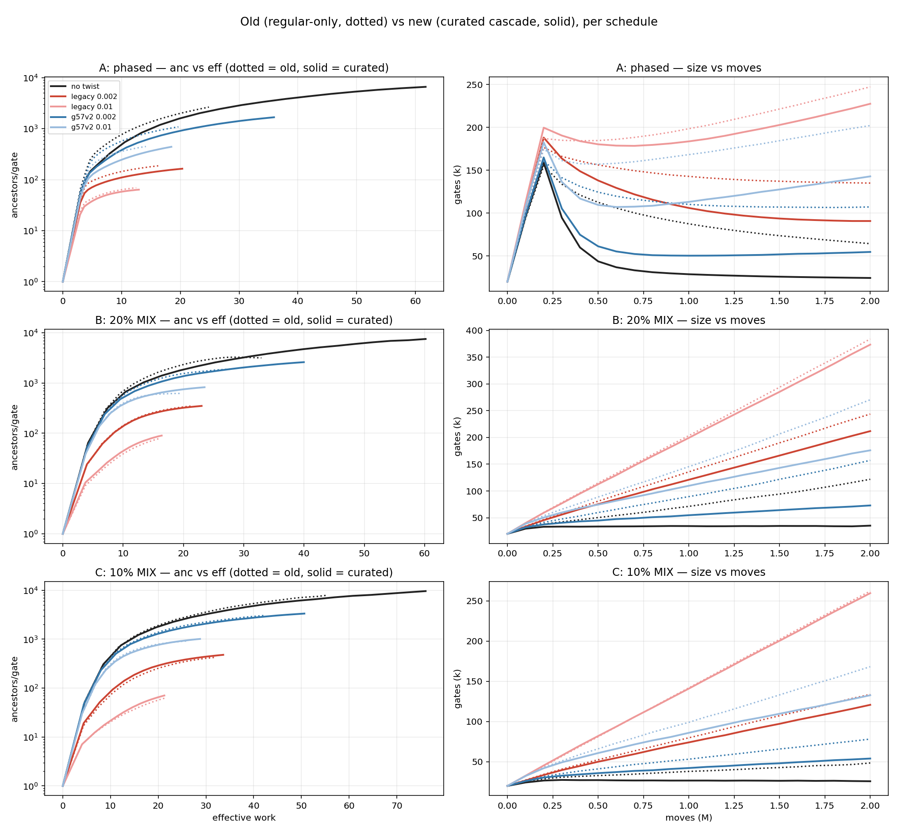
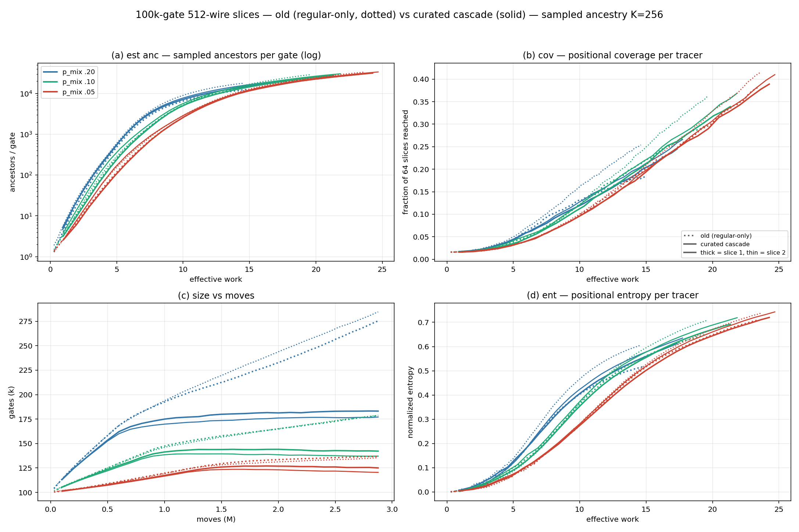
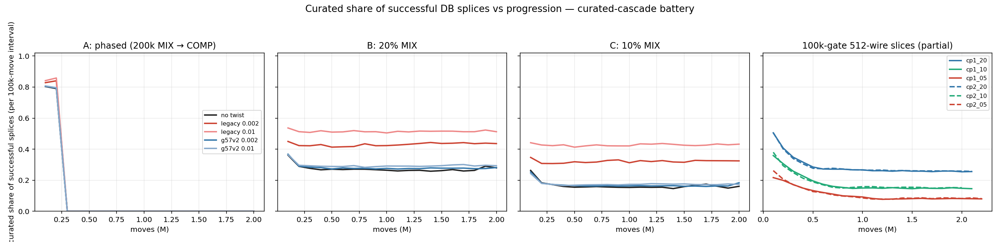
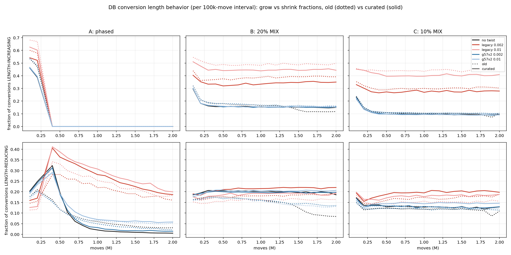
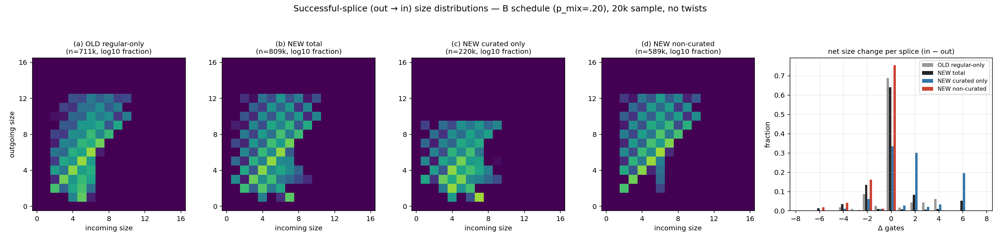

# The Bounded Curated Store vs. the Regular-Only Regime:

*2026-07-31*

> Markdown rendering of `docs/CURATED_DB_COMPARISON.tex`. The PDF is authoritative for figures, diagrams and display math.

## Abstract
The new bounded curated `.frz` store (1.72 GB; ≤20 candidates and
≤512 decoded value bytes per key) was installed, its runtime contract
implemented (per-store value conventions, expansion-first routing), and a
two-scale measurement campaign run against the regular-only baselines: 15
arms on the 20k-gate/64-wire sample and 6 arms on the 100k-gate/512-wire
slices, all same-seed pairs. Headline: the curated cascade wins on every
measured axis at every scale — circuits up to 71% smaller, ancestry
transport up to +149%, schedule and slice asymmetries largely erased —
with **zero** verification rejections across 2M curated splices.
The splice-economy decomposition shows why: curated conversions are a
dedicated growth stroke (58–62% growing, +2-dominated), non-curated
conversions a dedicated compression stroke (24% shrinking,
0% growing) — two stores, each doing the job it is built for. A
2×2 interaction check shows the conclusion is robust to (and
strengthened by) turning on `–db-advance`, which was off throughout
the campaign.

## The stores

**Old (retired):** the unbounded curated store — 6.49 GB, 258
files, a pathological 1.19 GB `shard_66` — kept at
`frozen_curated_m1_m11.old6g`. Every historical "430k candidates /
multi-megabyte values / never reaches its first checkpoint" observation
describes this store.

**New (installed, verified):** `/home/cc/frozen_curated_m1_m11`,
1,720,215,364 bytes; `shard_66.frz` = 6,350,369 B;
`tables.bin` `df8ee453…`; `filters.bin`
`8dde6635…`. Bounded guarantees: ≤20 candidates/key, ≤512
decoded value bytes/key, largest encoded bucket 361 B. Reference lookup
cost: 3.8 μs curated, 33 μs regular.

**The convention fix.** The curated store was built under the
pre-`2ed0222a` swapped-controls polynomial key convention, so its
values decode with each gate's two controls swapped relative to native —
the never-diagnosed root cause of "every curated candidate fails
verification." The runtime now takes per-store conventions from the
environment (`FROZEN_REGULAR_VALUE_CONVENTION=native`,
`FROZEN_CURATED_VALUE_CONVENTION=legacy-swapped-controls`),
applying a controls-swap at the single decode choke point. Proof at scale:
`cur=hits/0` — zero rejections — in every run of the campaign,
under mandatory per-splice exhaustive verification.

## Routing and selection

Commits `f8afdc7b` + `47053b0f`:

- **Expansion (MIX / ANY)**: probe CURATED first, forward key
only. Apply the mode's size rule within the curated answer — for MIX:
*random among no-larger spellings if any exist, else random among the
minimal ones*. On a complete curated miss, fall back to REGULAR (forward +
reverse keys) under the same rule. The reverse canonicalization is deferred
to the fallback stage.
- **Compression**: REGULAR only, always — including the ssg
SAMF-hiding tiers.
- Tripwire: a warn-once alarm if any curated value exceeds the bounded
contract.

## Campaign design

Same-seed pairs, only the store policy changed. **20k battery:** the
A/B/C schedule family (A phased 200k MIX → COMP; B `p_mix` 0.2; C
0.1) × {no twist, legacy twists 0.002/0.01, g57-v2 twists
0.002/0.01}, 2M moves, exact ancestry. **100k battery:** slices 1
and 2 of the n=128 Gray gadget (512 wires) × `p_mix`
{0.20, 0.10, 0.05}, 2.877M moves, sampled ancestry (K=256).
`–db-advance` was off throughout (both columns — internally
consistent; §6 measures the flag's effect). `FROZEN_FILTER` off for
the battery (trajectory-identical; filters only accelerate misses).

## Results

### 20k sample

| arm | size old→new | anc old→new | span old→new | eff old→new |
|---|---|---|---|---|
| A no twist | 64,333 → **24,320** | 2,649 → **6,606** | 3,253 → 7,112 | 24.9 → 61.7 |
| A legacy .002 | 135,058 → 90,770 | 187 → 164 | 691 → 577 | 16.2 → 20.3 |
| A legacy .01 | 247,382 → 227,632 | 69 → 64 | 393 → 327 | 12.5 → 12.9 |
| A g57v2 .002 | 107,220 → **54,678** | 1,085 → **1,673** | 1,690 → 2,121 | 19.7 → 35.9 |
| A g57v2 .01 | 202,164 → 142,886 | 447 → 441 | 973 → 890 | 14.1 → 18.5 |
| B no twist | 121,835 → **35,213** | 3,165 → **7,527** | 3,820 → 8,159 | 32.9 → 60.2 |
| B legacy .002 | 243,674 → 211,770 | 350 → 350 | 1,012 → 954 | 21.5 → 23.0 |
| B legacy .01 | 383,924 → 373,367 | 80 → 90 | 451 → 443 | 16.2 → 16.4 |
| B g57v2 .002 | 157,153 → **72,929** | 1,895 → **2,602** | 2,589 → 3,275 | 28.0 → 40.0 |
| B g57v2 .01 | 270,377 → 175,873 | 620 → 825 | 1,198 → 1,410 | 19.7 → 23.5 |
| C no twist | 48,493 → 25,804 | 7,941 → **9,615** | 8,626 → 10,340 | 55.5 → 76.0 |
| C legacy .002 | 133,665 → 120,777 | 425 → 479 | 1,111 → 1,211 | 31.8 → 33.6 |
| C legacy .01 | 262,115 → 259,558 | 62 → 71 | 369 → 399 | 21.4 → 21.3 |
| C g57v2 .002 | 78,233 → **54,031** | 3,038 → 3,339 | 3,895 → 4,098 | 42.0 → 50.6 |
| C g57v2 .01 | 168,192 → 132,681 | 921 → 1,012 | 1,625 → 1,661 | 26.1 → 28.8 |

*Finals at 2M moves. Sizes fall everywhere (most where MIX
dominates); transport rises with effective work; the A/B/C schedule gap
largely collapses (all no-twist baselines land at 24–35k gates, eff
60–76). All prior orderings (twist arms, rates) survive.*

### 100k / 512-wire slices

| run | size old→new | est. anc old→new | cov old→new | ent old→new |
|---|---|---|---|---|
| s1 `p_mix`.20 | 275,431 → **183,160** | 12,591 → **19,273** | .183 → **.245** | .518 → .612 |
| s2 `p_mix`.20 | 284,635 → **177,101** | 17,901 → 21,330 | .254 → .266 | .606 → .635 |
| s1 `p_mix`.10 | 178,592 → **142,212** | 22,774 → **27,678** | .298 → **.339** | .651 → .692 |
| s2 `p_mix`.10 | 179,136 → 137,094 | 29,009 → 30,360 | .363 → .369 | .709 → .719 |
| s1 `p_mix`.05 | 136,927 → 125,059 | 30,031 → 31,562 | .383 → .389 | .711 → .720 |
| s2 `p_mix`.05 | 135,334 → 120,482 | 33,443 → 33,658 | .416 → .743_≈ | ≈ |

*Production scale replicates the 20k findings; gains scale with the
MIX fraction. The old slice-1-vs-slice-2 asymmetry (12.6k vs. 17.9k anc at
`p_mix` .20) closes under the cascade (19.3k vs. 21.3k).*

### Dynamics

**Curated share of successful splices** is flat over each 20k run
(C ≈ 0.17, B ≈ 0.28; legacy arms higher via a weak-COMP
denominator) and, on the 100k slices, decays from an early store-friendly
peak to stable plateaus (≈ .08/.15/.26 by `p_mix`) — the
store keeps serving at the same rate deep into the run, and slice-1/slice-2
curves are near-identical.

**Grow/shrink balance**: the cascade lowers the growing-conversion
fraction by 1–6 points and raises the shrinking fraction (B no-twist
cumulative 0.147 → 0.200), which no longer decays late-run — COMP
stays productive against the smaller steady-state circuit.

### The splice-economy decomposition

A per-store splice histogram (instrumented rerun; bit-identical
trajectories verified at both scales) splits the successful-splice
(out → in) distribution:

| population | n | shrink | equal | grow | shape |
|---|---|---|---|---|---|
| (a) old regular-only (20k B) | 710k | .147 | .690 | .164 | grow spread +2/+3/+4 |
| (b) new total (20k B) | 809k | .200 | .641 | .160 | grow at +2 and +6 |
| (c) new, curated only | 220k | .087 | .334 | **.579** | +2 (30%), +6 (20%) |
| (d) new, non-curated | 589k | **.242** | .756 | .003 | -2/-4/-6 only |
| 100k: curated only | 601k | .079 | .305 | .616 | same shape |
| 100k: non-curated | 1.62M | .233 | .760 | .007 | same shape |

*The two-stroke engine: curated conversions are the growth stroke
(the store holds longer equivalents by construction — splits of minimal
identities — so the "else random minimal" branch dominates, usually at
+2), non-curated conversions the compression stroke (zero growth).
The old regime forced one store to do both jobs.*

## Robustness to `–db-advance`

The whole campaign ran with `–db-advance` off (both columns). A
2×2 same-seed interaction check at the strongest-effect point
(20k, C schedule, no twists) asks whether the flag changes the conclusion:

| cell | size | anc | span | eff |
|---|---|---|---|---|
| regular, off | 48,493 | 7,941 | 8,626 | 55.5 |
| curated, off | 25,804 | 9,615 | 10,340 | 76.0 |
| regular, on | 66,957 | 11,950 | 12,679 | 39.9 |
| curated, on | **27,761** | **15,637** | **16,305** | 60.6 |

The curated-vs-regular delta *widens* with the flag on (anc $+1,674
→ +3,686; size-22.7k→ -39.2$k): ballistic transport amplifies
whichever splice economy is in place, and the curated economy is better
(the regular regime's growth-heavy splices both spread and accumulate).
The flag itself adds +50–63% transport in both regimes —
**directive: `–db-advance` on in every run unless an A/B
explicitly needs it off**. The weak-effect bracket (100k slice-1,
`p_mix` .05, both advance-on cells) was still running at the time of
writing; with the margin above, only a sign reversal there could matter.

## Conclusions

1. The bounded curated store is correct (zero rejections at two scales
under exhaustive verification), fast (its lookups are not a cost factor),
and strictly beneficial under the cascade selection rule at every measured
operating point.
1. The mechanism is a division of labor: curated supplies re-encoding
diversity (growth in small, structured steps), regular supplies
compression. Routing each job to its store beats any single-store policy
measured.
1. The best measured operating point on the 20k sample is
*curated + db-advance*: anc 15,637 at 27.8k gates — 2× the
transport of the best regular-only cell at half its size.
1. Caveats: campaign comparisons are same-seed single trajectories (no
replication); `–db-advance` was off in the battery (both sides;
§5 shows on-state widens the win); campaign-preflight fingerprints still
pin the old store and need regeneration.

## Figures

*Per-schedule overlays: old (dotted) vs. curated cascade (solid).*

*100k/512-wire slices: sampled-ancestry measures, old vs. new.*

*Curated share of successful splices vs. progression.*

*Grow/shrink conversion fractions, old (dotted) vs. new (solid).*

*The four-way splice-size decomposition (a/b/c/d).*
