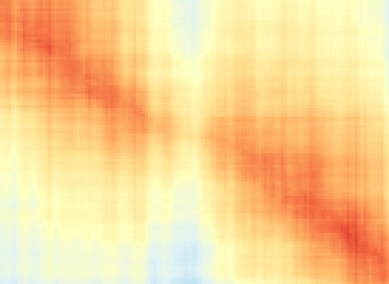
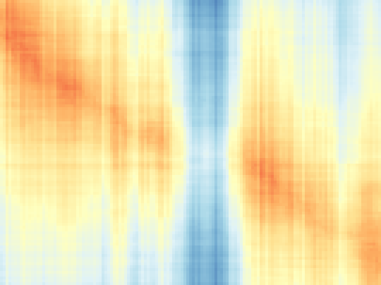

# Pale Bands in the Affine Heatmaps:

*2026-08-02*

> Markdown rendering of `docs/HMAP_BANDS.tex`. The PDF is authoritative for figures, diagrams and display math.

## Abstract
Reading the layer-2 profile sweep's heatmaps at pixel resolution turned up
narrow vertical bands where the mixed circuit is markedly less
affine-readable. This note establishes what they are. Three results, in
order of importance. (1) The heatmap measure carries *no sampling
noise*: every cell is an exact count of non-recoverable target bits, and
the plate is byte-identical under different random seeds — so every
visible feature is real structure, and the "is it jitter" question is
answered before it is asked. (2) The bands are genuine local regions,
200–2200 gates wide, where 40–75 more of the 512 target bits go
unreadable. (3) They are *dead*, not *hidden*: a whole-circuit
search across every position and every gap width up to 11k gates finds no
case where the computation re-emerges further along, with the observed
statistic sitting far *below* its own null. The interesting
phenomenon — mixed material performing part of the source computation
invisibly — does not occur in this mixer's output at any measurable
resolution.

## The instrument has no noise floor

`hmap_affine` scores cell (i,j) by fitting, for each of the n
target bits of C's prefix i, a GF(2) affine function of the mixed
circuit's wires at prefix j: inconsistent (the bit is not affine in those
wires) scores 0.5; consistent scores the measured holdout error, which is
≈ 0 for a genuine affine relation. So

```tex
H(i,j) = 1/2·(fraction of C's bits not
affine-recoverable from G_j).
```

Two checks confirm this is exact rather than statistical:

- **Quantisation.** Every cell of the 101 × 121 `nR30`
plate is an exact integer multiple of 0.5/n = 0.5/512 = 0.000977
— 100% of cells on the lattice, to within 10_-3 of a multiple.
- **Seed independence.** Runs at seeds 12345, 999, 4242 and 31337
produce **byte-identical** `.bin` files, as does a minimal control
at seeds 7 and 88888. Span membership over GF(2) is a fact about the
functions, not about which random inputs were drawn.

Consequence: there is no noise to discount. A column that looks pale
*is* pale. (An earlier "how many standard errors" framing in this
investigation was therefore mis-conceived, and is superseded.)

*Caveat worth carrying:* because the plate is seed-independent, one
cannot use re-seeding to cross-check a feature, and agreement between the
degree-1 and degree-2 plates is **not** independent evidence — both
draw their sample batches from the same seeded stream, so the degree-2
run's first 96 batches are byte-identical to the degree-1 run's.

## What the bands are

### Width and depth

On the coarse plate (column spacing 1876 gates) 17 of 121 columns sit more
than 2 local units above baseline. Re-measured at 200-gate spacing
(26 × 1127), the features resolve into structured bands with smooth
shoulders:

| G-gate range | width (gates) | peak H | peak non-recoverable bits |
|---|---|---|---|
| 13,200–15,200 | 2,200 | 0.3941 | **404** of 512 |
| 97,600–98,800 | 1,400 | 0.3805 | 390 |
| 178,200–178,800 | 800 | 0.3837 | 393 |
| 20,800–21,400 | 800 | 0.3853 | 395 |
| 125,200–125,600 | 600 | 0.3622 | 371 |
| four more | 200–400 | 0.367–0.372 | 377–381 |
| typical material | — | 0.3226 | 330 |

*`nR30`. The ordinary column-to-column wobble on this plate is
7.5 bits of 512; the bands stand well clear of it.*

### They appear in every arm

Each of the eight profile arms has them; `nR30` merely has the most,
and its larger circuit spaces them far enough apart to be seen separately.
Per-arm strongest band (excluding edge columns), all rendered at matched
aspect and a common colour scale:

| arm | size ratio | band G | peak H | bits |
|---|---|---|---|---|
| no twist | 1.30 | 40,145 | 0.3535 | 362 |
| R1=1.5 | 1.49 | 6,230 | 0.3611 | 370 |
| R1=2.0 | 1.79 | 137,700 | 0.3605 | 369 |
| R1=2.5 | 1.99 | 6,648 | 0.3808 | 390 |
| R1=3.0 | 2.25 | 97,552 | 0.3684 | 377 |
| short hold | 1.62 | 37,800 | 0.3501 | 359 |
| long hold | 1.98 | 108,636 | 0.3467 | 355 |
| 10× twist | 6.42 | 176,484 | 0.3632 | 372 |

### Framing note: the plate's aspect is the size ratio

The ridge's slope is dG/dC = |G|/|C|. For `nR30`
that is 225,014/100,000 = 2.25, and the measured ridge slope is
2.183 (fractional slope 0.970) — the diagonal crosses corner to
corner, as it must. A local window therefore needs its G extent to be
≈ 2.25× its C extent or the ridge sweeps out of frame; the
first round of zoom plates in this investigation was mis-framed for exactly
this reason. The per-row ratio also drifts from 2.63 early to 2.25 late,
i.e. material that was present early is proportionally more inflated —
a residue of the expansion phase that compression did not re-flatten.

## Dead, not hidden

### The question

A pale band where the ridge resumes at the *same* C position is
uninteresting: it is a stretch that does no work (an identity, in effect).
The interesting event would be a band after which the computation
**re-emerges further along** — mixed material that performed part of
C invisibly and handed back the result. That is a specific, testable
signature: a persistent forward level-shift in the ridge trajectory
C^*(G), beyond what the size ratio predicts.

### The search

Two whole-circuit plates at 501 × 641 cells (C step 200 gates,
G step 280–352), so the detector scans *every* position rather than
a hand-picked window. For each candidate position the trend fitted on the
left of the gap is extrapolated across it and compared with the level on the
right; the gap width is swept from 1 to 32 columns (352 up to 11,264
gates). The null detrends the true ridge and *shuffles its residuals*,
preserving the wobble's magnitude while destroying its structure, then runs
the identical detector.

| circuit | gap (gates) | observed | null p95 | null max | p |
|---|---|---|---|---|---|
| `nR30` | 352 | 1,125 | 4,418 | 4,837 | 1.000 |
| `nR30` | 2,816 | 2,525 | 7,518 | 8,273 | 1.000 |
| `nR30` | 11,264 | 5,783 | 17,764 | 19,677 | 1.000 |
| `nR20` | 280 | 875 | 2,298 | 2,888 | 1.000 |
| `nR20` | 2,240 | 2,075 | 3,916 | 4,529 | 1.000 |
| `nR20` | 8,960 | 6,175 | 9,624 | 11,376 | 0.950 |

*Largest persistent forward shift in C gates. Every cell p ≥
0.95.*

### Verdict

No re-emergence events, at any scale, anywhere in either circuit. The result
is stronger than a bare null: the observed statistic sits *far below*
its own null distribution, typically a quarter to a half. Shuffling destroys
the autocorrelation of the ridge's wobble and manufactures apparent leaps
that the true trajectory never makes — the real ridge is
**smoother than chance**. C's computation advances steadily at the
size-ratio rate; the bands are stretches where it does not advance and then
resumes exactly where it left off.

An earlier pass of this analysis, restricted to eight 6000-gate windows,
appeared to find persistent shifts of 430–820 C-gates in all eight arms.
That was the maximum of a noisy statistic over 120 candidate
positions, and the null test dissolved it (p = 0.05 to 1.00). It is
recorded here because the failure mode — cherry-picking an extremum
without a null — is the one this kind of search invites.


*Top: the ridge trajectory over the whole circuit against its fitted
trend. Bottom: observed maximum forward shift against the shuffled-residual
null, by gap width. The observed curve lies below the null everywhere.*

## Incidental findings

- **Ridge scatter scales with expansion.** `nR30`'s ridge
wobbles by 880 C-gates about its trend, `nR20`'s by 359. The more
expanded circuit localises its computational progress less tightly — a
mild point in expansion's favour that the summary statistics miss.
- **Mean H rises with circuit size** (0.337 at 130k gates to
0.361 at 642k) while ridge *depth* stays flat at 0.174–0.188. The
drift is dilution, not a weakening diagonal: per the standing directive,
read the plate by ridge, never by the mean.
- **Two arms' strongest band sits in the first few percent** of
the circuit (R1=1.5, R1=2.5). Plausibly a head effect distinct from the
mid-circuit bands; not investigated.

## Tools added

- `reports/hmap_pixels.py` — renders a plate at true 1:1, one
image pixel per matrix cell, with `–scale` for integer magnification,
`–gates A:B` to crop by G-gate index and `–annotate` to print
the numbers behind the pixels. Matplotlib's figure rendering resamples
plates and smears single-column features into their neighbours; this does
not.
- `hmap_affine –c-from/–c-to/–g-from/–g-to` — restricts the
plate to a rectangle of prefix indices, so a dense *local* plate costs
minutes instead of computing a dense global one.
- `plot_hmap_ridge.py –no-ridge` — draws the raw H field
without the traced overlay, while still computing and printing the ridge
statistics.

## The plates

Every image below is rendered by `hmap_pixels.py`: one image pixel per
matrix cell, integer replication only, no interpolation and no resampling.
Colour is fixed across the whole appendix — H = 0.10 (red, leaking) to
H = 0.45 (blue, hidden) — so panels are directly comparable. In every
plate rows are C prefixes (top = start of the source computation) and
columns are G prefixes (left = start of the mixed circuit).

### A resolution ladder on one circuit

All five panels show the same object — `nR30`, 225,014 gates
against a 100,000-gate source — sampled at five resolutions. The point
of the ladder is that what a plate *says* depends on how finely it is
cut: a coarse plate shows a clean diagonal and a handful of suspicious
columns; a fine one shows those columns are structured bands with
shoulders; a local one shows the diagonal itself has width and texture.


***Rung 1 — global, coarse.** 101 × 121 cells;
C step 1000, G step 1876 gates. This is the plate the sweep was read
from. The diagonal is unmistakable; the pale columns are visible but
unresolved, each one cell wide.*


***Rung 2 — global, dense in C.** 501 × 641 cells;
C step 200, G step 352 gates, one pixel per cell at true 1:1. This is
the plate the hidden-computation search ran on: dense enough in C that a
forward jump of a few hundred gates would be visible, over the whole
circuit rather than a window.*


***Rung 3 — fine in G, coarse in C.** 26 × 1127
cells; G step 200 gates, C step 4000, stretched 14× vertically
(pixel replication, not interpolation). This is the cut that resolved the
band widths: the pale features are 200–2200 gates across with smooth
shoulders, not knife edges.*

![**Rung 4 — local, dense in both.** 101 × 135 cells;
C step 60, G step 100 gates, over C ∈ [39k, 45k],
G ∈ [90.9k, 104.3k]. At this scale the diagonal is a
textured structure of finite width rather than a line.](../reports/ancestry_20260728/plates/lad4_band.png)

***Rung 4 — local, dense in both.** 101 × 135 cells;
C step 60, G step 100 gates, over C ∈ [39k, 45k],
G ∈ [90.9k, 104.3k]. At this scale the diagonal is a
textured structure of finite width rather than a line.*


***Rung 5 — local, aspect-matched.** 100 × 136 cells
over C 6000 gates × G 13,500 gates, i.e. a window whose sides
are in the circuit's own 2.25 size ratio, so the ridge runs corner to
corner instead of sweeping out of frame. Compare with rung 4: the same
material, framed correctly.*

### One band from each profile arm

Each panel is that arm's own strongest band, in a window aspect-matched to
that arm's own size ratio, at C step 60 gates. Same colour scale
throughout (0.10–0.35 here, since these local windows never reach the
global extremes). The bands look alike across very different runs — the
6.4×-expanded twist-heavy circuit included — which is the visual
counterpart of the finding that no profile parameter changes the plate.



*figure*



*figure*
