\addtocontents{toc}{\protect\setcounter{tocdepth}{-1}}

# Local Mixing of Reversible Circuits {#local-mixing}

\addtocontents{toc}{\protect\setcounter{tocdepth}{3}}

The following document serves as a draft detailing the ideas and experiments of Ran Canetti, Nicholas Ho, and other collaborators. The document is written by Nicholas Ho. local mixing of reversible circuits is still evolving and the results as claimed here can and will be changed/modified and updated.  

This revision follows the code as of September 11, 2026. We keep the earlier
constructions and experiments because they explain how we arrived here.
Our current GSS method uses the sliced sandwich, quadratic masking, database
mixing, splitting, crossing, and final compression. The product-share and
Gray-fold construction below is an earlier gadgetizer; its measurements do not
automatically describe the current quadratic-masking recipe. The
[current gadgetization](#quadratic-masking) and
[six-step method](#current-mixing-method) describe what we now run.

Introduction {#introduction}
============

Indistinguishability Obfuscation (iO) is immensely powerful. For
instance, it can be used to achieve almost every other cryptographic
task, such as trapdoor permutations or non-interactive zero-knowledge.
If combined with lossy encryption, even a beast like fully homomorphic
encryption can be achieved.

The history of achieving iO is quite intriguing. In fact, there have
already been results that prove iO can in fact exist. However, there are
numerous problems with these existing tools. Some of these tools include
evasive LWE, multi-linear maps, learning parity with noise, etc. These
tools can be highly structured resulting in constructions that are both
complex and impractical. As a result, local mixing of reversible circuits serves to answer the
following question: Can we achieve iO with \"first principles\"? The
\[CCMR'24\] paper proposes a solution to such a question: local mixing of reversible circuits.

This paper serves as a documentation for our experiments, results, as
well as questions that remain for local mixing of reversible circuits. We note that we solely
rely on the structure of reversible circuits, but this of course is not
a problem as we can reduce any arbitrary circuit to a reversible
circuit.

Strategies {#strategies}
==========

The below strategies will all follow the same ideas. Namely, we want to
make simple actions and use minimal structure in order to obfuscate our
circuits. In the pursuit of simplicity, our circuits will thus only
contain gate r57, a Toffoli gate whose control function is the complement of
NIMPLY. Standard gates like NOT, AND, OR, NOR, NAND, etc, can
all be represented by gate r57. Thus, this simplification does not
impede us from our goal of general-purpose obfuscation.

**Definition:** Let $g$ be gate r57 on inputs $A$, $B$, and $C$, with
$A$ being the active wire, $B$ being the positive control pin, and $C$
being the negative control pin. Then 

$$
A = A + (B \vee \neg C)
$$

In words, $A$ is flipped unless $C = 1$ and $B = 0$. In the code and in the
rest of our tooling this gate is written `g57` rather than `r57`; the two names
refer to the same gate and we use them interchangeably.

For Boolean values $a$ and $b$, we can use

$$
a\lor\neg b=1\oplus(\neg a)b=1\oplus b\oplus ab.
$$

Therefore, over $GF(2)$,

$$
A = A + \neg B \wedge C + 1 = A + BC + C + 1.
$$

Note the constant term. Every r57 gate flips its active wire unconditionally
and then unflips it on one of the four control states, so a $+1$ appears in
every gate's polynomial. This will matter a great deal later, when we start
caring about the algebraic degree of our circuits.

We note that the restriction to r57 alone no longer holds all
the way through our pipeline. The source circuit is still built from r57,
but the sandwich and gadgetization already use a wider gate vocabulary.
Later splitting deliberately fragments the remaining complemented gates into
plain conjunctions. We describe that vocabulary when we introduce the circuit
representation below. The early strategies use pure r57 unless stated otherwise.

A good question to answer is what type of actions we are allowed to do
to follow the rule of \"first principles\". The basic local mixing of reversible circuits
strategy is thus to only allow small local and equivalent perturbations
of a circuit in the hopes that with enough of them, we can get a global
effect. In other words, given a circuit, we sample and replace many
subcircuits of equivalent functionality. Of course, there are many ways
to do this that do not actually incur a large enough effect. For
example, say we have a circuit on 64 wires with 1000 gates and only make
100 replacements on 6 gate subcircuits. Then, with most replacement
methods, an observer can merely find these points of replacements and
potentially even undo them. We then have a number of concerns that we
will need to address. Firstly, how can we sample replacements? This is a
question that we did not think too deeply about at the beginning of the
project, and so will be more deeply talked about later. Secondly, how
can we mix gates in a way that we can not identify points of
replacement?

With these questions in mind, let us introduce the obfuscation
strategies that we have tried.

1.  **[The Two Phase Strategy](#two-phase-strategy)**: This strategy splits up the obfuscation
    process into two phases. The first phase is the *inflationary
    phase*. In this phase, we sample random subcircuits and make
    replacements that contain more gates than the subcircuit we are
    replacing. Thus, we slowly inflate our subcircuit. We then move on
    to the *kneading phase*. In this phase, we sample random subcircuits
    and make replacements with equal length random circuits in the hopes
    that we can spread out the randomness that we injected into our
    circuit in the inflationary phase.

2.  **[The Butterfly Method](#butterfly-methods)**: The butterfly method utilizes compression,
    something that we will talk more about later. As opposed to a two
    stage method, the butterfly method has many stages of (inflationary
    $\to$ compression). Suppose we have a circuit $C$. We then wrap each
    gate with an identity of the form $R_i R_i^{-1}$, a simple identity.
    We can sample $R_i$ completely randomly and so we have a \"stupid\"
    identity. Afterwards, we group up each $R_i^* g_i R_{i+1}$ and
    randomize it to get $B_i$. This can be done by attempting to
    compress it, expand it, or make equal length replacements of
    equivalent functionality. All that remains is to then merge the
    $B_i$ together, compressing as we do so. The diagram below shows one
    round of this in more detail. Ideally, we would use enough rounds
    for this to effectively \"mix\" our gates.

    $$
    \begin{array}{c}
            \boxed{g_1}\;\boxed{g_2}\;\boxed{g_3}\;\boxed{g_4} \\[0.6em]
            \boxed{R_1 R_1^*}\;\boxed{g_1}\;\boxed{R_2 R_2^*}\;\boxed{g_2}\;
            \boxed{R_3 R_3^*}\;\boxed{g_3}\;\boxed{R_4 R_4^*}\;\boxed{g_4}\;\boxed{R_5 R_5^*} \\[0.6em]
            \boxed{R_1}\;\boxed{R_1^* g_1 R_2}\;\boxed{R_2^* g_2 R_3}\;
            \boxed{R_3^* g_3 R_4}\;\boxed{R_4^* g_4 R_5}\;\boxed{R_5^*} \\[0.6em]
            \boxed{R_1}\;\boxed{B_1}\;\boxed{B_2}\;\boxed{B_3}\;\boxed{B_4}\;\boxed{R_5^*} \\[0.6em]
            \boxed{R_1}\;\boxed{B_{12}}\;\boxed{B_{34}}\;\boxed{R_5^*} \\[0.6em]
            \boxed{R_1}\;\boxed{B_{1234}}\;\boxed{R_5^*} \\[0.6em]
            \boxed{O(C)}
    \end{array}
    $$

3.  **[Pair Replacement Methods](#pair-replacement-methods)**: The pair replacement methods are
    different strategies that utilize one type of replacement: the pair
    replacement. Given two gates $g_i$ and $g_{i+1}$, we can replace
    them with some identity $I_i$ by relabeling the first two gates to
    be equal to the pair. In other words, we have
    $I_i = g_i g_{i+1} B_i$, which gives us $B_i^* = g_i g_{i+1}$. These
    strategies will make repeated replacements of this type before
    moving onto a compression phase. These two phases will then repeat.
    This is meant to be seen as a smaller version of the butterfly
    method.

4.  **[Fragmentation](#fragmentation)**: Fragmentation deliberately stops requiring every gate to
    remain r57. Keeping one gate type makes the rainbow tables much easier to
    use, but it also leaves the transformed circuit with one repeated gate
    shape. We begin with an exact split. The r57 gate
    $a \mathrel{{\oplus}{=}} (b \vee \neg c)$ can be split in either of the
    following two ways:

    $$
    \{a \mathrel{{\oplus}{=}} b,\quad
    a \mathrel{{\oplus}{=}} \neg b \wedge \neg c\}
    $$

    or

    $$
    \{a \mathrel{{\oplus}{=}} \neg c,\quad
    a \mathrel{{\oplus}{=}} b \wedge c\}.
    $$

    In either split, the two firing conditions are disjoint and their XOR is the
    firing condition of the original gate. This makes the replacement exact.
    The two pieces are plain conjunctions which share a target and commute with
    one another. More importantly, some pieces of two parent gates which
    originally collided may now commute because their firing conditions are
    disjoint. We can therefore move those pieces into, and sometimes past, one
    another. The initial split still has at most two controls. Later crossing
    splits can create gates with three, four, or more controls and produce more
    varied polynomial forms. The [later fragmentation section](#fragmentation) explains the two
    mixing methods which build on this identity.

Sampling Subcircuits {#sampling-subcircuits}
--------------------

In the above strategies, it is important for us to sample random
subcircuits and then replace them. We will discuss how to make these
[replacements in a later section](#sampling-circuit-replacements). Before we talk about our methods, it is
useful to define collisions between gates.

**Definition:** Two gates $g_1 = (A_1, B_1, C_1)$ and
$g_2 = (A_2, B_2, C_2)$ collide if one of the following holds:

1.  $A_1 == A_2$

2.  $A_1 == B_2$

3.  $A_1 == C_2$

4.  $B_1 == A_2$

5.  $C_1 == A_2$

The first obvious way to sample subcircuits is by sampling a random
contiguous subcircuit within our circuit. If we view our circuit as an
array of gates, then this is merely taking a window of some size. This
is, of course, very easy to do.

The other method is to take \"convex subcircuits\". The meaning of
convex here directly lies in finding convex subgraphs of a directed
graph. In order to turn a circuit into its graph representation, let
each gate be a node $i$ and for every other gate $j$ that collides with
$i$, is such that $i < j$, and there is no $k$ with $i < k < j$ that
already collides with $i$, then there is a directed edge from $i$ to
$j$. We do this for all nodes in order to get our skeleton graph. From
this, we can sample a convex subgraph and then take the circuit version
of it in order to get what we call a **convex subcircuit**. As we have
convexity, we can then rearrange gates in the original circuit to make
this convex subcircuit a contiguous subcircuit. As a reminder, we note
that gates can be swapped without changing the functionality of the
original circuit if they do not collide. Unfortunately, the algorithm
for finding convex subcircuits is slow when used hundreds of millions of
times, taking up about 40% of total computation time. This is our largest bottleneck when it comes to speed.

Random Circuits {#random-circuits}
===============

Before anything, it is important to establish a shared language to discuss our circuits. Below is a
table for any circuit-wiring language that we use for circuits with only r57.

**Table: Wire Index Encoding Used by Circuits of r57** {#tab:wire-encoding}

| Wire range | Encoded as | Notes |
|------------|------------|-------|
| $0$–$9$ | `0–9` | Decimal digits |
| $10$–$35$ | `a–z` | Lowercase letters |
| $36$–$61$ | `A–Z` | Uppercase letters |
| $62$–$71$ | `! @ # $ % ^ & * ( )` | Special symbols (set 1) |
| $72$–$82$ | `- _ = + [ ] { } < > ?` | Special symbols (set 2) |
| $\ge 83$ | `~^kX` | $k$ tildes followed by base-83 digit, giving wire $83k + X$ |

A gate consists of three pins, each on a distinct wire. We represent a gate by listing the wires in the order (active pin, positive control pin, negative control pin). For example, `123` represents a gate with the active pin on wire 1 and control pins on wires 2 and 3. A circuit is represented as a sequence of gates separated by `;`.

**Notation:**  
A gate $g = [a,b,c]$, where $a$ is the active pin and $b,c$ are the control pins, is written as `abc`.  
A circuit is written as a list of such gates separated by `;`.

While this is not the notation we will be using to represent our mixed circuits, this is the notation that is used when storing circuits as we will strictly be using r57 gates in our rainbow tables. 

Beyond r57 {#beyond-r57}
----------

The encoding above can only ever describe r57 circuits. A gate is three wire
tokens and nothing else, so there is nowhere in it to say *which* control
function the gate uses: the control function is fixed by the format, and any
circuit written this way is r57 by construction. For most of this document that
is exactly what we want, and we will lean on it heavily.

As we said at the outset, it does not hold all the way through our pipeline.
Later stages deliberately emit gates that are *not* r57, and once they have run
the circuit is not expressible in the three-token format at all. Why we are
willing to give up r57, and what it costs us, is an argument that belongs with
the attack material and is taken up later in [*Fragmentation: leaving r57
behind*](#fragmentation). What we need here is only a notation general enough to write the
results down.

That notation is a single gate type: a single-target controlled XOR whose
control is a conjunction of mixed-polarity literals, optionally complemented as
a whole.

$$
\texttt{fires}(x) = \texttt{comp} \oplus \bigwedge_i \texttt{lit}_i(x), \qquad
x[\texttt{target}] \mathrel{{\oplus}{=}} \texttt{fires}(x)
$$

Each $\texttt{lit}_i$ is a wire or its negation. The members of this family that
actually occur in our circuits are worth naming, since we refer to them by name
throughout.

**Table: The wider gate vocabulary**

| Name | `comp` | Controls | Effect |
|------|--------|----------|--------|
| X | 0 | none | $t \mathrel{{\oplus}{=}} 1$ |
| CNOT | 0 | one, positive | $t \mathrel{{\oplus}{=}} x_c$ |
| NCNOT | 0 | one, negative | $t \mathrel{{\oplus}{=}} \neg x_c$ |
| AND2 | 0 | two | $t \mathrel{{\oplus}{=}} \texttt{lit}_a \wedge \texttt{lit}_b$ |
| conj $wK$ | 0 | $K \ge 3$ | $t \mathrel{{\oplus}{=}}$ the $K$-literal conjunction |
| r57 | 1 | two, opposite polarity | $t \mathrel{{\oplus}{=}} (x_b \vee \neg x_c)$ |
| comp $wK$ | 1 | $K$, any polarity | $t \mathrel{{\oplus}{=}} \neg(\text{the conjunction})$ |

The important row is the r57 one. An r57 gate $[a,b,c]$ is `comp` $= 1$ with the
two literals $\neg b, c$, since $1 \oplus (\neg b \wedge c) = b \vee \neg c$. So
r57 is a *member* of this family rather than something sitting outside it, which
is what makes the notation worth adopting at all: one vocabulary holds plain r57
and non-r57 material at the same time, and a circuit that is only partly
converted is still a single object in a single format. At the other end of the
table, an empty conjunction is true, so the `comp` $= 0$ gate with no controls
fires on every input and is an unconditional NOT.

Circuits in this vocabulary are written in a second, plainer text format we call
`mpmct1`, for mixed-polarity multi-controlled Toffoli. The three-token encoding
gets its density from knowing the gate type in advance, which is precisely what
`mpmct1` cannot assume, so it spells everything out instead: a header line
naming the wire and gate counts, then one gate per line, all in decimal.

```
mpmct1 <num_wires> <num_gates>
<target> <comp> <k> <wire> <pol> ... (k wire/polarity pairs)
```

The wire numbers in this format are ordinary zero-indexed decimal numbers. A
polarity bit of `1` denotes the positive literal $x_w$, while a polarity bit of
`0` denotes the negative literal $\neg x_w$. If the conjunction of the $k$
literals is $L$, then `comp` $=0$ flips the target when $L=1$, while `comp`
$=1$ flips the target when $L=0$. In other words, the stored gate performs

$$
x_{\mathtt{target}} \mathrel{{\oplus}{=}}
\mathtt{comp} \oplus L.
$$

The following gives one stored-line example for every gate form in the table
above. We use wire 1 as the target throughout.

- **X:** `1 0 0` gives $x_1 \mathrel{{\oplus}{=}} 1$. Here $k=0$, and the
  empty conjunction is true.
- **CNOT:** `1 0 1 2 1` gives $x_1 \mathrel{{\oplus}{=}} x_2$.
- **NCNOT:** `1 0 1 2 0` gives $x_1 \mathrel{{\oplus}{=}} \neg x_2$.
- **AND2:** `1 0 2 2 1 3 0` gives
  $x_1 \mathrel{{\oplus}{=}} x_2 \wedge \neg x_3$.
- **Conjunction of width 3:** `1 0 3 2 1 3 0 4 1` gives
  $x_1 \mathrel{{\oplus}{=}} x_2 \wedge \neg x_3 \wedge x_4$.
- **r57:** `1 1 2 2 0 3 1` gives
  $x_1 \mathrel{{\oplus}{=}} 1 \oplus (\neg x_2 \wedge x_3)
  = x_2 \vee \neg x_3$.
- **Complemented conjunction of width 3:** `1 1 3 2 1 3 0 4 1` gives
  $x_1 \mathrel{{\oplus}{=}} 1 \oplus
  (x_2 \wedge \neg x_3 \wedge x_4)$.

Below is an example of a 3-gate circuit written in this format. 

```
mpmct1 32 3
15 0 2 7 1 20 1
4 0 2 2 1 31 1
4 0 1 20 1
```

The header declares physical wires 0 through 31 and three gate instructions.
The value 32 cannot be reduced without relabeling the gates, since the second
gate refers to wire 31. Reading the instructions from top to bottom, they give

1.  $x_{15} \mathrel{{\oplus}{=}} x_7 \wedge x_{20}$,
2.  $x_4 \mathrel{{\oplus}{=}} x_2 \wedge x_{31}$,
3.  $x_4 \mathrel{{\oplus}{=}} x_{20}$.

We will use the simple language for writing circuits when it only consists of r57 gates. 

## Sampling Circuit Replacements {#sampling-circuit-replacements}
The simplest way to sample a random circuit with a particular functionality, would be to search it up in a precomputed table of circuits. If we do this carelessly, then our table will not take into
account circuits that are essentially the exact same circuit, but differ
in trivial ways. For instance, the below circuits are all equivalent
circuits $$123;456;789$$ $$123;789;456$$ $$789;123;456$$

Recalling that our definition of collisions require two gates to share a wire between an active pin and any other pin, we notice that all of the 3 above circuits depict 3 gates that share no wires, which means there can exist no collision. This shows that we can
actually order the gates in any way that we want. This means that many
of our replacements in the kneading stage, were just trivial
replacements as seen here.This gives us a new problem of defining
circuit equivalences beyond trivial gate swaps.

Canonicalization {#canonicalization}
----------------

There are two types of trivialities we can identify. First, it is the
one described in the last section where we can swap commuting gates.
For the second, let us first consider the following two circuits.
```123;345``` and ```145;523;```. 

Before we discuss the second type of canonicalization, we first establish the idea of circuit permutation. Besides the gates of a circuit, a circuit can be identified by its functionality. Using this form of identification can be useful for us as circuits can share the same functionality while sharing a different sequence of gates. For instance, ```140;214;250;014;250;205;014;205;140;``` and ```136;063;031;013;136;016;061;``` both compute identities. A circuit representation is thus a bijective mapping of all input states to all output states. For instance, a circuit on 3 wires can have the following input states: $0, 1, 2, 3, 4, 5, 6, 7$. We call these states because each of these can be thought of as the states of each wire on the 3 wire circuit, with ```0 = 000``` and ```7 = 111``` when thought of as bit strings. 

Going back to our two circuits, we can see that the gates now collide and so we can not just swap things around to make them equivalent. In fact, they aren't even equivalent at
all. However, the structure that they have is identical. Namely, there
is one collision between the second control pin of the first gate and
the active pin of the second gate. We can see that mapping the wires
$$\begin{aligned}
    1 &\to 1\\
    2 &\to 4\\
    3 &\to 5\\
    4 &\to 2\\
    5 &\to 3\end{aligned}$$

allows us to map the first circuit to the second one. Let us see what is actually happening when we consider the states as bits. 

$$\begin{aligned}
    001 &\to 001\\
    010 &\to 100\\
    011 &\to 101\\
    100 &\to 010\\
    101 &\to 011\end{aligned}$$

The two circuits are equal up to a shuffle of the right two bits. Thus, while the circuits are effectively different circuits, we can see that they are extremely similar. By considering only one of these circuits in our rainbow table of possible circuits, our random sampling is only amongst truly different and random looking circuits. So while the first type of circuit canonicalization is based on gate ordering and collisions, the second type of canonicalization is based on the bit shuffles of the circuit's permutation. 

It is important for our canonicalization algorithms to be efficient as
we will be constantly computing them. One extremely simple algorithm for
circuit canonicalization is by just taking the lexicographic ordering,
with respect to colliding gates. This is very efficient already as it is
essentially just a sorting algorithm. On the other hand, computing
permutations is much harder. While we know that there exists a poly-time
algorithm, we have not yet found this. Thus, the best we can usually do
is brute forcing every possible bit shuffle in order to find the lowest
lexicographical ordering. It remains an open problem to find a better
algorithm for this and this is one of our main bottlenecks. Once the bit shuffle that corresponds to the smallest permutation lexicographically,
we can just apply the bit shuffle to the circuit and of course undo the
shuffle whenever we want so that we don't lose any circuits in this
canonicalization, just like how we can merely shuffle gates around again
to \"undo\" circuit canonicalization.

Canonicalizing via Polynomials {#polynomial-canonicalization}
------------------------------

The two canonicalizations above got us a long way, but relying solely on permutations can get quite expensive if we wish to canonicalize circuits on 7+ wires. To identify a circuit's functionality by its
permutation, we must save an entry for every possible input. It is rare for a random circuit to only span 7 wires, and when we make
replacements we would like to be able to replace both deep (many gates) and
wide (many wires) circuits.

The fix is to stop identifying a circuit by its permutation and start
identifying it by its list of polynomials. Recall from the definition of r57
that a gate $[a,b,c]$ gives $a' = a + \neg b \wedge c + 1$. If we seed each wire
$i$ with the degree-1 monomial $x_i$ and apply that substitution gate by gate,
then after the last gate every wire holds a polynomial in the inputs over
$GF(2)$. A circuit on $n$ wires is therefore a list of $n$ polynomials, and two
circuits are functionally equal exactly when their polynomial lists agree. This
is often a far cheaper object than a permutation for the short windows we
sample, and it is the one we now use. We use Boolean polynomials, so
$x_i^2=x_i$ and repeated monomials cancel over $GF(2)$. These reduced
polynomials are the algebraic normal form of the function. They can still
grow exponentially, which is why we bound the work of a local lookup below.

The remaining problem is the same one we had before: we want a canonical *wire
labeling*, so that two circuits which differ only by a relabeling collapse onto
one entry. Except now we can rank the wires by their polynomials rather than by
brute forcing bit shuffles. The wire with the highest ranking gets mapped to
wire 0, the next highest to wire 1, and so on. The algorithm is as follows.

**Input:** a list of `n` polynomials over GF(2), one per wire (represented as sets of monomials, each monomial a bitmask of variables).

**Output:** the canonical reordering of those polynomials, plus the wire permutation that achieves it.

1. **Degree profile partitioning** — For each wire `i`, compute its degree profile: a vector where entry `k` is the number of monomials of degree `k` in `P_i`, sorted highest degree first. Sort wires by degree profile (descending) and group wires with identical profiles into equivalence classes `C_1, C_2, ...`.

2. **Build class polynomials** — For each class `C_i`, build `P_{C_i}`: the sum (with integer coefficients) of all polynomials of wires in that class, counting how many times each monomial appears across the class. This gives us a new polynomial with coefficients in $\mathbb{N}$.

Degree profile partitioning simply means we group all of the polynomials by the
number of monomials with some highest degree. Any tied polynomials, we then
look at the number of monomials with the next highest degree, etc. For
instance, consider the polynomials:

$$P_1 = x_0 + x_1 + x_2 + x_0x_1 + x_2x_3 + x_0x_2x_3$$
$$P_2 = x_2 + x_3  + x_2x_3x_4x_5$$
$$P_3 = x_3 + x_5 + x_0x_1x_3x_5$$

Their degree profiles are:

| Polynomial | Degree 4 | Degree 3 | Degree 2 | Degree 1 |
|------------|----------|----------|----------|----------|
| $P_1$      | 0        | 1        | 2        | 3        |
| $P_2$      | 1        | 0        | 0        | 2        |
| $P_3$      | 1        | 0        | 0        | 2        |

Since $P_2$ and $P_3$ both have 1 monomial of degree 4 while $P_1$ has none,
$P_2$ and $P_3$ are placed in a higher class than $P_1$. Since $P_2$ and $P_3$
have identical degree profiles, they remain in the same equivalence class.
Thus, we have $C_1$, the first polynomial class, holding $P_2$ and $P_3$, and
$C_2$ is then just simply $P_1$. To build the class polynomials, we now just
sum the polynomials within each class together, noting that we have
coefficients over $\mathbb{N}$, rather than our polynomial being in $GF(2)$.
$P_{C_1}$ is thus $P_2 + P_3 = x_2 + 2x_3 + x_5 + x_2x_3x_4x_5 + x_0x_1x_3x_5$
and $P_{C_2} = P_1 = x_0 + x_1 + x_2 + x_0x_1 + x_2x_3 + x_0x_2x_3$.

We note that the degree profile is used only to build these class polynomials.
It does *not* seed the ranking of the wires. The refinement below starts with
every wire tied and produces the entire ranking itself.

Before we go through how to use these $P_{C_i}$ to rank our wires, we first
must know how to rank two monomials.

Given **$M$** and **$M'$** and some partial ranking $\sigma$ of the variables, we have $M > M'$
a. If the degree of $M$ is greater than the degree of $M'$
b. If the degrees are equal, then if the highest ranked variable, based on $\sigma$, of $M$ is ranked higher than the highest ranked variable of $M'$.
c. If the degrees are equal and the variables are equally ranked, then if the coefficient of $M$ is greater than the coefficient of $M'$.

Let us take an example. Suppose we have $x_0x_1x_3$ vs $x_2x_4$ with current
partial ranking $0,1 < 4 < 3,5,6$. Then from rule $(a)$, we have $x_0x_1x_3 >
x_2x_4$ as the degree of $x_0x_1x_3$ is greater than that of $x_2x_4$. Let us
keep this partial ranking and move onto examples of when we would use $(b)$ and
$(c)$. So let us consider the two monomials $x_0x_4$ and $x_1x_5$. These
monomials have equal degree, so rule $(a)$ tells us these two monomials are
tied. We now consider rule $(b)$. The highest ranked variable in $x_0x_4$ is
$x_0$. The highest ranked variable in $x_1x_5$ is $x_1$. As our partial ranking
currently can not differentiate between $0$ and $1$, then we have that $x_0$ and
$x_1$ are ranked equally. Thus, we move on to the next variables. The next
highest ranked variable in $x_0x_4$ is $x_4$ and for $x_1x_5$ is $x_5$. As we
have $4 < 5$, then $x_4$ is the higher ranked variable. Thus, $x_0x_4 >
x_1x_5$. Let us finally take an example where rule $(c)$ would be called. Let us
have the monomials $5x_0x_1$ vs $x_0x_1$. As the degrees are equal, then rule
$(a)$ fails to differentiate them. As the variables are exactly the same, then
rule $(b)$ fails to differentiate them. We note that the variables do not have
to be equal for this case to fail. For instance, $x_0$ vs $x_1$ would also fail
since our partial ranking does not differentiate between $0$ and $1$. Thus, we
use rule $(c)$ and find that $5x_0x_1 > x_0x_1$ based on the coefficients.

Given this definition, we continue with our algorithm.

3. **Start with an empty partial ordering (all wires tied). Repeat until no ties remain:**
   - **Phase 1** — For each `P_{C_i}`, starting from `P_{C_1}`, look at the highest ranked monomial. In the case that there are multiple, then we consider all of them. The frequency of variables that appear in the highest monomial define which wires should be ranked higher than other wires. The initial partial ordering is created looking at the highest degree monomials of `P_{C_1}`. Any ties, which are variables that we have not yet been able to determine a ranking for, are then attempted to be broken by looking at the subsequent monomials. If every monomial of `P_{C_1}` has been observed and ties remain in $\sigma$, then continue to `P_{C_2}`, etc. Whenever a tie is broken, restart from `P_{C_1}`. We note that the highest monomial may change as our partial ordering becomes more complete. In other words, we have less ties between variables. If we exhaust all `P_{C_i}` and ties remain, then continue to the next step.
   - **Tiebreak 1 (per-polynomial key)** — For each tied group, consider a ranked version of each $P_i$ (the original polynomials associated with the tied wires) within that group: replace each variable with its current rank, sort ranks within each monomial, sort monomials by degree, then lexicographically. The lexicographically smaller ranked polynomial is then deemed to have a higher rank. Whenever a tie is broken, restart from `P_{C_1}` in phase 1.
   - **Tiebreak 2 (dynamic class polys)** — Build dynamic class polynomials `P_{D_r}` from the current tied groups as opposed to from degree profiling. In other words, for all polynomials $P_j$ for $j \in J$ where $J$ is the list of tied wires in a group, then construct $P_{D_s}$ as the sum of all $P_j$ as a polynomial with coefficients in $\mathbb{N}$. Apply the same Phase 1 frequency splitting. Whenever a tie is broken, restart from `P_{C_1}` in phase 1.
   - **Rule L (exhaustive)** — If ties still remain, find the highest-ranked tied group. For each candidate wire `w`, hypothetically denote `w` as higher than all others in the group, continue the loop, and compute the resulting canonical form. Repeat for all candidates. Pick the `w` that yields the lexicographically smallest result.

4. **Remap polynomials and monomials** — Using the final wire ordering, move the output polynomial of the wire at position `p` to position `p`, rename that wire's input variable to variable `p`, and apply this renaming to all monomials. The same ordering is used for the inputs and outputs.

5. **Trim trailing identity wires** — Remove wires from the end where `P_i = {x_i}` and `x_i` appears in no other polynomial. These are fully decoupled identity outputs.

Below are some examples for $(3)$.

**Phase 1** — Suppose wires $\{x_0, x_1, x_2\}$ all share the same degree
profile and form class $C_1$, with $P_{x_0} = P_{x_1} = x_0x_1x_2 + x_0x_1 +
x_2$ and $P_{x_2} = x_0x_1x_2 + x_0x_2 + x_1$. Their class polynomial is
$P_{C_1} = 3x_0x_1x_2 + 2x_0x_1 + x_0x_2 + x_1 + 2x_2$. We start with the empty
partial ranking, which just means all wires are considered equal. The highest
monomial $3x_0x_1x_2$ contains all three variables equally, so no tie is broken.
Moving to the next highest ranked monomial, $2x_0x_1$, which tells us $0,1 < 2$.
Since we made progress, we restart from the highest ranked monomial, but learn
nothing. We then go to the next highest monomial, etc. We note that after the
initial partial ranking, we are now just trying to tie-break. In this case, we
are trying to determine the true ranking of 0 and 1.

**Tiebreak 1** — Suppose Phase 1 has established $x_2 < x_3$, but $x_0$ and
$x_1$ remain tied, with $P_{x_0} = x_0x_2 + x_3$ and $P_{x_1} = x_1x_3 + x_2$.
Replacing variables with their current ranks and sorting within each monomial
gives $x_0x_2 + x_3$ for $P_{x_0}$ and $x_0x_3 + x_2$ for $P_{x_1}$. Since we
have that $x_2 > x_3$ from our partial ordering, we find that $P_{x_0} >
P_{x_1}$ and so $0 < 1$. The intuition is that $x_0$ co-occurs with $x_2$, while
$x_1$ co-occurs with $x_3$, and $x_2 < x_3$.

**Tiebreak 2** — Suppose $x_0$ and $x_1$ remain tied after Phase 1, with
$P_{x_0} = x_0x_1 + x_0x_2 + x_0x_3$ and $P_{x_1} = x_0x_1 + x_1x_2 + x_0x_3$.
Tiebreak 1 fails here as they are equal when we set $x_0 = x_1$. The tied group
we are considering is $0,1$, and so we build the dynamic class polynomial with
$P_0$ and $P_1$. Building the dynamic class polynomial $P_D = P_{x_0} + P_{x_1}
= 2x_0x_1 + x_0x_2 + x_1x_2 + 2x_0x_3$. We now do what we did in Phase 1. The
highest ranked monomial, if we assume partial ranking $0,1 < 2 < 3$ is
$2x_0x_1$. This does not help us break $0,1$. The next highest monomial is
$2x_0x_3$. As there is $x_0$ but not $x_1$, this tells us that $0 < 1$.

**Rule L** — Suppose $x_0$ and $x_1$ are still tied after all prior steps. We
take hypotheses $x_0 < x_1$ vs $x_1 < x_0$. Whichever hypothesis produces the
lexicographically smaller canonical form is committed to. Unlike the earlier
tiebreaks, Rule L is global: it considers the full resulting representation
rather than any local polynomial property. When two branches give the same
form, their wire labelings reveal a symmetry. We remember this symmetry and
skip later equivalent branches when the symmetry preserves the current tied
groups. Thus, the current implementation need not visit every symmetric
branch separately.

**Highest monomials depending on $\sigma$** — Suppose we have polynomial $P =
x_0x_1 + x_1x_3$ with partial ranking $1 < 2 < 0,3$. Here the monomials would be
tied. However, if we break $0,3$ and have $0<3$ from some rule above, then the
highest monomial would be $x_0x_1$. Thus, it is important to remember that the
rules above are all relative to the current partial ordering of the variables.

We note that Rule L can be quite expensive if we are not careful. After all, it
is the same method of wire relabeling that we had before. However, it will only
run if all above methods have failed and ties remain between wires. This means
we may only need to consider a couple branches, as opposed to a full $n!$
different wire relabelings. Thus, in practice, this is still efficient. There is
an optional cap on the total number of Rule L candidates across the entire
recursive call. Exceeding it makes the canonicalization fail rather than
return a partial answer. The general library options leave this cap unset;
the current GSS driver sets it to 512. Candidates are charged before symmetry
pruning at each search node. A failure here skips the database lookup rather
than producing a wrong key; it does not establish that the function has no
friends.

We also restrict the number of distinct wires a lookup window may touch to
64, since a monomial is a 64-bit mask. This is the number of local variables
in the window, not the total width of the surrounding circuit. GSS sets the
legacy g57 composition cap to 200,000 reduced monomials per wire. The XGate
composition used for mixed gate windows has separate limits on multiplication
work, reduced terms per wire, and reduced terms across all wires. Hitting
one of these limits likewise skips the lookup. The offline regular and full
curated builders require the environment caps to be unset so that generation
does not silently inherit the mixing-time limits.

Step 5 is what buys us the most. It allows us to relate the functionalities of
circuits on a different number of wires together, which is something that we
were not able to easily do before. Thus, our tables no longer need to be
separated by wires. Instead, we can have a table for 1 gate circuits, for 2 gate
circuits, etc. In fact, we can then combine all of these together into one large
database, which then allows us to relate circuits of both differing gates and
differing wires together.

Besides only including canonical circuits within our tables, we have two more
restrictions. Firstly, we do not include any circuits that have two adjacent and
equivalent gates. Suppose we were generating our 5 gate circuits and one of them
had 2 identical and adjacent gates. By the definition of our gate, this means
those two gates are just an identity and so this circuit is equivalent to a 3
gate circuit. As we would already have generated the 3 gate circuits, then this
is a redundant circuit. In the regular table, the second restriction is to not store a circuit and its
reversal separately. Any canonical circuit can be mapped to its inverse, which
makes storing both redundant. Rather than probing for the reversal, we get this
for free from the key itself: we canonicalize the circuit in both directions and
key it by whichever of the two comes out smaller. A circuit and its reversal
therefore collapse onto a single entry automatically. The current regular
lookup computes both canonical forms but normally probes only the smaller
one. Historical and diagnostic modes can also probe both keys. A hit in the
reverse direction is flagged so that the replacement gets re-reversed before
it is spliced in. The curated lookup, described below, uses its forward form.

The trimming at the end means that circuits that are equivalent in functionality, but differ in the total number of wires, will still be met with the same wire canonicalizations. This means that we can actually store our rainbow solely by their functionality and generate them based on the number of gates we have already generated. We no longer need to separate our tables by wires. 

Rainbow Tables {#rainbow-tables}
--------------

With our new notions of canonicalizations (we will be using both gate-level and polynomial-level canonicalizations), we can greatly
decrease the number of possibilities stored in our rainbow tables, as we
saw that many circuits are already equivalent. It turns out that this
means that many permutations only have a single circuit that corresponds
to it. It is actually hard to find many circuits that have many
\"friends\", where two circuits are friends if they differ in both
canonicalizations above and still have the same permutation (which
corresponds to the same functionality).

There are two main things to now consider: storage and speed. Storage is
greatly helped by canonicalizations. Let $n$ be the number of wires and
$m$ be the number of gates. Let us consider the rainbow table for
$n = 5$ and $m = 5$. This has $(n * (n-1) * (n-2))^m = 777,600,000$ total
circuits before canonicalizations. After permutation canonicalization, we can bring
thus number down to about 2.5 million circuits.

Historically, we stored circuits in a mix of SQL databases and B-tree databases
(LMDB), indexed by permutation and separated by $(n, m)$. SQL was nicer than
pure binaries because we could search for particular permutations or circuits,
or select randomly, without converting the data ourselves. However, as the
number of circuits grows exponentially in both $n$ and $m$, SQL queries became
extremely slow for large $n, m$ even with indexing, and LMDB's slow writes meant
tables like $n6m5$ and $n7m4$ could not be built with that workflow. Once we
moved to polynomial canonicalization there was no longer any reason to
separate tables by wire count, and once the tables grew past a terabyte there
was no longer any reason to keep a general-purpose database engine underneath
our runtime lookups. Both of these changes are worth describing.

We still use RocksDB and LMDB when constructing the tables. Regular generation
and merging use RocksDB, followed by an export to sharded LMDB and then to
frozen files. The current full curated construction uses a composite RocksDB
and freezes it directly. Mixing itself only reads the frozen files; it does
not open either mutable database engine.

The Frozen Table {#frozen-table}
----------------

We first note what the table is meant to store. We take the canonical
polynomial representation of a circuit and hash it with XXH3-128 to obtain a
128-bit key. The value associated with that key is the list of canonical
circuits we have found with the same polynomial representation. Thus, a lookup
begins with the functionality of a sampled subcircuit and returns other
circuits that may be used in its place.

The table is constructed ahead of time and is only read during mixing. We never
need to insert, update, or delete an entry at mixing time. A general-purpose
database still maintains machinery for writes and concurrency. In our earlier
B-tree storage, this included page slack, free lists, transactions, and locks.
Since we do not use that machinery, we can store the same mapping in a simpler
form.

The distinction in names is important here. The *rainbow table* is the logical
mapping from a canonical functionality to the circuits that compute it. The
*frozen table* is the physical file format we use to store that mapping. It is a
static, read-only, compressed point-lookup store, meaning that it is designed to
answer a request for one exact key at a time. The regular and [curated tables](#curated-table)
described below contain different circuits, but both use this same frozen file
format.

We do not retain all 128 bits of each hash. The hash is first serialized as
16 little-endian bytes, and we divide the bits of that byte sequence as
follows:

| Part of the hash | Number of bits | Purpose |
|---|---:|---|
| Shard | 8 | Selects one of 256 shard files |
| Bucket | 20 | Selects one of $2^{20}$ buckets within that shard |
| Tail | 48 | Identifies the entry within the bucket |
| Omitted | 52 | Not stored |

In other words, the first 28 bits tell us where to look, and the next 48 bits
tell us which entry we want once we get there. The remaining 52 bits are
discarded. Here, "first" refers to the serialized bytes, not the most
significant bits of the numeric 128-bit hash. Within each bucket, the 48-bit tails are sorted and compressed using
Elias--Fano coding. Each tail then has one value, stored as a length-prefixed
chain of circuit representations in a compressed bit stream.

A lookup then proceeds as follows:

1.  Canonicalize the polynomial representation of the sampled circuit and hash
    it.
2.  Use the first 8 bits of the serialized key to choose a shard.
3.  Use the next 20 bits to choose a bucket within that shard.
4.  Read that bucket's two offsets from an in-memory index and load only the
    corresponding byte range.
5.  Search for the 48-bit tail and, if it is present, decode the associated
    list of circuits.

Thus, we do not need to descend through a tree or search unrelated entries. We
read only the bucket selected by the key, and an empty bucket requires no disk
read.

Keeping only 76 bits means that two different 128-bit hashes can produce the
same stored key. For the historical corpus of approximately 22.6 billion
entries recorded below, in a $2^{76}$-element
key space, the probability that a random absent key agrees with a stored key on
all 76 retained bits is approximately $3 \times 10^{-13}$. A campaign making
approximately $10^{10}$ absent lookups would therefore expect only a few
thousandths of a false hit. A collision may return a circuit from the wrong
entry or hide the entry we wanted to find. With fmix's default database
verification enabled, however, every proposed replacement is checked before it
is inserted. We compare every input when the combined support has at most
24 wires, and compare the exact output polynomials above that width. An
undecided polynomial check, due to its budget or the 64-variable limit,
declines the replacement. Thus, a truncated-key collision cannot silently
change the functionality of an accepted replacement. This safety statement no longer
applies if database verification is explicitly disabled.

The circuit lists themselves are compressed using a canonical Huffman code. The
value header is coded separately, and each symbol after it is one complete
3-byte gate triple rather than one wire index. The coding context uses the
circuit width, capped at 32, and the gate's position, capped at 11. We use whole
gates because recurring gate patterns are more useful for compression than
their wire indices considered separately. Escape codes allow all of our source
values to be represented, including raw values that the current circuit parser
does not recognize. On the historical dataset measured here, the encoding used approximately 9 bits per
gate. 

The resulting frozen table occupied 320.3 GB, or approximately 14.15 bytes per
entry. The same content occupied 1.1 TB in LMDB and approximately 700 GB in a
compressed RocksDB store. This reduction comes from three changes: removing the
unused write machinery, compressing the circuit values, and truncating the
stored hashes. We have not measured the contribution of each change
independently. These are measurements of that corpus, rather than an inventory
of every store currently deployed.

Finally, we note that the two bucket offsets immediately tell us when a bucket
is empty, so that case requires no disk read. If the selected bucket is not
empty, an absent key ordinarily requires reading the bucket before we can
determine that its tail is not there. We can avoid most of these reads by
keeping an optional approximate membership filter over the retained 76-bit keys
in memory. If the filter says that a key is absent, we skip the disk lookup. If
it reports that the key may be present, we still perform the exact bucket
lookup. For a filter built from the same store, a false positive only causes an
unnecessary exact lookup and cannot select an incorrect value. We now build
the filter from the frozen files themselves and verify every retained key
before publishing it. In the original measurement, the filter reduced the average miss time from
approximately 120 microseconds to approximately half a microsecond. An exact
hit in the frozen table took approximately 33 microseconds. These timings
depend on the store, hardware, and cache state.

What the Database Covers {#database-coverage}
------------------------

We now generate the source tables by gate count rather than by wire count, and
then merge them into the frozen store. A circuit with $m$ gates can use at most
$3m$ distinct wires because each r57 gate touches three distinct wires.
Polynomial canonicalization relabels only the wires that the circuit actually
uses, so additional unused wires in the surrounding circuit do not affect the
key. Thus, a source table for $m$ gates can include circuits taken from any
total circuit width.

The following coverage figures describe the historical m1 through m11
construction recorded in these experiments. They do not establish the
contents of a current directory from its name alone; generation bounds and
the source tables used for a particular build determine its coverage.

For gate counts 1 through 6 in this construction, generation was run without a minimum used-wire
cutoff. These tables were intended to cover every canonical functionality
reached by an r57 circuit with at most 6 gates, regardless of how many distinct
wires those gates use. This is already a large improvement over our old limit
of 7 wires and 4 gates.

Starting at 7 gates, the tables become too large to generate exhaustively.
However, this does not give us a simple cutoff where we have every circuit up to
one gate length and no circuits after it. We generate a longer table by taking
shorter circuits and adding another gate. If the new gate uses several wires
that have not appeared before, then many choices become equivalent after
canonicalization. Permuting those new wire labels produces the same canonical
circuit, so we can skip those repeated choices. We refer to this as *fresh-wire
symmetry*.

If the new gate instead reuses wires that already appear in the circuit, then
the different choices can produce different polynomials and do not collapse in
the same way. Thus, after 6 gates, our tables mainly cover circuits that use many
distinct wires. Circuits with the same number of gates on fewer distinct wires
are much harder to generate. Here, *used wires* refers to the number of distinct
wires touched by the gates, not the total number of wires in the surrounding
circuit.

The following table summarizes what was generated at each gate count in that construction. The first
four rows are small enough to state exactly. We round the larger rows because
their exact-looking build totals are not useful here, and we only rely on their
approximate scale.

| Gate count | Stored circuits | Unique polynomials* |
|---:|---:|---:|
| 1 | 1 | 1 |
| 2 | 23 | 23 |
| 3 | 895 | 894 |
| 4 | 87,002 | 85,667 |
| 5 | $\approx 13.2\text{M}$ | $\approx 13.2\text{M}$ |
| 6 | $\approx 2.88\text{B}$ | $\approx 2.87\text{B}$ |
| 7 | $\approx 9.82\text{B}$ | $\approx 9.82\text{B}$ |
| 8 | $\approx 3.60\text{B}$ | $\approx 3.60\text{B}$ |
| 9 | $\approx 5.76\text{B}$ | $\approx 5.76\text{B}$ |
| 10 | $\approx 287\text{M}$ | $\approx 287\text{M}$ |
| 11 | $\approx 290\text{M}$ | $\approx 290\text{M}$ |

*Unique polynomials* counts the distinct canonical polynomial keys among the
stored circuits. Two stored circuits can compute the same polynomial, in which
case they give us another replacement candidate under the same key rather than
another key. Here, M means million and B means billion. After merging and
deduplicating all eleven source tables, the
frozen store had approximately 22.6 billion unique keys.

The used-wire coverage in that build differed after 6 gates. The 7 through 11 gate
tables began at 12, 16, 19, 23, and 26 used wires, respectively. Thus, the
larger totals do not mean that these tables contain every circuit of those gate
counts.

The 10 and 11 gate tables can still provide replacements, but their usefulness
is limited for the narrow windows we most often sample. A 10 gate circuit can
use at most 30 wires, while that 10 gate table only contained circuits using at
least 23 wires. Similarly, an 11 gate circuit can use at most 33 wires, while
that 11 gate table began at 26 used wires. These circuits therefore reuse very
few wires between gates.

This missing region directly affects the lookup rate for longer, narrow
windows. A window outside the generated used-wire range can only match the
regular table if its functionality also has a circuit in one of the ranges that
we did generate, including a shorter circuit. The degree and span checks used
during production mixing can also cause a lookup to be skipped. In our measured
pure-r57 configuration, windows matched 100% of the time through 5 gates and
94% of the time at 6 gates. The measured rates for 7 through 12 gates were then
56%, 31%, 20%, 8%, 3%, and 0%. These rates are specific to that sampling and
lookup configuration. Thus, we normally use short windows when we need a
consistently high lookup rate.

This does not mean that every longer window will miss. The lookup key represents
the functionality of the window rather than its number of gates. For example, a
20 gate window can still match if the same functionality has an equivalent
circuit of 11 gates or fewer in the table. In a later MIX campaign using convex
windows and the [curated-first lookup described below](#curated-table), the match rate decreased
by roughly a factor of $0.75$ per additional gate after length 7, but remained
at 1.72% at length 20. This later result uses a different sampling and lookup
configuration from the pure-r57 measurements above. Thus, longer windows still
have a use, even though their matches are much less common. Finally, these longer gates can be useful in generating *minimal* identities and supply the *curated* table. 

The Curated Table {#curated-table}
-----------------

Alongside the general table we keep a second, much smaller one, which we call
the *curated* table. The motivation is that the general table answers "what else
computes this function", and the overwhelming majority of equivalent circuits aren't too random, even after canonicalization. What we actually want, when we are trying to
inflate a circuit rather than compress it, is a replacement that is
structurally *unlike* what it replaces.

An identity $I$ is *minimal* if every subcircuit, other than the entire circuit,
is incompressible. For instance, consider an identity `[[0,1,2], [0,1,2],
[0,1,3], [0,1,3]]`. This is not minimal because the subcircuit `[[0,1,2],
[0,1,2]]` is compressible to $0$ gates. We can thus use the general table to
create a large list of identities, and then filter out the non-minimal ones.
Given the minimal identities, we can then extract every single circuit in order
to create a list of *curated* circuits. Consider the following identity
`[[2,1,0], [1,5,2], [3,0,4], [5,3,2], [2,0,3], [2,4,3],
 [5,3,2], [2,4,3], [2,0,3], [3,0,4], [1,5,2], [2,1,0]]`. We can extract a prefix
`[[2,1,0], [1,5,2]]` which will have equivalent circuit
`[[2,1,0], [1,5,2], [3,0,4], [2,0,3], [2,4,3], [5,3,2], [2,4,3], [2,0,3], [5,3,2], [3,0,4]]`.
Extracting prefixes and suffixes in this manner, for all prefixes and for all
cyclic rotations and both directions of the identity, is what fills the curated
table.

The half-window minimality test used for this identity collection is narrower than the definition
above. Rather than checking every
proper subcircuit, it checks every contiguous window of exactly half the
identity's length, and "incompressible" operationally means that the window's
canonical key is *absent* from the general table, i.e. that we know of no
alternative spelling for it. This is a table-relative test of selected windows
rather than the full definition, and identities that pass it can still contain a compressible
subcircuit of some other length.

The historical bounded curated table held 11,858,820 keys in about 1.72 GB, which was roughly one
key per 1,900 general keys and about half a percent of the general table's
bytes. It was bounded: at most 20 candidates and at most 512 bytes of value per
key. That bound is not cosmetic. The earlier unbounded build was 6.49 GB with a
single pathological 1.19 GB shard, and a single lookup into it could take over
half a second because it reconstructed the entire candidate list. Since every
candidate under a key computes the same function, capping the list bounds only
redundant choice and never correctness, and it took the curated table from
unusable to sub-millisecond in that experiment. In those measurements, curated lookups were about an order of
magnitude cheaper than general ones, around 3.8 microseconds against 33.

The current full curated builder does not impose those per-key candidate or
byte limits. It deduplicates complete function/circuit pairs in a composite
RocksDB, verifies the generated candidates against their keys, and records a
completion audit. It then writes the frozen files directly. Some of the full
friend lists exceed LMDB's ordinary single-value limit of $4\text{ GiB}-1$,
so exporting this construction through LMDB would not preserve every friend.
The older bounded import route remains available for stores that fit it.

The current runtime also reads the full stored candidate list. It scans the
record lengths to choose a friend and only then constructs that circuit and
maps its wires, rather than constructing every friend before choosing.
Repeated large lists can be retained in a decoded-value cache. This lets us
use larger pools, although a very large list can still cost substantial time
and memory. Capping a list changes the available diversity and mixing choices
even when every retained candidate remains correct.

Curated lookup uses the window's forward canonical form. When no curated
candidates are found, the regular fallback follows the minimum-direction
rule described above; some mixing policies try several curated window sizes
before falling back. Current stores use the native g57 control order.
The `legacy-swapped-controls` option is only for historical values whose two
control bytes need to be exchanged during decoding.

Using the Rainbow Tables {#using-rainbow-tables}
-----------

The main use we have for our tables is to make replacements, and in particular
to shorten or lengthen subcircuits.

This allows us to both compress and expand circuits and gives us additional randomness. This randomness comes from the fact that a single circuit functionality can be shared amongst $x$ different circuits up to canonicalization, and an obfuscator can easily select any one of these to make a replacement. For instance, a circuit with 100 gates and 64 wires could have a subcircuit with 10 gates and only 6 wires. We could then compress this down to 5 gates, to which the original 10 gates have all been changed. This allows us to fundamentally change a circuit, as the states between the 10 original gates has been lost and instead put into only 5 gates. Of course, the state before and after our new 5 gates will remain equal to the state before and after the old 10 gates that we compressed. The same can be said about expansion. 

We now state some things about compressibility. Stupid identities such
as $214;251;123;123;251;214$, created by just reversing an identity and
then concatenating them, is extremely easy to compress. In addition, it
is easy to compress identities created by combining friends from the
rainbow table. However, it is extremely hard to compress completely
random circuits. These facts are important to consider when looking at a
new strategy for local mixing of reversible circuits.

In these earlier mixing experiments, accepting both compressions and expansions, the best gate-length to start with appeared to be 9 gates. Making cascading replacements, i.e. making replacements that include gates of the previous replacement, rather than random replacements, led to better mixing, but were slower. Contiguous circuits with few collisions very rarely had shorter replacements, which motivated our use of convex subcircuits. The current GSS size schedule and sampling policy are described in the pipeline section below.

How We Measure Success {#how-we-measure-success}
----------------------

As we discuss our strategies, it will of course be important for us to measure
how well we are doing. At first, we mainly used heatmaps and incompressibility.
However, these only test two particular kinds of structure, and later attacks
showed that passing them is not enough. We now use several different
measurements, each of which asks a different question about the circuit.

Before applying any attack, we first check that the transformed circuit still
computes the required function or fixed-slice contract. Full-state and endpoint
comparisons give sampled evidence at large sizes, while exhaustive comparison is
only practical at small sizes. Correctness is separate from hiding: an incorrect
circuit can look excellent under every attack below.

The main measurements introduced here are:

1.  state heatmaps, which ask whether the states reached by the original and
    transformed circuits remain correlated;
2.  compression attacks, which ask whether an attacker-computable compressor
    can undo our expansion and recover a much smaller equivalent circuit;
3.  algebraic-degree and differential tests, which ask whether the
    intermediate states remain low-degree functions of the original input;
4.  affine and bounded-degree reconstruction heatmaps, which ask whether an
    original intermediate state can be recovered as a low-degree function of
    the transformed circuit's current wires; and
5.  SAT tests, which turn the published circuit into a Boolean formula and ask
    for an input which produces a chosen output. We use this later to search for
    preimages in the [trapdoor permutation challenge](#trapdoor-permutation-challenge).

We note that none of these measurements replaces the others. A circuit can
look random in an ordinary heatmap while still having low algebraic degree. Its
physical wires can have high degree in the input while its logical values
remain affine functions of those wires. A circuit can also look well mixed under
these measurements while its SAT formula remains easy to solve. Thus, whenever
we give a result below, it is important to state which of these attacks the
result actually tests.

**State heatmaps.** Let $C_1$ and $C_2$ be two circuits on $n$ wires. For each
pair of prefixes $i,j$, we run both circuits on the same set $S$ of sampled
inputs and compare the two intermediate states. The displayed heatmap value is

$$
D(i,j)=\frac{1}{n|S|}\sum_{x\in S}
\operatorname{HD}\!\left(C_{1,i}(x),C_{2,j}(x)\right),
$$

where $\operatorname{HD}$ is Hamming distance. In other words, each cell
averages the number of differing state bits across the shared inputs, and we
normalize by $n$ for display. This ordinary heatmap assumes that the physical
wire positions of the two circuits are comparable. A wire relabeling can
therefore change the map even when it has only moved the bits around.

We use *green* to denote \"random\" and *red* to denote \"equal\", although
some of our older heatmaps use *purple* and *green* instead. Two identical
circuits should have a red diagonal along $y=x$. Two completely random circuits
should give a green heatmap. If two circuits look random internally but compute
the same function, then their input and output corners should agree while the
interior is green. Figure 1 below is a sketch of this.

<!-- Figure 1 -->
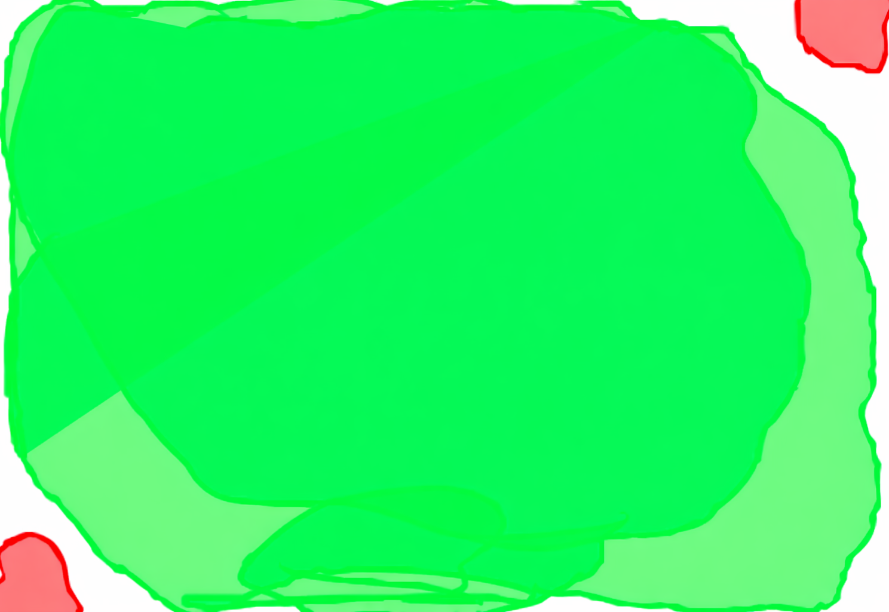{width=55%}

We can calibrate this measure by comparing actual random circuits. This allows
us to see how many gates are needed before random circuits look random in the
heatmap. Below, we vary both the number of gates and the number of wires.

<!-- Figure 2-5 -->
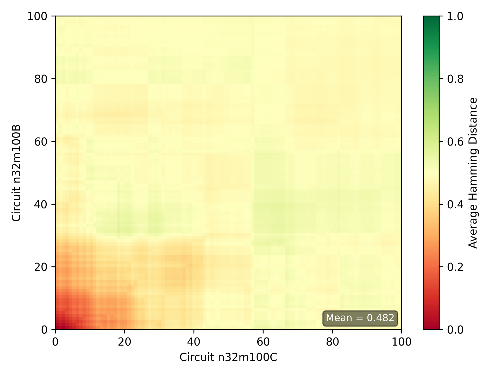{width=55%}

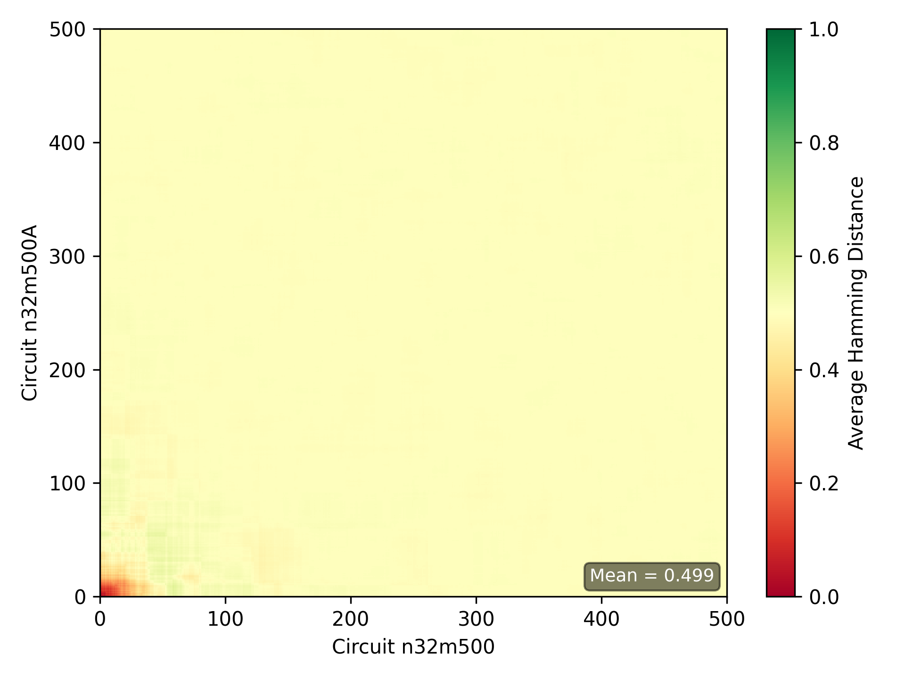{width=55%}

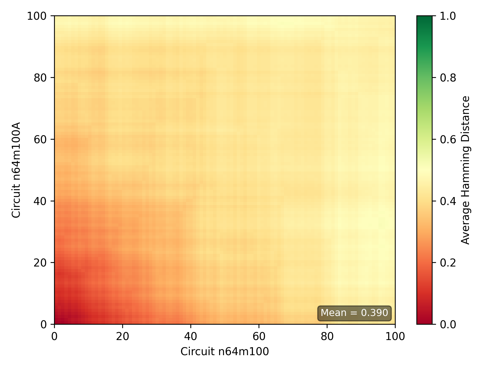{width=55%}

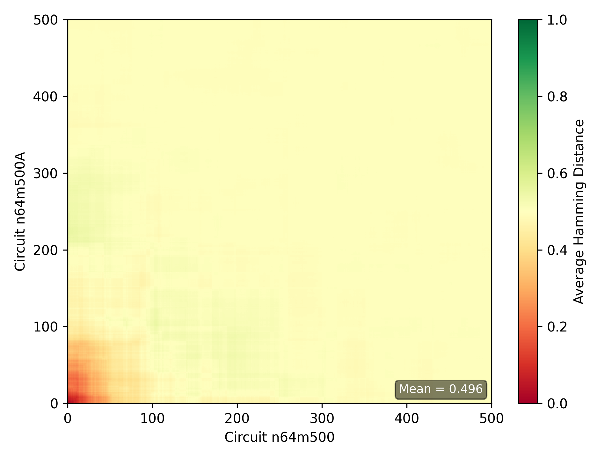{width=55%}

From Figures 2 and 3, we can see that on 32 wires, two completely random
circuits already look uncorrelated at 100 gates. On the other hand, Figures 4
and 5 show a good bit of correlation on 64 wires at 100 gates. This correlation
is gone when we use 500 gates. Thus, a random-circuit comparison needs enough
gates before it becomes a meaningful baseline. Without restricting the circuit
to r57 gates, this number is $O(n\log n)$.

Figure 6 shows a circuit compared with itself. This is the diagonal that we are
attempting to escape from.

<!-- Figure 6 -->
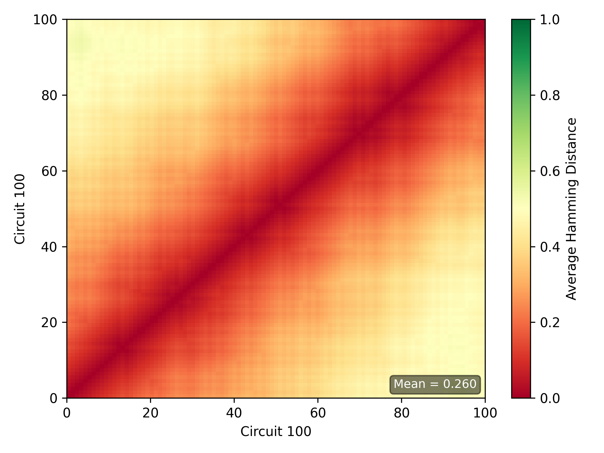{width=55%}

The ordinary heatmap is not the only state heatmap that we use. A pure wire
permutation can make the ordinary map look random without actually hiding the
computation. Since a permutation preserves Hamming weight, we also compare

$$
\left|\operatorname{wt}(C_{1,i}(x))-\operatorname{wt}(C_{2,j}(x))\right|.
$$

This Hamming-weight heatmap catches the simple wire-shuffle case, although bit
flips and more general affine encodings can defeat it. We can also make either
heatmap on isolated pieces of a circuit, build up longer prefixes one piece at
a time, or choose inputs which are more likely to expose structure. Our chosen
inputs include low-Hamming-weight inputs, inputs close to one fixed random
input, and pairs which differ in exactly one bit. A flat global map on random
inputs only rules out the statistic and input distribution that we tested.

**Compression attacks.** Incompressibility asks how well an attacker can sample
subcircuits and replace them with fewer gates. If we expand a 100 gate circuit
on 64 wires to 1000 gates, then a compressor which brings it back to 100 gates
or fewer has undone the expansion for this purpose. This is an empirical attack,
not a proof of incompressibility: a stronger compressor may find replacements
that ours misses. We use `fcompress` as the current attacker-computable cleanup
test because it also tells us whether our additional structure survives an
ordinary deterministic compression pass. Showing that no practical compressor
can undo the construction remains an open problem.

**Differential attacks and algebraic degree.** Heatmaps compare sampled states,
but a circuit can pass them while every intermediate wire is still a simple
function of the original input. To test this, we begin with input variables
$x_0,\ldots,x_{n-1}$ and apply each gate as a substitution over $GF(2)$. Every
wire at every prefix is then an algebraic-normal-form polynomial in the original
inputs. Its degree is the largest number of distinct input variables in any of
its monomials.

If a coordinate has degree at most $d$, then its $(d+1)$ st derivative vanishes.
Equivalently, XORing its value over the $2^{d+1}$ points of a suitable affine
cube gives zero. This gives a differential distinguisher when $d$ is small. We
therefore inspect the degree of every wire throughout the circuit, rather than
only the maximum: one remaining low-degree coordinate can leak even if another
wire has high degree. The end-to-end degree is fixed by the function that we
must preserve. Only the intermediate degree profile is ours to change.

**Affine reconstruction heatmaps.** The differential test above asks how
complicated each transformed wire is as a function of the original input. The
affine reconstruction heatmap asks a different question: given all of the wires
in the transformed circuit at one moment, can an attacker combine them to
recover the original circuit's state at some moment?

For instance, two carrier wires $c_0$ and $c_1$ may each be high-degree
functions of the original input while still encoding a logical value as

$$
v=c_0\oplus c_1.
$$

The differential test sees two complicated physical wires. The affine
reconstruction test sees that the logical value is still recovered by one XOR.

Let $C$ be the original circuit on $n$ wires and let $G$ be the wider
transformed circuit on $N$ wires. Row $i$ of the heatmap represents the state of
$C$ after $i$ gates, while column $j$ represents the state of $G$ after $j$
gates. To fill the cell $(i,j)$, we run both prefixes on the same collection of
logical inputs. We also follow the auxiliary-input policy of the construction:
the public slice is fixed, while the remaining helper wires are fixed or
sampled as required by that experiment. This policy is part of the result. A
flat map under one choice of helper inputs does not tell us what happens under
every other choice.

We then take one target wire $t$ from the state of $C_i$ and ask whether there
are fixed coefficients $a_0,\ldots,a_N$ such that

$$
C_i(x)_t
=a_0\oplus a_1G_j(x)_1\oplus\cdots\oplus a_NG_j(x)_N
$$

for every sampled input $x$. The coefficients do not change with the input.
Each coefficient is either 0 or 1: choosing 1 includes that wire in the XOR,
while choosing 0 leaves it out. For example, if

$$
C_i(x)_t=1\oplus G_j(x)_3\oplus G_j(x)_{11},
$$

then the attacker has recovered that logical bit, even if neither physical wire
3 nor physical wire 11 contains it by itself. We repeat this for every one of
the $n$ target wires of $C_i$. In other words, the test does not ask whether the
two physical states look alike. It asks whether the original state can be
decoded by XORing wires of the transformed state, with an optional constant.

We find these coefficients with Gaussian elimination over $GF(2)$, which is
ordinary linear algebra with XOR used as addition. We use one set of inputs to
find a relation and a separate holdout set to test it. If a target wire has no
affine relation on the training set, it receives error $0.5$, which is the error
of a random guess. This $0.5$ is assigned by convention; it does not mean that
we measured the best affine predictor and found that it guesses randomly. If we
find a relation, it receives its actual error on the holdout set.
The heatmap value $H(i,j)$ is the average of these errors over the $n$ target
wires. Thus, $H(i,j)=0$ means that the complete state of $C_i$ was recovered
exactly on the holdout inputs. A value near $0.5$ means that this test did not
find exact affine reconstructions for most of the target wires. It does not mean
that no biased or more complicated predictor exists. An intermediate value
usually means that the test recovered only part of the original state.

A low-$H$ cell therefore says that the state of $C$ at row $i$ can be read from
the state of $G$ at column $j$. If the location of these low-$H$ cells moves
forward as $i$ moves forward, they form a ridge across the map. This ridge tells
the attacker where the successive stages of the original computation occur
inside the transformed circuit. We call it a ridge because we can plot
recoverability as $0.5-H$. In the raw error map, the same feature is a low-$H$
valley.

We do not read this map using its overall mean. Most cells compare unrelated
stages and therefore sit near $0.5$. Also, when $G$ gets longer, the leaking
region can occupy a smaller fraction of the map even when the leak itself has
not changed. We first remove the forced input and output ports and then measure
the low-$H$ cells in the interior. *Coverage* tells us how many original-circuit
rows contain a meaningful dip. *Depth* tells us how far that dip falls below
the background of its own row. Once enough rows have meaningful dips, $\rho$,
the Spearman correlation between the row and the location of its dip, tells us
whether those locations move forward with the original circuit. We can also
compare $\rho$ with shuffled ridge locations to determine whether the observed
ordering is stronger than chance.

**Bounded-degree reconstruction heatmaps.** The affine test only allows a
constant and XORs of individual wires. We can give the attacker more power by
also allowing products of the current wires. For example, the degree-2 test can
use terms such as

$$
G_j(x)_3G_j(x)_{11}.
$$

Here, multiplication is an AND of the two wire values.

It then asks whether each target wire of $C_i$ can be written as an XOR of a
constant, individual wires of $G_j$, and products of two wires of $G_j$. The
degree-$d$ test does the same thing with products of up to $d$ distinct wires.
Thus, the degree here describes the power of the reconstruction attacker, not
the degree of $G$'s wires as functions of the original input.

The difficulty is that the number of terms grows very quickly. On $N$ wires, a
complete degree-$d$ test has

$$
R(N,d)=1+\sum_{k=1}^{d}\binom{N}{k}
$$

possible terms. For reference, the counts are:

| wires $N$ | $d=1$ | $d=2$ | $d=3$ |
|---|---:|---:|---:|
| 48 | 49 | 1,177 | $\approx 18{,}000$ |
| 128 | 129 | 8,257 | $\approx 350{,}000$ |
| 512 | 513 | 131,329 | $\approx 22{,}000{,}000$ |

The number of training samples must exceed the number of possible terms. After
that, the Gaussian elimination itself also becomes expensive. For this reason,
a practical degree-2 or degree-3 test may use only some of the possible products.
A flat map from one of these restricted tests only means that this particular
set of terms did not reconstruct the original state. It does not rule out every
attacker of that degree. We should also run a control with a degree-$d$ relation
that the restricted test is supposed to find. If it cannot recover that control,
then its flat result tells us nothing useful.

**SAT tests.** A reversible circuit is already a straight-line Boolean program,
so we can translate it directly into a SAT formula. We begin with one Boolean
variable for each input wire and keep a table recording the variable which
currently represents each physical wire. For every gate, we allocate a fresh
variable for the gate's updated target wire and add CNF clauses which force that
variable to equal the result of applying the gate to the current target and
control variables. A CNF formula is an AND of clauses, where each clause is an
OR of literals. For a gate, we choose clauses which rule out exactly the
assignments where the fresh variable disagrees with the gate's truth table. We
then update the target's entry in the table. The other wire entries do not
change. Repeating this for the complete gate list produces a CNF formula whose
satisfying assignments are exactly valid executions of the circuit under the
chosen input restrictions.

We can then add unit clauses which fix the public auxiliary inputs and the
chosen output bits. A SAT solver returns values for every remaining variable,
including the free input wires. If the constrained output is a target image,
the returned input is a preimage of that image. We verify the answer by running
the circuit on the returned input. A successful model is therefore an
unambiguous break of that instance, while a timeout is only evidence about the
particular solver, encoding, and resource limit that we used. We use this test
for the [trapdoor permutation challenge](#trapdoor-permutation-challenge), which we discuss later.

The Two Phase Strategy {#two-phase-strategy}
======================

The two phase strategy was the initial method that we used in order to
try and achieve local mixing of reversible circuits. For more details on it, see the
\[CCMR'24\] paper. However, here, we will provide some results.

While we were experimenting with this method, we did not use compression
nor heatmaps in order to determine how well we were doing. However, the
loose proof given in \[CCMR'24\] was enough motivation to believe that
this method could work well. We tested numerous things here and got many
different results. We remind that the heatmaps here have an outdated
coloring scheme, with *purple* meaning the two circuits appear random to
each other and *green* to mean the two circuits are equal.

One essential thing for us to
figure out, as long as we assume that the two phase method works, is the
correct parameters to choose. We need to answer how much we need to
inflate, as well as how many rounds of kneading is necessary. The
principal idea behind the inflationary phase is to first add padding
that allows room for our circuit to be randomized. Afterwards, it is the
kneading that stops attackers from undoing our replacements.

When it comes to making our replacements in each phase, the easiest
method would be to simply precompute a table of all possible circuits of
a given $n$ wires and $m$ gates. For now, this is what we will be moving
forward with.

The \$10,000 Bounty {#bounty}
-------------------

Trusting that the inflationary and kneading phases would be enough to
stop any attacks on our circuit, we started up a bounty. We started with
a completely random circuit with 64 wires and 1014 gates. Afterwards, we
repeated the inflationary phase until we reached 12,111 gates and then
did hundreds of thousands of rounds of the kneading phase. If the
kneading phase was done correctly, then all replacements in the
replacement phase should be irreversible. The goal of the bounty is to
find an equivalent circuit on 1014 gates or less, essentially finding
the original circuit and showing that the obfuscation was ineffective.
The bounty can be found [here](https://hackmd.io/@gausslabs/rJRSYZ0Wye).

The bounty was quickly broken by Killari. There were a number of
techniques that were used. One of them, was to use a precomputed rainbow
table, much like we did to make our own replacements. However, Killari
would try to make sampled subcircuits smaller. In other words, by
sampling random subcircuits, Killari was able to compress the circuit
back down. In fact, the circuit was compressed to less than 1000 gates.
This is when it became obvious that we needed to strongly consider
compression attacks. For more details, see Killari's blog post on
breaking the bounty. A detailed discussion can be found
[here](https://paragraph.com/@killaridev/breaking-the-10-000-io-bounty-my-journey-to-crack-an-indistinguishability-obfuscation-implementation).

After the Bounty {#after-the-bounty}
----------------

Now that we knew that our two phase method was incomplete, we moved on
to looking at heatmaps. We wanted to better understand the circuits that
we could \"obfuscate\" with this method. As a result, we generated
numerous heatmaps to understand what was happening with different
changes in parameters. Namely, how the circuits look after more rounds
of kneading.

Keeping to 64 wires, it was clear that a couple thousand number of
rounds for the kneading stage was insufficient. The heatmap in Figure 7 below shows
that there is still an extremely clear correlation between the original
circuit and the \"obfuscated\" circuit as there is a clear green line
across $y = x$.

<!-- Figure 7 -->
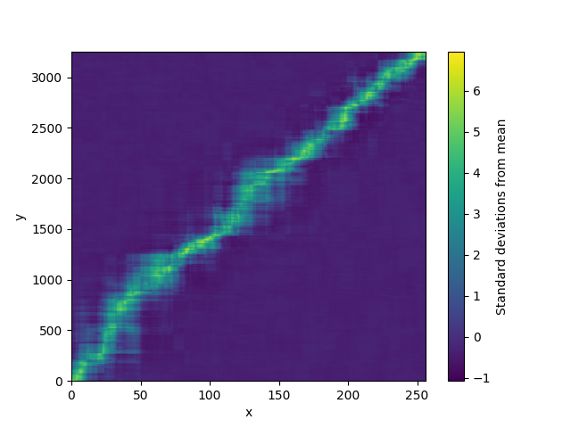{width=55%}

The two heatmaps in Figures 8 and 9 below show what the same circuit heatmaps look like with
100,000 rounds of kneading and 1,000,000 rounds of kneading.

<!-- Figure 8-9 -->
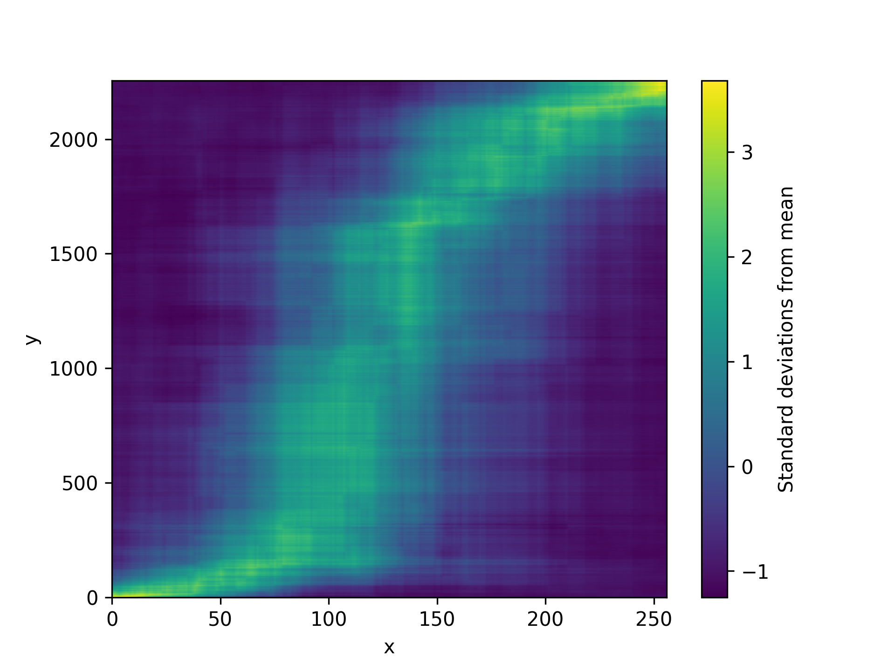{width=55%}

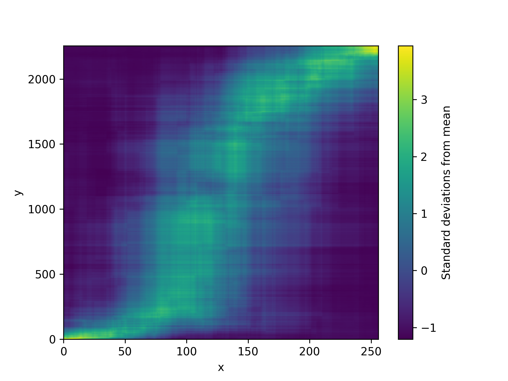{width=55%}

While it is clear that our heatmap is indeed \"spreading out\", which
means that we are indeed seeing more randomness, we also see that it
would require tens or even hundreds of millions of kneading rounds.
Thus, it was obvious that something needed to be changed. 

The Butterfly Methods {#butterfly-methods}
=====================

The main motivation for these methods, is to get
incompressibility. There are two versions of the butterfly method that
we will talk about. Namely, they are the asymmetric butterfly method and
the symmetric butterfly method. The asymmetric butterfly method is just
the butterfly method but with each $R_i$ being completely random. If we
look at the blocks in asymmetric butterfly, they are of the form
$R_i^*gR_{i+1}$. As the left and right circuits are random to each
other, then this block is essentially completely random. As mentioned
before, this makes the blocks extremely incompressible. On the other
hand, the symmetric butterfly method is with each $R_i$ being equal.
While the symmetric butterfly method gives us much less randomness, the
additional structure of each block $R^*gR$ makes them more compressible.

We note that $5OA$ will represent 5 rounds of symmetric butterfly on
circuit $A$, and $5QA$ would be the same but with asymmetric butterfly.

We first test our experiments on a small number of wires, as we know
that we can simply take contiguous subcircuits without sampling
subcircuits with more wires than we are able to compress with our
rainbow tables. Thus, we test on 5 to 7 wire circuits. We did many of
our tests on the two identities, circuit $A$, a 55 gate identity on $5$
wires, and circuit $B$, a 22 gate identity. We are interested in
numerous heatmaps here, such as $A$ vs $OA$, $B$ vs $OB$, $A$ vs $B$,
and $OA$ vs $OB$. The first two gives us an idea of how well we
obfuscate in relation to the original circuit, while the last two give
us an idea of how well we obfuscate equivalent, yet different circuits.

There was a problem we quickly ran into though. The butterfly methods
were ineffective on a small number of wires. Even with many rounds of
the butterfly methods, we would always be able to compress back down to
the original circuit. If we started with an identity, we would always be
able to compress back down to zero gates. This means that we are largely
unable to compress blocks and the gates $g$ in $R^*gR$ are not
effectively being hidden. This means that we may need more \"room\" for
the gates, which means we may need to use more wires. We of course can
still start with the 5 wire circuits, but the $R$ that we sample should
be over 64 wires. This would allow us to sample circuits from $3$ wires
to $7$ wires, giving us much more freedom.

Moving on to more wires {#moving-to-more-wires}
-----------------------

One change becomes immediate as we move onto more wires. We can no
longer sample contiguous circuits of size greater than 2 gates. This is
because if two gates share no wires, then 2 gates will already span 6
wires and 3 gates will span 9 wires, exceeding the limitations of our
rainbow table.

Before showing off some heatmaps, it is important to note that these
results are from when we had a weaker compressor. So while the results
won't match any longer, it maps our thought process as we changed our
algorithms.

Below gives our first heatmaps of $A$ vs $B$, $A$ vs $OA$, $A$ vs $2OA$.
The results for $B$ are very much the same and so will not be shown.

<!-- Figure 10-2 -->
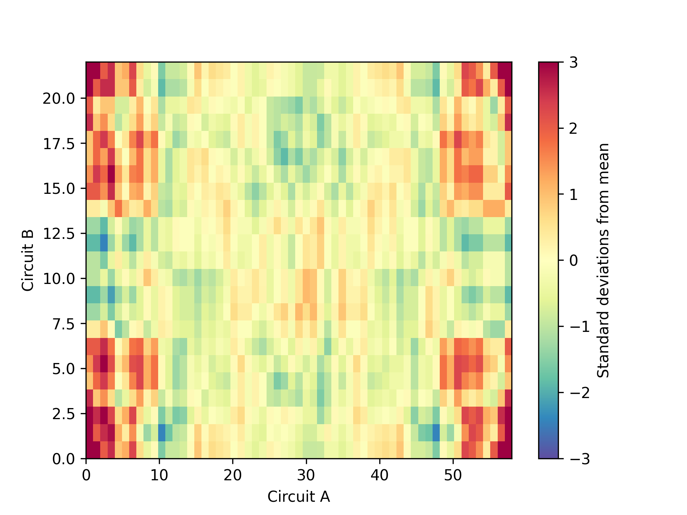{width=55%}

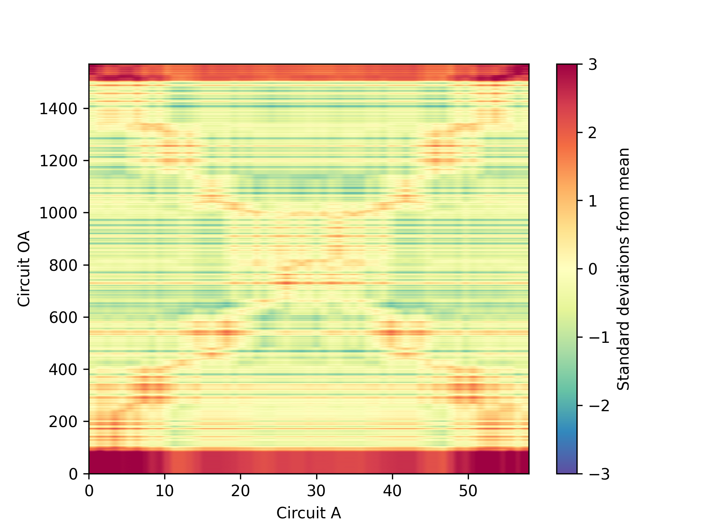{width=55%}

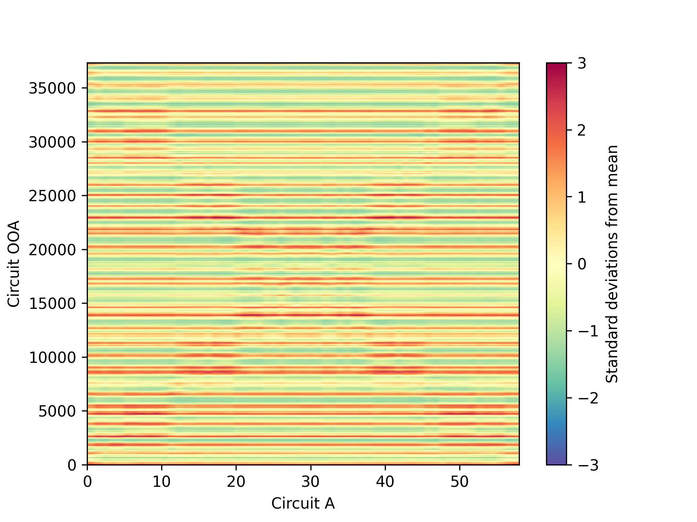{width=55%}

From the above heatmaps in Figures 10, 11, and 12, two things are clear. Firstly, there remains an
obvious diagonal. Secondly, the number of gates has blown up greatly.
The number of gates in each $R$ is randomized between 6-25 gates, and
with the weak compressor, it struggled to compress down at all,
resulting in a large blow up in gates. However, there is still an
obvious diagonal. In addition, due to runtime constraints, we would be
unable to run another round as the number of gates would blow up even
more. The final nail in the coffin, is if were to look at heatmaps on
raw hamming distance data, rather than standard deviations. Standard
deviations are useful to look at as they enlarge small differences for
us to see, but when we look at the raw data, it tells a much more somber
story.

Figures 13, 14, 15, and 16 are heatmaps where $R$, which we will now call *wings* is
small (5-15 gates), medium (30-70 gates), large (100-150 gates) and
large x2 (200-300 gates). We see that there is a gradual decrease in
redness, which shows that indeed, longer wings will create more
randomized obfuscated circuits. This is obvious as the gates we are
trying to hide in each block are more \"buried\" within the arbitrary
gates in the wings.

<!-- Figure 13-6 -->
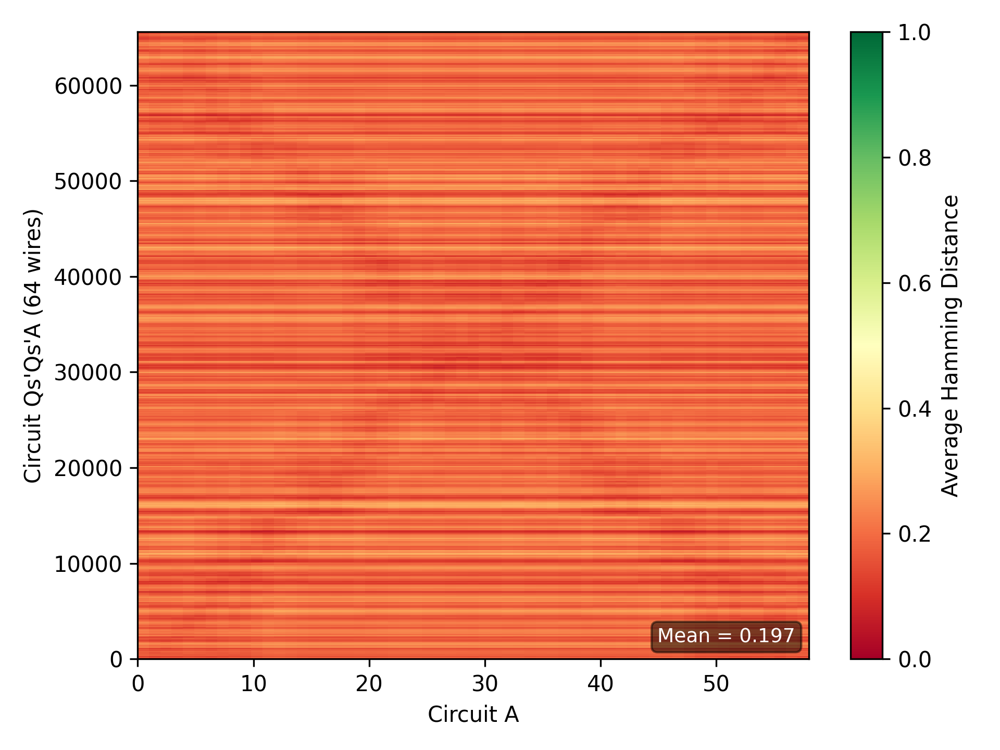{width=55%}

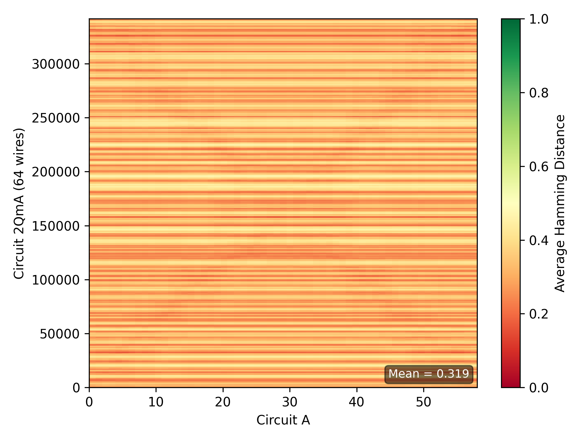{width=55%}

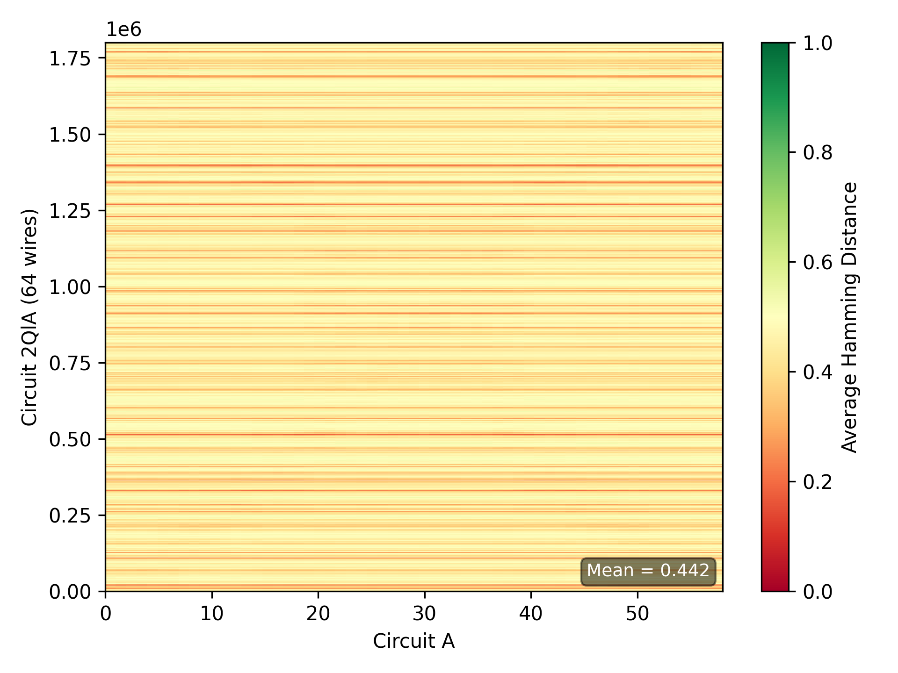{width=55%}

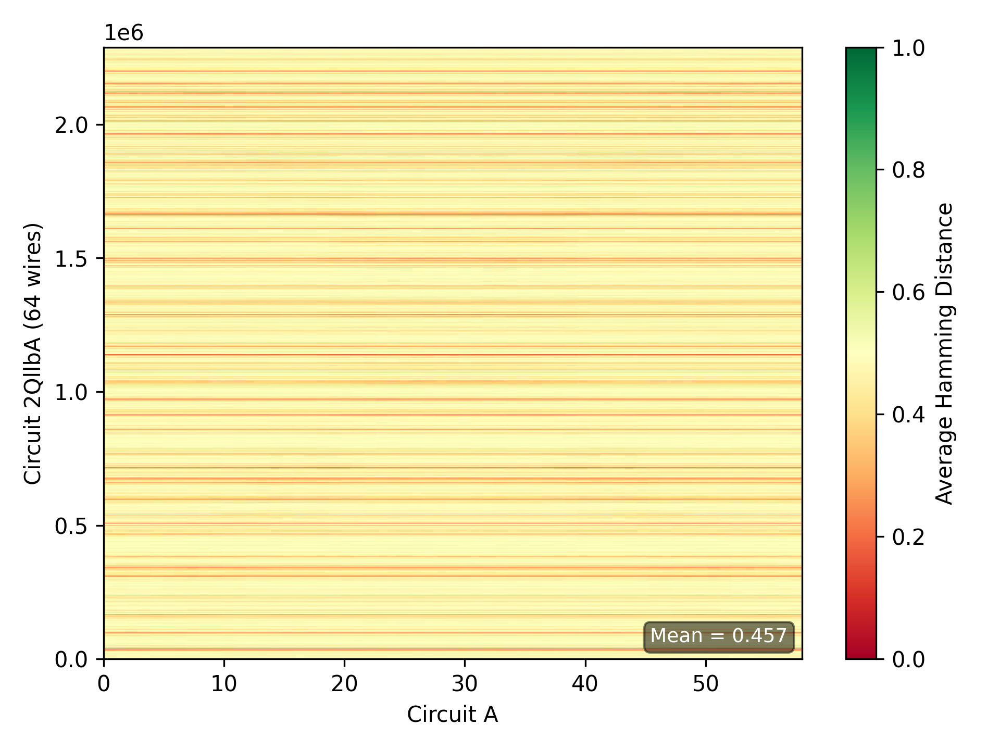{width=55%}

As there seemed to be little to gain from the heatmaps in Figure 15 and Figure 16, we kept with 100-200 gate wings and continued
testing. It is at this point, that we made some implementation-level improvements in speed to
our compressor, allowing us to compress at a much faster rate, and much
more. We also allowed our compressor to use ancilla wires during the compression. For example, when searching for a 5 wire circuit, we would find the corresponding circuit permutation on 6 or 7 wires and then find a replacement in our 6 or 7 wire rainbow tables. These improvements make all the above results prior to this
impossible. This actually made the entire butterfly method, as it was,
useless. Suppose we have $A$ and attempted to generate $OA$. Well this
would compress completely and we would just have $A = OA$. If we then
tried to get $2OA$, then this would be equivalent to as if we were
trying to generate $OA$ $A$. In other words, $A = OA = 2OA = \dots$. One
thing that would be useful, is understanding at what point during
compression our circuits stop looking random. The heatmaps below in Figures 17, 18, 19, and 20 answer
this question, to an extent. We start with a completely random circuit
on 64 wires and 500 gates, and then take heatmaps as it is being
compressed.

<!-- Figure 17-20 -->
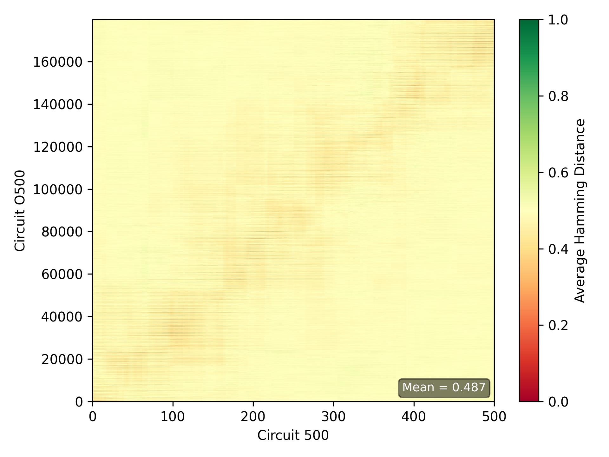{width=55%}

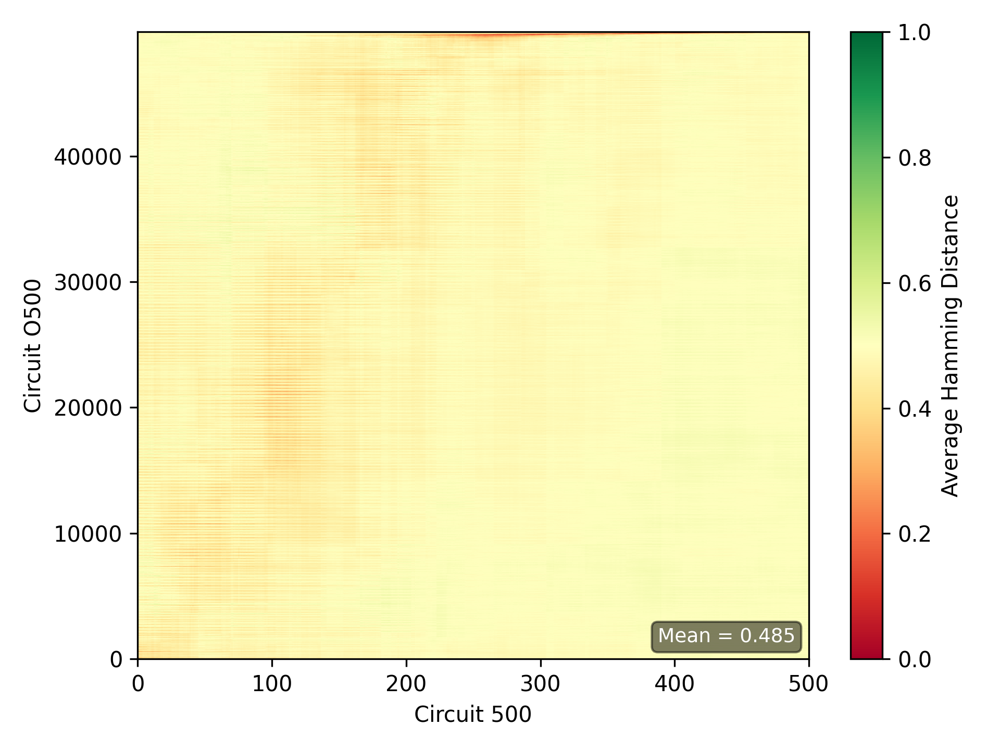{width=55%}

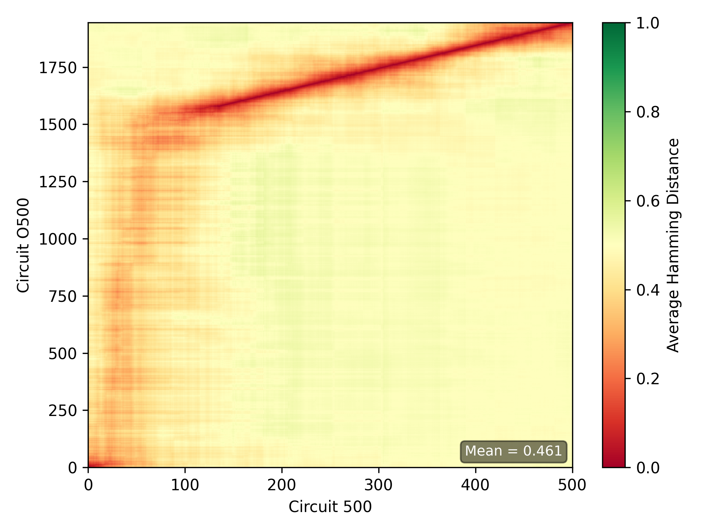{width=55%}

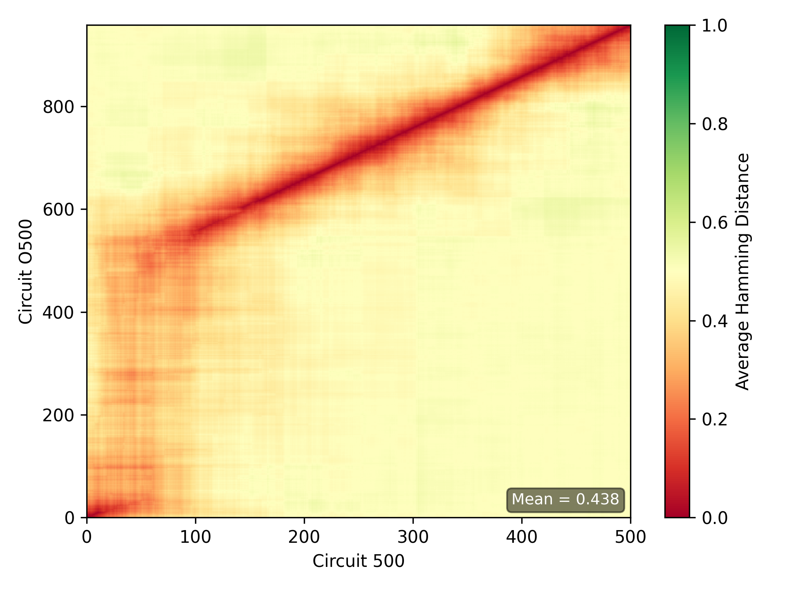{width=55%}

These results led us to instead stopping compression early, at
around 1,000 gates. After each round, we would increase this by another
thousand. So for the 10th round of compression, we would stop
compression at 10,000 gates. It was only in the final round would we
attempt to completely compress a circuit. This finally gave us
incompressibility, without the extreme blowup in the number of gates.
However, these heatmaps did not look the most random. The bigger problem
was that if we changed our compressor to allow ancilla wires, which
means when we sample a 5 wire subcircuit, we allow the compressor to
look into the 6 or 7 wire rainbow table, we could actually compress
these down completely. Thus, we needed to include ancilla wires to our
randomization in some way.

Ancilla Wire Replacements {#ancilla-wire-replacements}
-------------------------

When we are making replacements, we would add randomization in two ways.
The first way is by randomly sampling a subcircuit. The second way is by
randomly choosing how many wires our subcircuit could be on. For
example, we may try to only sample a 5 wire subcircuit as opposed to the
much easier 7 wire one. One change that we could make to this, is to
sample a 5 wire subcircuit, but then find how the circuit's permutation on 7 wires, and then use the 7 wire rainbow tables to
make the replacement. In other words, we are adding ancilla wires to our replacements. To illustrate how we do this, consider a circuit on 3 wires. To compute its permutation, we would consider bits such as $000, 001, 010, \dots$. However, nothing stops us from treating a 4th wire as a "do nothing" wire, which then allows us to consider input bits $0000, 0001, 0010, \dots$ in order to compute a permutation on 4 wires as opposed to the original 3. We then need to search for this permutation in the 4 wire rainbow table, which allows us to find a functionally equivalent replacement of a 3 wire circuit with a 4 wire circuit. 

Ancilla wire replacements alone gave us
incompressibility. One useful thing about this process, is that it gave
us even smaller incompressible circuits. The heatmap in Figure 21 below shows that we
still have the red beam in the top right corner, which tells us that we
still need more randomization.

<!-- Figure 21 -->
{width=55%}

Blurring {#blurring}
========

With our new goal of randomization, we will consider various methods. As
we are trying to make the heatmaps look more random, this means that we
want to make our heatmap look more \"blurry\". Hence, we call this
section \"blurring\". One easy way to blur is to randomize the gate
ordering of non-colliding gates and then \"locking them in\" via the
incompressibility of the butterfly method. Another way to do so is to
replace gates entirely with rewired identities. For instance, if we have
$g$ and an identity $I$, and then shuffle the bits of $I$ such that the
first gate of $I$ matches with $g$, then we have $I = gB$, for some $B$.
This means that $B = g^{-1} = g$, since every gate r57 (and in fact every Toffoli gate) is its own inverse, and so we can replace $g$ with $B$. These two
ideas will be the pillars of our discussions moving forward.

Random Shooting vs Random Walking {#random-shooting-vs-walking}
---------------------------------

This is our first, and more basic, method to blurring. The processes are
described below.

**Random Shooting:**

1.  Select a random gate $g$.

2.  Select a random direction $d$, left or right.

3.  Send $g$ all the way $d$ until it meets a gate that it collides
    with.

4.  Repeat.

**Random Walking:**

1.  Create the skeleton tree of the circuit

2.  If any nodes have no parents in candidates, then add them to
    candidates (for the first iteration this is all nodes at level 0)

3.  Select a random node from candidates, add it to $c$, and remove from
    candidates (nodes can not be re-added).

4.  Repeat from step 2 until candidates is empty and all gates have been
    added to $c$.

The basic idea of these two methods is the same: to randomize the
ordering of gates. The first one is extremely simple. There is no
problem with sending a gate all the way left or right, because any gates
in the same level can still be sent past it. For instance, say we have a
circuit $abc$ such that no gates collide. If we send $c$ all the way to
the left, then we have $cab$. We do not have to worry about $c$ getting
\"stuck\" there, as if we send $b$ to the left, then we have $bca$.
However, there remains a concern that the very last gate that we shoot
will be at the end, or the farthest it can be. It is unclear whether
this causes any damage or not. Random walking is meant to circumvent
this problem as we are truly randomizing the nodes in each level of the
skeleton tree. However, this is much more algorithmically complex as we
need to convert our circuit to the skeleton graph. With a different data
structure, it is possible that this is more efficient, but for now, we
choose to use random shooting.

To further convince that this choice is not wrong, we have three tests
to compare the two. For the first test, let circuit $N$ be a circuit
with no colliding gates on 64 wires. This circuit has 62 gates. There
are three ways we can randomize this and retain functionality. First, we
can just randomize all the gates by simply selecting the gates in a completely random order. This can be done because no gates collide and so any ordering of the gates will yield the same functionality. This essentially
serves as our goal for the next two. Second and third are our proposed
random shooting and random walking. As we are only on 62 gates, there is
high variance, which means that heatmaps won't be the best way to view
the results. Instead, we can record the mean hamming distance across
hundreds of random states between $N$ and the randomized circuits, and
then randomize them 100 times to get a new mean each time. Taking the
average gives us a better estimate on how we are doing.

For the second test, let us now consider a completely random 100 gate
circuit and then do the same process. Note that we no longer are able to
complete randomize the circuit as gates will now collide.

For the third and final test, we can consider a 500 gate random circuit.
The results of all the tests are below.

| Scenario        | Method          | Average       |
|-----------------|---------------- |---------------|
| Non-colliding   | Random ordering | 0.4532510031  |
|                 | Walking         | 0.4522365294  |
|                 | Shooting        | 0.4535883884  |
| 100 gate        | Walking         | 0.4286999006  |
|                 | Shooting        | 0.4226936795  |
| 500 gate        | Walking         | 0.2003583436  |
|                 | Shooting        | 0.1988034497  |

*Average mean Hamming distance by scenario and method.*

As we can see from the table, we see only very small differences between
random shooting and random walking. Thus, we conclude that there is
little gain in using random walking over random shooting given the
additional algorithmic complexity in random walking.

For an idea of how well we can actually mix, below are two heatmaps. Figure 22 is a random 100 gate circuit on itself as we saw earlier, which we expect to have a
\"red beam\" along $y = x$ as the circuits are equal. Figure 23 is the
same 100 gate circuit but with random shooting. We note that the heatmap
for random walking looks extremely similar.

<!-- Figure 22-3 -->
{width=55%}

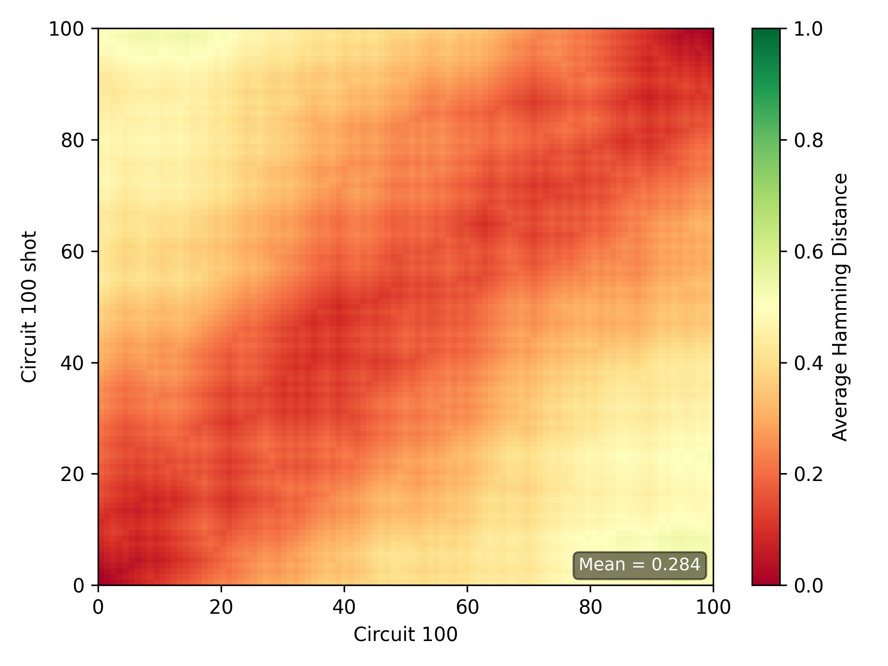{width=55%}

Replacing Gates with Rewired Identities {#rewired-identities}
---------------------------------------

A more complex method of achieving blurring is to make single and pair
gate replacements. The process for both is given below.

**Single Gate Replacement**

1.  Select a random gate $g$.

2.  Create a random identity $I$ by finding two friends from our       rainbow table.

3.  Rewire the very first gate of $I$ to match $g$ to get $I'$. We note
    that this is still an identity as bit shuffles of identities are
    still identities.

4.  Remove the first gate of $I'$, which should be equal to $g$, to get
    $B$.

5.  Replace $g$ with $B$.

6.  Repeat.

More formally, step 2 can be done by searching for a permutation that has multiple circuits computing it. We can then select two of them, say $C_i$ and $C_j$, and then we have $I = C_1C_2^{-1}$. 

For the pair replacements, we will classify each type of overlap from
the right gate onto the left gate. For instance, $123;321$ we can say
that the active pin of the left gate's active pin shares a wire with the
second control pin of the right gate, the left gate's first control pin
shares a wire with the right gate's first control pin, and the left
gate's second control pin shares a wire with the right gate's active
pin. For pairs of gates, there are 33 different ways to have an overlap
(excluding the case where the two gates don't overlap at all). This is
because there are 6 ways to have an overlap on every single wire of the
left gate, 18 ways to have 2 overlaps on the left gate, and 9 ways to
have an overlap on a single wire. This means we can easily identify each of the overlaps with an id. We can now define how to make pair
replacements. 

**Pair Gate Replacements**

0. Choose how many pairs to be replaced $X$.

1.  Pair up all gates in the circuit and store their overlap ids in a
    table $T$.

2.  Create a random identity $I$ by finding two friends from our rainbow
    table.

3.  If $I$'s taxonomy matches one in $T$, say that of $g_1g_2$, then rewire the first and
    second gate to match the pair to get $I' = g_1g_2B'$.

4.  Remove the first two gates of $I'$ that match the pair with the
    matching taxonomy to get $B'$.

5.  Replace the pair with $B'^{-1}$ as $I' = g_1g_2B'$ which means $g_2g_1 = B'$.

6.  Repeat until $X$ pairs have been replaced.

The biggest advantage to using the single gate replacements is the
simplicity. It allows us to hide a single gate amongst 4 to 8 gates.
However, the state before these 4 to 8 and after them will remain the
same. Thus, by replacing a pair of gates, we get to remove the seam
between those two gates. So while it is harder to replace a pair, as the
best we can do is check a random identity and see if it matches, it is
more effective in blurring. Thus, the first question is whether we can
get enough randomness with only single gate replacements, similar to how
we chose to use random shooting over random walking.

Figures 24 and 25 are two heatmaps of tests that use random shooting, ancilla
replacements, single gate replacements, and 5 and 30 rounds of
asymmetric butterfly, respectively.

<!-- Figure 24-5 -->
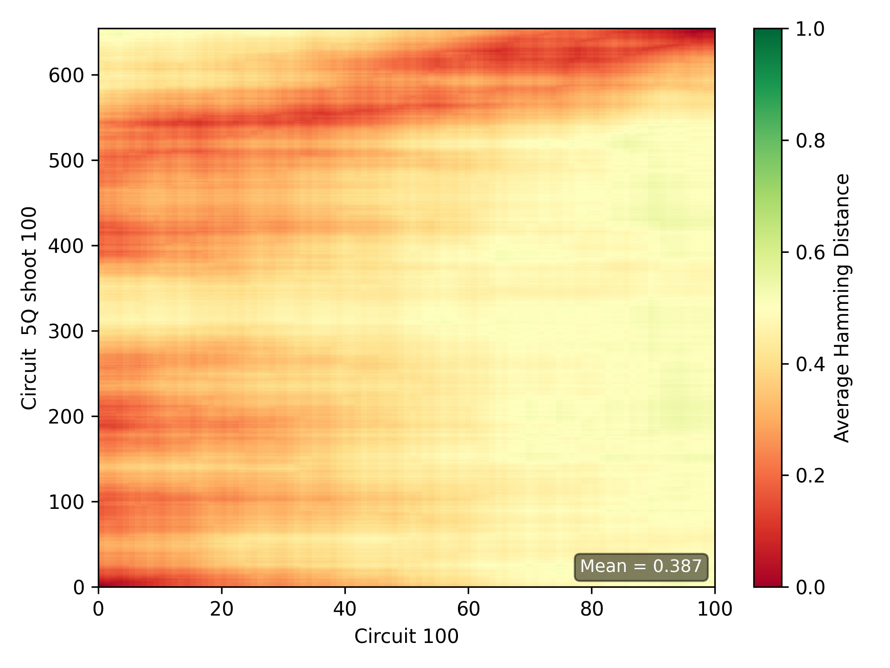{width=55%}

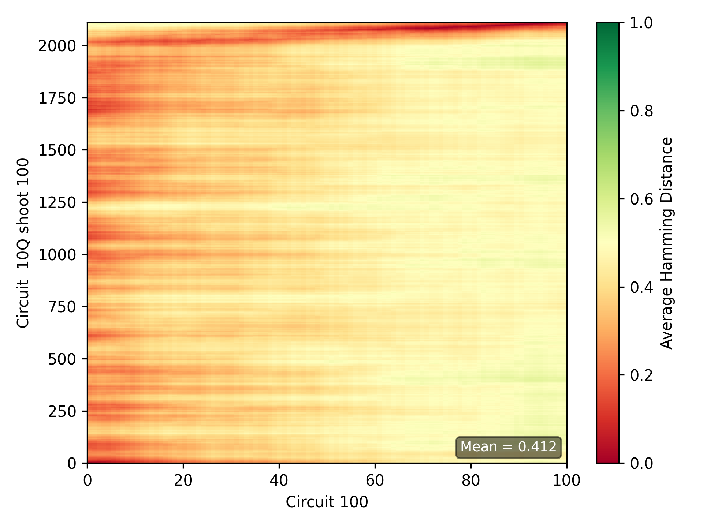{width=55%}

While we get incompressibility from the above results, we see that there
remains a \"red beam\" in the top right corner. In addition, for much of
the obfuscated circuit, we see that it doesn't move much, indicated by
the red lines on the left until near the top of the heatmap. We call
this a red boomerang. We suspected that this was a result of the
structure of the random 100 gate circuit, but upon testing with other
random circuits, the red boomerang remained. Thus, it would appear that
we need to test with pair gate replacements. The heatmap below in Figure 26 shows the
same test, but with only pair gate replacements.

<!-- Figure 26 -->
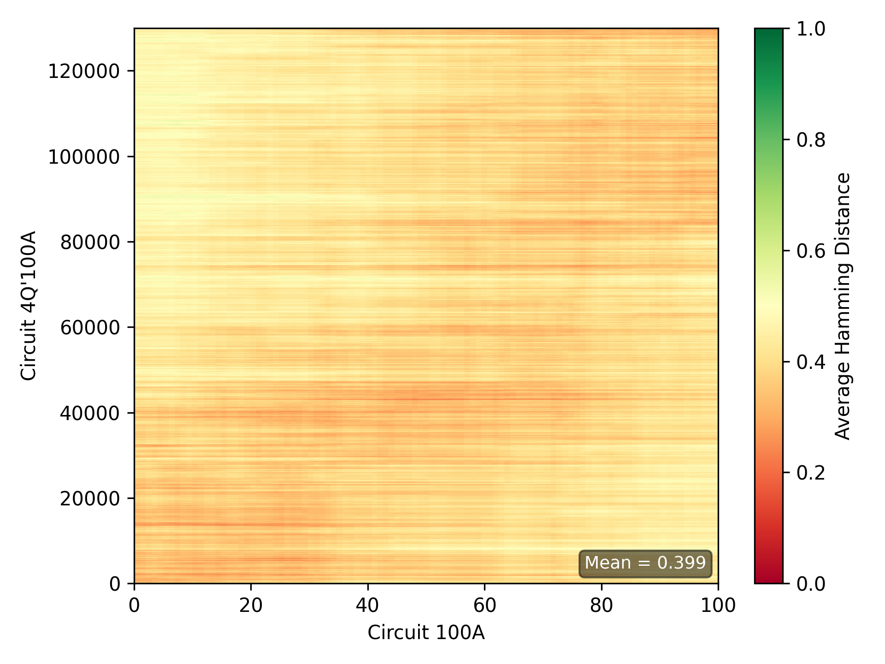{width=55%}

We quickly note that we have tested this a number of times and got
similar results each time. We see no \"red beam\" anymore and the
randomness is much more spread out. There is still a very spread out red
\"line\" on $y = x$ and so additional blurring is needed. This is the
only way we have found so far that has managed to get the blurring and
incompressibility that we desire. We also believe that it would be good
to use both single and pair gate replacements, rather than just one.

Methods on Pair Replacements {#pair-replacement-methods}
============================

Above, we discussed a [partitioned pair gate replacement](#rewired-identities). However, this
doesn't actually provide much mixing outside of the replacements
themselves. The gates adjacent to each other don't interact in any
meaningful way, unlike how adjacent identities in the butterfly will
attempt to randomize via shooting and compression. Thus, the methods
that we discuss here will attempt to further introduce randomization
amongst gates through the use of pair gate replacements. We note that
all of these methods incorporate shooting somewhere in the algorithm as
well. The point of these methods is to get away from the large blowup
incurred from the butterfly methods, while still effectively mixing our
circuits.

There are a number of methods that we have tried with motivation of pair
get replacements. We note that pair gate replacements are actually very
similar to the [ancilla replacements that we discussed before](#ancilla-wire-replacements), as a pair
could span anywhere from 3 to 6 wires. Thus, all we need to do is make a
replacement on 6 or 7 wires in order to use ancilla wires.

Replace Pairs Sequentially {#replace-pairs-sequentially}
--------------------------

In this method, we make pair replacements in a sequential manner before
doing compression. For short, this method is called RCS. RCS is very
similar to the method described above. However, we no longer partition
our circuit into pairs. Instead, we do the following

1.  We take $g_1 g_2$ as a pair and replace it with $u_1 u_2 \dots u_l$

2.  We then treat $u_l g_3$ as our next pair and replace it with
    $w_1 w_2 \dots w_k$

3.  Our next pair is $w_k g_4$ and do the same

4.  Repeat until we have reached the end of the circuit.

Notice that our end result is a sequence of gates that never return to
the original functionality of $g_i g_{i+1}$ because we replace it with
$u_1 u_2 \dots u_l$, but then use $u_l$ in a later pair swap. Notice
that it is possible that $g_1$ and $g_2$ do not collide at all. In fact,
they may not even share any of the same wires. We experimented with some
ideas on forcing collisions and while we didn't see any new results, we
will state the ideas below for completion.

1.  We take $g_i g_{i+1}$ as a pair

2.  If $g_i$ and $g_{i+1}$ share any wires, then replace with
    $u_1 u_2 \dots u_l$ as before. The next pair to consider is
    $u_l g_{i+2}$

3.  Else, we shoot $g_{i+1}$ to the right

4.  If $g_{i+1}$ eventually collides with some gate $h_j$, then we treat
    $h_j g_{i+1}$ as a pair and replace it with $w_1 w_2 \dots w_k$. The
    next pair to consider is $g_i g_{i+2}$

5.  If $g_{i+1}$ does not collide with any gate to the left, then make
    it a single gate replacement. The next pair to consider is
    $g_i g_{i+2}$

Notice that in the experiment above, we don't fully remove the
$u_1 u_2 \dots u_l$ in the cases that we must shoot left. It remains
unclear whether this is a huge loss or not and we did not explore this
much further as little to nothing was lost when switching to the simpler
method discussed at first. Below, Figure 27 is the result of RCS after 3 rounds.

<!-- Figure 27 -->
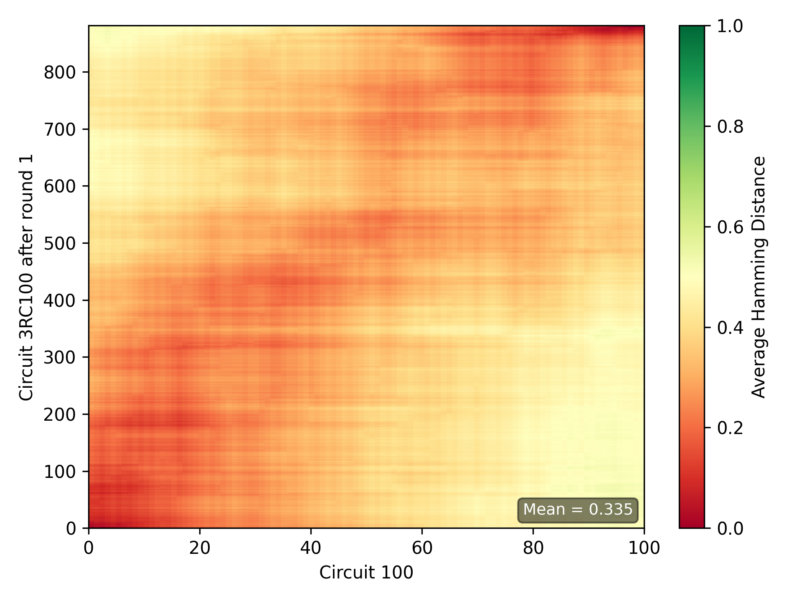{width=55%}

This heatmap is quite similar to the heatmap taken from our partitioned
version of pair replacements. Of course there is more correlation
overall, but the gate blowup is much smaller. In fact, we can take this
to 50 rounds and still be only at a fraction of the number of gates that
the pair gate replacements with asymmetric butterfly.

For comparisons sake to the next method, Figure 28 depicts heatmap of
a test done on 16 wires.

<!-- Figure 28 -->
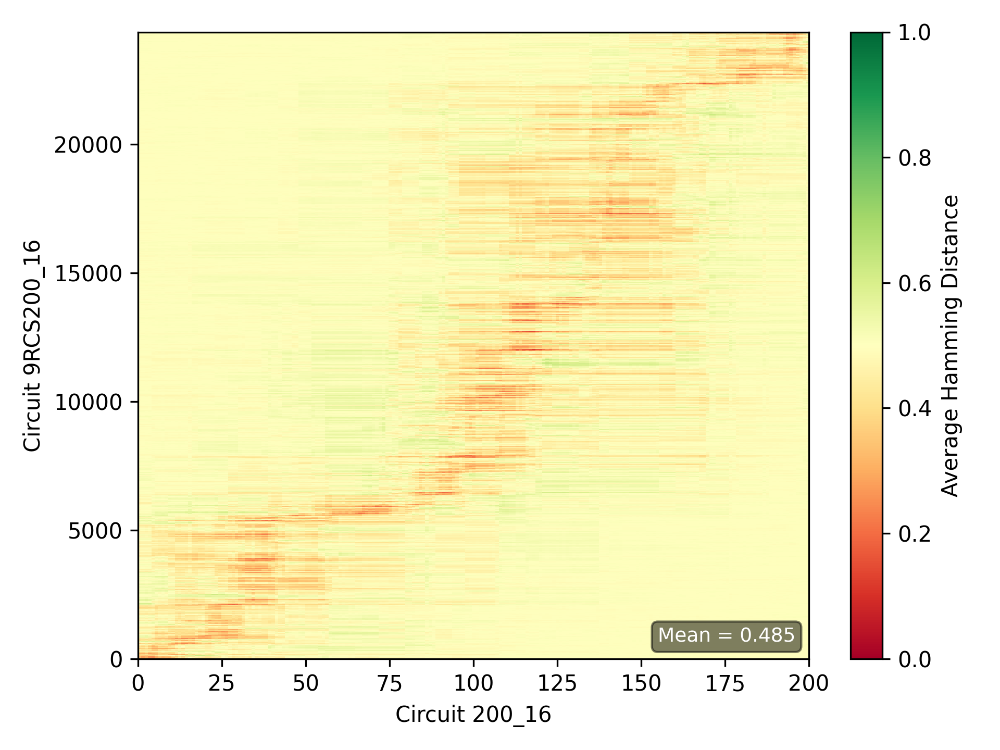{width=55%}

We will return to this method after discussing the other two methods.

Replace Pairs by Distance {#replace-pairs-by-distance}
-------------------------

One problem with the above method is that we replace pairs in a very
standard manner, without caring for the kinds of pairs that we replace.
For instance, suppose a circuit is extremely randomized in the first
half and completely untouched in the second half. Then ideally, we would
further randomize the second half in order to get complete randomness.
The sequential method constantly gets close to the original states, and
we wish to stay away from these points until the end of the circuit.
This is the idea of the replace pairs by distance method (RCD).

This method records of notion of \"distance\" in between each gate.
These distances measure how far we have gone from the original states of
our original circuit. The idea is to track how far the circuit is from the **original circuit** after each gate. We call this the *distance*. As each gate can only flip a single bit, then a single gate can only affect the distance by $\pm 1$. So suppose we have a circuit $g_1g_2g_3$. Then there are 4 initial states for us to record: before $g_1$, between $g_1$ and $g_2$, between $g_2$ and $g_3$, and after $g_3$. As this is the original circuit, our starting distances is thus $[0,0,0,0]$. Now suppose we replace $g_1g_2$ with $u_1u_2u_3u_4$ (of course with equivalent functionality). Then the circuit becomes $u_1u_2u_3u_4g_3$. In addition, the gates within $u_1u_2u_3u_4$ will differ from $g_1g_2$. So suppose and input state $x_0$ is changed by $g_1$ to become $x_1$. Then $x_0$ may never be $x_1$ after any $u_i$. This means that the $u_i$ give us some *distance* from the original circuit. Our new distances become $[0,1,2,1,0,0]$. We note that $x_0$ after both $g_1g_2$ and $u_1u_2u_3u_4$ is equal as the circuits themselves are equivalent. We quickly note that this creates a small "hill" in the distances. Now let us replace $u_4g_3$ with $w1w_2\dots w_8$. The distances will then become $[0,1,2,1,1,2,3,4,3,2,1,0]$. The beginning and end are ascending and descending respectively. However, notice that the "second" distance in our list of distances can never be greater than 1. In other words, we can not have a distance like $[0,2,3,2,0]$. This means that $u_1u_2$ is already as "steep" as possible and can not be improved further. We can therefore ignore these "edges" and only need to consider the middle section $[1,1,2,3]$. Finally, notice that all the $0$s have been eliminated. If we continue with this process, we can work to eliminate all the $1$s, and then the $2$s, etc. $Ideally, we would be able to continue until we have removed all
30s, but practically this becomes very hard due to gate blowup. Thus, our tests only go as far as removing all $10$s. 

<!-- Figure 29 -->
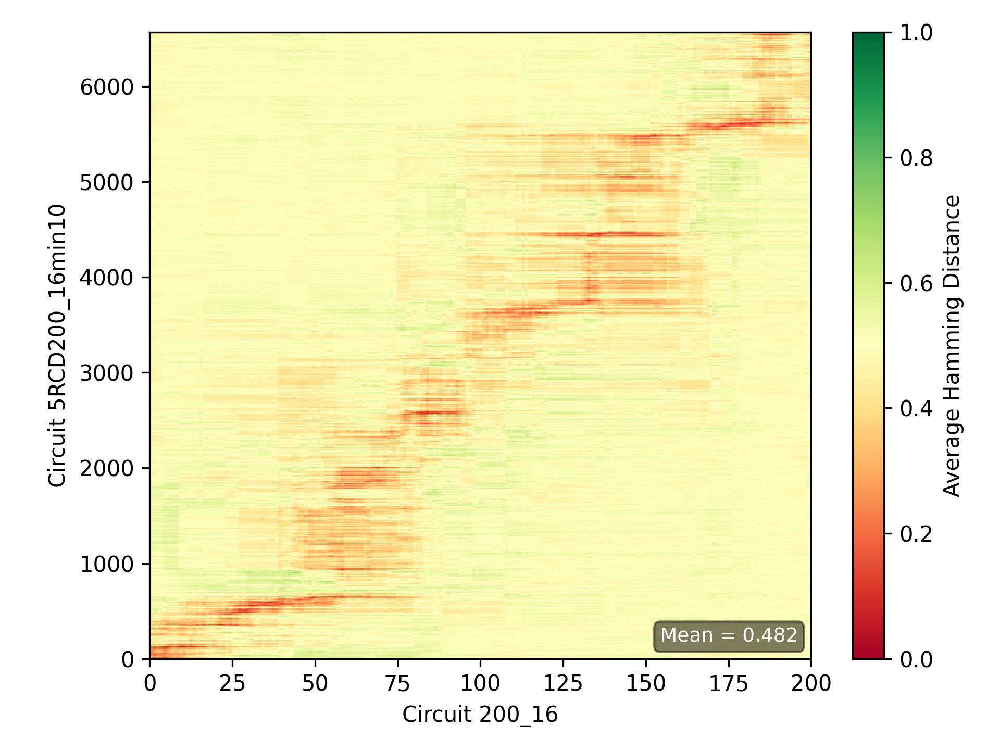{width=55%}

Figure 29 looks extremely similar to that of the RCS method.
With further rounds, we only get a lighter red line, but can't seem to
escape the red line that reveals our correlation. In addition, we
clearly notice that the line is much clearer in the 16 wire version than
the 64 wire version. This reveals that our randomization methods are
merely fixing the blurring that we have from our shooting. On 16 wires,
shooting is much less effective as gates will collide much more often.
Thus, it is clear we need some further form of randomization. That is
not to say that the above methods are useless though, as we have still
achieved incompressibility. At this point, we are most concerned with
the heatmap attacks.

More on RCS and RCD {#rcs-and-rcd}
-------------------

We earlier discussed that our random circuits needed a sufficient number of gates to actually appear random. Figures 30 and 31 below show that tests on an insufficient number of wires indeed are not meaningful, as the heatmap in Figure 30, which uses 100 wires as a base, looks very blurry, while Figure 31, which uses 1000 wires, does not. 

<!-- Figure 30-1 -->
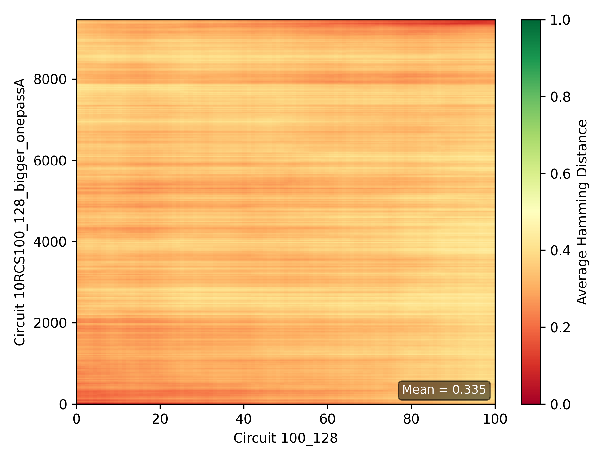{width=55%}

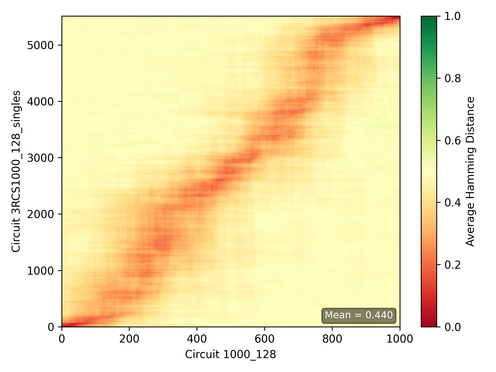{width=55%}

One thing that we have retained throughout all of our experiments, is
maintaining functionality of the circuit. As a result, we have always
gotten a strong diagonal on our heatmaps due to the functionality being
equivalent, causing there to be guaranteed strong correlation in the
corners along $y=x$. As discussed earlier when we detailed our [measures of success](#how-we-measure-success), our results may only be a result of working on 100 gates on 64 wires. As we saw, this isn't enough to get a full amount of randomness on 64 wires. However, one idea that comes from this is given our starting
number of gates, to simply increase the number of wires that we work on
in hopes that we can force a heatmap that blurs in the way we saw
previously. However, this would continue to limit us, as even those
blurred heatmaps showed a lot of correlation. This correlation is, in a
way, expected as for equivalent circuits, we will always have
correlation in the corners along $y=x$. Thus, one question to ask is if
we really need to maintain equivalence?

Generation Mixing {#generation-mixing}
-----------------

Generation mixing began as a variation on [RCD](#replace-pairs-by-distance). RCD tries to work on the
parts of the circuit which remain closest to the original computation. Instead
of repeatedly measuring that distance on many input states, generation
mixing gives each gate a cheap score which records how deeply it has been
rewritten. It also keeps the useful idea from [RCS](#replace-pairs-sequentially) that one replacement should
overlap the next, rather than leaving a sequence of isolated replacement
blocks.

The first implementation made this very literal. It selected a gate at the
lowest useful generation, shot it through the gates with which it commuted,
replaced the window at the resulting collision, and continued from a gate made
by that replacement. The current generation mixer grew out of this idea, but
it no longer runs that generation-floor collision chain. Instead, it makes fresh
database-replacement attempts under a size schedule and moves the products of
each successful replacement outward. Repeated sampling and this outward motion
are now what make the replacements overlap.

This is the point at which the [frozen table](#frozen-table) is most
useful. Apart from the occasional twist described below, every round attempts
the following database move:

1.  Choose either a contiguous window or a convex window. As described in
    [*Sampling Subcircuits*](#sampling-subcircuits), the gates of a convex window can be brought
    together by commuting them past gates with which they do not collide.

2.  Compute the exact polynomial functionality of the selected window and
    canonicalize it to obtain its database key. We first check the [curated
    table](#curated-table) and then fall back to the [general table](#database-coverage). The identical spelling is
    discarded; a successful lookup must actually change the window.

3.  Choose a different circuit with the same functionality. A **MIX** move
    chooses randomly among the non-growing spellings when any are available.
    If every available spelling is larger, it may instead choose a random
    larger one and pay the necessary growth. A **COMP** move never grows the
    window and chooses among its shortest available spellings. Therefore, a
    COMP move shrinks when it can, but it may also make an equal-length
    re-spelling. COMP normally begins with a larger window and tries shorter
    prefixes when the full window has no usable replacement, while MIX samples
    one relatively short window without walking through all of its prefixes.

4.  Map the canonical circuit back onto the physical wires, verify that it has
    the same functionality as the outgoing window, and splice it into the
    circuit. The two boundary states are unchanged, but the gates and
    intermediate states inside the window may be completely different.

5.  Point the new gates outward from the center of the replacement and move
    each one through a fixed fraction of the gates across which it can legally
    commute. The new gates therefore do not remain together as an obvious
    replacement block. A later sampled window is likely to contain gates made
    by several different earlier replacements.

If a lookup fails, that round simply makes no replacement. It does not fall
through to a different kind of move. This keeps generation mixing focused on
repeated database re-spelling rather than turning it into the [fragmentation
walk which comes later](#crossing-walk).

For a small example, suppose part of the circuit is

$$
g_1g_2g_3g_4g_5.
$$

We may first replace $g_2g_3$ by an equivalent circuit
$u_1u_2u_3u_4$, giving

$$
g_1u_1u_2u_3u_4g_4g_5.
$$

After the $u_i$ are moved through their available commuting ranges, a later
window may contain, for example, $u_3u_4g_4$. Replacing that window folds part
of the first replacement together with previously untouched material. We no
longer have a clean boundary at which we can separate the first replacement
from the rest of the circuit. Repeating this process is the current version of
the cascading behavior that motivated RCS and the earlier generation mixer.

The implementation still records generations in order to measure this process.
Input gates begin at generation $0$. After a database replacement, every new
gate receives one more than the upper median generation of the window which it
replaced. The gates made by one replacement also share a **litter** label, which
lets us recognize gates which were born together. These are coarse accounting
tools rather than exact ancestry statements. In particular, the current full
pipeline does not select its windows or decide when to stop from these labels;
its main dose control is the [size schedule described next](#generation-mixing-schedule).

### Expansion, Holding, and Compression {#generation-mixing-schedule}

The general generation-mixing schedule supports three size periods:
expansion, holding, and compression. Expansion gives us more alternative
spellings and more room for the new gates to move into other neighborhoods.
Holding keeps that space while many overlapping replacements re-spell the
circuit. Earlier recipes then compressed part of the way back down.

Our current GSS recipe uses only the first two periods. Its profile is
`3,30,30,2,2`: grow toward twice the input size over three work units, then
hold there for another 27. The two final times coincide and the two size
factors are equal, so there is no shrinking leg. We leave the final
compression until after splitting and crossing.

The schedule controls the balance between MIX and COMP on every round. During
expansion it favors MIX, during the hold it balances the two so that growth and
compression roughly cancel, and during the final period it favors COMP. The
schedule measures work relative to the current circuit size, so a larger
circuit receives proportionally more replacement attempts. Thus, the chosen
peak size controls how much room the mixer has, while the length of the hold
controls how long it continues re-encoding at that scale.

### Changing the Internal Wire Frame {#changing-internal-wire-frame}

A database replacement changes the inside of a short window while preserving
the states at its two ends. Generation mixing also occasionally changes the
physical wire frame throughout a much longer window. Let $W$ be that window
and let $P$ swap two wires. Since $P$ is its own inverse,

$$
P(PWP)P = W.
$$

The middle copy $PWP$ is obtained by relabeling the two wires throughout $W$.
The opening and closing copies of $P$ move into this swapped frame and then
move back out of it. The complete circuit therefore has the same functionality,
but its intermediate states use a different physical representation throughout
the window.

We do not insert a bare, easily recognized swap and merely hope that later
database moves hide it. Each boundary is instead synthesized directly as an
all-r57 word which can absorb a few of the real neighboring gates. The new
boundary gates are then moved outward in the same way as database products,
and later database rounds may re-spell them again. This is the part of the
current method which borrows the wire-frame idea developed in the [later SAMF
section](#samfs). The present twist uses the swap part only; it does not add a separate
maybe-flip operation. The older gate-by-gate SAMF construction itself is not a
separate generation-mixing step.

At the end of generation mixing, every gate is given one final random position
within the full interval through which it can commute. This changes no gates
and preserves their legal order, but removes positioning left over from the
final replacement round. Generation mixing therefore leaves us with an
equivalent circuit whose database replacements are in the r57 vocabulary.
Non-r57 gates from preprocessing can remain. The circuit has undergone many
overlapping local re-spellings and changes of wire frame over long intervals.

Pre-Interleaving {#pre-interleaving}
----------------

In order to play around with the idea of not maintaining functionality, we must first establish that we
can not just destroy all semblance of equivalence, as in the end, an
obfuscated circuit should still be able to used for its original
purpose. Despite this goal, we can still create a random circuit via
pre-interleaving.

The idea of pre-interleaving is to create a circuit that is completely
random overall on $2n$ wires, but on the first $n$ wires maintains
functionality. A simple way to do this is with the following:

1.  Let $C$ be a random circuit on $n$ wires with $m$ gates

2.  Generate a random $C'$ on $n$ wires and $m$ gates and then shift to
    wires to lie on $n..2n$ as opposed to $0..n$

3.  Interleave $C$ and $C'$ together to get a new circuit $D$

From this, we have that $C'$ gives us a completely random circuit $D$,
but as we shifted all of its gates to commute with the gates of $C$,
then the functionality of $D$ on the first 64 wires will depend solely
on $C$. In other words, given $D$, we can just limit our view to the
first 64 wires in order to use it as intended. The hope here is to not
hide the fact that we are using only half the wires, nor is it to hope
that we can hide which 64 wires we have chosen. Instead, we can combine
this interleaving idea with our [previous RCS/RCD methods](#rcs-and-rcd). As we have
interleaved our gates together, then each adjacent pair will be
noncolliding. When we replace them with our identities, we hope to
enforce some collisions and, in a way, fix these gates together such
that the interleaving can not be undone. This is very similar to our
hope of fixing our [blurring methods from earlier](#blurring). In addition, by
allowing a completely random $C'$ to help create a $D$, a heatmap of $D$
and $D'$ would, in theory, look completely random.

Unfortunately, we did not see great results from this method. The
heatmap in Figure 32 reveals that we can still easily correlate between the
original circuit and the new circuit. We tested a number of heatmaps,
and they all revealed the underlying correlation. We tried first to take
the inputs only on the first 64 wires. If things worked as we thought
they would, then the additional $C'$ would incur great randomness on
these 64 inputs. After, we took a heatmap on 128 wires, shown in Figure 33, which again,
should be quite difficult to relate to the original circuit due to the
circuits not even being correlated.

<!-- Figure 32-3 -->
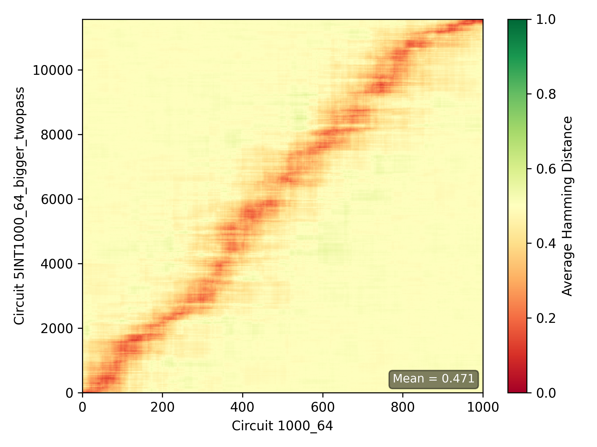{width=55%}

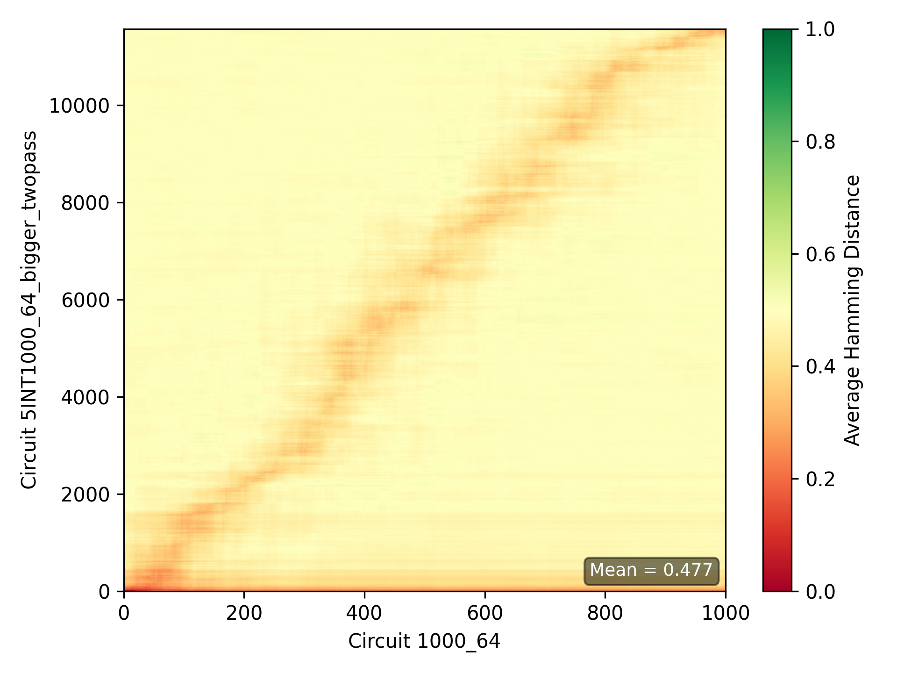{width=55%}

In a way, this might not be too unexpected. The butterfly methods that
we worked on before, were initially tested on identities over 5 wires.
Our results in the end, would constantly look correlated no matter how
much we increased the wires, but that was largely due to our resulting
circuit being heavily condensed on the original 5 wires. From this, it
seems that adding gates on new wires is ineffective in randomizing a
circuit. So while we leave the interleaving method largely untested from
these results, we still find promise in this idea of \"leaving
functionality behind\". Merging in more clever ways will eventually lead us to the [later gadgetization ideas](#linear-gadgetizing). 

SAMFs: Wire Shuffles and Bit Flips {#samfs}
=================================

The following SAMF construction records an earlier mixing method. It is not
a separate part of the current [generation mixer](#generation-mixing) or the [current full pipeline](#current-mixing-method).

A **SAMF**, short for *swap and maybe flip*, is a reversible circuit which
swaps two selected wires and may also flip the value on either one. As we add
SAMFs, we keep track of the accumulated wire permutation and negations, relabel
the later gates into that changing frame, and undo the final accumulated
transformation at the end. The discussion below first develops this idea as
wire shuffles and then adds the bit flips.

We take a different approach here. We recall that we have already
achieved the goal of incompressibility and only need to beat the heatmap
attacks (at least for now). The heatmaps simply record hamming distances
between states as they evolve throughout the two circuits. Thus, one
simple way to force this to differ greatly, is to shuffle the wires that
we are working on. If we are to do this, then we have artificially
beaten the heatmap attacks, as two different wire shuffles on the same
circuit $C$, would result in $C$ having a higher hamming distance than
if we took a heatmap of $C$ with itself.

Let us think about how we can achieve these shuffles. One way that
utilizes a similar thought to our butterfly method, is to do the
following.

**Butterfly-like**

1.  Start with some circuit $C = g_1g_2g_3\dots g_m$

2.  For $g_i$, replace it with some shuffle $B_{w_i} g_i' B_{w_i}^*$, where $g_i'$ has been shifted accordingly with $B_{w_i}$ so that functionality is maintained. 

The above would yield something like
$B_{w_1} g_1' B_{w_1}^* B_{w_2} g_2' B_{w_2}^* \dots$. One of the
advantages of using our wire shuffles, is that they form a subgroup of
all circuits. This can easily be verified. The identity is the trivial shuffle where nothing gets shuffled. Every shuffle can be shuffled in reverse order and so every shuffle has an inverse. Finally, if $C_1$ and $C_2$ are shuffles, then of course $C_1C_2$ is also a shuffle. 

In addition, it is much easier to find equivalent wire
shuffles than it is to find equivalent circuits. The main reason for this is that we do not need to work in the world of circuits. Instead, we can find two different shuffles $S_1$ and $S_2$ that compute the same permutation, and then convert each of them into a circuit. In addition, given a random permutation that is known to be a shuffle, we can find all the transpositions that make up the shuffle and then convert that into a circuit. Now consider the task of finding a circuit corresponding to a particular completely random circuit. On 16 wires, there are already 2^{16} different permutations, and it wouldn't even be known how many gates would be needed to compute the desired permutation. 

In mixing our shuffles, we can actually find a random, yet equivalent, circuit representation of $B_{w_1}^* B_{w_2}$. Thus, we would ideally never return to the original states until we reach the very end of the
circuit. From what we see below in Figure 34, heatmaps reveal that we can not
actually get far enough from the original functionality for this to be
the case. The many red horizontal lines show that we are constantly
returning back to the original functionality, or at least getting close
enough to it to reveal correlation.

<!-- Figure 34 -->
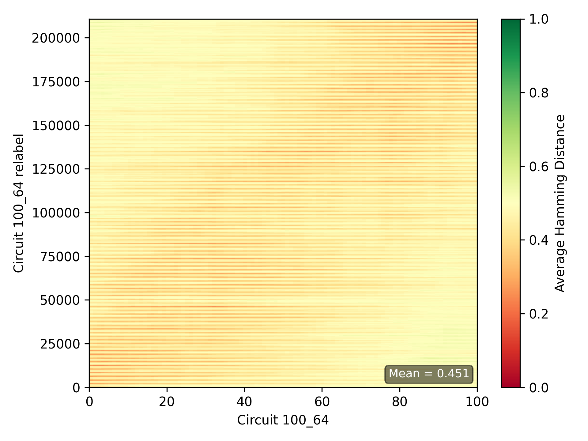{width=55%}

Thus, we need to carry our wire shuffles throughout the entirety of the
circuit. Let us take this in the simplest way possible.

**Singular Shuffle**

1.  Start with a circuit $C = g_1g_2g_3\dots g_m$

2.  Insert a shuffle at the very beginning and at the very end, shifting
    $g_i$ to $g_i'$ such that
    $g_1g_2g_3\dots g_m = B_{w}g_1'g_2'g_3'\dots g_m'B_{w}^*$

Of course, as before, we can get two random circuits that compute $B_w$
so that we are not merely reversing the same circuit. Thankfully, our
sanity checks pass and our heatmap now looks extremely random, as shown in Figure 35.

<!-- Figure 35 -->
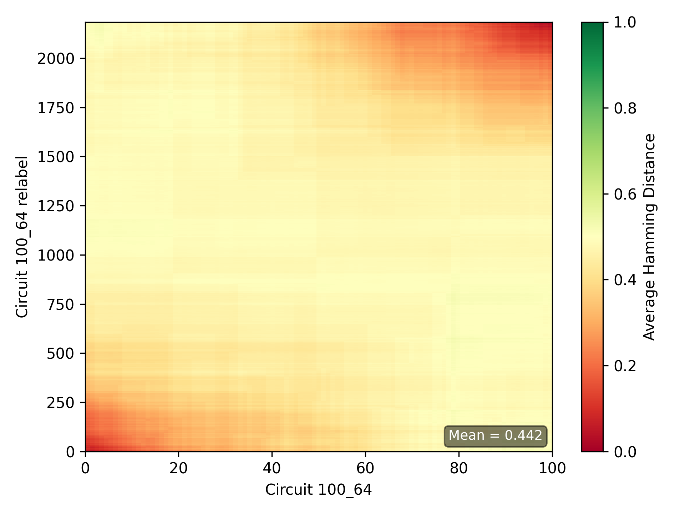{width=55%}

The main reason that this works so much better, is that in no point in
the circuit, are we returning to the original functionality. We remain
far from it with our first shuffle and do not return until the very end.
Of course, this does not hide anything. An attacker can easily look at
our circuit and then see that our initial gates are merely a shuffle
amongst the wires, undo the shuffle, and then recover the original
circuit. Thus, we need to do something more than just a simple singular
shuffle. Let us do the following instead.

**Gate-by-gate Shuffles**

1.  Start with a circuit $C = g_1g_2g_3\dots g_m$

2.  For each gate, insert a $B_{w_i}$ and shift $g_i$ as needed to
    maintain functionality to get
    $$B_{w_1} g_1' B_{w_2} g_2'' B_{w_3} g_3''' \dots B_{w_m} g_m^{(m)'} B^*,$$
    where $B^*$ is the inverse of the composition of all $B_{w_i}$.

This alone makes it much harder to find our original gates $g_i$. If we
combine this now with our [previous mixing methods, such as RCS](#replace-pairs-sequentially), then we
can ensure that this is also incompressible. This also gives us some
randomization amongst the swap gates to hide the fact that they are
doing swaps or even hiding the original gates into these swaps, making
it even harder for an attacker to determine which gates are part of
swaps and which gates are from the original.

<!-- Figure 36 -->
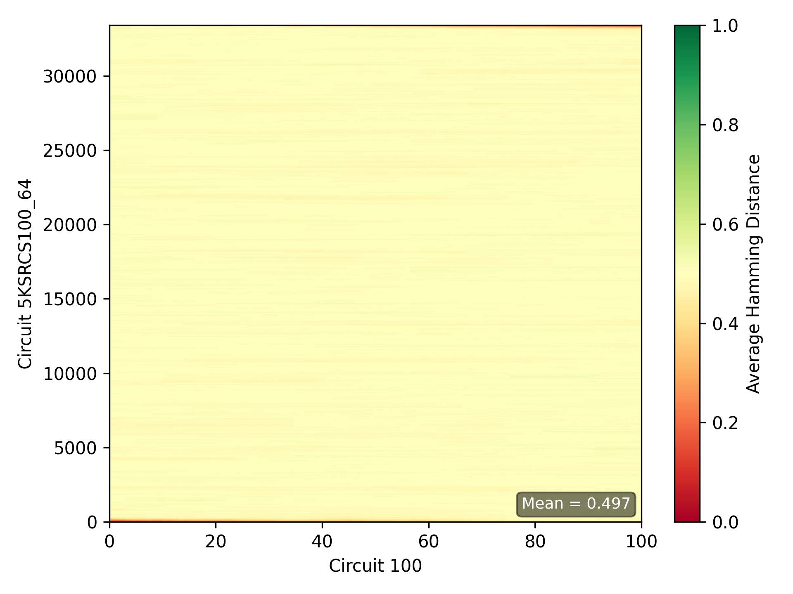{width=55%}

As seen in Figure 36, the heatmap remains close to the ideal that we are
looking for. One thing to note is that the blowup in the number of gates
is much greater. As we are limited to gate r57, in order to compute a
swap of two wires, it requires at minimum, 6 gates and 3 wires. The
algorithm above utilizes a random choice of a swap using 3 wires and
between 6 and 20 gates, just for some additional randomness. In order to
compute a completely random shuffle on the wires, we can then use a
Knuth shuffle. This requires $n$ swaps in total, which gives us a total
of $6n$ blowup in the total number of gates. Thus, one thing that one
could try is to instead only add wire shuffles to some gates, rather
than before every single gate. Then repeat it in combination with RCS
and compression. In other words,

1.  Start with a circuit $C = g_1g_2g_3\dots g_m$

2.  Insert $x$ number of shuffles randomly in between the gates of $C$, as well as
    before $g_1$ and after $g_m$. 

3.  Mutate the shuffled $C$ via RCS

4.  Compress

5.  Repeat

The shuffle before $g_1$ is meant to ensure that the entire circuit is
shuffled, at least a little. The shuffle after $g_m$ is meant to undo
everything and maintain functionality. One advantage to this relies on
the fact that adding shuffles without RCS remains compressible. For
instance, a gate-to-gate shuffle insertion can blow up a 100 gate
circuit to a 60,000 gate circuit, on 64 wires. This compresses down to
around 31,000 gates. Thus, we believe that we can add many shuffles and
compress them along the way, such that we have both many shuffles as
well as minimal gate blowup. However, this remains untested.

As discussed in [*How We Measure Success*](#how-we-measure-success), an ordinary heatmap compares physical
states directly. A wire permutation can therefore make this map look random
without hiding the computation. We use the Hamming-weight heatmap here because
a pure wire permutation preserves Hamming weight. This lets us test whether the
shuffles above have only moved the same intermediate state to different wires.
We compute it as follows.

To compute heatmap between $C$ and $C'$ on $n$ wires:

1. Let $i$ be the $i$th gate of $C$ and $j$ be the $j$th gate of $C'$.
2. Choose a shared set $S$ of random input states in $\{0,1\}^n$.
3. For each $x\in S$, compute $y=C_i[x]$ and $y'=C'_j[x]$.
4. Average $|H(y)-H(y')|$ over $S$, where $H$ is Hamming weight.
5. Repeat for all pairs $i,j$.

Let us check on a circuit that has been shuffled using this new type of heatmap. We will test on 32 wires as to keep the wire blowup minimal, however, the results can be extended to a larger number of wires as well. We will test in the following manner. 

1. For a given $C$, shuffle/shoot the circuit
2. From above, shoot/shuffle
3. Compress

<!-- Figure 37-8 -->
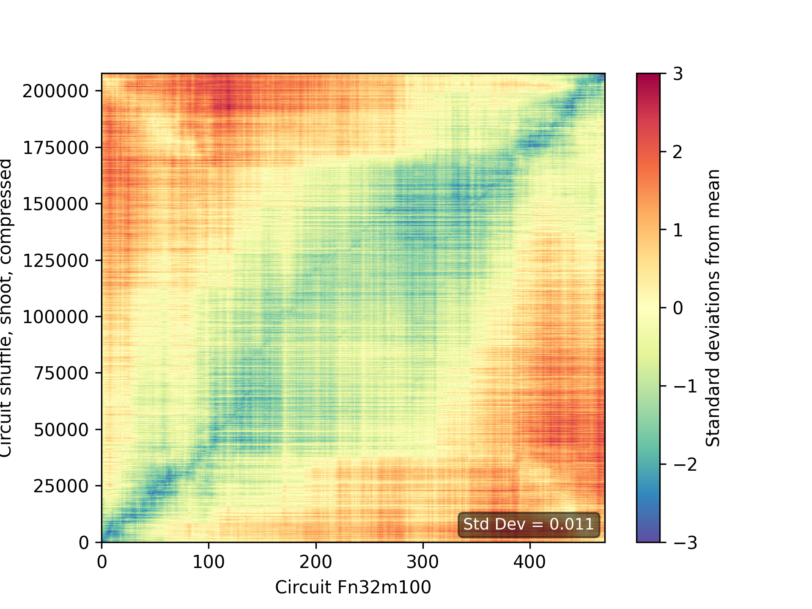{width=55%}

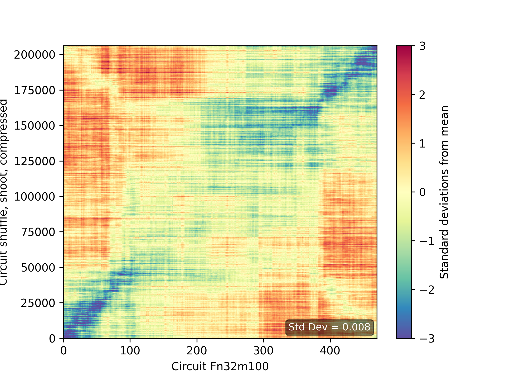{width=55%}

As we can see in Figures 37 and 38, whether we shoot or shuffle first, we can still clearly see the structure of the original circuit with shuffles. Thus, we need to destroy this structure in some way. 

One way that we can introduce some functional changes to the
circuit, is by introducing bit flips. We note that the set of all
circuits which swap as well as flip bits, remains a subgroup of all
circuits. Thus, we can do all of our methods above, but now allow our
swaps to also flip a single bit. 

<!-- Figure 39 -->
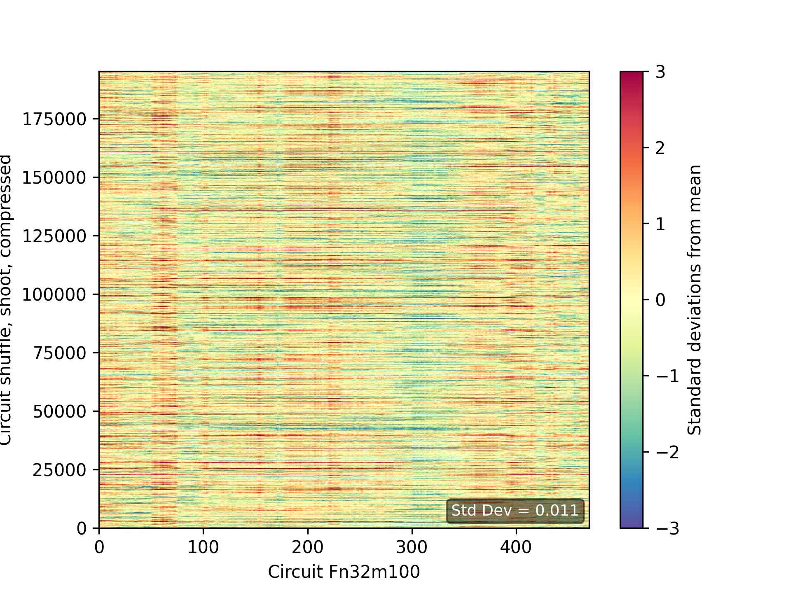{width=55%}

From Figure 39, we can see that the information from the original circuit has been lost. 

Beyond Heatmaps & Compression {#beyond-heatmaps}
==========
We recall that a flat global heatmap only rules out the statistic and input
distribution that we tested. We therefore repeat the same comparisons on pieces
of the circuit and on deliberately chosen input families. These tests are more
targeted, but they still do not rule out the other attacks listed in *How We
Measure Success*.

One variation of the heatmap that we showed briefly, was to instead take a heatmap on partial circuits. For instance, a 1000 gate circuit can be split into 100 gate "pieces", to which we can take a heatmap on each piece. This can either be done by treating each piece as its own isolated circuit, but also we can combine pieces together to form a partial circuit. The former method allows us to test whether each part of the larger circuit is truly random. Suppose a circuit is extremely correlated, except at the very beginning. Then the randomness incurred at the beginning of the circuit would propagate throughout the entire circuit. This method allows us to get around this. On the other hand, by attaching pieces together, we can measure how the progression of the circuit as we reach the final obfuscated version. Indeed, we can measure how the mean (from the heatmaps) of the circuit changes as we add more gates in order to see if it acts in line with a completely random circuit. 

We can also choose our inputs more carefully, instead of solely relying on random inputs. It is possible that some inputs will reveal more correlations than others. This is because even a single bit flip at the beginning of the circuit can cause many bit flips throughout the entire circuit. In other words, some inputs may look more random than others and there may be inputs that reveal much of the structure of the original circuit. We have three ways of going about this. First, it is to take inputs with only small hamming weight. The second is to take a random input $x_0$, and then only take $x_i$ such that the hamming distance between $x_i$ and $x_0$ is small. Thirdly, we can take a random input $x_0$ and then fix every single bit except for bit $k$. We can then flip $k$ to see how this single flip propagates throughout the entire circuit, and then do the same for every bit $k$ of $x_0$. 

There are also methods for us to probe the circuit in order to attempt to determine what the original shuffles are. This remains largely untested and it remains unclear whether we are able to retrieve the original shuffle even after our randomization methods. In addition, even with the original shuffle, we may not be able to undo them as the original shuffle has been mixed throughout the circuit. In other words, finding the shuffle means having to reverse engineer it even through the noise we have added in compression and the pair replacement methods, and then undoing it means we have to deal with the noise as well. 

Differential Attacks and Algebraic Degree {#differential-attacks}
=========================================

We recall that the differential test writes every wire at a circuit prefix as a
polynomial in the original inputs and looks at its algebraic degree. The final
degree is fixed by the original functionality, so our goal is only to keep the
intermediate states at high degree. We now ask whether a random circuit already
gives us this property. For more on differential attacks, see Bard's
*Algebraic Cryptanalysis*.

It is natural to first ask whether a random circuit already gives us this
property. At least in the regime we care about, it does not. While degree does
increase with gate count and a random circuit will eventually saturate every
wire, it increases slowly and unevenly in the low gate regime. For instance, on
16 wires, a random 32 gate circuit can have three wires at degree 1 while other
wires are already at degree 8. Thus, heatmap randomness and degree are not the
same measure, and a circuit can pass the first while failing the second on only
a handful of wires. Since this is enough for an attacker, we must construct high
degree on every wire deliberately.

We use the following construction. Reuse the last active wire as a control wire,
introduce a fresh wire as the second control wire, and recycle a previously used
wire as the new active wire. Each gate then folds the previous output polynomial
into the next and gains one degree of interaction, so the maximum degree grows by
exactly one per gate, reaching $m+1$ after $m$ gates, until it saturates at the
permutation ceiling of $n-1$. Below is the beginning of such a circuit.

| Gate | Output | Degree |
|------|--------|--------|
| `[1,0,2]` | $x_1 = x_0x_2 + x_1 + x_2 + 1$ | 2 |
| `[2,1,3]` | $x_2 = x_0x_2x_3 + x_1x_3 + x_2x_3 + x_2 + 1$ | 3 |
| `[3,2,4]` | $x_3 = x_0x_2x_3x_4 + x_1x_3x_4 + \dots$ | 4 |
| `[4,3,5]` | $x_4 = x_0x_2x_3x_4x_5 + x_1x_3x_4x_5 + \dots$ | 5 |

Of course this only guarantees high degree on the wire that was most recently
active. To get every wire high, the active wire cycles through all wires
repeatedly, so that after a full pass every wire carries its own rung of the
ladder.

Gadgetizing {#linear-gadgetizing}
===========

This section records the paired gadgetizer that preceded the current
single-carrier product-share construction. Its RG policy, `rg_frequency`, wire
count, and blowup formula are historical and should not be used to size a GSS
build.

We will call integrating our original circuit so that it carries high algebraic
degree *gadgetizing* it. This is in reference to our heavy use of "gadgets" in
order to do secret-preserving computations, secret-preserving swaps, and more.

The idea is to add auxiliary wires which already have high algebraic degree, and
then use them in the computation of our circuit, while ensuring that by the end
we have returned to the original functionality. This is quite reminiscent of our
SAMF gates (swap and maybe flip), where we swap wires and flip the value of many
wires, changing the functionality throughout the circuit, but then are able to
undo everything and return to the original circuit at the end. Instead of just
simply swapping and flipping though, we want something that will actually change
the structure of the circuit and incur a higher algebraic degree.

To do this we use an extra $n$ auxiliary wires, so the gadgetized circuit lies on
$2n$ wires. The first $n$ outputs will have the functionality of the original
circuit, while the latter $n$ outputs are allowed to contain random values. The
goal is therefore to integrate the auxiliary computation into the original
computation without changing what is eventually returned on the first $n$ wires.

Suppose $r_i$ is an auxiliary value with high algebraic degree and $w_i$ is a
computation value from our original circuit. One way to imbue the physical
representation of $w_i$ with high algebraic degree is to form $w_i \oplus r_i$.
Of course, if we replace $w_i$ by this value directly we have lost the ability to
read $w_i$ without later removing $r_i$, and simply removing the same mask at
every use would expose the original computation in the middle of the circuit
anyway. Instead we represent each computation value $w_i$ by a *secret* value
$s_i$ and an auxiliary value $r_i$ with

$$w_i = s_i \oplus r_i.$$

Here $w_i$ is the value the original circuit uses, while $s_i$ and $r_i$ are the
two physical values the gadgetized circuit actually holds. We call the pair
$(s_i, r_i)$ a *pairing*, and $w_i$ the *virtual value* it carries. The
gadgetizer only needs to remember which physical wires currently hold $s_i$ and
$r_i$, and that bookkeeping never appears in the output.

If our original circuit is $C = g_1 g_2 \cdots g_m$, we would like to replace
each gate $g_k$ by a gadget whose effect on the physical values is the same as
$g_k$'s effect on the virtual ones. We do not want to decode $w_i$, apply the
gate, and re-encode it, since that exposes $w_i$. The gadget must compute the
r57 gate *homomorphically*, with the values staying encoded throughout.

The gadgets {#linear-gadgets}
-----------

An early version of this used a single 12 gate gadget,
`[[0,3,5], [0,3,6], [0,4,5], [0,4,6], [1,0,2], [0,2,1], [2,0,1], [1,2,0], [0,2,1], [2,1,0], [0,3,4], [0,4,3]]`,
which did both the secret computation and a secret swap of the auxiliary pair
tied to a particular computation wire. This cost 12 gates and led to a 13x blowup
in the total number of gates. We now split those jobs apart. The following table
lists the gadgets we use.

| Gadget | Purpose | Gate sequence (`[active, ctrl1, ctrl2]`) |
|--------|---------|-------------------------------------------|
| **SG** | 6-gate homomorphic gadget for a secret-shared r57 | `[4,5,6] [0,4,6] [0,5,4] [4,5,6] [0,6,3] [0,3,5]` |
| **RG1** | Swap virtual values between two pairs | `[1,2,3] [0,3,2] [3,1,0] [2,0,1] [0,3,2] [1,2,3]` |
| **RG2** | Re-pair two pairs (break pairings, keep virtual values) | `[0,3,2] [1,0,2] [2,0,3] [2,3,0] [1,3,2] [3,0,2]` |
| **RG3** | Refresh a pair's shares against two random wires | `[share_i, r1, r2] [pad_i, r1, r2]` |

**SG** is the gadget used for each original gate. Given an original gate
$[a,b,c]$, it acts on the five wires $s_a, s_b, r_b, s_c, r_c$, which are local
slots $0, 5, 6, 3, 4$, respectively, in the sequence above. The auxiliary wire
$r_a$ of the active value
does not appear in the gadget at all and is left untouched, which is what lets
the result decode. After the six gates,

$$w_a' = s_a' \oplus r_a = w_a \oplus (w_b \vee \neg w_c),$$

and both control pairings still carry $w_b$ and $w_c$ unchanged. So six physical
gates perform exactly one original gate on the encoded state, without ever
exposing $w_a$, $w_b$, or $w_c$ on any individual wire. Every original gate is
replaced by one SG, and in principle SG alone would reconstruct the entire
original functionality. However, a circuit made only from a repeating six gate
period would leave an obvious trail, and so we also use the $RGi$ gadgets below.

For **RG1**, assume we have virtual values $s_1, s_2$ where $s_1$ is carried by
wires $w_0, w_1$ and $s_2$ is carried by $w_2, w_3$. That is:

$$w_0 + w_1 = s_1$$
$$w_2 + w_3 = s_2$$

From the gate sequence above we have:

$$w'_0 = w_0 + w_1 + w_2 + w_0 w_1 + w_1 w_2 + w_0 w_3 + w_2 w_3 + w_0 w_1 w_2 + w_0 w_1 w_3$$
$$w'_1 = w_0 + w_1 + w_3 + w_0 w_1 + w_1 w_2 + w_0 w_3 + w_2 w_3 + w_0 w_1 w_2 + w_0 w_1 w_3$$
$$w'_2 = 1 + w_0 + w_0 w_1 + w_1 w_2 + w_0 w_3 + w_2 w_3 + w_0 w_2 w_3 + w_1 w_2 w_3$$
$$w'_3 = 1 + w_1 + w_0 w_1 + w_1 w_2 + w_0 w_3 + w_2 w_3 + w_0 w_2 w_3 + w_1 w_2 w_3$$

which means that:

$$w'_0+w'_1=s_2$$
$$w'_2+w'_3=s_1$$

This swaps the secret values between the two pairs, and does not swap the
auxiliary pairings.

For **RG2** we have:

$$w'_0=1+w_0+w_2+w_2w_3$$
$$w'_1=1+w_0+w_1+w_2+w_3+w_0w_2+w_0w_3+w_2w_3$$
$$w'_2=1+w_0+w_3+w_2w_3$$
$$w'_3=1+w_2+w_3+w_0w_2+w_0w_3+w_2w_3$$

which means that:

$$w'_0+w'_2=s_2$$
$$w'_1+w'_3=s_1$$

This also swaps the secret values between the two pairs, but it swaps the
auxiliary pairings along with them, so virtual value $i$ now lives on
$(r_i, s_j)$ and virtual value $j$ on $(s_i, r_j)$. The XOR of each new pair is
still the correct computation value, but the physical relationship between
computation and auxiliary wires has changed, which makes the pairing structure
much less stable across the circuit.

For **RG3**, assume the virtual value $s_1$ is carried by wires $w_0, w_1$, i.e.

$$w_0 + w_1 = s_1$$

and let $r_1, r_2$ be two further (arbitrary) wires. Writing
$m = r_1 \vee \neg r_2 = 1 + r_2 + r_1 r_2$, we have:

$$w'_0 = 1 + w_0 + r_2 + r_1 r_2$$
$$w'_1 = 1 + w_1 + r_2 + r_1 r_2$$
$$r'_1 = r_1$$
$$r'_2 = r_2$$

which means that:

$$w'_0 + w'_1 = s_1$$

The same mask $m$ is added to both shares, so it cancels in the sum: the secret
stays on its own pair and the share/pad pairing is unchanged. RG3 therefore
re-randomizes the two shares of a single pair against two unrelated wires,
without moving the secret value or swapping any pairings. It is also by far the
cheapest of the three, at 2 gates rather than 6.

Notice that within our $RGi$s, we no longer need to consider freed versus paired
wires. In other words, we do not need to consider whether an auxiliary wire $r_i$
is currently paired with some computation wire $w_i$. In the past, we would
attempt to update $r_i$, which meant that we needed to ensure that $r_i$ wasn't
paired in order to update it. In other words, we could only update the "free"
wire, and we had to schedule which wire that would be. This is no longer a
problem. It also means that we can get away with only an additional $n$
auxiliary wires, rather than the $n+1$ the older design needed to keep one free.

Putting the gadgets together {#putting-linear-gadgets-together}
----------------------------

Recall that when integrating SAMFs into our earlier mixer, we didn't need to have a
full wire shuffle every single time. While this indeed provides us with the most
randomness, it also incurred a huge gate blowup. Similarly, we do not need to use
every single $RGi$ at every point in the integration process. The gadgetizer is
thus broken up into five blocks: randomization, pairing, gadgets, unpairing,
randomization. The final randomization block is there to make the gadgetized
circuit look more symmetric. In addition, the randomization blocks add padding
which is meant to make it harder for an adversary, after our mixing, to
determine the original rewiring. It is not clear whether this is actually needed
or not, as the mixing afterwards may already hide this information.

Before any of it runs we also shoot the original gates left and right past
non-colliding neighbors. This changes the visible gate order while preserving
functionality, so two gadgetizations of the same input do not begin from the
same ordering.

The **randomization blocks** are what supply the algebraic degree. Every gate's
active wire is drawn round-robin from the auxiliary half, each auxiliary wire
being targeted once per round before any wire is targeted twice, while both
control wires are drawn uniformly from all $2n$ wires. Restricting the active
wire to the auxiliary half is what makes these blocks safe: they cannot disturb
the lower $n$ outputs at all. Drawing controls from all $2n$ wires is what makes
them useful, since it lets the auxiliary values become complicated functions of
both the original and the auxiliary inputs rather than of the auxiliary inputs
alone. We note that this follows the cycling schedule of the [degree-raising
construction from the previous section](#differential-attacks) but does not chain the previous active
wire as a control; the controls are simply random.

The **pairing block** is where a computation wire and an auxiliary wire get bound
together into a pair. We do this with a block $W_i$, which takes four wires
$(q_0, q_1, q_2, q_3)$ and produces $(q_2, q_3, q_0 \oplus q_1, q_1)$. The
following 11 gates compute this:
`[[0,3,2], [3,2,1], [1,3,2], [2,0,1], [2,1,0], [0,1,2], [0,2,1], [1,0,3], [3,0,1], [3,1,0], [1,3,0]]`.
It was found by a meet-in-the-middle search over r57 gates, and since every r57
gate is its own inverse, reversing the sequence gives $W_i^{-1}$, which is what
the unpairing block uses.

To see what this does, call $W_i$ with $q_0$ the wire currently holding the
computation value, $q_1$ the wire holding its auxiliary value, and $q_2, q_3$ two
randomly chosen destination wires. Afterwards $q_2$ holds $q_0 \oplus q_1$ and
$q_3$ holds $q_1$, so the pair $(q_2, q_3)$ XORs back to the original computation
value: the value has been encoded, and it has been moved. Meanwhile the old
contents of $q_2$ and $q_3$ have landed on $q_0$ and $q_1$ rather than being
destroyed.

The reason we use one block for this rather than separate XORs and swaps is
exactly that it does both at once. It pairs a single computation wire with a
single auxiliary wire while simultaneously relocating the other wires involved,
so that after the pairing block the computation wires are no longer sitting on
the first $n$ wires and the auxiliary wires on the latter $n$. They are mixed
throughout all $2n$. Of course, this can be done with separate XORs and SAMFs,
but for three relocations we would need $6 \times 3$ gates. It is not clear
though whether these $W_i$ are better than simply using our SAMFs.

One implementation detail is worth stating, because it was a real bug. Since
$W_i$ relocates wires, a naive fixed choice of destinations will have one $W_i$
clobber a wire a later $W_i$ still needs. We therefore keep a live record of
where every unencoded computation value, every auxiliary value, and every pair
currently lives, and choose each $W_i$'s destinations against that live map. The
unpairing block does the same in reverse, decoding values onto output wires in
increasing order so that a finished output is never touched again. In the
special case where a pair's share or pad already sits on its output wire, we
skip $W_i^{-1}$ entirely and just XOR the other half in, which takes 4 gates
instead of 11.

In this paired gadgetizer's **gadgets block**, every gate of the original circuit becomes one SG, and
every `rg_frequency` gates we insert one $RGi$ drawn uniformly from
$\{RG1, RG2, RG3\}$. Its default frequency is 2, meaning two original gates are
simulated and then one rerandomization gadget is inserted. The pairs $(i,j)$ that
$RG1$ and $RG2$ act on, and the single index $i$ that $RG3$ acts on, are drawn
from shuffled queues, so that every pair gets its turn before any pair repeats.
This spreads rerandomization across the whole state rather than hitting the same
few values over and over.

We note that the gadgetizer's internal pairing map changes after RG1 and RG2,
while the represented computation does not. The next SG reads the updated map
and continues the original computation on the newly represented values. Once
gadgetization is over, none of this map is saved. The only output is a sequence
of r57 gates, so an adversary cannot simply look up which physical wires formed
which pair.

Some gate blowup benchmarks {#gadget-benchmarks}
---------------------------

The randomization portion costs $\max(2n\lfloor \ln n \rfloor, 64)$ gates per
bookend, and since there is one on each side, this contributes about
$4n \lfloor \ln n \rfloor$ gates in total. Of course, this is only our estimate
on the number of gates necessary in order to get enough randomness for our
mixing. We note the floor: at $n = 128$ this is 1024 per bookend, not 1243.

The pairing is done with the $W_i$ block, which costs exactly 11 gates per value,
so $11n$ per side. The unpairing side is at most $11n$, since the 4 gate special
case above fires occasionally, so $22n$ for both sides is a good approximation
rather than an identity.

Each $SG$ costs 6 gates, so if there are $m$ original computation gates this
yields a $6m$ blowup. $RG1$ and $RG2$ take 6 gates each while $RG3$ takes 2, so
an $RGi$ costs $\frac{6+6+2}{3} = \frac{14}{3}$ gates on average. We insert one
every `rg_frequency` gates, so the total gate blowup is approximately

$$4n\lfloor \ln n \rfloor \;+\; 22n \;+\; \left(6 + \frac{14}{3\,\texttt{rg\_freq}}\right)m.$$

At the default $\texttt{rg\_freq} = 2$ the coefficient on $m$ is
$\frac{25}{3} \approx 8.33$; at $\texttt{rg\_freq} = 3$ it is
$\frac{68}{9} \approx 7.56$.

As a sanity check, on $n = 256$ with $m = 6768$ and the default frequency, the
formula predicts $5120 + 2816 + 2816 + 40608 + 15792 = 67{,}152$ gates. Two
recorded runs produced 67,104 and 67,184 gates on 512 wires, both within half a
standard deviation of the $RGi$ draw.

Where the linearity hurts {#where-linearity-hurts}
-------------------------

Everything above is an improvement on the 12 gate gadget, and it does what we
asked of it: the auxiliary wires carry high algebraic degree, and that degree is
present on every carrier wire throughout the body of the circuit. However, the
sharing itself introduces a weakness at the center of the construction, and it
is not a mixing deficiency that additional rounds can fix.

A logical value $v$ lives on two carrier wires as $v = c_0 \oplus c_1$. Since
the decode is an XOR, it is *linear*, and so at every instant every logical value
of the original circuit $C$ is a degree-1 affine function of the gadgetized
circuit's wires. Thus, an adversary who fits affine functions can read $C$'s
intermediate state out of the gadgetized circuit at any point, regardless of how
algebraically complex that state is as a function of the input. Although the
previous section raised the degree of the individual wires, the linear decode
still exposes the low degree logical state.

We recall that the affine reconstruction heatmap does not compare physical wires
directly. At each pair of prefixes, it asks whether the logical state of $C$ can
be recovered as an affine function of the gadgetized circuit's current wires
under the declared auxiliary-input policy. The paired decode
$v=c_0\oplus c_1$ gives the attacker exactly such a relation, regardless of the
carriers' degree in the original inputs. We now apply that test to this gadget.

Under the linear sharing, affine heatmap reveals **diagonal**. It is the same diagonal we have been fighting since the very
beginning of this document, except now it is drawn in a metric that our shuffles
and bit-flips do not touch. This means that with SAMFs and our linear gadgetization, we are effectively not hiding our circuit at all.

The difficulty we found in removing this diagonal motivates the next stage of
our construction. No matter the expansion/compression method, we were not able to get rid of this diagonal.
The reason is structural: mixing re-randomizes *which* wires carry the sharing,
but the value stays affine in the new wires, and so the affine adversary can
simply fit it again. Wire permutations, NOTs, CNOTs, and SAMFs are all affine
changes of basis, while a degree-1 predictor is invariant to that entire class.
Similarly, every re-randomization in our gadgetizer, including RG1, RG2, RG3,
and both randomization bookends, is affine or affine-preserving on the carrier
pair. Thus, these methods cannot fix this leak by construction.

The secret share itself unable to help us here. An affine adversary obtains
every degree-1 term at no cost by XORing it into its predictor, and so the second
carrier does not add any cost for the adversary. In other words, the
secret-sharing scheme above gives us no protection against a degree-1 attacker.

This also gives us a constraint on how we can fix the problem, as we cannot
simply remove the XOR pair and replace it with something nonlinear. A pure
two-wire product decode is unbalanced: over the four states of $(w_p, w_q)$, the
value 1 has exactly one preimage and 0 has three. No reversible gadget can
conditionally flip between classes of unequal size, since a bijection cannot map
a 3-element class onto a 1-element class, and this holds for every choice of
constants, with any ancillae or garbage. Thus, the linear part is structurally
necessary because it re-symmetrizes the classes.

Thus, the diagonal cannot be removed by tuning the mixer. Since the leak comes
from the linear decode, we need an encoding whose decode is itself nonlinear.
We discuss this construction in [the next section](#nonlinear-gadgetization).

The Earlier Product-Share Gadgetization {#nonlinear-gadgetization}
=======================================

This section describes the product-share construction used in our earlier
experiments. We retain its decode, Gray fold, and measurements here as the
development that led to [quadratic masking](#quadratic-masking). New GSS runs
use quadratic masking by default; product-2223 is retained for historical runs.

Let the circuit entering gadgetization have $q$ logical wires. The nonlinear
gadgetization uses $2q$ physical wires: one carrier for each logical value and
one band wire for each carrier. Thus, this step doubles the width of the circuit
entering gadgetization. The carriers hold the encoded computation, while the
band wires supply the nonlinear product terms used to mask it. During
gadgetization, a ledger records where every carrier and band variable currently
lives, which mask terms belong to each logical value, and each value's
compile-time constant.

The product-share decode {#product-share-decode}
------------------------

At an ordinary gadget boundary, each logical value $V_i$ is represented as

$$
V_i=C_i\oplus M_i\oplus\kappa_i,
$$

where $C_i$ is the value's current carrier, $\kappa_i$ is a compile-time ledger
constant, and

$$
M_i=\bigoplus_j\prod_l(B_{b_{jl}}\oplus a_{jl})
$$

is its product mask. Each $B_b$ names a band variable, while each $a_{jl}$ is a
compile-time bit which chooses whether that band variable is used normally or
negated. The mask slots name band variables rather than physical wires. When a
gate is emitted, the ledger resolves each variable to the wire which currently
holds it. The offsets and $\kappa_i$ never need their own physical wires.

The nonlinear band fill {#nonlinear-band-fill}
-----------------------

The second half of the physical wires initially contains incoming junk
$z_1,\ldots,z_q$. We turn these wires into band variables
$B_1,\ldots,B_q$ in order. Each band variable has the form

$$
B_j=z_j\oplus x_{p_j}\oplus L_j
    \oplus P_{j1}\oplus P_{j2}\oplus\delta_j,
$$

where $x_{p_j}$ is a randomly chosen pivot data wire. In the construction used
here, $L_j$ is the XOR of between one and seven additional data wires, limited
by the number available, and $P_{j1}$ and $P_{j2}$ are two-literal products.
The two sources within one product are distinct, either literal may be negated,
and a source may be a data wire or an earlier band variable. The fixed bit
$\delta_j$ accounts for a possible complement introduced by the chosen g57
spelling of those products. It is determined when the gadget is generated and
can be absorbed into the auxiliary junk value for purposes of the examples
below.

The pivot appears exactly once, as the linear term $x_{p_j}$. It cannot appear
in $L_j$, in either product directly, or inside the transitive support of an
earlier band variable used by a product. Therefore, after fixing every other
source, flipping the pivot always flips $B_j$. This makes the individual band
value balanced even though the rest of its expression is nonlinear. The band
variables are constructed in order, so $B_1$ can use only data wires, $B_2$ may
also use $B_1$, and in general $B_j$ may use any earlier $B_r$ which passes the
pivot-support check. Different band variables may choose the same pivot.

These choices are random when the gadget is generated, not while it is being
evaluated. Each $B_j$ is computed in place by XORing its selected terms into
the wire which initially holds $z_j$. Once filled, it is a fixed physical bit
until an explicit retire-and-refill step changes it. In particular, later
source-gate updates to the logical values do not retroactively change the band
or require every mask using it to be updated. 

Mask injection {#mask-injection}
--------------

After filling the band, we draw four product terms for each logical value:
three products of two band literals and one product of three band literals. A
literal may be either $B_j$ or $\neg B_j$. XORing the four terms assigned to
$V_i$ gives its mask $M_i$. In particular, the three-literal term gives the
decode degree 3 in the band variables; it is not restricted to pairwise
products.

The circuit injects the four terms into $V_i$'s carrier one at a time. If the
carrier initially contains $V_i$, it contains
$V_i\oplus M_i\oplus\kappa_i$ after the injection. The full value of $M_i$ is
never collected on another wire: the ledger only records its four terms and
resolves their current wire locations whenever it emits a gate. After the band injection, this means that the original $n$ wires hold $V_i \oplus M_i \oplus \kappa_i$ and the latter $n$ wires hold $B_i$. 

Gray Folding Source Gates {#gray-folding}
-------------------------

Suppose a source gate updates a logical target as

$$
V_t\mathrel{{\oplus}{=}}f(V_{i_1},\ldots,V_{i_r}).
$$

We write $f$ in algebraic normal form and substitute the complete decode of
every control. Each control contributes its carrier, its individual product
mask terms, and its ledger constant. Distributing the expression produces a
collection of conjunction fragments, each of which is XORed into the target
carrier. A product mask is therefore used only through its band literals as
part of a fragment's controls; neither the mask nor the decoded logical value
is first reconstructed on a physical wire.

For a two-control gate, write the complete control expressions as

$$
S_b=L_b\oplus M_b
\qquad\text{and}\qquad
S_c=L_c\oplus M_c,
$$

where $L_b$ and $L_c$ contain the carrier literal and any ledger constant,
while $M_b$ and $M_c$ are the XORs of their product-mask terms. The product
part of the source gate is then

$$
S_bS_c=L_bL_c\oplus L_bM_c\oplus M_bL_c\oplus M_bM_c.
$$

A direct expansion would form these contributions by repeatedly pairing the
individual mask terms. The Gray fold instead gathers each complete mask sum
once and reuses it. It borrows two *dirty* wires $u$ and $z$, whose incoming
values $u_0$ and $z_0$ are unknown and are not cleared. Call the four working
states

$$
\begin{aligned}
A&=(u_0,z_0), &
B&=(u_0\oplus M_b,z_0),\\
C&=(u_0\oplus M_b,z_0\oplus M_c), &
D&=(u_0,z_0\oplus M_c).
\end{aligned}
$$

The circuit moves through them as

$$
A\xrightarrow{\text{gather }M_b}B
 \xrightarrow{\text{gather }M_c}C
 \xrightarrow{\text{strip }M_b}D
 \xrightarrow{\text{strip }M_c}A.
$$

This is a Gray-code order because only one gathered mask changes between two
adjacent states. While moving through the cycle, the circuit XORs several
products into the target carrier. One valid placement of those products works
as follows.

**Recovering $L_bM_c$.** In state $A$, the $z$ accumulator contains $z_0$; in
state $D$, it contains $z_0\oplus M_c$. XORing $L_bz$ into the target once in
each of these states contributes

$$
L_bz_A\oplus L_bz_D
=L_bz_0\oplus L_b(z_0\oplus M_c)
=L_bM_c.
$$

The two copies of $L_bz_0$ cancel because addition is XOR.

**Recovering $M_bL_c$.** In state $A$, the $u$ accumulator contains $u_0$; in
state $B$, it contains $u_0\oplus M_b$. XORing $uL_c$ into the target in both
states contributes

$$
u_AL_c\oplus u_BL_c
=u_0L_c\oplus(u_0\oplus M_b)L_c
=M_bL_c.
$$

Here the two copies of $u_0L_c$ cancel.

**Recovering $M_bM_c$.** The circuit XORs $uz$ into the target once in every
state. The combined contribution is

$$
\begin{aligned}
u_Az_A\oplus u_Bz_B\oplus u_Cz_C\oplus u_Dz_D
={}&u_0z_0
 \oplus (u_0\oplus M_b)z_0\\
 &\oplus (u_0\oplus M_b)(z_0\oplus M_c)
 \oplus u_0(z_0\oplus M_c)\\
={}&M_bM_c.
\end{aligned}
$$

After expansion, $u_0z_0$ appears four times, while $u_0M_c$ and $M_bz_0$
each appear twice. All of them cancel, leaving only $M_bM_c$. Finally,
$L_bL_c$ does not use either accumulator, so it is XORed into the target once
at any state. All four required terms have now been added to the same target
carrier; the circuit never has to place their intermediate XOR on another
wire. The implementation may randomize which equivalent bare and gathered
states receive the $L_bz$ and $uL_c$ contributions, but the same cancellation
argument applies.

Thus, *folding* refers to obtaining the complete product from differences
between these dirty states rather than reconstructing either mask on a clean
wire. The final two transitions strip the gathered masks and restore both
borrowed wires exactly. A degree-3 mask term needs a temporary dirty helper
while it is gathered, and that helper is also restored. Fixed complements from
the g57 spellings are absorbed into the fold's constant atoms, which are taken
from the ledger.

There is an important trace-security limitation. The statement above is true
at one instant, but it is not true for an observer who combines two times. If
$u_{
m before}=u_0$ and
$u_{
m after}=u_0\mathbin\oplus M_b\mathbin\oplus\delta$, then

$$
u_{\rm before}\mathbin\oplus u_{\rm after}
=M_b\mathbin\oplus\delta.
$$

The unknown dirty value cancels, so two prefixes on the same physical wire
reveal the complete aggregate mask. Together with the entry carrier and the
known ledger residual this gives an exact identity for the logical operand.
The exhaustive regression
`prod_gray_fold_has_an_exact_space_time_operand_recovery` checks this over the
whole small input domain. Dividing $M_b$ into several Gray gathers does not
remove the issue: XORing all tile deltas reconstructs $M_b$.

For this trace model, we also tested the no-Gray Phase-A preset
(`PROD_PRESET=no-gray-phase-a`). It expands products atom-by-atom and ladders
only fragments through width four. On the paired 64-wire experiment it made
92.22% of all gates reachable in the frozen regular store, versus 97.37% for
Gray, while never gathering the complete $M_i$ on one accumulator. Full
laddering reached only 92.37% at substantially higher cost, and running
`fcompress` before Phase A reduced the selective arm to 77.96%, so neither is
preferred in that experiment. These measurements concern the earlier
product-share construction, rather than the current quadratic-masking recipe.

That product-share construction uses this Gray fold for suitable two-control
source gates. Other gate shapes use the same full-decode substitution but fall
back to the ordinary fragment or dirty-ladder implementation. In either case,
constant contributions update $\kappa_t$, and the target's mask does not have
to change merely because its logical value changed.

The purpose of this Gray folding is that it uses fold gates with at most two
controls, which keeps them close enough to r57 for the frozen database to
replace them during the later mixing. It does not make the complete circuit
r57, nor does it need to. It only needs to keep the fold from creating a large
class of gates which the database cannot reach.

We can see the difference by comparing the Gray fold with the earlier direct
expansion on the same $n=128$ sandwich and source circuit. The direct expansion
emits one gate for every cross-product of mask atoms, so its control count grows
with both the source-gate arity and the mask degree. The Gray fold replaces
those wide gates with the gather, read, and restore cycle described above.

| | direct wide fold | Gray fold |
|---|---|---|
| gadget gates | 339,786 | 808,618 |
| fold gates above two controls | 153,421 | **0** |
| gates reachable by the frozen database | 31.55% | **95.47%** |

The later product-share variant measured in that campaign was cheaper and slightly more
reachable than the Gray column above, at 692,653 gates with 97.53% of the
circuit inside the database's reach. The important number is reachability, not
the raw database match rate: a gate outside the eligible width can never be
re-encoded regardless of how many replacements the table stores.

Thus, the Gray fold buys **digestibility, not hiding**. In particular, it must
not be treated as hiding against a multi-prefix trace adversary. It is the nonlinear
product-share encoding which removes the affine diagonal. The Gray fold keeps
that encoding from producing wide fragments which would pass through the
mixing stage unchanged.

A four-wire example {#four-wire-gadget-example}
-------------------

Let us walk through a simplified example. Suppose the source computation begins with four logical wires
$x_1,x_2,x_3,x_4$. Gadgetizing this computation gives us eight physical wires,
$C_1,\ldots,C_8$. Before the band fill, they contain

$$
C_1=x_1,\quad C_2=x_2,\quad C_3=x_3,\quad C_4=x_4
$$

and

$$
C_5=z_1,\quad C_6=z_2,\quad C_7=z_3,\quad C_8=z_4,
$$

where the $z_i$ are the incoming auxiliary junk values. The fill targets
$C_5,C_6,C_7,C_8$ in order, turning them into $B_1,B_2,B_3,B_4$. One valid
draw is

$$
\begin{aligned}
B_1&=z_1\oplus x_2\oplus x_4\oplus x_1x_3\oplus x_1x_4,
    &&\text{pivot }x_2,\\
B_2&=z_2\oplus x_2\oplus x_3\oplus x_1x_4\oplus x_3x_4,
    &&\text{pivot }x_2,\\
B_3&=z_3\oplus x_4\oplus x_1\oplus x_1x_2\oplus x_2x_3,
    &&\text{pivot }x_4,\\
B_4&=z_4\oplus x_1\oplus x_4\oplus x_2x_3\oplus x_2x_4,
    &&\text{pivot }x_1.
\end{aligned}
$$

For example, $B_1$ starts with the junk value $z_1$. The construction XORs in
pivot $x_2$, the extra linear source $x_4$, and the two quadratic terms
$x_1x_3$ and $x_1x_4$. Nothing besides the pivot term depends on $x_2$.
Likewise, the remaining expressions exclude their stated pivots from every
other term. The first two bands deliberately show that pivots do not have to be
unique: both may use $x_2$.

This particular four-wire draw uses only data wires because each displayed
band ends up depending on all four data inputs. At larger widths, an eligible
earlier band may be used as one source of a later product, and this is how the
band fill can rise above degree 2. For example, suppose an earlier band contains
a quadratic term $x_ax_b$ and a later fill includes the product $B_rx_c$.
Expanding just that product gives

$$
B_rx_c=(\cdots\oplus x_ax_b\oplus\cdots)x_c
      =\cdots\oplus x_ax_bx_c\oplus\cdots.
$$

For distinct $x_a,x_b,x_c$, the later band can therefore contain a degree-3
monomial in the original data inputs, provided that another contribution does
not cancel it. Further eligible uses of earlier bands can raise the degree
again, even though each individual fill gate uses only two source literals.
After all four fills in our concrete example, the physical wires contain

$$
x_1,\ x_2,\ x_3,\ x_4,\ B_1,\ B_2,\ B_3,\ B_4.
$$

We next draw product mask terms for each logical value. A band literal may be
either $B_j$ or $\neg B_j$. For instance, one possible toy mask for the first
value is

$$
\begin{aligned}
M_{11}&=B_1B_2, &
M_{12}&=(\neg B_1)B_3,\\
M_{13}&=B_2(\neg B_4), &
M_{14}&=B_1(\neg B_3)B_4,
\end{aligned}
$$

and

$$
M_1=M_{11}\oplus M_{12}\oplus M_{13}\oplus M_{14}.
$$

The first three terms have degree 2 in the band variables. The last has degree
3. In particular, treating a negated literal as
$\neg B_3=1\oplus B_3$ gives

$$
M_{14}=B_1(\neg B_3)B_4
      =B_1B_4\oplus B_1B_3B_4.
$$

Thus, $M_{14}$ contains the cubic monomial $B_1B_3B_4$. This degree is measured
in the physical band variables. Since the $B_j$ may themselves be nonlinear
functions of the incoming data, the mask can have still higher degree when it
is expanded all the way back into the original inputs.

The other values receive their own independently drawn masks $M_2,M_3,M_4$.
Ignoring the ledger constants for one line, injecting the masks leaves the
eight physical wires as

$$
x_1\oplus M_1,\ x_2\oplus M_2,\ x_3\oplus M_3,\ x_4\oplus M_4,
\ B_1,\ B_2,\ B_3,\ B_4.
$$

More precisely, if $V_i$ denotes the current logical value, then at every
ordinary gadget boundary we maintain

$$
V_i=C_i\oplus M_i\oplus\kappa_i,
$$

where $\kappa_i$ is the compile-time ledger constant. Neither $V_i$ nor $M_i$
is reconstructed on a physical wire.

Now suppose the next source gate is

$$
V_1\mathrel{{\oplus}{=}}V_2\lor\neg V_3.
$$

At the level of the decode invariant, its control function is

$$
F=(C_2\oplus M_2\oplus\kappa_2)
  \lor\neg(C_3\oplus M_3\oplus\kappa_3).
$$

Equivalently, over $GF(2)$,

$$
F=1\oplus(C_3\oplus M_3\oplus\kappa_3)
  \oplus(C_2\oplus M_2\oplus\kappa_2)
          (C_3\oplus M_3\oplus\kappa_3).
$$

The ledger constants are known when the gadget is generated, so the compiler
substitutes them and simplifies the expression. To display the nonconstant
parts clearly, suppose for one line that $\kappa_2=\kappa_3=0$. Algebraically,
the required carrier update is then

$$
\begin{aligned}
C_1'
={}&C_1\oplus 1\oplus C_3\oplus M_3\oplus C_2C_3\\
   &\oplus C_2M_3\oplus M_2C_3\oplus M_2M_3.
\end{aligned}
$$

This shows each carrier, mask, and mixed contribution which must be folded. If

$$
M_2=\bigoplus_a M_{2a}
\qquad\text{and}\qquad
M_3=\bigoplus_b M_{3b},
$$

then the last three parts expand further as

$$
\begin{aligned}
C_2M_3&=\bigoplus_b C_2M_{3b},\\
M_2C_3&=\bigoplus_a M_{2a}C_3,\\
M_2M_3&=\bigoplus_{a,b}M_{2a}M_{3b}.
\end{aligned}
$$

Every $M_{ia}$ in these equations is one specific product of two or three band
literals. These equations describe the function to be folded, but the circuit
does not first place $M_2$, $M_3$, or either decoded control on a clean wire.
On a circuit with enough spare carrier wires, the [Gray fold introduced above](#gray-folding)
gathers the masks onto dirty accumulators, walks the four-state cycle, and emits
the carrier--mask and mask--mask contributions while the unknown incoming
values cancel. More precisely, a g57 spelling may leave a fixed residual, so
the accumulators can hold $u_0\oplus M_2\oplus\delta_2$ and
$z_0\oplus M_3\oplus\delta_3$. The fold compensates for these residuals through
the controls' constant atoms and restores every borrowed wire exactly.

The four-wire example is meant to show the algebra of the fold. A literal
four-carrier circuit does not leave enough spare carrier wires for both dirty
accumulators and the helper used by degree-3 terms, so that tiny instance uses
the ordinary fallback implementation. At the wider sizes where the Gray path
is available, it computes exactly the expansion shown here without placing a
control or complete mask on a clean wire.

The constant pieces, including the leading $1$ above, are absorbed into
$\kappa_1$. Thus, the physical updates are arranged so that

$$
C_1'\oplus\kappa_1'=C_1\oplus\kappa_1\oplus F,
$$

while $M_1$ is unchanged. Decoding after the fold gives

$$
\begin{aligned}
V_1'
  &=C_1'\oplus M_1\oplus\kappa_1'\\
  &=C_1\oplus M_1\oplus\kappa_1\oplus F\\
  &=V_1\oplus(V_2\lor\neg V_3),
\end{aligned}
$$

which is exactly the source gate. The controls were used only through their
complete encoded expressions, so neither $V_2$ nor $V_3$ was ever revealed on
an individual physical wire. We also did not update $M_1$ merely because the
logical value changed: the same mask now hides the new value carried by $C_1'$.

Re-masking is a separate maintenance step. Suppose we later replace the
degree-2 term $M_{12}$ by a fresh degree-2 term $M_{12}'$. At the level of the
decode, the new carrier and mask are

$$
C_1''=C_1'\oplus M_{12}\oplus M_{12}',
\qquad
M_1'=M_1\oplus M_{12}\oplus M_{12}'.
$$

Therefore,

$$
C_1''\oplus M_1'=C_1'\oplus M_1,
$$

so the logical value does not change. The circuit emits the fresh term first
and strips the old term second, which means that the value is never left with
less masking in between. Similarly, before retire-and-refill rewrites a band
variable, every live mask which names that variable is re-sourced in this way.

Moving and refreshing the representation {#refreshing-the-representation}
-----------------------------------------

The construction also changes where the pieces of the representation live. A
carrier relocation swaps the physical locations of two logical carriers and
updates the ledger. A band roll swaps a band variable with another physical
wire and updates both the band-location map and the carrier map when necessary.
The values and mask formulas do not change during either operation; only their
locations do. Because mask slots name band variables rather than wire numbers,
later folds, re-sources, and strips automatically use the new locations.

A retire-and-refill step changes the band value itself. Before rewriting a band
variable, the construction finds every live mask term which names it and
re-sources that term onto a fresh product. Only after the old variable has no
remaining references does the refill change its wire. This mid-computation
refill does not rebuild the initial fill from $z_j$. Instead, it XORs one fresh
source and a small number of fresh two-source products into the current band
wire, drawing those sources from other band variables and current carriers. The
order is important: inject each replacement mask term first, remove the old
term second, and refill the band variable only after all references are gone.

Leaving the gadget {#leaving-the-gadget}
------------------

At the end of the gadget, the circuit strips each recorded mask term from its
carrier using the band variables' current locations and discharges the remaining
ledger constants. It then applies a routing permutation over the whole physical
wire space, placing the decoded logical values on their required output wires
and the band variables on the auxiliary wires. Finally, another nonlinear fill
is emitted over the auxiliary side so that those outputs contain fresh junk
rather than an exposed copy of the working band. The required outputs therefore
compute the same function as the source circuit, while the other outputs remain
unrestricted junk. Of course, further mixing with our database replacements will be needed to ensure these remain hidden. 

Quadratic Masking: the Current Gadgetization {#quadratic-masking}
===========================================

The product-share construction above records an earlier version of our
gadgetizer. Our current default uses quadratic masking. The goal remains the
same: we want to compute on encoded values without first recovering the
original values on physical wires. We also want the masks to change throughout
the computation, so that the observer is not following one fixed encoding.

Let $A$ be the circuit entering gadgetization, on $q$ wires. We add a band of
$q$ wires, giving us $2q$ wires in total. In the full GSS construction, $A$ is
the sliced sandwich, so $q=2n$ and the gadgetized circuit has $4n$ wires. The
first $q$ wires carry the masked computation, and the latter $q$ wires hold
the band values $B_1,\ldots,B_q$. Their physical wire labels stay fixed.

Open quadratic masks {#open-quadratic-masks}
--------------------

Write $V_w$ for a logical value and $W_w$ for its current physical carrier. We
maintain a collection $\mathcal O_w$ of masks which are *open* on that carrier:

$$
V_w=W_w\oplus\bigoplus_{j\in\mathcal O_w}M_j(B).
$$

At our default mask size, each mask is

$$
M_j(B)=1\oplus B_y\oplus B_xB_y\oplus B_z.
$$

Namely, we inject one r57 gate with band controls $B_x,B_y$, followed by the
CNOT $W_w\mathrel{\oplus{=}}B_z$. Applying these gates again removes the mask
as long as its band values have not changed. We call these open/close mask
pairs locally geodesic identities, or LGIs.

The extra $B_z$ matters. The r57 increment alone is one on three of its four
inputs. Adding a separate uniform bit makes the mask balanced while retaining
its quadratic term. This describes the mask as a function of its band
variables; our actual band is derived from the input, so its variables are not
assumed to be mutually independent.

We normally keep at least two masks open in the masked interior, with a
rolling cap of three for ordinary mask placements. Temporary covers and
replacement masks can exceed that cap. Before reading a thinly masked
control, we add enough masks to reach the lower bound and keep those masks
open afterward. We try to choose their band wires disjointly from the other
masks on that carrier. Small bands can force this condition to be relaxed.

Computing from inside the masks {#quadratic-fire}
-------------------------------

Suppose the next logical gate is

$$
V_t\mathrel{\oplus{=}}1\oplus V_b\oplus V_aV_b.
$$

Let $P_a=W_a\oplus M_a(B)$ and $P_b=W_b\oplus M_b(B)$ be the complete
control decodes, where each $M$ is the sum of that carrier's open masks. We
expand the update

$$
W_t\mathrel{\oplus{=}}1\oplus P_b\oplus P_aP_b.
$$

Each operand is quadratic in the current physical variables, so their product
has degree at most four. We emit its terms without first putting $V_a$ or
$V_b$ on a physical wire. This is what we call **quadratic fire**.

An earlier read completed each r57 mask with its reversed control pair,
temporarily making the operand affine in the band. Later gate reorderings
could stretch this interval across the operand's idle time. Keeping the
quadratic masks in place removes that particular linearization step.

For the degree-three and degree-four terms, we borrow dirty band wires and
restore their incoming values after each small block. For example,

```
t ^= h & c
h ^= a & b
t ^= h & c
h ^= a & b
```

adds $abc$ to $t$ and restores $h$, regardless of the initial value of $h$.
Degree-four terms use an eight-gate block with two helpers. Thus, the fire
uses gates with at most two controls and requires no additional clean scratch
wires. Its surrounding slice guards can still contain three-control gates.

Shuffling the computation {#quadratic-masking-shuffles}
-------------------------

We treat each complete term block as a fire unit. Its internal order matters,
but the complete units commute: each restores its helpers and adds its term
to the same target. We divide the fire into two halves and independently
shuffle the units within each half.

We also open a temporary mask on the target before the fire and close it
afterward. Between the two shuffled halves, we open a new persistent target
mask. Thus, the order is

```
temporary cover ; first half ; persistent mask open ; second half ; cover close
```

Where space permits, these new masks avoid the band wires appearing in the
operand polynomials. The temporary cover protects the target during the
partial sum, while the persistent mask remains after the update. Consequently,
the target's difference across this block includes both the logical firing
increment and a new mask.

Filler masks are sampled throughout the computation, with target selection
weighted by each wire's remaining mask budget. The logical gates are placed
from a dependency-ready queue: reads remain after their earlier writes, and
writes remain after earlier reads. The queue itself is FIFO. We randomize the
surrounding masks, refreshes, and fire units; we do not randomly violate the
logical dependencies. These are changes to gate ordering and mask placement,
rather than the physical wire swaps of the earlier paired gadgetizer.

Band refresh and the two ports {#quadratic-masking-ports}
-----------------------------

During the compute, we spread refresh bursts across the mask and logical-gate
placements. With $m$ logical gates and the default pair size $k=2$, we use
$\lfloor m/(4k)\rfloor$ slots of $8k=16$ updates each. A burst repeatedly
updates one band wire by

$$
B_j\mathrel{\oplus{=}}\ell_a\ell_b.
$$

The literals are sampled from the live low data prefix and the band. Thus,
these refreshes use both pools, whereas the dirty helpers inside a quadratic
fire are sampled only from the band. Before changing $B_j$, we open
replacement masks where necessary, then close every mask which reads it.
This preserves coverage without leaving a mask defined in terms of an obsolete
band value. An optional repair refresh instead removes and reapplies the
affected terms around the burst; this is off by default.

The complete preprocessing has five parts:

```
opening guard ; band seed ; masked computation ; band reseed ; closing guard
```

The opening guard reads the outer band and is dead when that band is zero.
We then seed each band wire with $x_a\oplus x_b$, choosing distinct wires
from the original input prefix. After the masked computation, we close all
remaining masks, leaving the sandwich output on its original $q$ wires. A
separately seeded collection of two-CNOT updates then reseeds the band from
the current low data prefix. This is not an inverse fill: the band remains
junk. Finally, the closing guard reads this band and changes only the
sandwich's junk half.

The guards distribute their slice controls across the band, shuffle those
assignments, and shuffle their sampled gates. Their randomness is separate
from the masked-compute stream. The seed and reseed also use distinct derived
seeds. All these choices occur during circuit generation; evaluation remains
deterministic.

For the classic sandwich, the public promise is therefore

$$
G(x,0^n,0^{2n})=(\text{junk},C(x),\text{junk}).
$$

The circuit is reversible on all $4n$ wires, but we only constrain the answer
block. The zero inputs specify the public slice, and neither junk output
needs to be zero. The classic guards also preserve the reverse-slice answer
$D^{-1}(p)$ on the high sandwich half. The balanced sandwich instead keeps
its forward answer on the low half and mirrors the closing guard accordingly.

We also support a separate `nonlinear291` construction. It represents a value
by two five-wire shares decoded through
$E(s)=s_0\oplus s_1\oplus\operatorname{maj}(s_2,s_3,s_4)$ and uses fixed
gate templates. It has a larger wire layout and ends with eight bounded
passes of adjacent commuting swaps. This remains an alternative to the
quadratic-masking construction described here.

The Trapdoor Permutation Challenge {#trapdoor-permutation-challenge}
==================================

Every measure of success we have used so far asks a question about resemblance.
The heatmaps ask whether the obfuscated circuit's behavior still looks like the
original's, compression asks whether the gate list can be squeezed back toward
the original's length, and the affine reconstruction ridge asks whether a
predictor can read the original's intermediate state out of the obfuscated
wires. These are useful questions and we have learned a great deal from them,
but they share a defect. None of them gives us a statement that an attacker can
falsify by handing us an answer. A heatmap that finds no correlation is evidence
that *we* found no correlation, and nothing stronger. The one exception in this
document was the bounty, whose win condition was to produce an equivalent
circuit of 1014 gates or fewer. Thus, when the bounty was broken, there was no
ambiguity about the result. This clarity is what made the bounty useful to us,
even though we lost.

For this reason, we wanted another challenge with a win condition an attacker
can meet. This is a direct preimage challenge: given a published target, the
attacker wins by returning an input which maps to it. The attacker does not
need to locate or reconstruct the original circuit inside the published one.
As we noted at the very beginning, iO is powerful enough to build almost
everything else, including trapdoor permutations.

The construction is a "Feistel"-shaped wrapper around the circuit we are hiding.
Given a random circuit $C$ on $n$ wires, we build $\mathrm{TDP}_C$ on $2n$ wires.
$C$'s functionality is moved onto the high half, wires $n..2n$, and a fresh
random circuit $D$ runs on the low half. On input $(x, y)$ the construction
returns

$$\mathrm{TDP}_C(x,y) = \bigl(\,\text{junk}\,,\; y \oplus C(x)\,\bigr),$$

with the low half carrying material that has been pushed through $D$ and is
meant to look like nothing in particular.

From here, we note several consequences that pull in different directions.

Of course, forward evaluation is available to everyone. We publish the final
gate list, and a gate list is a circuit, so anyone can run it on any input with
no secret at all. Thus, the "easy to compute" half of a trapdoor permutation is
given by construction rather than by argument.

On the other hand, reversing the circuit, which would normally allow reverse computation to recover preimages, is no longer possible due to $D$. The intended challenge is therefore easy to evaluate forward, while recovering a preimage without the original circuit is the problem we ask the attacker to solve. 

Fixing $y = 0$ collapses the high-half output to exactly $C(x)$, so the whole
challenge becomes the single sentence "find $x$ with $C(x) = t$". The campaign
instances do not literally use zero. The public block is pinned to a published
constant $y^*$, and the constraint on output wire $n+i$ becomes
$t_i \oplus y^*_i$. In other words, this only relabels the target, which makes
the challenge clean to state.

The trapdoor is $C$ and $D$ themselves. Whoever generated the instance holds the
source circuit, the random $D$, and the seed that drove the transform, and can
therefore invert immediately. $C$ is a reversible circuit of a few thousand r57
gates, and every r57 gate is its own inverse, so inverting is nothing more than
running $C$'s gate list backward on $t \oplus y$, while nobody else is supposed
to be able to do that.

SAT Solvers {#sat-solvers}
===========

We introduced the general SAT test and the circuit-to-CNF translation in [*How
We Measure Success*](#how-we-measure-success), so we will not repeat that process here. Instead, we now
look at how we used this test against the TDP campaign. In these instances,
$X$ is the only free input block.

The campaign encoding {#campaign-encoding}
---------------------

The campaign encoder reads an `mpmct1` circuit,
writes the resulting DIMACS formula, and calls its current-wire table `cur`.
The important detail for this campaign is that the transformed circuits do not
contain only r57 gates. Different kinds of gates need different numbers of
clauses, so two circuits with the same number of gates do not necessarily
produce SAT formulas of the same size.

There is also one small optimization which matters for the numbers below. A
zero-control gate with `comp` $= 0$ is an unconditional NOT. We can represent
this by writing $-\texttt{cur}[t]$ back into the table, without adding a new
variable or any clauses. A zero-control gate with `comp` $= 1$ never fires and
can be dropped entirely.

For r57 itself, $o = a \oplus (b \vee \neg c)$, the direct encoding is six
clauses:

```
(-b or  a or  o)
(-b or -a or -o)
( c or  a or  o)
( c or -a or -o)
( b or -c or -a or  o)
( b or -c or  a or -o)
```

These clauses separate the gate into its three possible cases. If $b = 1$, we
enforce $o = \neg a$. We do the same if $c = 0$. If $b = 0$ and $c = 1$, the
gate does not flip its target, so we instead enforce $o = a$. We previously
used an eight-clause truth-table encoding, but this six-clause version is
smaller and propagated better in our tests. We have not isolated exactly why
it propagates better. Setting $b = 1$ or $c = 0$ turns one pair into binary
implications between $a$ and $o$, but the other assignments still leave
ternary clauses.

The published circuits also contain gates from the [wider vocabulary introduced
earlier](#beyond-r57). Such a gate has the form
$\texttt{fires}(x) = \texttt{comp} \oplus \bigwedge_i \texttt{lit}_i(x)$ with
$x[\texttt{target}] \mathrel{{\oplus}{=}} \texttt{fires}(x)$, for $k$ mixed-polarity
literals. We use one of two encodings depending on $k$.

The **direct** form extends the six clauses above. It uses two clauses for each
control literal, followed by one final pair for the case in which every control
literal is true. This gives $2k+2$ clauses and one new variable. The
**auxiliary**, or Tseitin, form first introduces a variable $g$ for the complete
conjunction. It enforces $g$ using $k$ binary clauses
$\neg g \vee \ell_i$ and one wide clause
$\bigvee_i \neg \ell_i \vee g$, and then uses four clauses for
$o = a \oplus \texttt{comp} \oplus g$. This gives $k+5$ clauses and two new
variables.

The direct form is smaller through $k = 3$. At $k = 3$, both forms use eight
clauses, but the direct form still uses one fewer variable. For larger values
of $k$, the auxiliary form becomes smaller. The default `--aux-threshold` is 3,
while `--six` forces the direct form for every gate. In particular, the direct
encoding of a complemented two-control gate gives exactly the six r57 clauses
shown above.

This means that we cannot compare these constructions using their gate counts
alone. The number of clauses per gate changes with the gate vocabulary, as the
following table shows.

**Table: Per-gate CNF cost at $n = 128$, by construction**

| build | gates | clauses | clauses/gate |
|---|---|---|---|
| no nonlinear gadgetization | 57,471 | 288,512 | 5.02 |
| gadgetized, no Gray fold | 288,334 | 2,176,477 | **7.55** |
| gadgetized + Gray fold | 989,343 | 5,447,206 | 5.51 |

Gadgetization without the Gray fold increases the number of clauses per gate by
about $1.5\times$. This happens because 42% of its gates have at least four
controls and therefore use the auxiliary encoding. The Gray fold breaks these
gates back down to at most three controls, bringing the average back to about
5.5 clauses per gate. The folded circuit has 384 zero-control gates, 248,464
one-control gates, 735,689 two-control gates, and 4,806 three-control gates. This hints at the fact that using gates with *more* controls, can be effective at increasing the number of clauses, further emphasizing the limitation of relying solely on r57 gates. 

For a circuit with $w$ input wires and $g$ r57 gates, this gives approximately
$w+g$ variables and $6g$ clauses, followed by the unit clauses which pin the
inputs and outputs. Once the circuit has been fragmented, we instead count the
clauses from the number of controls on each gate. For instance, the full
$n = 128$ construction has 989,343 gates. Of these, 384 are zero-control gates
which add no variables. The formula therefore has
$768 + 988{,}959 = 989{,}727$ variables. Its gate clauses are
$4 \cdot 248{,}464 + 6 \cdot 735{,}689 + 8 \cdot 4{,}806 = 5{,}446{,}438$, and
the 768 unit clauses bring the total to 5,447,206.

The challenge that broke {#challenge-that-broke}
------------------------

We note that the below challenge uses a variation on the TDP construction that is done on $3n$ wires, rather than $2n$. This is now a legacy construction and we will not describe it deeply here, but the main idea is that the secret sharing in the linear gadgetization and TDP construction are combined into one and the secret shares are done between 1 data wire, 1 "TDP" wire (wires that will hold the old data wires when the data wires get overwritten, giving us our TDP construction), and one auxiliary wire. The first challenge we broke with this test used 384 wires. It placed $x$ on
wires $0\text{--}127$, $y$ on wires $128\text{--}255$, and $z$ on wires
$256\text{--}383$. Its middle output block computed

$$
\text{middle}=y\oplus C(x).
$$

The published circuit had 1,672,129 gates, grown from an original circuit $C$
with 2,000 gates. The six-clause encoding produced 1,672,513 variables and
10,033,158 clauses.

We then fixed $y = 0$ and $z = 0$ using 256 unit clauses, and used another 128
unit clauses to fix the middle output to the target. Since $y$ was zero, the SAT
problem became simply

$$
C(x)=\text{target}.
$$

Kissat, run through PySAT, returned the following preimage:

```
target = 0x73f3f19f19ed8618653ee7ca759811e7
x      = 0x1318d06b8d50e2324d1b935a584b7782
```

We checked this by running the 384-wire circuit on $z \mathbin\| y \mathbin\| x$
with $y=z=0$. The middle 128 output bits matched the target.

We ran many tests of similar types and found that even with more and more expansion in the latter mixing stages, the longest average SAT solve time was only around 10 hours. We use average SAT solve times as our metric here as some targets are easier to find preimages for than others.

Making the Solver Struggle {#making-the-solver-struggle}
==========================

These observations lead us to two changes. First, we define the preimage
challenge on one public input slice, so the auxiliary wires are not additional
valid input choices. Second, we move away from the uniform r57 gate vocabulary
on which most of this document was built. The first change defines the
anti-inversion problem that we want to ask, while the second changes how that
problem is presented to an attacker.

Slicing and the sliced sandwich {#sliced-sandwich}
-------------------------------

The goal of slicing is to stop the SAT solver from freely manipulating the auxiliary wires when trying to solve for preimages in the TDP challenge. One additional property we get from slicing is it stops the reversal of the published circuit from
immediately giving us $C^{-1}$. If an attacker knows the complete output of an
ordinary reversible circuit, then they can simply reverse the gate list and
recover the input. We instead reveal only the output block containing $C(x)$.
The other output wires contain junk which is not part of the target, so running
the circuit backward would also require finding that missing junk. This removes
the trivial reverse-circuit attack, although it does not by itself prove that
finding a preimage is hard.

We begin with a source circuit $C$ on $n$ wires and build a **sliced sandwich**
$A$ on $2n$ wires. The first $n$ wires hold the free input $x$, while the
second $n$ wires hold an auxiliary slice register $y$. $S_1$ and $S_2$ will both serve to enforce the slices. In other words, they yield the identity when the slice matches, and will permute the input bits otherwise. The sandwich has the
form

```
A = [ C interleaved with S1 ] ; N ; [ D interleaved with S2 ]
```

We first run $C$ on the first half while interleaving it with a slice block
$S_1$. We then apply the copy step $N$, consisting of the $n$ CNOTs
$y_i\mathrel{{\oplus}{=}}x_i$. Finally, we run an independent random r57
circuit $D$ on the first half while interleaving it with another slice block
$S_2$. In the production construction, $D$ uses the same gate design and gate
count as $C$. By default, this count is
$\max(n,\operatorname{round}(n(\log_2 n)^2))$.

Each slice block has $\max(n,\operatorname{round}(n\log_2 n))$ gates drawn from
two shapes:

```
x_i ^= y_j            CNOT,  control in the second half      ~1/3 of gates
x_i ^= x_j & y_k      CCNOT, one control per half            the rest
```

Every slice gate targets the first half and reads exactly one positive literal
from the second half. Therefore, each gate is individually dead when $y=0$.
We randomly interleave $S_1$ through $C$ and $S_2$ through $D$ while
preserving the internal order of $C$ and $D$.

It is easiest to trace the sandwich before we move the copy CNOTs away from the
middle. Forward on the public slice, we have

$$
(x,0)
\longrightarrow (C(x),0)
\longrightarrow (C(x),C(x))
\longrightarrow (\text{junk},C(x)).
$$

Thus,

$$A(x,0)=(\text{junk},C(x)).$$

$S_1$ is dead while $C$ runs. The copy step then places $C(x)$ in the second
half. After that, $D$ and $S_2$ may change the first half, but they cannot
change the answer in the second half.

On the same slice, the reverse circuit instead gives

$$
(p,0)
\longrightarrow (D^{-1}(p),0)
\longrightarrow (D^{-1}(p),D^{-1}(p))
\longrightarrow (\text{junk},D^{-1}(p)).
$$

Therefore,

$$A^{-1}(p,0)=(\text{junk},D^{-1}(p)).$$

On this reverse slice, the reversed gate list exposes the random $D^{-1}$
rather than $C^{-1}$. We give $D$ the same design and size as $C$ so that later
mixing has two similar computations to work with. The copy step $N$ initially
creates an obvious column between them, so before gadgetization we assign each
copy CNOT a random direction and commute it in that direction until it reaches
a genuine collision. These moves preserve the function and both slice equations
above, while removing the most obvious contiguous boundary.

We then gadgetize all $2n$ sandwich values. The current quadratic gadgetizer
uses one carrier per value and a band of the same $2n$ width. We add an
opening zero-slice guard controlled by this band, seed it from the input,
perform the masked computation, reseed it, and add a closing guard on the
junk half. This outer band slice is separate from the sandwich's $n$-wire
register $y$. Thus, the default width is

$$
n\ \text{source wires}
\quad\longrightarrow\quad
2n\ \text{sandwich wires}
\quad\longrightarrow\quad
4n\ \text{gadgetized wires}.
$$

The resulting circuit is still a reversible circuit on every one of its $4n$
inputs. The circuit itself does not force any input to zero. Instead, the
challenge and its verifier define the public slice by fixing both $y$ and the
outer band to zero. The complete layout is:

| wires | input role | output role on the public slice |
|---|---|---|
| $0,\ldots,n-1$ | the free input $x$ | junk |
| $n,\ldots,2n-1$ | sandwich slice $y$, fixed to zero by the challenge | $C(x)$ |
| $2n,\ldots,4n-1$ | masking band, fixed to zero by the challenge | junk |

On the complete public slice, the gadget $G$ therefore satisfies

$$
G(x,0^n,0^{2n})=(\text{junk},C(x),\text{junk}).
$$

There are three limits to keep in mind:

1.  When $y\ne0$, the output has the form $y\oplus C'(x,y)$ because $S_1$
    becomes live. The intended behavior is that these slices do not expose clean
    $C(x)$. The zero-slice equation follows gate by gate, but no per-circuit test
    proves that every off-slice input differs.
2.  At the sandwich's functional level, $D$ and $S_2$ affect only the
    unconstrained junk output. They add no target bits, although their encoded
    and mixed gate material can still change the SAT presentation. Measuring
    their benefit requires a matched sandwich-versus-no-sandwich comparison.
3.  Fixing the auxiliary inputs prevents them from counting as additional valid
    preimages, but the [broken SAT attack above](#challenge-that-broke) already chose $y=z=0$. The public
    pins also give the SAT solver constants which it can propagate. A separate
    matched pinned-versus-unpinned test is needed to measure the effect of the
    pins.

Slicing therefore defines the preimage problem and prevents the immediate
reverse-circuit attack. It is not the defense against affine reconstruction.
On the zero slice, the sandwich alone still runs $C$ as plaintext;
quadratic masking is the layer which makes the internal decoding nonlinear.

Fragmentation: leaving r57 behind {#fragmentation}
---------------------------------

Earlier, when we [translated a circuit into SAT](#campaign-encoding), we saw that gates with more
controls require more clauses. A direct $k$-control gate contributes $2k+2$
clauses, while the auxiliary encoding contributes $k+5$. We therefore do not
want to make every gate wider just for the sake of making the formula larger.
At the same time, staying entirely in r57 leaves every gate in the same
complemented two-control form. We need a way to increase the variety of gate
shapes while also continuing to mix where their effects live.

The exact r57 split was already introduced in [*Strategies*](#strategies). It replaces one
r57 gate with a one-control conjunction and a two-control conjunction whose
firing cases are disjoint. Their XOR is the firing condition of the parent, so
the replacement preserves the complete circuit exactly. The important new
freedom is that these fragments are plain conjunctions. Two plain conjunctions
with opposite polarities on a shared control have disjoint firing regions and
can commute, even when their parent gates could not. The initial split itself
does not create gates wider than r57. The three-control and wider gates appear
later, when conjunction fragments are split again while crossing colliders.

We use this idea in two related fragmentation methods.

[**Splitting.**]{#fragmentation-splitting} We first apply the randomized r57 split throughout the circuit.
The two fragments begin where their parent was and receive opposite travel
directions. If we left every pair beside one another, however, the original gate
would still be easy to recognize. Selected splits are therefore used to make a
distant join on the same target wire $w$. Here, a join does not mean that the
two gates are moved together. The first one-control fragment stays where its
parent was, while the second bracket is chosen from the gates targeting $w$
elsewhere in the circuit. That bracket may already be a one-control
conjunction. If it is instead a complemented conjunction, we apply the same
randomized first-failing-literal split and use its first one-control piece. The
two one-control gates remain at the ends of the resulting segment.

We then flip the control polarity of both brackets and flip every use of $w$ as
a control between them. This is equivalent to inserting a NOT on $w$ at each
end of the segment, except that both NOTs are absorbed into gates which were
already present. Gates which target $w$ inside the segment do not change.

The two absorbed NOTs cancel, so the function remains unchanged. What changes is
where the explanation for the rewrite lives: the local split, the distant
bracket, and the flipped uses of $w$ now compensate for one another across the
whole segment. Any complemented gate which reads $w$ along that segment is
split as part of the same process. If a join is attempted, the two-control
sibling is also sent through one ordinary crossing move in its assigned
direction, whether or not a distant bracket was found. On the remaining
bare-split branch, the move ends without that crossing. The intended exit is
exhaustion of the complemented-gate population, with a safety exit after 100
consecutive failed bracket searches. The result is a varied collection of plain
conjunctions rather than one repeated complemented gate form.

[**The crossing walk.**]{#crossing-walk} The crossing walk begins with those conjunction
fragments and their saved directions, so it does not split r57 gates again. A
fragment first moves through every gate with which it commutes. When it reaches
a true collider, we use one of three exact case-split rules. In R1 the collider
writes a control of the moving fragment, so the moving fragment splits and its
pieces cross. In R2 the moving fragment writes a control of the collider, so the
collider splits instead. In R3 each gate reads the other's target, so one
restricted residue stays behind while the remaining residues cross. Each rule
divides the collision into disjoint firing cases, just as the original r57 split
did, and therefore preserves the function exactly.

The new fragments usually inherit the direction of the gate sent into the
collision, immediately advance through most of their next free commuting run,
and continue walking. A declined or blocked crossing retreats instead of
leaving the gate parked at the collision. Repeating this lets pieces of gates
which originally collided move into, and sometimes past, one another. It also
produces conjunctions with different polarities and with three, four, or more
controls. Thus, later algebraic attacks can no longer assume that the circuit
consists only of the degree-two r57 polynomial shape.

Since each extra control also raises the SAT clause cost, the walk uses a width
damper. Before a crossing which requires a split, the damper is applied to the
gate being split. A gate at or below the chosen threshold is admitted outright;
above it, acceptance falls exponentially with its control count. A separate
hard width cap rejects any rewrite whose emitted residue would be too wide.
Together, these two checks let the vocabulary grow without allowing wide gates
to take over the circuit.

[**Contraction during the crossing walk.**]{#fragmentation-contraction} Every successful crossing can replace
one or two gates with several fragments, so a walk which only moved forward
would continue growing. We instead hold the gate count near a chosen target with
a thermostat. While the circuit is below that target, another forward crossing
is more likely. As it approaches and moves above the target, contraction becomes
more likely. This is probabilistic rather than a hard boundary, so crossings and
contractions remain interleaved throughout the walk.

One contraction option uses the record made by an earlier crossing. It first
checks that every fragment produced by that crossing still exists and has not
been changed by another rewrite. It then floats those pieces back around the
recorded pivot and restores the original pair. If even one fragment has already
taken part in another move, the record is no longer usable. Thus, this operation
removes crossings which remained isolated, while crossings whose pieces fed
later work cannot simply be taken back.

The other contraction option looks for two compatible gates with the same
active wire, meaning the same target. Since both gates XOR into that target
without reading it, they commute with one another, and their combined firing
condition is the XOR of their two conjunctions. In a few exact cases this XOR
has a smaller form. For example,

$$
a \mathrel{{\oplus}{=}} bc,
\qquad
a \mathrel{{\oplus}{=}} (\neg b)c
$$

can be replaced by

$$
a \mathrel{{\oplus}{=}} c.
$$

This works because exactly one of the first two gates fires whenever $c=1$.
The complete merge catalogue can cancel identical gates, turn a conjunction
paired with its complemented form into a NOT, drop the only literal whose
polarity differs, simplify a pair where one control set is the other plus one
literal, and absorb a bare NOT into a complemented gate.

The same target alone is not enough. The pair must have one of these exact
relationships, must lie within the search distance, and must be able to commute
to a common position. The first gate is floated toward the second and then the
second toward the first. We do not fragment intervening blockers to force this
contraction: if another gate prevents the pair from becoming adjacent, the
attempt fails. Newly created siblings are also protected for a short period, so
a split cannot be undone or merged away immediately.

Finally, the online merge refuses any pair whose result would be a complemented
conjunction. In particular, the two pieces of an r57 split are not allowed to
rejoin into the r57 gate from which they came. Contraction can therefore control
the size without steadily rebuilding the uniform gate form which fragmentation
was meant to remove. This online pairwise contraction is separate from the
stronger final compression pass described next.

[**Compressing fragments with `fcompress`.**]{#fcompress} The frozen-database mixer was built
to move in both directions. It can expand or re-spell a window to create new
structure, and it can later compress a window to control the size. The
compression direction also acts as an attacker test: if our own compressor can
immediately undo an expansion, we should assume that an attacker can do the
same. We use this same idea after leaving r57. Splitting and crossing provide
the expansion side for fragments, while `fcompress` provides the corresponding
fragment-aware compression side.

The key observation is that several gates with the same active wire all XOR
into the same target. If those gates can commute to one common position, then
together they have the form

$$
t \mathrel{{\oplus}{=}} f_1 \oplus f_2 \oplus \cdots \oplus f_k,
$$

where each $f_i$ is one mixed-polarity conjunction. This is an ESOP, so
`fcompress` can simplify the complete group instead of only looking at adjacent
pairs.

The pass repeats three steps. First, it **gathers** compatible gates in one
forward sweep, keeping an open group for each target. Reading a target closes
that target's group, because the reader pins the value accumulated so far.
Writing to any control used by the group also closes it, because the control
values may not change while the gates are being moved. These two rules ensure
that every member of the group can legally commute to the point where the group
is closed. Second, it **reduces** the gathered ESOP. It applies the same exact
pairwise identities used above until none remain. When the group's total wire
support is small enough, it also expands the group into ANF, cancels duplicate
monomials, and keeps that spelling only when it is smaller. Third, it
**re-emits** the surviving conjunction gates together at the closing point. The
whole gather, reduce, and re-emit process repeats until the gate count stops
shrinking or the iteration limit is reached.

This is stronger than the online contraction used during the crossing walk.
The walk can undo one intact crossing or merge one nearby compatible pair;
`fcompress` can gather and reduce a larger same-target group after the mixing is
finished. It is deterministic and attacker-computable, so the size left after
this pass is the honest effective size of the fragmented circuit. Any structure
which `fcompress` removes is structure that we assume an attacker can remove as
well.

At the end of each fragmentation stage, we make one final positional float.
Every gate is moved to a uniformly chosen position inside its current two-sided
commutation interval. This changes neither the gates nor the circuit's function,
and it never moves a gate through a true collider. It only removes positional
structure which does not need to remain at the stage boundary.

The two fragmentation methods therefore do different parts of the same job.
Splitting removes the uniform r57 form and couples distant parts of the circuit.
The crossing walk then spreads those fragments, creates a wider range of
conjunction polynomials, and uses its two contraction paths to keep that growth
under control. This does not by itself prove that the SAT problem is harder; we
have not isolated gate variety as a SAT variable. It does remove the restriction
that every gate, every local polynomial, and every gate encoding must have the
same r57 form.

The frozen table emits r57 circuits, so all database mixing is completed before
these two methods. Otherwise, each successful replacement would reintroduce the
structure we had just removed. There is no need to return to pure r57 after the
fragmentation stages. The [next section](#current-mixing-method) puts these parts into their current order
and keeps the earlier attack measurements alongside them.

The Current Mixing Method {#current-mixing-method}
=========================

Our current GSS method combines the constructions above in the following
order. This is the default quadratic-masking recipe in the current code.

1.  **[Build the sliced sandwich.](#sliced-sandwich)** We place the source computation inside a
    reversible circuit on $2n$ wires. On the zero slice, the first $n$ outputs
    are allowed to contain junk and the latter $n$ outputs contain the desired
    value $C(x)$.

2.  **[Apply quadratic masking.](#quadratic-masking)** This takes the sandwich
    to $4n$ wires. We keep balanced quadratic masks open on the carriers,
    compute through their decodes, shuffle complete fire units, and refresh
    the band. Opening/closing guards and the two band seed blocks preserve
    the public payload. This stage writes `gss.mpmct1`.

3.  **[Run database mixing.](#generation-mixing)** While the circuit is still close to the
    r57 vocabulary, we repeatedly replace local windows with different
    database spellings of the same function. This is the current descendant
    of generation style mixing: the goal is repeated overlapping
    re-encoding, rather than simply compressing each window. The default
    profile grows to twice the incoming size and holds there, writing
    `db_mixing.mpmct1`.

4.  **[Split the remaining r57 gates.](#fragmentation-splitting)** We rewrite the uniform r57 structure
    into one- and two-control pieces and use the splitting construction to
    couple distant parts of the circuit. This writes `split.mpmct1` and the
    checkpoint used by the next stage.

5.  **[Run the crossing walk.](#crossing-walk)** We shoot the resulting fragments through the
    circuit and fragment the gates which block them. This spreads the pieces
    of each earlier gate and creates a much wider range of conjunction
    polynomials than r57 alone provides. This writes `crossing.mpmct1`.

6.  **Run [`fcompress`](#fcompress).** Finally, we apply our whole-circuit compressor and
    remove whatever local redundancy it can still recover. The compressed
    output, rather than the larger pre-compression circuit, is the final
    artifact, packed as `final.esop1`.

This ordering matters. The frozen database is most useful before
fragmentation, while the gates still resemble the r57 circuits from which
the table was built. Splitting and crossing then change that structure
without asking the database to translate it back into r57. The final
compression pass is not another hiding layer; it makes sure that we do not
count expansion which our own attacker-computable compressor can undo.

Where this leaves the solver {#where-this-leaves-the-solver}
-----------------------------

We judge a complete method through SAT solving, affine reconstruction, and
compression. The results below were recorded for the earlier full-pipeline
experiments in this document. They are retained as measurements of those
instances; changing the gadgetizer or recipe calls for new matched runs.

**SAT solving.** In the SAT tests containing all six stages, the solver has not
found a preimage within the allotted runs. This means that the complete method
remains unresolved under the solvers and budgets we have tried. It does not
prove that the instances are unsatisfiable or that a stronger solver could not
recover a preimage.

**Affine reconstruction.** The affine reconstruction heatmaps we have run do
not show the old interior progress diagonal. The forced input and output
boundaries remain, but between them the affine predictor we tested cannot
follow the original circuit's intermediate states. This is exactly the leak
which remained under the earlier linear gadgetization.

**Compression.** The final circuits are effectively incompressible under
`fcompress`. Across four independent $n=128$ full-pipeline outputs, the
compressor retained 93.7–93.8% of the gates, removing only 6.2–6.3%. Thus,
the size of the final circuit is mostly mixing which survives our own
compressor rather than easy expansion. Here, incompressibility is relative
to `fcompress`; a stronger compressor may still find structure which ours
does not.

These tests ask different questions. The affine heatmap asks whether the
original computation can still be followed, compression asks whether the
expansion can simply be undone, and SAT asks for a preimage without first
locating the original circuit. The method surviving all three is our strongest
result so far, but it remains empirical evidence rather than a proof of
security.

Conclusion {#conclusion}
==========

Our current construction is therefore the complete sliced-sandwich,
quadratic-masking, database-mixing, splitting, crossing, and
`fcompress` pipeline. Starting from a source computation on $n$ wires, the
sandwich and gadgetization take us to $4n$ physical wires. The later stages
change and spread the gate representation without requiring another increase
in the wire count.

Each part addresses a different failure from the earlier methods. The
nonlinear masks address the affine direction left by linear
gadgetization. Quadratic fire keeps those masks nonlinear while we read the
values. Database mixing repeatedly changes the local spelling while
that database is still useful. Splitting and crossing leave the uniform r57
gate form and spread the resulting fragments throughout the circuit. The
final compressor then removes the redundancy which remains easy for us to
find.

The earlier experiments above did not yield a SAT preimage within their
budgets, did not reveal the old affine diagonal, and retained most gates
under `fcompress`. These results motivate the construction, but describe
the particular circuits, attacks, and budgets we tested. They are neither
a proof of security nor new measurements of the present default recipe.

Our tests have primarily been on random circuits, and we have not shown that we can effectively obfuscate general circuits. Local mixing has not yet reached this point and so is not a full-fledged iO scheme. Instead, our results are focused on showing we can get iO for random circuits and some related families. We hope that these are enough to get things like trapdoor permutations, but we have not yet reached the level of FHE/FE/SNARKS. 

References {#references}
==========
R. Canetti, C. Chamon, E. Muccilio, A. Ruckenstein, *Towards
general-purpose program-obfuscation via local mixing*, 2024.\
<https://eprint.iacr.org/2024/006>

G. V. Bard, *Algebraic Cryptanalysis*, Springer, 2009.\
<https://link.springer.com/book/10.1007/978-0-387-88757-9>
