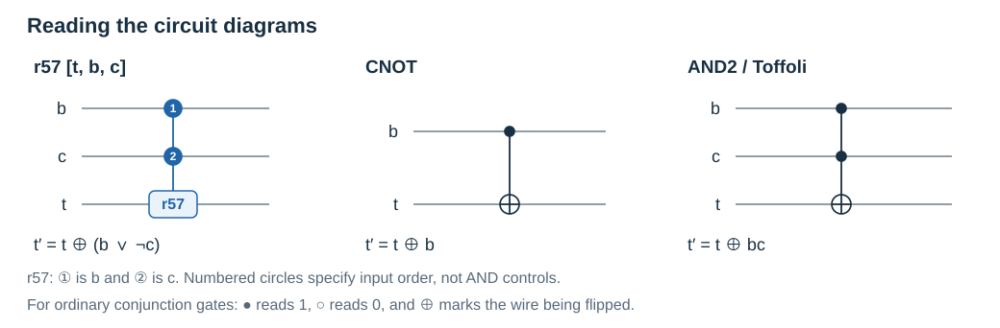
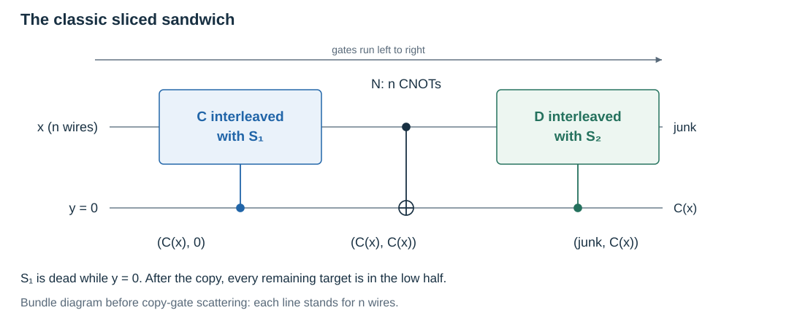
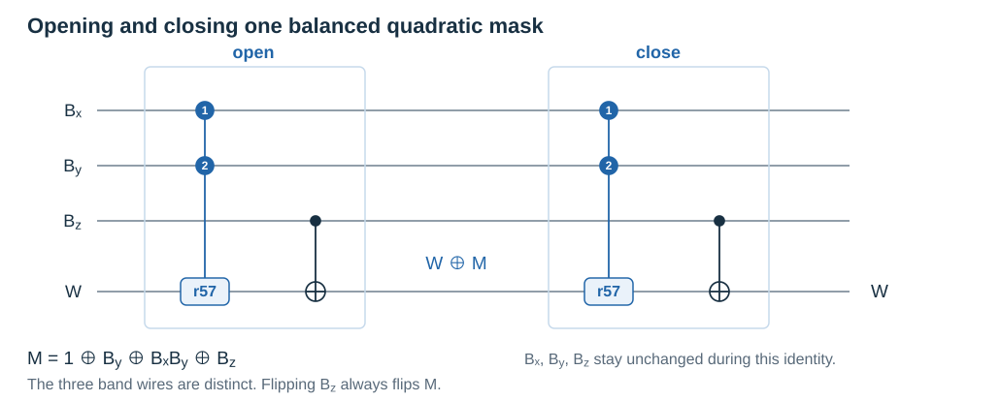
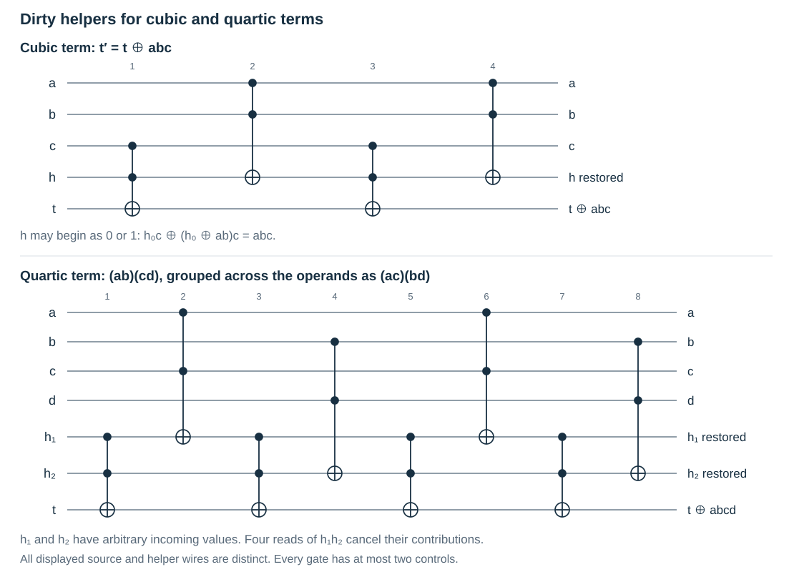
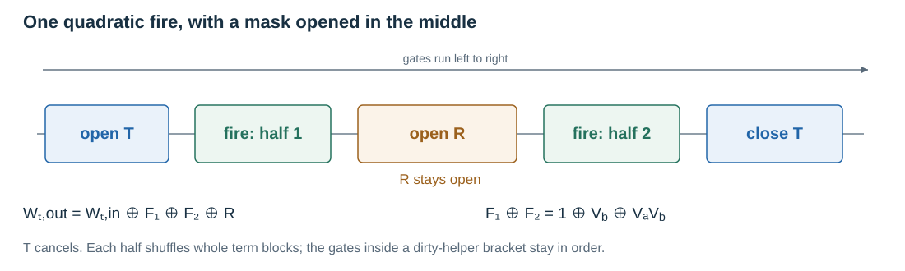

<a id="local-mixing"></a>

# Local Mixing of Reversible Circuits: Current Method

This document describes the current local-mixing construction and the attacks
used to examine it. It draws on the ideas and exposition of Ran Canetti,
Nicholas Ho, and their collaborators, retaining the notation, equations, and
construction diagrams of the research document. The chronological experiments
and superseded constructions are collected separately in
[Local Mixing History](local_mixing_history.md).

The method constructs a sliced sandwich, applies embedded masking, performs
database replacements, splits and crosses the resulting gates, and finally
compresses and packs the circuit. Optional carrier shuffling is a part of
embedded masking. It is implemented but disabled by default; enabling it does
not select another masking mode. This text describes the implementation as of
September 16, 2026.

The goal is to change the internal representation of a computation while
preserving its required behavior. The algebraic identities below explain
correctness. The attack section explains what we test for hiding. Passing a
sampled test, exhausting a solver budget, or preserving the function does not
establish indistinguishability obfuscation or preimage hardness.

**Contents**

- [Attacks and measurement](#attacks)
- [The construction and its contract](#current-mixing-method)
- [Circuit notation and representation](#random-circuits)
- [Local replacements and canonicalization](#sampling-circuit-replacements)
- [Frozen and curated databases](#frozen-table)
- [The sliced sandwich](#sliced-sandwich)
- [Embedded masking](#embedded-masking)
- [Optional preprocessing shuffling](#preprocessing-shuffling)
- [Database mixing and its schedule](#generation-mixing)
- [Splitting, crossing, and compression](#fragmentation)
- [Implementation and optimizations](#implementation)
- [Running the method and interpreting results](#running-the-method)
- [References](#references)

<a id="attacks"></a>

## Attacks and measurement

Write $C$ for the source circuit and $G$ for its transformed representation;
$\oplus$ denotes XOR, and products of bits denote AND, with arithmetic over
$GF(2)$. The [construction and its contract](#current-mixing-method) below
specifies the public input slice and answer block.

The public object is a reversible gate list. An observer can evaluate it on
chosen inputs, record its intermediate values, and run transformations that
depend only on that circuit. Some diagnostics also know a reference source
circuit and use it to label the logical values they try to recover. A
source-dependent recovery is evidence of a relation; it is not automatically
a blind recovery of an unknown source circuit or a preimage witness.

These observation models must be distinguished:

| Experiment | Inputs and observations | What success means |
|---|---|---|
| Full TDP preimage | Free $x$, fixed zero auxiliaries, specified answer block; whole published circuit available | Independently verified $x$ producing the target. |
| State reconstruction | Reference logical values and all physical wires at one chosen prefix | A fixed predictor recovers those values on held-out inputs. |
| Whole-trace reconstruction | Reference logical values, initial wires, and selected or complete gate traces | A fixed relation across times predicts or reconstructs them. |
| Isolated gadget gauntlet | Explicit encoded-I/O and auxiliary-input policy; source labels available | Detection by the stated attack family on that controlled construction. |
| Demixing/compression | Supplied circuit and declared output projection | A smaller equivalent circuit or a smaller circuit preserving the selected outputs. |

Correctness is checked first. Exhaustive tests are practical for small inputs;
larger comparisons provide sampled evidence. Full-state equivalence, logical
output equivalence after decoding, and agreement only on a public slice are
different contracts. Every report must state which one it checked.

<a id="state-heatmaps"></a>

### Ordinary state heatmaps

For circuits $C_1,C_2$ on corresponding $n$ wires, compare prefixes $i,j$ on
the same sampled input set $S$:

$$
D(i,j)=\frac{1}{n|S|}\sum_{x\in S}
\mathrm{HD}(C_{1,i}(x),C_{2,j}(x)).
$$

The normalized metric is zero for identical states and has expectation one
half for independent balanced bits. An equivalent circuit can agree at its
ports while differing internally. A progress diagonal indicates that stages
of the original computation remain recognizable in corresponding states.


This figure is a conceptual illustration retained from the research document,
not a measurement of the current shuffled construction. Color scales are a
plotting choice and must be read from each plot's legend.

The Rust `hmap` tool stores the mean number of differing bits, without dividing
by width; the Python heatmap path can normalize it. The metric assumes wire
positions have corresponding meanings. A wire permutation can change ordinary
distance while leaving all information recoverable by a simple map. Therefore
ordinary heatmaps alone do not measure resistance to affine reconstruction.

Useful variations restrict prefixes, examine interior chunks, fix selected
input wires, use sparse Bernoulli inputs, or seed an input distribution at a
chosen reference prefix and invert that prefix to obtain actual inputs. Each
variation asks about its stated input family rather than all inputs.

<a id="differential-attacks"></a>

### Algebraic degree and differential tests

Write a physical wire at prefix $j$ as a Boolean polynomial $P_j(x)$ in the
original inputs. Low degree may expose algebraic structure even when ordinary
state distance looks random. The derivative in direction $a$ is

$$
D_aP(x)=P(x)\oplus P(x\oplus a).
$$

An additional derivative reduces degree by at least one unless it has already
vanished, so a polynomial of degree at most $d$ has zero $(d+1)$-fold derivative.
Exact ANF composition is possible on small support; chosen-input derivative
tests probe restricted directions without expanding the complete polynomial.

This degree is measured in the original input variables. It differs from the
degree of a decoder expressed in the current physical wires. Two high-degree
carriers can still reveal a logical value by one XOR. No standalone general
differential campaign runner is retained in `security_tests/`; this is an
attack model and a way to design additional experiments, not a claimed
completed test of the new shuffling policy.

<a id="affine-reconstruction"></a>

### Affine reconstruction at one state

The differential test above asks how
complicated each transformed wire is as a function of the original input. The
affine reconstruction heatmap asks a different question: given all of the wires
in the transformed circuit at one moment, can an attacker combine them to
recover the original circuit's state at some moment?

For instance, two carrier wires $c_0$ and $c_1$ may each be high-degree
functions of the original input while still encoding a logical value as

$$
v=c_0\oplus c_1.
$$

The differential test sees two complicated physical wires. The affine
reconstruction test sees that the logical value is still recovered by one XOR.

Let $C$ be the original circuit on $n$ wires and let $G$ be the wider
transformed circuit on $N$ wires. Row $i$ of the heatmap represents the state of
$C$ after $i$ gates, while column $j$ represents the state of $G$ after $j$
gates. To fill the cell $(i,j)$, we run both prefixes on the same collection of
logical inputs. We also follow the auxiliary-input policy of the construction:
the public slice is fixed, while the remaining helper wires are fixed or
sampled as required by that experiment. This policy is part of the result. A
flat map under one choice of helper inputs does not tell us what happens under
every other choice.

We then take one target wire $t$ from the state of $C_i$ and ask whether there
are fixed coefficients $a_0,\ldots,a_N$ such that

$$
C_i(x)_t
=a_0\oplus a_1G_j(x)_1\oplus\cdots\oplus a_NG_j(x)_N
$$

for every sampled input $x$. Here all the features come from the single state $G_j$. The heatmap
compares many states, but each cell fits its own equation. The
[whole-circuit attack](#linear-correlators) removes this restriction
and combines observations from different times.

The coefficients do not change with the input.
Each coefficient is either 0 or 1: choosing 1 includes that wire in the XOR,
while choosing 0 leaves it out. For example, if

$$
C_i(x)_t=1\oplus G_j(x)_3\oplus G_j(x)_{11},
$$

then the attacker has recovered that logical bit, even if neither physical wire
3 nor physical wire 11 contains it by itself. We repeat this for every one of
the $n$ target wires of $C_i$. In other words, the test does not ask whether the
two physical states look alike. It asks whether the original state can be
decoded by XORing wires of the transformed state, with an optional constant.

We find these coefficients with Gaussian elimination over $GF(2)$, which is
ordinary linear algebra with XOR used as addition. We use one set of inputs to
find a relation and a separate holdout set to test it. If a target wire has no
affine relation on the training set, it receives error $0.5$, which is the error
of a random guess. This $0.5$ is assigned by convention; it does not mean that
we measured the best affine predictor and found that it guesses randomly. If we
find a relation, it receives its actual error on the holdout set.
The heatmap value $H(i,j)$ is the average of these errors over the $n$ target
wires. Thus, $H(i,j)=0$ means that the complete state of $C_i$ was recovered
exactly on the holdout inputs. A value near $0.5$ means that this test did not
find exact affine reconstructions for most of the target wires. It does not mean
that no biased or more complicated predictor exists. An intermediate value
usually means that the test recovered only part of the original state.

A low-$H$ cell therefore says that the state of $C$ at row $i$ can be read from
the state of $G$ at column $j$. If the location of these low-$H$ cells moves
forward as $i$ moves forward, they form a ridge across the map. This ridge tells
the attacker where the successive stages of the original computation occur
inside the transformed circuit. We call it a ridge because we can plot
recoverability as $0.5-H$. In the raw error map, the same feature is a low-$H$
valley.

We do not read this map using its overall mean. Most cells compare unrelated
stages and therefore sit near $0.5$. Also, when $G$ gets longer, the leaking
region can occupy a smaller fraction of the map even when the leak itself has
not changed. We first remove the forced input and output ports and then measure
the low-$H$ cells in the interior. *Coverage* tells us how many original-circuit
rows contain a meaningful dip. *Depth* tells us how far that dip falls below
the background of its own row. Once enough rows have meaningful dips, $\rho$,
the Spearman correlation between the row and the location of its dip, tells us
whether those locations move forward with the original circuit. We can also
compare $\rho$ with shuffled ridge locations to determine whether the observed
ordering is stronger than chance.

### Bounded-degree reconstruction

The affine test only allows a
constant and XORs of individual wires. We can give the attacker more power by
also allowing products of the current wires. For example, the degree-2 test can
use terms such as

$$
G_j(x)_3G_j(x)_{11}.
$$

Here, multiplication is an AND of the two wire values.

It then asks whether each target wire of $C_i$ can be written as an XOR of a
constant, individual wires of $G_j$, and products of two wires of $G_j$. The
degree-$d$ test does the same thing with products of up to $d$ distinct wires.
Thus, the degree here describes the power of the reconstruction attacker, not
the degree of $G$'s wires as functions of the original input.

The difficulty is that the number of terms grows very quickly. On $N$ wires, a
complete degree-$d$ test has

$$
R(N,d)=1+\sum_{k=1}^{d}\binom{N}{k}
$$

possible terms. For reference, the counts are:

| wires $N$ | $d=1$ | $d=2$ | $d=3$ |
|---|---:|---:|---:|
| 48 | 49 | 1,177 | $\approx 18{,}000$ |
| 128 | 129 | 8,257 | $\approx 350{,}000$ |
| 512 | 513 | 131,329 | $\approx 22{,}000{,}000$ |

The number of training samples must exceed the number of possible terms. After
that, the Gaussian elimination itself also becomes expensive. For this reason,
a practical degree-2 or degree-3 test may use only some of the possible products.
A flat map from one of these restricted tests only means that this particular
set of terms did not reconstruct the original state. It does not rule out every
attacker of that degree. We should also run a control with a degree-$d$ relation
that the restricted test is supposed to find. If it cannot recover that control,
then its flat result tells us nothing useful.

The current `hmap_affine --degree 2` path can restrict the pair-product wires
with `--deg2-wires` or `--deg2-wire-list`. Report the chosen support and feature
count alongside the training and held-out sample counts. A restricted
degree-two test does not search all degree-two formulas on all wires.

### Statistical prediction at one state

`hmap_stat` searches individual wires and XORs of wire pairs for predictors
of each source value. With `--and-wires`, it can greedily add one product
term drawn from a selected wire set. Its score is best agreement, so higher
values mean stronger prediction; this is the opposite direction from the
affine heatmap's error score.

The tool also searches against a random target to expose the finite-sample
floor from trying many predictors. It searches and scores on the same sample
set, so the plate is a screening statistic rather than an independently
held-out generalization result. A candidate witness needs a separate fresh
replay before it is treated as a persistent predictor. The predictor family
and selected product wires bound what a clean plate can exclude.

<a id="linear-correlators"></a>

### Whole-circuit linear correlators

A state heatmap fits a separate predictor at each prefix. It does not let
that predictor combine the wire values seen at different moments.

An observer of our circuit does not have this restriction. They can run the
published gate list and keep the intermediate values. Thus, we should allow
the correlator to use observations from across the entire circuit. Suppose
$Z_w^{(j)}(x)$ is the value of physical wire $w$ after gate $j$, and $v(x)$ is
one of the source circuit's intermediate values. We now ask whether

$$
v(x)=\kappa\oplus\bigoplus_{j,w}\alpha_{j,w}Z_w^{(j)}(x)
$$

for fixed coefficients $\kappa,\alpha_{j,w}\in GF(2)$. The coefficients may
select different wires at different times, but they must work across the
inputs. In other words, we have changed the information available to the
attacker, while still only asking for a linear combination of that information.

A nonlinear mask is not automatically safe against this observation model.
If a helper changes from $u_0$ to $u_0\oplus M\oplus\delta$, the observer can
XOR its before/after values and recover $M\oplus\delta$. The unknown dirty
value cancels. More generally, a nonlinear product observed as one gate's
firing bit is one linear feature for a trace attacker. Linearity in observed
features and linearity in the original inputs are different restrictions.

<a id="recording-the-trace"></a>

#### Recording the trace

We do not need to store the complete state after every gate to perform this
attack. Let $\Delta_j$ be the firing bit of physical gate $j$. Since our gates
only change one target,

$$
\Delta_j=Z_{t_j}^{(j-1)}\oplus Z_{t_j}^{(j)},
$$

and every later wire value can be recovered as

$$
Z_w^{(r)}=Z_w^{(0)}\oplus
\bigoplus_{\substack{j\le r\\t_j=w}}\Delta_j.
$$

Thus, the initial wire values and all gate firing bits already span every
intermediate wire value. We can use these as the features of our linear
system. This is still a linear attack in the trace values; it does not claim
that those values are linear in the original inputs.

We can display this attack as a cumulative heatmap. As we move through
the gadgetized circuit, we add observations to one growing linear system.
One version adds the full wire state at each sampled checkpoint. Another
adds every gate's firing bit, giving the complete trace span. The last
column therefore uses observations from across the circuit, rather than
just its final state. Sampling only some checkpoints or gate deltas gives
a restricted version of this attack.

The `hmap_trace_affine` tool fits the equations on one set of inputs and checks
them on separate inputs. It uses three independent sets: fitting inputs to find
an equation, validation inputs to reject spurious relations and choose a
witness, and test inputs to measure that chosen witness without changing it. A long trace can have many more features than fitting samples. If
the fitted span reaches the number of fitting samples, it can fit
arbitrary labels on those samples. At that point, a failed test on new
inputs is inconclusive: the procedure may have chosen a spurious equation
instead of another one which generalizes. We cannot treat this as evidence
that no affine equation exists.

<a id="approximate-linear-correlators"></a>

#### Correlations without exact recovery

Exact recovery is only one kind of failure. A predictor which agrees with a
source value on three quarters of the inputs fails an exact reconstruction
test, but still reveals information. For a parity $P$ of observed trace bits,
we can write its signed agreement with $v$ as

$$
\rho=\mathbb E[(-1)^{v\oplus P}].
$$

Choosing the better of $P$ and its complement gives agreement
$(1+|\rho|)/2$. For instance, $|\rho|=1/2$ gives agreement $3/4$.
We should therefore look for biased linear correlators as well as exact
linear equations.

To see why this matters for masking, suppose a carrier contains
$v\oplus xy$, where $x,y$ are independent uniform bits, independent of $v$.
The product is zero on three quarters of the inputs, so the carrier already
guesses $v$ with agreement $3/4$. The decode is nonlinear, but the mask is
biased. A wider product does not necessarily help: a product of three
independent bits is zero seven eighths of the time.

<a id="gadget-gauntlet"></a>

### The gadget gauntlet

We collect these tests in the **gadget gauntlet**. We begin with a chain of
source r57 gates, gadgetize it, optionally mix it, and compare the two
executions on the same inputs. For each source gate
$c\mathrel{\oplus{=}}a\vee\neg b$, we record five target values:

$$
a,\qquad b,\qquad c_{\mathrm{old}},\qquad
f=a\vee\neg b,\qquad c_{\mathrm{new}}.
$$

On the gadgetized side, we record the initial wires and, for each physical
gate, its firing bit and new target value. This includes values which exist
only briefly. The main tests are:

| Test | What the observer can combine |
|---|---|
| `a1` | One recorded value, or its complement, to recover a source value exactly. |
| `xrows` | Any affine combination of the wires at one physical-gate prefix. This is the local-state reconstruction test. |
| `xtrace` | Any affine combination of initial wires and gate firing bits across the complete recorded execution. |
| `w1` | Each individual trace feature, looking for statistical correlation. |
| `w2`, `w3` | Pairs and triples from selected trace features. These include XOR correlators and limited nonlinear combinations such as AND and OR. |

The numbers in `w2` and `w3` count the features used, not the algebraic
degree of every predictor. The statistical score is centered so that a
predictor does not count as useful merely because the source firing bit is
usually one. Namely, for the $\pm1$ versions of $v$ and $P$, it measures

$$
\left|\mathbb E[(-1)^{v\oplus P}]
-\mathbb E[(-1)^v]\mathbb E[(-1)^P]\right|.
$$

Under the default native/ideal-pool policy, the auditor runs the same
correlators against an independent random target. This gives us a noise
baseline: a score can look
nonzero merely because we have finitely many samples and try many predictors.
A flag must exceed both the largest score against that random target for
the same test and $6/\sqrt{N}$, where $N$ is the number of correlation samples. The affine
recovery tests check their equations on 2,048 held-out samples as well. The
gauntlet's correlation families search and score on their correlation sample
tail; they do not use the trace heatmap's separate locked final-test set. In
the alternative file-builder band-pool policy, the noise target is a held-out
input-derived band column and is not necessarily independent of source inputs.
The unprotected circuit is included as a positive control, so that
we can check that the attacks find the structure they are meant to find.

Of course, the gauntlet has limits. `w1` scans every recorded feature, but
the usual `w2` and `w3` caps select 64 and 16 features respectively; they do
not scan all pairs and triples of a large trace. `xtrace` also has a feature
limit and explicitly reports when it is skipped. A skipped test is not a
passed test. Small input domains can saturate the trace span, so the logical
width, auxiliary-input policy, and sample counts must accompany the result.

The auditor knows the source values because it runs the source circuit.
Finding a recovery equation demonstrates a relation with that computation;
it is not already a blind reconstruction of an unknown circuit or a SAT
preimage. We use it to find weaknesses in the gadget before asking the
complete mixing method to hide it.


The native arms include unprotected control, embedded masking, wider-band
embedded masking, and both returned and carried shuffling layouts. The
nonlinear291 reference is also retained as an explicit comparison arm; it is
not the default embedded-masking construction. The test arm names identify
different experiments and do not add aliases to the production masking mode.

For isolated encoded-I/O experiments, the visible trace starts after the
input encoder and ends before the output decoder. Their random auxiliary
band differs from the full pipeline's input-derived band. The carried-layout
arm decodes through its final layout map. Results from these observation
policies must be reported separately.

The gauntlet's optional mixing is a database-free in-process walk, using
crossing/splitting moves and twists. Its database-move probability is zero.
It is not a run of the managed database-mixing, splitting, crossing, and final
compression sequence. A gauntlet result must therefore be labeled as an
isolated gadget experiment even when its `--mix` option is enabled.

The driver accepts a list of mixer seeds so the same source/gadget instances
can be compared under multiple paired mixing trajectories. Fixing only one
mixer seed does not estimate variation across mixing. Compare baseline and
shuffled arms at the same source, gadget, mixing budget, observation policy,
and seed list; do not pool returned and carried layouts. Use positive controls,
held-out witnesses, and independent replay before interpreting a detector's
absence of hits.

The current source paths and runnable commands are listed in the
[security-tool guide](../security_tests/README.md). Feature caps, skipped tests,
logical width, physical width, sample counts, and input distribution belong in
the result. A report with these fields omitted cannot establish what the
observer was actually allowed to see.

### What embedded masking does not establish

In [fixed-carrier embedded masking](#embedded-masking) before mixing, each complete fire unit adds
one polynomial term to the logical target and restores its helpers. If $J$
selects its target updates while omitting independent mask injections, then

$$
f=\bigoplus_{j\in J}\Delta_j
$$

is the source firing bit. A persistent mask changes the XOR over the entire
box, but an observer who identifies the constituent gates can omit the mask
updates. With source inputs and logical firing bits, the observer can follow
the source computation. Thus masked before/after values and a flat local
affine map do not exclude recovery from the complete trace.

Carrier transfers change which physical target receives each term and add
temporary masks and routing deltas. Their layout algebra guarantees correct
decoding; it does not establish that source values leave every whole-trace
span. A shuffle is itself a public circuit operation. Whether subsequent
database mixing and fragmentation obscure the resulting relations is an
attack question requiring measurements of that exact construction.

Historical embedded-masking gauntlets found whole-trace recoveries despite
no hits in several smaller feature families. Those exact circuits, policies,
and counts are recorded in [the history](local_mixing_history.md#embedded-gauntlet-results).
They are not measurements of the newly corrected carrier-shuffling transform.
No research-harness occupancy percentage, exposure rate, SAT timeout, or
full-pipeline compression ratio is asserted here for that new transform.

<a id="sat-solvers"></a>

### SAT preimage solving

A reversible gate list is a straight-line Boolean program. The SAT encoder
starts with one variable per input wire, tracks the current variable for each
wire, and allocates a fresh target variable for each update. Its clauses force
the new variable to match that gate's truth table. The other wire mappings
remain unchanged. Unit clauses then pin the public auxiliary inputs and the
specified answer bits.

For the classic full pipeline, the first $n$ input wires are free, every
remaining input wire is zero, and output wires $[n,2n)$ are fixed to the
target. Only the free inputs are a preimage witness. The generic retained
encoder also supports a different `--output-start` for explicitly declared
port conventions.

<a id="campaign-encoding"></a>

#### Gate-to-CNF encoding

The retained encoder uses a direct encoding for every gate, allocating one
new target variable and $2k+2$ clauses for a gate with $k$ controls. This
includes zero-control gates: an unconditional NOT and a gate which never
fires each receive one variable and two clauses. It does not apply the
zero-control folding or wide-gate auxiliary encoding described in historical
experiments.

For r57 itself, $o = a \oplus (b \vee \neg c)$, the direct encoding is six
clauses. Here `-b` means $\neg b$, and `or` is Boolean OR:

```text
(-b or  a or  o)
(-b or -a or -o)
( c or  a or  o)
( c or -a or -o)
( b or -c or -a or  o)
( b or -c or  a or -o)
```

These clauses separate the gate into its three possible cases. If $b = 1$, we
enforce $o = \neg a$. We do the same if $c = 0$. If $b = 0$ and $c = 1$, the
gate does not flip its target, so we instead enforce $o = a$. This encodes the truth table without enumerating all eight input cases. Setting $b = 1$ or $c = 0$ turns one pair into binary
implications between $a$ and $o$, but the other assignments still leave
ternary clauses.

The published circuits also contain gates from the [mixed-polarity gate
vocabulary](#beyond-r57). Such a gate has the form
$\texttt{fires}(x) = \texttt{comp} \oplus \bigwedge_i \texttt{lit}_i(x)$ with
$x[\texttt{target}] \mathrel{{\oplus}{=}} \texttt{fires}(x)$, for $k$ mixed-polarity
literals.

The **direct** form extends the six clauses above. It uses two clauses for each
control literal, followed by one final pair for the case in which every control
literal is true. A complemented gate is handled by negating the new target
literal in this relation. In particular, the direct encoding of a complemented
two-control gate gives exactly the six r57 clauses shown above. There is no
control-width threshold at which the retained tool switches encodings.

For a tape with $w$ input wires, $g$ gates, and a total of $K$ control
occurrences, the formula has $w+g$ variables and

$$
2K+2g+(w-n)+n=2K+2g+w
$$

clauses: the gate clauses, $w-n$ fixed auxiliary-input clauses, and $n$
answer-bit clauses. The encoder validates and counts the tape before emitting
DIMACS, so the header reflects the actual control widths rather than an
assumed r57-only average.

Consequently, gate count alone does not determine SAT size. Report the control
width distribution, encoding implementation, variables, clauses, unit
pins, and any preprocessing performed by the solver.

The retained workflow is under [`security_tests/sat_solve/`](../security_tests/sat_solve/).
It contains a C++17 encoder, a model decoder that verifies the actual circuit
output, and an input-cube runner for an external Kissat executable. Solver
exit 10 means SAT, 20 means UNSAT, and a timeout or unknown result does not
mean UNSAT. Solving selected random input cubes restricts the search to those
partial assignments; failure in those cubes does not prove the whole problem
unsatisfiable. In particular, an exhausted sampled-cube run is inconclusive.

A satisfying assignment is checked by evaluating the circuit on its decoded
free input. That is a concrete break of the selected instance. A resource
timeout measures only the selected solver, encoding, input restrictions, and
budget. It is not evidence that no preimage exists or a proof that another
algorithm will fail.

### Compression and demixing

The final fragment compressor is available to an attacker. It gathers
commutable same-target gates, reduces their ESOP, and repeats while it can
shrink the tape. The relevant size is the size after this pass, accompanied
by its parameters. A circuit that resists this compressor may still admit
another reduction algorithm.

Two retained probes use only the supplied circuit:

- `crossing_downhill` searches inverse crossing substitutions that shrink
  same-target ESOP groups. Applied rewrites preserve the whole function and
  are followed by sampled all-wire checks.
- `output_cone` uses legal movement and backward liveness to remove work
  irrelevant to selected outputs. This preserves a declared output
  projection, allowing discarded outputs to change. A comparison must use
  the actual application answer range.

The first asks whether crossing left locally recoverable expansion. The
second asks how much of the published material is needed for its visible
output. Neither requires access to generator seeds or provenance. Neither
by itself recovers the secret source representation or solves a preimage.

### What to record for a comparison

Record the source and full transformed artifact identities, physical width,
stage outputs, mask parameters, shuffling settings, band initialization,
answer range, construction and mixer seeds, budgets, feature caps, and
held-out sample policy. For shuffling, report original-target occupancy
separately from all-write occupancy and report overhead from the emitted
circuit. Use matched comparisons when attributing a change to one mechanism.

The SAT problem asks for a preimage. The iO game instead asks an observer to
distinguish obfuscations of two equal-size circuits computing the same
function. Those are different objectives. A source-dependent trace relation
can matter to that game even when no SAT preimage has been found. The
construction and available tests do not establish general iO.

<a id="current-mixing-method"></a>

## The construction and its contract

Let $C$ be a reversible source circuit on $n$ wires. The default construction
publishes a circuit $G$ on $4n$ wires with the public-slice behavior

$$
G(x,0^n,0^{2n})=(\text{junk},C(x),\text{junk}).
$$

Only $x$ is free at the input, and only the middle $n$ output bits are the
answer. The circuit remains reversible on every complete $4n$-bit state.
Fixing auxiliary inputs and projecting the outputs are part of the application
contract; no gate forces an arbitrary input onto that slice.

For a preimage problem, the target is an $n$-bit value $t$ and the required
witness is an $x$ with $C(x)=t$. Knowing $C$ gives the intended trapdoor:
reverse its gates on $t$. Knowing the published full output would likewise
allow anyone to reverse $G$, but the target does not include its junk outputs.
This removes an immediate complete-output inversion, not every possible way
to solve the projected problem.

The six stages are:

| Stage | Transformation | Purpose |
|---|---|---|
| 1 | Source $C$ to a sliced sandwich on $2n$ wires | Separates the answer from unconstrained junk and defines forward/reverse slices. |
| 2 | Embedded masking on $4n$ wires | Computes through balanced nonlinear masks, refreshes the band, and optionally moves physical carriers. |
| 3 | Database mixing | Replaces local windows by different equivalent circuits and repeatedly overlaps replacements. |
| 4 | Splitting | Removes complemented gate forms and couples distant locations with absorbed changes of wire frame. |
| 5 | Crossing | Moves fragments through true colliders by exact case splits, with contraction controlling growth. |
| 6 | Compression and packing | Removes recoverable redundancy and writes the final grouped ESOP representation. |

```text
C -> sliced sandwich -> embedded masking -> database mixing
  -> splitting -> crossing -> compress and pack -> final.esop1
```

Database mixing comes before fragmentation because the database returns r57
circuits. Putting it after splitting would repeatedly reintroduce the gate
form splitting is intended to remove. Final compression makes the published
size reflect the redundancy our own attacker-computable compressor can remove.

The [pipeline guide](tdp_pipeline.md) contains the complete configuration and
shell-flag reference. [Gadgetization](gadgetization.md) explains the first two
stages from an implementation perspective. The following sections develop
the construction behind those attack questions.

<a id="random-circuits"></a>

## Circuit notation and representation

We write a circuit as a list of gates executed from left to right. A wire
holds one bit, and each gate XORs a function of its controls into a distinct
target. Such a gate is its own inverse. Reversing the list therefore computes
the inverse circuit. We write $R^{-1}$ or $R^{\ast}$ for that inverse, so $RR^{\ast}$ is
an identity on every input.

Throughout, $+$ and $\oplus$ denote XOR for Boolean values; multiplication
denotes AND. Boolean polynomials use $GF(2)$ arithmetic with $x^2=x$.
Our source and stored replacement circuits use r57, also written g57:

$$
A\mathrel{\oplus{=}}B\vee\neg C
=1\oplus C\oplus BC.
$$

Thus r57 flips its target except when $B=0$ and $C=1$. The ordering of its
positive and negative controls matters. An ordinary CNOT or AND2 instead
uses a conjunction as its firing condition.



For pure r57 tapes, a gate consists of three distinct wire tokens in the
order `(target, positive control, negative control)`, and semicolons separate
gates. For example, `123;145` is a two-gate circuit. Wire tokens use the
following encoding:

| Wire range | Encoded as |
|---|---|
| $0$–$9$ | `0–9` |
| $10$–$35$ | `a–z` |
| $36$–$61$ | `A–Z` |
| $62$–$71$ | `! @ # $ % ^ & * ( )` |
| $72$–$82$ | `- _ = + [ ] { } < > ?` |
| $\ge83$ | $k$ tildes followed by base-83 digit $X$, meaning $83k+X$ |

The later stages need the wider vocabulary below. The pure r57 spelling is
useful for source and database circuits but cannot represent the entire
pipeline output.

<a id="beyond-r57"></a>

### Mixed-polarity controlled XOR gates

The general notation uses a single gate type: a single-target controlled XOR whose
control is a conjunction of mixed-polarity literals, optionally complemented as
a whole.

$$
\texttt{fires}(x) = \texttt{comp} \oplus \bigwedge_i \texttt{lit}_i(x), \qquad
x[\texttt{target}] \mathrel{{\oplus}{=}} \texttt{fires}(x)
$$

Each $\texttt{lit}_i$ is a wire or its negation. The members of this family that
actually occur in our circuits are worth naming, since we refer to them by name
throughout.

**Table: The wider gate vocabulary**

| Name | `comp` | Controls | Effect |
|------|--------|----------|--------|
| X | 0 | none | $t \mathrel{{\oplus}{=}} 1$ |
| CNOT | 0 | one, positive | $t \mathrel{{\oplus}{=}} x_c$ |
| NCNOT | 0 | one, negative | $t \mathrel{{\oplus}{=}} \neg x_c$ |
| AND2 | 0 | two | $t \mathrel{{\oplus}{=}} \texttt{lit}_a \wedge \texttt{lit}_b$ |
| conj $wK$ | 0 | $K \ge 3$ | $t \mathrel{{\oplus}{=}}$ the $K$-literal conjunction |
| r57 | 1 | two, opposite polarity | $t \mathrel{{\oplus}{=}} (x_b \vee \neg x_c)$ |
| comp $wK$ | 1 | $K$, any polarity | $t \mathrel{{\oplus}{=}} \neg(\text{the conjunction})$ |

The important row is the r57 one. An r57 gate $[a,b,c]$ is `comp` $= 1$ with the
two literals $\neg b, c$, since $1 \oplus (\neg b \wedge c) = b \vee \neg c$. So
r57 is a *member* of this family rather than something sitting outside it, which
is what makes the notation worth adopting at all: one vocabulary holds plain r57
and non-r57 material at the same time, and a circuit that is only partly
converted is still a single object in a single format. At the other end of the
table, an empty conjunction is true, so the `comp` $= 0$ gate with no controls
fires on every input and is an unconditional NOT.

Circuits in this vocabulary are written in a second, plainer text format we call
`mpmct1`, for mixed-polarity multi-controlled Toffoli. The three-token encoding
gets its density from knowing the gate type in advance, which is precisely what
`mpmct1` cannot assume, so it spells everything out instead: a header line
naming the wire and gate counts, then one gate per line, all in decimal.

```text
mpmct1 <num_wires> <num_gates>
<target> <comp> <k> <wire> <pol> ... (k wire/polarity pairs)
```

The wire numbers in this format are ordinary zero-indexed decimal numbers. A
polarity bit of `1` denotes the positive literal $x_w$, while a polarity bit of
`0` denotes the negative literal $\neg x_w$. If the conjunction of the $k$
literals is $L$, then `comp` $=0$ flips the target when $L=1$, while `comp`
$=1$ flips the target when $L=0$. In other words, the stored gate performs

$$
x_{\mathtt{target}} \mathrel{{\oplus}{=}}
\mathtt{comp} \oplus L.
$$

The following gives one stored-line example for every gate form in the table
above. We use wire 1 as the target throughout.

- **X:** `1 0 0` gives $x_1 \mathrel{{\oplus}{=}} 1$. Here $k=0$, and the
  empty conjunction is true.
- **CNOT:** `1 0 1 2 1` gives $x_1 \mathrel{{\oplus}{=}} x_2$.
- **NCNOT:** `1 0 1 2 0` gives $x_1 \mathrel{{\oplus}{=}} \neg x_2$.
- **AND2:** `1 0 2 2 1 3 0` gives
  $x_1 \mathrel{{\oplus}{=}} x_2 \wedge \neg x_3$.
- **Conjunction of width 3:** `1 0 3 2 1 3 0 4 1` gives
  $x_1 \mathrel{{\oplus}{=}} x_2 \wedge \neg x_3 \wedge x_4$.
- **r57:** `1 1 2 2 0 3 1` gives
  $x_1 \mathrel{{\oplus}{=}} 1 \oplus (\neg x_2 \wedge x_3)
  = x_2 \vee \neg x_3$.
- **Complemented conjunction of width 3:** `1 1 3 2 1 3 0 4 1` gives
  $x_1 \mathrel{{\oplus}{=}} 1 \oplus
  (x_2 \wedge \neg x_3 \wedge x_4)$.

Below is an example of a 3-gate circuit written in this format.

```text
mpmct1 32 3
15 0 2 7 1 20 1
4 0 2 2 1 31 1
4 0 1 20 1
```

The header declares physical wires 0 through 31 and three gate instructions.
The value 32 cannot be reduced without relabeling the gates, since the second
gate refers to wire 31. Reading the instructions from top to bottom, they give

1.  $x_{15} \mathrel{{\oplus}{=}} x_7 \wedge x_{20}$,
2.  $x_4 \mathrel{{\oplus}{=}} x_2 \wedge x_{31}$,
3.  $x_4 \mathrel{{\oplus}{=}} x_{20}$.

We will use the simpler three-pin notation when a circuit only consists of r57 gates.

<a id="sampling-circuit-replacements"></a>

## Local replacements and canonicalization

A replacement preserves the states at the boundaries of a selected window
while changing the gates and intermediate states within it. A precomputed
table supplies circuits with the same function. Its key must identify the
function independently of the local spelling and the names of the wires.

Two different simplifications matter. Commuting-gate normalization removes
differences caused only by gate ordering. Polynomial canonicalization
identifies the same function up to simultaneous relabeling of its input and
output wires. It does not allow unrelated input and output permutations.

<a id="sampling-subcircuits"></a>

### Sampling subcircuits

A contiguous window is already adjacent in the gate list. A convex window
may contain gates separated by others, provided legal commuting swaps can
bring the selected gates together without crossing a true dependency. The
window can then be replaced and its products dispersed again.

For general controlled XOR gates, shared wires alone do not settle whether
the gates commute. Two gates with the same target commute because neither
reads that target. Reads of another gate's target can create a dependency;
disjoint firing conditions can sometimes remove it. The commutation engine
uses the actual gate forms and exact conditions, including mixed polarities.

Gate-order normalization and convex sampling reduce trivial variation and
make replacements overlap actual dependency neighborhoods. They do not change
the definition of functional equivalence.

<a id="canonicalization"></a>

### Function keys and wire relabeling

The gates `123;345` and `145;523` illustrate relabeling. The map
$1\mapsto1$, $2\mapsto4$, $3\mapsto5$, $4\mapsto2$, $5\mapsto3$
changes the first list into the second. They have the same dependency shape
on relabeled wires, even though their functions on the original numbered
wires differ. The lookup records the map so a candidate can be returned to
the sampled window's actual coordinates.

Polynomial canonicalization works on the local window's input variables,
not on the polynomials of the entire preceding circuit. This distinction
makes short-window queries practical even when the global function is large.

<a id="polynomial-canonicalization"></a>

### Canonicalizing via polynomials

Recall from the definition of r57
that a gate $[a,b,c]$ gives $a' = a + \neg b \wedge c + 1$. If we seed each wire
$i$ with the degree-1 monomial $x_i$ and apply that substitution gate by gate,
then after the last gate every wire holds a polynomial in the inputs over
$GF(2)$. A circuit on $n$ wires is therefore a list of $n$ polynomials, and two
circuits are functionally equal exactly when their polynomial lists agree. For the short windows we sample, this is often much smaller than
an explicit permutation over every input state. We use Boolean polynomials, so
$x_i^2=x_i$ and repeated monomials cancel over $GF(2)$. These reduced
polynomials are the algebraic normal form of the function. They can still
grow exponentially, which is why we bound the work of a local lookup below.

We also need a canonical *wire labeling*, so that two circuits which differ
only by a relabeling collapse onto
one entry. We rank the wires by their polynomials rather than by enumerating
every possible relabeling. The wire with the highest ranking gets mapped to
wire 0, the next highest to wire 1, and so on. The algorithm is as follows.

**Input:** a list of `n` polynomials over GF(2), one per wire (represented as sets of monomials, each monomial a bitmask of variables).

**Output:** the canonical reordering of those polynomials, plus the wire permutation that achieves it.

1. **Degree profile partitioning** — For each wire `i`, compute its degree profile: a vector where entry `k` is the number of monomials of degree `k` in `P_i`, sorted highest degree first. Sort wires by degree profile (descending) and group wires with identical profiles into equivalence classes `C_1, C_2, ...`.

2. **Build class polynomials** — For each class `C_i`, build `P_{C_i}`: the sum (with integer coefficients) of all polynomials of wires in that class, counting how many times each monomial appears across the class. This gives us a new polynomial with coefficients in $\mathbb{N}$.

Degree profile partitioning simply means we group all of the polynomials by the
number of monomials with some highest degree. Any tied polynomials, we then
look at the number of monomials with the next highest degree, etc. For
instance, consider the polynomials:

$$
P_1 = x_0 + x_1 + x_2 + x_0x_1 + x_2x_3 + x_0x_2x_3
$$

$$
P_2 = x_2 + x_3  + x_2x_3x_4x_5
$$

$$
P_3 = x_3 + x_5 + x_0x_1x_3x_5
$$

Their degree profiles are:

| Polynomial | Degree 4 | Degree 3 | Degree 2 | Degree 1 |
|------------|----------|----------|----------|----------|
| $P_1$      | 0        | 1        | 2        | 3        |
| $P_2$      | 1        | 0        | 0        | 2        |
| $P_3$      | 1        | 0        | 0        | 2        |

Since $P_2$ and $P_3$ both have 1 monomial of degree 4 while $P_1$ has none,
$P_2$ and $P_3$ are placed in a higher class than $P_1$. Since $P_2$ and $P_3$
have identical degree profiles, they remain in the same equivalence class.
Thus, we have $C_1$, the first polynomial class, holding $P_2$ and $P_3$, and
$C_2$ is then just simply $P_1$. To build the class polynomials, we now just
sum the polynomials within each class together, noting that we have
coefficients over $\mathbb{N}$, rather than our polynomial being in $GF(2)$.
$P_{C_1}$ is thus $P_2 + P_3 = x_2 + 2x_3 + x_5 + x_2x_3x_4x_5 + x_0x_1x_3x_5$
and $P_{C_2} = P_1 = x_0 + x_1 + x_2 + x_0x_1 + x_2x_3 + x_0x_2x_3$.

We note that the degree profile is used only to build these class polynomials.
It does *not* seed the ranking of the wires. The refinement below starts with
every wire tied and produces the entire ranking itself.

Before we go through how to use these $P_{C_i}$ to rank our wires, we first
must know how to rank two monomials.

Given **$M$** and **$M'$** and some partial ranking $\sigma$ of the variables, we have $M > M'$

- **(a)** If the degree of $M$ is greater than the degree of $M'$
- **(b)** If the degrees are equal, then if the highest ranked variable, based on $\sigma$, of $M$ is ranked higher than the highest ranked variable of $M'$.
- **(c)** If the degrees are equal and the variables are equally ranked, then if the coefficient of $M$ is greater than the coefficient of $M'$.

Let us take an example. Suppose we have $x_0x_1x_3$ vs $x_2x_4$ with current
partial ranking $0,1 < 4 < 3,5,6$. Then from rule $(a)$, we have $x_0x_1x_3 >
x_2x_4$ as the degree of $x_0x_1x_3$ is greater than that of $x_2x_4$. Let us
keep this partial ranking and move onto examples of when we would use $(b)$ and
$(c)$. So let us consider the two monomials $x_0x_4$ and $x_1x_5$. These
monomials have equal degree, so rule $(a)$ tells us these two monomials are
tied. We now consider rule $(b)$. The highest ranked variable in $x_0x_4$ is
$x_0$. The highest ranked variable in $x_1x_5$ is $x_1$. As our partial ranking
currently can not differentiate between $0$ and $1$, then we have that $x_0$ and
$x_1$ are ranked equally. Thus, we move on to the next variables. The next
highest ranked variable in $x_0x_4$ is $x_4$ and for $x_1x_5$ is $x_5$. As we
have $4 < 5$, then $x_4$ is the higher ranked variable. Thus, $x_0x_4 >
x_1x_5$. Let us finally take an example where rule $(c)$ would be called. Let us
have the monomials $5x_0x_1$ vs $x_0x_1$. As the degrees are equal, then rule
$(a)$ fails to differentiate them. As the variables are exactly the same, then
rule $(b)$ fails to differentiate them. We note that the variables do not have
to be equal for this case to fail. For instance, $x_0$ vs $x_1$ would also fail
since our partial ranking does not differentiate between $0$ and $1$. Thus, we
use rule $(c)$ and find that $5x_0x_1 > x_0x_1$ based on the coefficients.

Given this definition, we continue with our algorithm.

3. **Start with an empty partial ordering (all wires tied). Repeat until no ties remain:**
   - **Phase 1** — For each `P_{C_i}`, starting from `P_{C_1}`, look at the highest ranked monomial. In the case that there are multiple, then we consider all of them. The frequency of variables that appear in the highest monomial define which wires should be ranked higher than other wires. The initial partial ordering is created looking at the highest degree monomials of `P_{C_1}`. Any ties, which are variables that we have not yet been able to determine a ranking for, are then attempted to be broken by looking at the subsequent monomials. If every monomial of `P_{C_1}` has been observed and ties remain in $\sigma$, then continue to `P_{C_2}`, etc. Whenever a tie is broken, restart from `P_{C_1}`. We note that the highest monomial may change as our partial ordering becomes more complete. In other words, we have less ties between variables. If we exhaust all `P_{C_i}` and ties remain, then continue to the next step.
   - **Tiebreak 1 (per-polynomial key)** — For each tied group, consider a ranked version of each $P_i$ (the original polynomials associated with the tied wires) within that group: replace each variable with its current rank, sort ranks within each monomial, sort monomials by degree, then lexicographically. The lexicographically smaller ranked polynomial is then deemed to have a higher rank. Whenever a tie is broken, restart from `P_{C_1}` in phase 1.
   - **Tiebreak 2 (dynamic class polys)** — Build dynamic class polynomials `P_{D_r}` from the current tied groups as opposed to from degree profiling. In other words, for all polynomials $P_j$ for $j \in J$ where $J$ is the list of tied wires in a group, then construct $P_{D_s}$ as the sum of all $P_j$ as a polynomial with coefficients in $\mathbb{N}$. Apply the same Phase 1 frequency splitting. Whenever a tie is broken, restart from `P_{C_1}` in phase 1.
   - **Rule L (exhaustive)** — If ties still remain, find the highest-ranked tied group. For each candidate wire `w`, hypothetically denote `w` as higher than all others in the group, continue the loop, and compute the resulting canonical form. Repeat for all candidates. Pick the `w` that yields the lexicographically smallest result.

4. **Remap polynomials and monomials** — Using the final wire ordering, move the output polynomial of the wire at position `p` to position `p`, rename that wire's input variable to variable `p`, and apply this renaming to all monomials. The same ordering is used for the inputs and outputs.

5. **Trim trailing identity wires** — Remove wires from the end where `P_i = {x_i}` and `x_i` appears in no other polynomial. These are fully decoupled identity outputs.

Below are some examples for $(3)$.

**Phase 1** — Suppose wires $\lbrace x_0, x_1, x_2\rbrace$ all share the same degree
profile and form class $C_1$, with $P_{x_0} = P_{x_1} = x_0x_1x_2 + x_0x_1 +
x_2$ and $P_{x_2} = x_0x_1x_2 + x_0x_2 + x_1$. Their class polynomial is
$P_{C_1} = 3x_0x_1x_2 + 2x_0x_1 + x_0x_2 + x_1 + 2x_2$. We start with the empty
partial ranking, which just means all wires are considered equal. The highest
monomial $3x_0x_1x_2$ contains all three variables equally, so no tie is broken.
Moving to the next highest ranked monomial, $2x_0x_1$, which tells us $0,1 < 2$.
Since we made progress, we restart from the highest ranked monomial, but learn
nothing. We then go to the next highest monomial, etc. We note that after the
initial partial ranking, we are now just trying to tie-break. In this case, we
are trying to determine the true ranking of 0 and 1.

**Tiebreak 1** — Suppose Phase 1 has established $x_2 < x_3$, but $x_0$ and
$x_1$ remain tied, with $P_{x_0} = x_0x_2 + x_3$ and $P_{x_1} = x_1x_3 + x_2$.
Replacing variables with their current ranks and sorting within each monomial
gives $x_0x_2 + x_3$ for $P_{x_0}$ and $x_0x_3 + x_2$ for $P_{x_1}$. Since we
have that $x_2 > x_3$ from our partial ordering, we find that $P_{x_0} >
P_{x_1}$ and so $0 < 1$. The intuition is that $x_0$ co-occurs with $x_2$, while
$x_1$ co-occurs with $x_3$, and $x_2 < x_3$.

**Tiebreak 2** — Suppose $x_0$ and $x_1$ remain tied after Phase 1, with
$P_{x_0} = x_0x_1 + x_0x_2 + x_0x_3$ and $P_{x_1} = x_0x_1 + x_1x_2 + x_0x_3$.
Tiebreak 1 fails here as they are equal when we set $x_0 = x_1$. The tied group
we are considering is $0,1$, and so we build the dynamic class polynomial with
$P_0$ and $P_1$. Building the dynamic class polynomial $P_D = P_{x_0} + P_{x_1}
= 2x_0x_1 + x_0x_2 + x_1x_2 + 2x_0x_3$. We now do what we did in Phase 1. The
highest ranked monomial, if we assume partial ranking $0,1 < 2 < 3$ is
$2x_0x_1$. This does not help us break $0,1$. The next highest monomial is
$2x_0x_3$. As there is $x_0$ but not $x_1$, this tells us that $0 < 1$.

**Rule L** — Suppose $x_0$ and $x_1$ are still tied after all prior steps. We
take hypotheses $x_0 < x_1$ vs $x_1 < x_0$. Whichever hypothesis produces the
lexicographically smaller canonical form is committed to. Unlike the earlier
tiebreaks, Rule L is global: it considers the full resulting representation
rather than any local polynomial property. When two branches give the same
form, their wire labelings reveal a symmetry. We remember this symmetry and
skip later equivalent branches when the symmetry preserves the current tied
groups. Thus, we need not visit every symmetric branch separately.

**Highest monomials depending on $\sigma$** — Suppose we have polynomial $P =
x_0x_1 + x_1x_3$ with partial ranking $1 < 2 < 0,3$. Here the monomials would be
tied. However, if we break $0,3$ and have $0<3$ from some rule above, then the
highest monomial would be $x_0x_1$. Thus, it is important to remember that the
rules above are all relative to the current partial ordering of the variables.

We note that Rule L can be quite expensive if we are not careful. After all, it
can enumerate wire labelings when refinement does not distinguish them. However, it will only
run if all above methods have failed and ties remain between wires. This means
we may only need to consider a couple branches, as opposed to a full $n!$
different wire relabelings. Thus, in practice, this is still efficient. There is
an optional cap on the total number of Rule L candidates across the entire
recursive call. For instance, a budget of 512 candidates limits how much work
we spend on a difficult window. Exceeding the budget makes the
canonicalization fail rather than return a partial answer. A failure skips
the database lookup; it does not establish that the function has no friends.

Polynomial expansion needs a budget for the same reason. A monomial can be
represented by a bit mask, with one bit for each variable it contains. A
64-bit representation therefore supports at most 64 distinct wires in the
sampled window, even when the surrounding circuit is much wider. We can also
bound the number of reduced monomials per wire and the work spent multiplying
polynomials. For example, a limit of 200,000 reduced monomials per wire keeps
one difficult r57 window from taking over the entire mixing process. If a
window exceeds a limit, we leave it unchanged. These limits control the cost
of searching for a replacement; they do not change what it means for two
circuits to be equivalent.

Step 5 is what buys us the most. It relates the functionalities of
circuits on different numbers of wires. Thus, our tables need not be
separated by wires. Instead, we can have a table for 1 gate circuits, for 2 gate
circuits, etc. In fact, we can then combine all of these together into one large
database, which then allows us to relate circuits of both differing gates and
differing wires together.

Besides only including canonical circuits within our tables, we have two more
restrictions. Firstly, we do not include any circuits that have two adjacent and
equivalent gates. Suppose we were generating our 5 gate circuits and one of them
had 2 identical and adjacent gates. By the definition of our gate, this means
those two gates are just an identity and so this circuit is equivalent to a 3
gate circuit. The shorter circuit is generated at its own gate count, so the
adjacent cancelling pair adds a redundant spelling. In the regular table, the second restriction is to not store a circuit and its
reversal separately. Any canonical circuit can be mapped to its inverse, which
makes storing both redundant. Rather than probing for the reversal, we get this
for free from the key itself: we canonicalize the circuit in both directions and
key it by whichever of the two comes out smaller. A circuit and its reversal
therefore collapse onto a single entry automatically. We look up the smaller
canonical form. If it came from the reverse direction, we reverse the
replacement again before inserting it. The curated lookup, described below,
uses its forward form.

Trimming independent identity wires lets equivalent circuits with different
total widths share a key. The returned wire map still covers the sampled
window, so the replacement can be mapped back even when its key omits those
unchanged outputs.

<a id="rainbow-tables"></a>

## Frozen and curated databases

The rainbow table is the logical mapping from a canonical functionality to
its equivalent circuits. The frozen table is the read-only file format used
to store that mapping. Regular and curated tables contain different candidate
collections but use the same frozen layout.

The regular table is generated by gate count. A circuit with $m$ r57 gates
touches at most $3m$ wires, and unused external wires do not affect its key.
Generation can exploit fresh-wire symmetry: many extensions using previously
unused wire names become identical after canonicalization. Extensions that
reuse existing wires create more distinct functions and are harder to cover.

Coverage belongs to the supplied database, not to the executable. A store
containing some eleven-gate circuits need not contain all shorter narrow
circuits. A long window can still hit if its function has a shorter equivalent
spelling. Conversely, a miss, a wire-support limit, and a canonicalization
budget exhaustion are different reasons no replacement occurs. Historical
store sizes and hit rates are preserved in the history, not treated as bounds
for an arbitrary installed store.

<a id="database-coverage"></a>

The [frozen-database guide](frozen_database.md) documents generation, freezing,
curated identity extraction, auditing, and optional membership filters. A usable
runtime store contains `tables.bin` and all 256 shard files.

<a id="frozen-table"></a>

### The frozen table

We first note what the table is meant to store. We take the canonical
polynomial representation of a circuit and hash it to obtain a
128-bit key, a compact identifier used to find the entry. The value associated with that key is the list of canonical
circuits we have found with the same polynomial representation. Thus, a lookup
begins with the functionality of a sampled subcircuit and returns other
circuits that may be used in its place.

The table is constructed ahead of time and is only read during mixing. We never
need to insert, update, or delete an entry at mixing time. A general-purpose
database maintains machinery for changing entries while other operations
are in progress. Since mixing does not need that machinery, we can store the
same mapping in a simpler form.

The distinction in names is important here. The *rainbow table* is the logical
mapping from a canonical functionality to the circuits that compute it. The
*frozen table* is the physical file format we use to store that mapping. It is a
static, read-only, compressed point-lookup store, meaning that it is designed to
answer a request for one exact key at a time. The regular and [curated tables](#curated-table)
described below contain different circuits, but both use this same frozen file
format.

We do not retain all 128 bits of each hash. The hash is first serialized as
16 little-endian bytes, and we divide the bits of that byte sequence as
follows. A shard is one of several files which divide up the table; a bucket is
a smaller group of entries within a shard.

| Part of the hash | Number of bits | Purpose |
|---|---:|---|
| Shard | 8 | Selects one of 256 shard files |
| Bucket | 20 | Selects one of $2^{20}$ buckets within that shard |
| Tail | 48 | Identifies the entry within the bucket |
| Omitted | 52 | Not stored |

In other words, the first 28 bits tell us where to look, and the next 48 bits
tell us which entry we want once we get there. The remaining 52 bits are
discarded. Here, "first" refers to the serialized bytes, not the most
significant bits of the numeric 128-bit hash. Within each bucket, the 48-bit tails are sorted and compressed using
Elias--Fano coding, which compresses a sorted list of integers while still
allowing us to search it. Each tail then has one value: a compressed list of
circuits, with each circuit preceded by its length so that we can locate it.

A lookup then proceeds as follows:

1.  Canonicalize the polynomial representation of the sampled circuit and hash
    it.
2.  Use the first 8 bits of the serialized key to choose a shard.
3.  Use the next 20 bits to choose a bucket within that shard.
4.  Read that bucket's two offsets from an in-memory index and load only the
    corresponding byte range.
5.  Search for the 48-bit tail and, if it is present, decode the associated
    list of circuits.

Thus, we do not need to descend through a tree or search unrelated entries. We
read only the bucket selected by the key, and an empty bucket requires no disk
read.

Keeping only 76 bits means distinct 128-bit hashes can agree on the
stored key. The store therefore supplies a candidate, not a correctness
certificate. With the managed recipe's verification enabled, the mixer compares
every input when the combined wire support has at most 24 wires, and compares
exact output polynomials above that width. If the exact check exceeds its
budget, the candidate is declined. A lookup collision can cause a missed
opportunity or an incorrect suggestion, but cannot bypass this check. The raw
stage executable exposes `--no-db-verify` for other configurations; that option
is not used by the managed pipeline and is refused with curated lookup.

The circuit lists themselves are compressed using Huffman coding, which gives
shorter bit strings to frequently occurring symbols. We treat one complete
three-pin gate as a symbol because recurring gate patterns are more useful for
compression than their wire indices considered separately. The symbol
frequencies depend on the circuit width and the gate's position in the circuit.
This exploits repeated gate patterns without storing a general-purpose
mutable database at mixing time.

Finally, we note that the two bucket offsets immediately tell us when a bucket
is empty, so that case requires no disk read. If the selected bucket is not
empty, an absent key ordinarily requires reading the bucket before we can
determine that its tail is not there. We can avoid most of these reads by
keeping an optional approximate membership filter over the retained 76-bit keys
in memory. If the filter says that a key is absent, we skip the disk lookup. If
it reports that the key may be present, we still perform the exact bucket
lookup. For a filter built from the same store, a false positive only causes an
unnecessary exact lookup and cannot select an incorrect value. We build
the filter from the frozen table and check that it recognizes every retained
key. The benefit depends on the query miss rate, available memory,
store, hardware, and cache state; it is not a fixed latency guarantee.

<a id="curated-table"></a>

### The Curated Table

Alongside the general table we keep a second, much smaller one, which we call
the *curated* table. The motivation is that the general table answers "what else
computes this function", and the overwhelming majority of equivalent circuits aren't too random, even after canonicalization. What we actually want, when we are trying to
inflate a circuit rather than compress it, is a replacement that is
structurally *unlike* what it replaces.

An identity $I$ is *minimal* if every subcircuit, other than the entire circuit,
is incompressible. For instance, consider an identity `[[0,1,2], [0,1,2],
[0,1,3], [0,1,3]]`. This is not minimal because the subcircuit `[[0,1,2],
[0,1,2]]` is compressible to $0$ gates. We can thus use the general table to
create a large list of identities, and then filter out the non-minimal ones.
Given the minimal identities, we can then extract every single circuit in order
to create a list of *curated* circuits. Consider the following identity
`[[2,1,0], [1,5,2], [3,0,4], [5,3,2], [2,0,3], [2,4,3],
 [5,3,2], [2,4,3], [2,0,3], [3,0,4], [1,5,2], [2,1,0]]`. We can extract a prefix
`[[2,1,0], [1,5,2]]` which will have equivalent circuit
`[[2,1,0], [1,5,2], [3,0,4], [2,0,3], [2,4,3], [5,3,2], [2,4,3], [2,0,3], [5,3,2], [3,0,4]]`.
Extracting prefixes and suffixes in this manner, for all prefixes and for all
cyclic rotations and both directions of the identity, is what fills the curated
table.

The half-window minimality test used for this identity collection is narrower than the definition
above. Rather than checking every
proper subcircuit, it checks every contiguous window of exactly half the
identity's length, and "incompressible" operationally means that the window's
canonical key is *absent* from the general table, i.e. that we know of no
alternative spelling for it. This is a table-relative test of selected windows
rather than the full definition, and identities that pass it can still contain a compressible
subcircuit of some other length.

Candidate retention is a build-time policy. Per-key count and byte caps can
bound list sizes; keeping all distinct function/circuit pairs preserves more
choice at a higher storage and scan cost. These policies must accompany the
store's description. They are not universal properties of every curated file.

We can retain every distinct function/circuit pair that we generate.
This gives us more choice, but we must avoid constructing every friend before
choosing one. We first scan the stored circuit lengths, select a friend, and
only then construct that circuit and map its wires. A very large list can
still cost substantial time and memory. Limiting the list changes the
available diversity and mixing choices, even though every retained candidate
remains correct.

Curated lookup uses the window's forward canonical form. When no curated
candidates are found, the regular fallback follows the minimum-direction
rule described above; some mixing policies try several curated window sizes
before falling back.

For an identity $I=A B$, reversibility gives $A=B^{-1}$. Prefix/suffix splits,
cyclic rotations, and reversal yield equivalent alternatives. The curated
builder obtains identity candidates from regular frozen entries, applies its
chosen sieve, and emits these relations. Its half-window filter is relative
to the regular store and the windows actually checked; it is not a proof of
minimality against every possible circuit.

The operational commands in [the database guide](frozen_database.md) distinguish
identity collection, optional gluing and filtering, accepted-identity storage,
curated extraction, frozen output, and validation. Mixing only consumes the
finished read-only store; it does not build identities during a replacement.

<a id="sliced-sandwich"></a>

## The sliced sandwich

The public slice fixes the auxiliary inputs in the preimage problem,
so they are not additional valid choices for a witness. Slicing also stops
reversal of the published circuit from
immediately giving us $C^{-1}$. If an attacker knows the complete output of an
ordinary reversible circuit, then they can simply reverse the gate list and
recover the input. We instead reveal only the output block containing $C(x)$.
The other output wires contain junk which is not part of the target, so running
the circuit backward would also require finding that missing junk. This removes
the trivial reverse-circuit attack, although it does not by itself prove that
finding a preimage is hard.

We begin with a source circuit $C$ on $n$ wires and build a **sliced sandwich**
$A$ on $2n$ wires. The first $n$ wires hold the free input $x$, while the
second $n$ wires hold an auxiliary slice register $y$. The slice blocks $S_1$
and $S_2$ are identities when $y=0$; away from that slice they can change the
first half. The sandwich has the
form

```text
A = [ C interleaved with S1 ] ; N ; [ D interleaved with S2 ]
```

We first run $C$ on the first half while interleaving it with a slice block
$S_1$. We then apply the copy step $N$, consisting of the $n$ CNOTs
$y_i\mathrel{{\oplus}{=}}x_i$. Finally, we run an independent random r57
circuit $D$ on the first half while interleaving it with another slice block
$S_2$. We give $D$ the same gate design and gate count as $C$. For the
random source circuits considered here, we choose this count to be
$\max(n,\mathrm{round}(n(\log_2 n)^2))$.

Each slice block has $\max(n,\mathrm{round}(n\log_2 n))$ gates drawn from
two shapes:

```text
x_i ^= y_j            CNOT,  control in the second half      ~1/3 of gates
x_i ^= x_j & y_k      CCNOT, one control per half            the rest
```

Every slice gate targets the first half and reads exactly one positive literal
from the second half. Therefore, each gate is individually dead when $y=0$.
We randomly interleave $S_1$ through $C$ and $S_2$ through $D$ while
preserving the internal order of $C$ and $D$.

It is easiest to trace the sandwich before we move the copy CNOTs away from the
middle. Forward on the public slice, we have

$$
(x,0)
\longrightarrow (C(x),0)
\longrightarrow (C(x),C(x))
\longrightarrow (\text{junk},C(x)).
$$

Thus,

$$
A(x,0)=(\text{junk},C(x)).
$$

The diagram shows this public-slice computation before we scatter the
copy CNOTs. Each horizontal line stands for a bundle of $n$ wires.



$S_1$ is dead while $C$ runs. The copy step then places $C(x)$ in the second
half. After that, $D$ and $S_2$ may change the first half, but they cannot
change the answer in the second half.

On the same slice, the reverse circuit instead gives

$$
(p,0)
\longrightarrow (D^{-1}(p),0)
\longrightarrow (D^{-1}(p),D^{-1}(p))
\longrightarrow (\text{junk},D^{-1}(p)).
$$

Therefore,

$$
A^{-1}(p,0)=(\text{junk},D^{-1}(p)).
$$

On this reverse slice, the reversed gate list exposes the random $D^{-1}$
rather than $C^{-1}$. We give $D$ the same design and size as $C$ so that later
mixing has two similar computations to work with. The copy step $N$ initially
creates an obvious column between them, so before gadgetization we assign each
copy CNOT a random direction and commute it in that direction until it reaches
a genuine collision. These moves preserve the function and both slice equations
above, while removing the most obvious contiguous boundary.

We then gadgetize all $2n$ sandwich values. The embedded-masking gadgetizer
uses one carrier per value and a band of the same $2n$ width. We add an
opening zero-slice guard controlled by this band, seed it from the input,
perform the masked computation, reseed it, and add a closing guard on the
junk half. This outer band slice is separate from the sandwich's $n$-wire
register $y$. Thus, the width is

$$
n\ \text{source wires}
\quad\longrightarrow\quad
2n\ \text{sandwich wires}
\quad\longrightarrow\quad
4n\ \text{gadgetized wires}.
$$

The resulting circuit is still a reversible circuit on every one of its $4n$
inputs. The circuit itself does not force any input to zero. Instead, the
challenge and its verifier define the public slice by fixing both $y$ and the
outer band to zero. The complete layout is:

| wires | input role | output role on the public slice |
|---|---|---|
| $0,\ldots,n-1$ | the free input $x$ | junk |
| $n,\ldots,2n-1$ | sandwich slice $y$, fixed to zero by the challenge | $C(x)$ |
| $2n,\ldots,4n-1$ | masking band, fixed to zero by the challenge | junk |

On the complete public slice, the gadget $G$ therefore satisfies

$$
G(x,0^n,0^{2n})=(\text{junk},C(x),\text{junk}).
$$

There are three limits to keep in mind:

1.  When $y\ne0$, the output has the form $y\oplus C'(x,y)$ because $S_1$
    becomes live. The intended behavior is that these slices do not expose clean
    $C(x)$. The zero-slice equation follows gate by gate, but no per-circuit test
    proves that every off-slice input differs.
2.  At the sandwich's functional level, $D$ and $S_2$ affect only the
    unconstrained junk output. They add no target bits, although their encoded
    and mixed gate material can still change the SAT presentation. Measuring
    their benefit requires a matched sandwich-versus-no-sandwich comparison.
3.  Fixing auxiliary inputs gives the SAT solver constants to propagate as
    well as narrowing the witness space. A matched pinned-versus-unpinned
    comparison is needed to measure its computational effect. The slice
    equation itself does not establish a solver lower bound.

Slicing therefore defines the preimage problem and prevents the immediate
reverse-circuit attack. It is not the defense against affine reconstruction.
On the zero slice, the sandwich alone still runs $C$ as plaintext;
embedded masking is the layer which makes the internal decoding nonlinear.

The generator also supports a balanced sandwich that places its answer on the
low data half and changes the closing junk guard accordingly. That choice is
separate from balanced masks, which are enabled in the default classic
sandwich. Unless a different layout is explicitly stated, the equations and
SAT examples in this document use the classic high-half answer.

<a id="embedded-masking"></a>

## Embedded Masking

Embedded masking leaves quadratic masks open on the computation wires and
computes through their decoded polynomials. It does not gather a complete
operand mask onto a helper or temporarily expose an affine operand decode.
The target mask also changes during the logical update, so the complete
block's before/after difference includes more than the firing bit.

Let $A$ be the circuit entering gadgetization, on $q$ wires. We add a band of
$q$ wires, giving us $2q$ wires in total. In the complete mixing method,
$A$ is a [sliced sandwich](#sliced-sandwich): a circuit on $2n$ wires which,
when its $n$ auxiliary inputs are zero, places $C(x)$ on one output half
and allows the other half to contain junk.
Thus, $q=2n$ and the gadgetized circuit has $4n$ wires. The
first $q$ wires carry the masked computation, and the latter $q$ wires hold
the band values $B_1,\ldots,B_q$. With shuffling disabled, physical carriers stay fixed. With the optional
[shuffling transform](#preprocessing-shuffling), data and band roles are
mapped to changing physical wires inside a fire block.

<a id="open-quadratic-masks"></a>

### Open quadratic masks

Write $V_w$ for a logical value and $W_w$ for its current physical carrier.
Before the optional carrier-shuffling transform, we maintain a collection
$\mathcal O_w$ of masks which are *open* on that carrier:

$$
V_w=W_w\oplus\bigoplus_{j\in\mathcal O_w}M_j(B).
$$

During a shuffled box, the outstanding linear escort masks described below
are additional terms in this decode; they close before the box finishes.

We use masks of the form

$$
M_j(B)=1\oplus B_y\oplus B_xB_y\oplus B_z.
$$

Namely, we inject one r57 gate with band controls $B_x,B_y$, followed by the
CNOT $W_w\mathrel{\oplus{=}}B_z$. Applying these gates again removes the mask
as long as its band values have not changed. We call these open/close mask
pairs locally geodesic identities, or LGIs.

The two gates on the left open one balanced mask. Repeating them on
the right closes it. In this picture the three band values are unchanged
between the open and close; we explain how to refresh them below.



The extra $B_z$ matters. The r57 increment alone is one on three of its four
inputs. Under independent uniform band values, a carrier under just this
mask therefore remains correlated with the logical value. Adding a separate independent uniform bit makes the mask
balanced while retaining its quadratic term. This describes the mask as a function of its band
variables; our actual band is derived from the input, so its variables are not
assumed to be mutually independent.

We normally keep at least two masks open in the masked interior, with a
rolling cap of three for ordinary mask placements. Temporary covers and
replacement masks can exceed that cap. Before reading a thinly masked
control, we add enough masks to reach the lower bound and keep those masks
open afterward. We try to choose their band wires disjointly from the other
masks on that carrier. Small bands can force this condition to be relaxed.

Balancing alone does not settle the issue. A balancing wire is itself
visible, and combining observations can cancel it. Keeping more than
one mask open makes it harder for a single observed product to remove
the remaining nonlinear part. This is why we check the mask depth
throughout the computation, including around reads and band refreshes,
rather than only counting how many masks we injected at the beginning.

<a id="quadratic-fire"></a>

### Computing from inside the masks

Suppose the next logical gate is

$$
V_t\mathrel{\oplus{=}}1\oplus V_b\oplus V_aV_b.
$$

Let $P_a=W_a\oplus M_a(B)$ and $P_b=W_b\oplus M_b(B)$ be the complete
control decodes, where each $M$ is the sum of that carrier's open masks. We
expand the update

$$
W_t\mathrel{\oplus{=}}1\oplus P_b\oplus P_aP_b.
$$

Each operand is quadratic in the current physical variables, so their product
has degree at most four. We emit its terms without first putting $V_a$ or
$V_b$ on a physical wire. This is what we call **quadratic fire**.

Keeping this decode nonlinear during a read matters. For the r57 increment
$h(x,y)=1\oplus y\oplus xy$, the identity
$h(x,y)\oplus h(y,x)=x\oplus y$ would turn a masked carrier into an affine
encoding if we injected the reversed pair. Restoring that mask after a read
would not erase the intermediate observation. The current quadratic-fire
path instead expands the still-quadratic decode directly.

For the degree-three and degree-four terms, we borrow dirty band wires and
restore their incoming values after each small block. In the gate lists
below, `t ^= a & b` means $t\mathrel{\oplus{=}}ab$. For example,

```text
t ^= h & c
h ^= a & b
t ^= h & c
h ^= a & b
```

adds $abc$ to $t$ and restores $h$, regardless of the initial value of $h$.
For a degree-four term $abcd$, we use two dirty helpers $h,k$:

```text
t ^= h & k
h ^= a & c
t ^= h & k
k ^= b & d
t ^= h & k
h ^= a & c
t ^= h & k
k ^= b & d
```

The four target updates visit all combinations of adding $ac$ to $h$
and $bd$ to $k$. Their XOR is $(ac)(bd)=abcd$, and both helpers return
to their incoming values. The cross-operand pairing matters: when
$ab$ and $cd$ came from the two operand masks, we borrow $ac$ and $bd$
instead of collecting one operand's own mask term on a helper.

Thus, the fire uses gates with at most two controls and requires no
additional clean scratch wires. Its surrounding slice guards can
still contain three-control gates.

Both borrowed-wire constructions are shown below. All displayed source
and helper wires are distinct. The intermediate helper values can change,
but their incoming values are restored at the end of each complete unit.



<a id="embedded-masking-shuffles"></a>

### Shuffling the computation

We treat each complete term block as a fire unit. Its internal order matters,
but the complete units commute: each restores its helpers and adds its term
to the same target. We divide the fire into two halves and independently
shuffle the units within each half.

We also open a temporary mask on the target before the fire and close it
afterward. Between the two shuffled halves, we open a new persistent target
mask. Thus, the order is

```text
temporary cover ; first half ; persistent mask open ; second half ; cover close
```



Here $T$ is the temporary cover and $R$ is the new persistent mask. The
two copies of $T$ cancel, while $R$ remains on the target.

Where space permits, these new masks avoid the band wires appearing in the
operand polynomials. The temporary cover protects the target during the
partial sum, while the persistent mask remains after the update. Consequently,
the target's difference across this block includes both the logical firing
increment and a new mask.

Filler masks are sampled throughout the computation, with target selection
weighted by each wire's remaining mask budget. The logical gates are placed
from a dependency-ready queue: reads remain after their earlier writes, and
writes remain after earlier reads. Among gates whose dependencies have
been satisfied, we take the one which entered the ready queue first. We randomize the
surrounding masks, refreshes, and fire units; we do not randomly violate the
logical dependencies. These shuffles change gate ordering and mask placement. Optional carrier
shuffling additionally changes where the target and band roles live.

<a id="embedded-masking-ports"></a>

### Band refresh and the two ports

During the compute, we spread refresh bursts across the mask and logical-gate
placements. With $m$ logical gates, we use $\lfloor m/8\rfloor$ bursts
of 16 updates each. A burst repeatedly
updates one band wire by

$$
B_j\mathrel{\oplus{=}}\ell_a\ell_b.
$$

Each $\ell$ is a wire value or its negation. We sample these literals
from the band and the first $n$ data wires, which initially hold the source
input and change as the computation proceeds. Thus,
these refreshes use both pools, whereas the dirty helpers inside a quadratic
fire are sampled only from the band. Before changing $B_j$, we open
replacement masks where necessary, then close every mask which reads it.
This preserves coverage without leaving a mask defined in terms of an obsolete
band value. An optional repair refresh instead removes and reapplies the
affected terms around the burst. The construction described here uses
the replacement-and-close method.

The complete preprocessing has five parts:

```text
opening guard ; band seed ; masked computation ; band reseed ; closing guard
```

The opening guard is a collection of gates targeting the first $n$ data
wires, each controlled by a positive literal from the outer band. Every
such gate is dead when that band is zero. The outer band is the added
masking register, separate from the sandwich's auxiliary register.
We then seed each band wire with $x_a\oplus x_b$, choosing distinct wires
from the original input prefix. After the masked computation, we close all
remaining masks, leaving the sandwich output on its original $q$ wires. A
separately seeded collection of two-CNOT updates then reseeds the band from
the first $n$ data wires at that point. This is not an inverse fill: the band remains
junk. Finally, the closing guard reads this band and changes only the
sandwich's junk half.

We distribute the guards' slice controls across the band, shuffle those
assignments, and shuffle the sampled gates. We sample the guards separately
from the masks used during computation, and make fresh choices for the
initial band fill and the final refill. All these choices occur when we
construct the circuit; evaluating its fixed gate list is deterministic.

For the sandwich which places the answer on the high half, the public
promise is therefore

$$
G(x,0^n,0^{2n})=(\text{junk},C(x),\text{junk}).
$$

The circuit is reversible on all $4n$ wires, but we only constrain the
answer block. The zero inputs specify the public slice: the input states
on which the circuit must return $C(x)$ in that block. Neither junk output
needs to be zero. The [sandwich construction](#sliced-sandwich) explains
why we separate the answer from the junk, and how the corresponding reverse
slice behaves.

<a id="preprocessing-shuffling"></a>

## Optional preprocessing shuffling

Carrier shuffling moves the logical target within each masked write. It is
controlled by `preprocessing.shuffling_segments`: zero leaves it off, and an
enabled value must be at least eight. The segment count requests target-write
quantiles, not a number of source gates, a width, or an exact count of
successful transfers. `embedded-masking` remains the only spelling of the
masking mode.

### The exact fire-box ledger

The gadgetizer records a *fire box* for each source-gate write. It contains
the target role, its gate interval, legal cuts between complete atomic units,
and snapshots of all band roles in the target's open masks. Snapshots include
the temporary cover as well as rolling, persistent, and coverage-replacement
masks. A cut cannot split a four/eight-gate dirty-helper bracket or the r57
and balancing-CNOT pair of one mask atom.

Band refreshes occur between boxes. Borrowed band helpers may be written
inside an atomic unit, but the complete unit restores them. Every box must
be target-write-only: no gate in it may read the logical target. This lets the
transform add temporary masks without changing a later fire's inputs.

Before transforming anything, ledger validation checks ordered box ranges,
strictly increasing unit cuts, endpoints, band-only mask support, and the
target-read prohibition. The transform processes all gates in the stream,
including between-box work and the final mask drain.

### A transfer and its extra mask

Suppose physical wire $p$ holds $X=d\oplus M$, the current carrier, and
physical wire $q$ holds an eligible band value $w$. Emit

$$
q\mathrel{\oplus{=}}p;\qquad p\mathrel{\oplus{=}}q.
$$

The state changes as

$$
(p,q)=(X,w)\longmapsto(w,X\oplus w).
$$

The data role moves from $p$ to $q$ with one additional linear mask $w$.
The band role containing $w$ moves to $p$ unchanged. A role-to-physical-wire
map $L$ swaps those two roles. Every following target and control is emitted
through $L$, preserving literal polarity and canonical control order. This
is a change of the circuit's internal representation, not an arbitrary
renaming of its public inputs or outputs.

After several transfers, the current carrier contains
$d\oplus M\oplus w_1\oplus\cdots\oplus w_r$. At the box's end, CNOTs from
the tracked band roles remove the temporary masks. These roles are sometimes
called *escorts*: each accompanies the moved target as an outstanding XOR
term until its closing operation.

The transfer packet has two gates. In carried-layout mode each successful
transfer also needs its closing CNOT, giving three added gates per transfer.
In return-home mode, the final two-gate packet cancels the first escort while
restoring the data position, so that escort needs no separate close. Gate
overhead is recorded from the actual output, since unavailable partners and
duplicate quantile cuts can reduce the number of transfers.

### Choosing safe partners and cuts

The transform counts the original writes to the target. For each requested
quantile it selects a nearby legal unit boundary, then sorts and deduplicates
those cuts. At a transfer cut it considers band roles which have not already
been used in this box and are absent from the current target-mask support.

There is a further unit-level exclusion: if a remaining atomic unit writes
the target, every role read anywhere in that unit is unavailable as an
escort. This includes controls on dirty-helper writes, even when those
controls never occur directly on a target-writing gate. A helper bracket's
net target polynomial depends on those reads. Excluding only the immediate
target controls would therefore be insufficient.

Among eligible destinations, the least-written physical wire is preferred,
with ties broken by the transform's independent random stream. If no partner
is available, the transfer is skipped and every original gate is retained.
The policy spreads target work; it does not guarantee equal occupancy on
small bands or boxes with few legal cuts.

### Returning home and preserving ports

The full sandwich requires `preprocessing.shuffling_return_home = true`.
The last selected transfer is reserved for returning home. With eight
segments, this permits up to seven outward transfers and one return; the
carried-layout policy instead permits up to eight outward transfers.
At the box end, after every original gate, the final transfer uses the first escort
to return the data role to its original physical wire. If no outward transfer
occurred, no home-return packet is needed. Remaining escort masks are closed
at the box end. Placing the return after the original work also places an
explicit routing operation after the last target segment.

The band roles may remain permuted across boxes. The map therefore stays
live for later masks, refreshes, and drain operations. At the compute's end,
all data roles are home; the outer guards, band seed/reseed, and public answer
positions retain their existing contract. These surrounding band operations
address physical band wires, whose output is unconstrained junk.

The low-level API and a separate gauntlet arm can instead carry the final data
layout. In that case `final_layout[role]` gives the output wire, and the
encoded-I/O decoder is remapped through it. The full sandwich rejects this
mode because its public answer block must remain at fixed physical positions.

### Diagnostics and comparison policy

The transform returns the final layout, added-gate and transfer counts,
skipped cuts, per-box ranges, transfer records, and two write histograms.
One histogram counts every emitted write, including routing and closes; the
other counts original target work only. Reporting both prevents extra routing
gates from making target-work distribution look artificially better.

Mask-coverage intervals are measured on the original emitted stream before
physical remapping. After a carrier moves onto a band-index wire, a diagnostic
that identifies data by physical wire range would otherwise miss its opens
and misinterpret its closes.

The transform uses a separately derived random stream. When disabled, it
consumes no new emitter randomness and preserves the original seeded stream.
When enabled, its construction, seed, return-home choice, and segment count
belong in the run manifest and in any attack report.

The implementation's correctness checks include independent packet replay,
dirty auxiliary states, inverse evaluation, remapped encoded I/O, and the
classic and balanced sandwich ports. These establish properties of the
transformation under the checked cases; they do not measure its resistance
to trace reconstruction. The research harness used different randomness and
cut rules. Its occupancy or exposure numbers must not be copied onto this
implementation. The [gauntlet](#gadget-gauntlet) supports paired mixer-seed
comparisons of fixed carriers, returned carriers, and carried layouts.

<a id="generation-mixing"></a>

## Database mixing

Database mixing repeatedly samples a local window, finds another spelling
of its exact function, and disperses the replacement's products. This creates
overlap between successive rewrites instead of leaving isolated replacement
blocks. Generation labels also let the sampler favor less-rewritten material.

The [frozen table](#frozen-table) supplies these replacement candidates. Apart from the occasional twist described below, every round attempts
the following database move:

1.  Choose either a contiguous window or a convex window. As described in
    [*Sampling Subcircuits*](#sampling-subcircuits), the gates of a convex window can be brought
    together by commuting them past gates with which they do not collide.

2.  Compute the exact polynomial functionality of the selected window and
    canonicalize it to obtain its database key. We first check the [curated
    table](#curated-table) and then fall back to the [general table](#database-coverage). The identical spelling is
    discarded; a successful lookup must actually change the window.

3.  Choose a different circuit with the same functionality. A **MIX** move
    chooses randomly among the non-growing spellings when any are available.
    If every available spelling is larger, it may instead choose a random
    larger one and pay the necessary growth. A **COMP** move never grows the
    window and chooses among its shortest available spellings. Therefore, a
    COMP move shrinks when it can, but it may also make an equal-length
    re-spelling. COMP normally begins with a larger window and tries shorter
    prefixes when the full window has no usable replacement, while MIX samples
    one relatively short window without walking through all of its prefixes.

4.  Map the canonical circuit back onto the physical wires, verify that it has
    the same functionality as the outgoing window, and splice it into the
    circuit. The two boundary states are unchanged, but the gates and
    intermediate states inside the window may be completely different.

5.  Point the new gates outward from the center of the replacement and move
    each one through a fixed fraction of the gates across which it can legally
    commute. The new gates therefore do not remain together as an obvious
    replacement block. A later sampled window is likely to contain gates made
    by several different earlier replacements.

If a lookup fails, that round simply makes no replacement. It does not fall
through to a different kind of move. This keeps database mixing focused on
repeated database re-spelling rather than turning it into the [fragmentation
walk which comes later](#crossing-walk).

For a small example, suppose part of the circuit is

$$
g_1g_2g_3g_4g_5.
$$

We may first replace $g_2g_3$ by an equivalent circuit
$u_1u_2u_3u_4$, giving

$$
g_1u_1u_2u_3u_4g_4g_5.
$$

After the $u_i$ are moved through their available commuting ranges, a later
window may contain, for example, $u_3u_4g_4$. Replacing that window folds part
of the first replacement together with previously untouched material. We no
longer have a clean boundary at which we can separate the first replacement
from the rest of the circuit. Repeating this process gives us the cascading
behavior needed for overlapping local replacement.

We can record generations in order to measure this process.
Input gates begin at generation $0$. After a database replacement, every new
gate receives one more than the upper median generation of the window which it
replaced. The gates made by one replacement also share a **litter** label, which
lets us recognize gates which were born together. These are coarse accounting
tools rather than exact ancestry statements. The TDP MIX sampler selects from a minimum-generation pool with
probability 0.5; COMP uses probability zero. Generations therefore affect
where some MIX attempts begin, while the size/work schedule determines
how long the stage runs.
The [size schedule described next](#generation-mixing-schedule) controls how
much mixing we do.

<a id="generation-mixing-schedule"></a>

### Expansion, holding, and compression

A generation-mixing schedule can have three size periods:
expansion, holding, and compression. Expansion gives us more alternative
spellings and more room for the new gates to move into other neighborhoods.
Holding keeps that space while many overlapping replacements re-spell the
circuit. The controller also supports a compression period.

The [complete mixing method](#current-mixing-method) uses only the first
two periods here. We grow toward twice the incoming gate count over three
work units, then hold that size for another 27. One work unit represents
roughly one mixing round per gate, counting the circuit's changing
size as we go. There is no shrinking period at this stage: we leave final
compression until after splitting and crossing.

The schedule controls the balance between MIX and COMP on every round. During
expansion it favors MIX, during the hold it balances the two so that growth and
compression roughly cancel, and during the final period it favors COMP. The
schedule measures work relative to the current circuit size, so a larger
circuit receives proportionally more replacement attempts. Thus, the chosen
peak size controls how much room the mixer has, while the length of the hold
controls how long it continues re-encoding at that scale.

<a id="changing-internal-wire-frame"></a>

### Changing the internal wire frame

A database replacement changes the inside of a short window while preserving
the states at its two ends. Generation mixing also occasionally changes the
physical wire frame throughout a much longer window. Let $W$ be that window
and let $P$ swap two wires. Since $P$ is its own inverse,

$$
P(PWP)P = W.
$$

The middle copy $PWP$ is obtained by relabeling the two wires throughout $W$.
The opening and closing copies of $P$ move into this swapped frame and then
move back out of it. The complete circuit therefore has the same functionality,
but its intermediate states use a different physical representation throughout
the window.

We do not insert a bare, easily recognized swap and merely hope that later
database moves hide it. Each boundary is instead synthesized directly as an
all-r57 word which can absorb a few of the real neighboring gates. The new
boundary gates are then moved outward in the same way as database products,
and later database rounds may re-spell them again. This twist uses a wire swap as its frame change. It is separate from
carrier transfers inside embedded masking, whose two-gate packets add and
track temporary escort masks.

At the end of generation mixing, every gate is given one final random position
within the full interval through which it can commute. This changes no gates
and preserves their legal order, but removes positioning left over from the
final replacement round. Generation mixing therefore leaves us with an
equivalent circuit whose database replacements are in the r57 vocabulary.
Non-r57 gates from preprocessing can remain. The circuit has undergone many
overlapping local re-spellings and changes of wire frame over long intervals.

### TDP window defaults

The preset distinguishes the two replacement policies:

| Setting | MIX | COMP |
|---|---:|---:|
| Probability of a convex window | 0.50 | 0.95 |
| Convex starting length | 6 | 12 |
| Contiguous starting length | 6 | 6 |
| Shorter-prefix descent | Off | On |
| Minimum-generation-pool sampling | 0.50 | 0 |

Curated candidates have priority where available, including during COMP.
With curated-prefix exhaustion enabled, the descent examines curated choices
across its eligible lengths before the regular fallback. Every chosen
replacement still passes exact functional verification. The `--tdp` preset
does not fix the per-round MIX/COMP probability: the size controller adjusts
that balance to the requested growth and hold schedule.

With the default incoming gate count $M$, stage 3 aims for $2M$, grows over
three work units, and holds for 27 more. Each move adds $1/M_{\mathrm{current}}$
to the work counter. Thus work units scale attempts with the changing tape
size, rather than treating one attempt as one whole-circuit pass.

<a id="fragmentation"></a>

## Splitting, crossing, and compression

The [SAT encoding](#sat-solvers) assigns more clauses to gates with
more controls. The retained encoder's direct $k$-control gate contributes
$2k+2$ clauses. We therefore do not
want to make every gate wider just for the sake of making the formula larger.
At the same time, staying entirely in r57 leaves every gate in the same
complemented two-control form. We need a way to increase the variety of gate
shapes while also continuing to mix where their effects live.

The exact r57 split replaces
$a\mathrel{\oplus{=}}b\vee\neg c$ by either

$$
\{a\mathrel{\oplus{=}}b,\quad
  a\mathrel{\oplus{=}}\neg b\wedge\neg c\}
$$

or

$$
\{a\mathrel{\oplus{=}}\neg c,\quad
  a\mathrel{\oplus{=}}b\wedge c\}.
$$

In either case the two firing regions are disjoint and their XOR equals the
parent's firing condition, preserving the complete function.
The important new
freedom is that these fragments are plain conjunctions. Two plain conjunctions
with opposite polarities on a shared control have disjoint firing regions and
can commute, even when their parent gates could not. The initial split itself
does not create gates wider than r57. The three-control and wider gates appear
later, when conjunction fragments are split again while crossing colliders.

We use this idea in two related fragmentation methods.

<a id="fragmentation-splitting"></a>

### Splitting

We first apply the randomized r57 split throughout the circuit.
The two fragments begin where their parent was and receive opposite travel
directions. If we left every pair beside one another, however, the original gate
would still be easy to recognize. Selected splits are therefore used to make a
distant join on the same target wire $w$. Here, a join does not mean that the
two gates are moved together. The first one-control fragment stays where its
parent was, while the second bracket is chosen from the gates targeting $w$
elsewhere in the circuit. That bracket may already be a one-control
conjunction. If it is instead a complemented conjunction, we apply the same
randomized first-failing-literal split and use its first one-control piece. The
two one-control gates remain at the ends of the resulting segment.

We then flip the control polarity of both brackets and flip every use of $w$ as
a control between them. This is equivalent to inserting a NOT on $w$ at each
end of the segment, except that both NOTs are absorbed into gates which were
already present. Gates which target $w$ inside the segment do not change.

The two absorbed NOTs cancel, so the function remains unchanged. What changes is
where the explanation for the rewrite lives: the local split, the distant
bracket, and the flipped uses of $w$ now compensate for one another across the
whole segment. Any complemented gate which reads $w$ along that segment is
split as part of the same process. If a join is attempted, the two-control
sibling is also sent through one ordinary crossing move in its assigned
direction, whether or not a distant bracket was found. On the remaining
bare-split branch, the move ends without that crossing. The intended exit is
exhaustion of the complemented-gate population, with a safety exit after 100
consecutive failed bracket searches. The result is a varied collection of plain
conjunctions rather than one repeated complemented gate form.

<a id="crossing-walk"></a>

### The crossing walk

The crossing walk begins with those conjunction
fragments and their assigned directions, so it does not split r57 gates again. A
fragment first moves through every gate with which it commutes. When it reaches
a true collider, we use one of three exact case-split rules. In R1 the collider
writes a control of the moving fragment, so the moving fragment splits and its
pieces cross. In R2 the moving fragment writes a control of the collider, so the
collider splits instead. In R3 each gate reads the other's target, so one
restricted residue stays behind while the remaining residues cross. Each rule
divides the collision into disjoint firing cases, just as the original r57 split
did, and therefore preserves the function exactly.

The new fragments usually inherit the direction of the gate sent into the
collision, immediately advance through most of their next free commuting run,
and continue walking. A declined or blocked crossing retreats instead of
leaving the gate parked at the collision. Repeating this lets pieces of gates
which originally collided move into, and sometimes past, one another. It also
produces conjunctions with different polarities and with three, four, or more
controls. Thus, later algebraic attacks can no longer assume that the circuit
consists only of the degree-two r57 polynomial shape.

Since each extra control also raises the SAT clause cost, the walk uses a width
damper. Before a crossing which requires a split, the damper is applied to the
gate being split. A gate at or below the chosen threshold is admitted outright;
above it, acceptance falls exponentially with its control count. A separate
hard width cap rejects any rewrite whose emitted residue would be too wide.
Together, these two checks let the vocabulary grow without allowing wide gates
to take over the circuit.

<a id="fragmentation-contraction"></a>

### Contraction during the crossing walk

Every successful crossing can replace
one or two gates with several fragments, so a walk which only moved forward
would continue growing. We instead hold the gate count near a chosen target with
a thermostat. While the circuit is below that target, another forward crossing
is more likely. As it approaches and moves above the target, contraction becomes
more likely. This is probabilistic rather than a hard boundary, so crossings and
contractions remain interleaved throughout the walk.

One contraction option uses the record made by an earlier crossing. It first
checks that every fragment produced by that crossing still exists and has not
been changed by another rewrite. It then floats those pieces back around the
recorded pivot and restores the original pair. If even one fragment has already
taken part in another move, the record is no longer usable. Thus, this operation
removes crossings which remained isolated, while crossings whose pieces fed
later work cannot simply be taken back.

The other contraction option looks for two compatible gates with the same
active wire, meaning the same target. Since both gates XOR into that target
without reading it, they commute with one another, and their combined firing
condition is the XOR of their two conjunctions. In a few exact cases this XOR
has a smaller form. For example,

$$
a \mathrel{{\oplus}{=}} bc,
\qquad
a \mathrel{{\oplus}{=}} (\neg b)c
$$

can be replaced by

$$
a \mathrel{{\oplus}{=}} c.
$$

This works because exactly one of the first two gates fires whenever $c=1$.
The complete merge catalogue can cancel identical gates, turn a conjunction
paired with its complemented form into a NOT, drop the only literal whose
polarity differs, simplify a pair where one control set is the other plus one
literal, and absorb a bare NOT into a complemented gate.

The same target alone is not enough. The pair must have one of these exact
relationships, must lie within the search distance, and must be able to commute
to a common position. The first gate is floated toward the second and then the
second toward the first. We do not fragment intervening blockers to force this
contraction: if another gate prevents the pair from becoming adjacent, the
attempt fails. Newly created siblings are also protected for a short period, so
a split cannot be undone or merged away immediately.

Finally, the online merge refuses any pair whose result would be a complemented
conjunction. In particular, the two pieces of an r57 split are not allowed to
rejoin into the r57 gate from which they came. Contraction can therefore control
the size without steadily rebuilding the uniform gate form which fragmentation
was meant to remove. This online pairwise contraction is separate from the
stronger final compression pass described next.

<a id="fcompress"></a>

### Compressing fragments

The frozen-database mixer is built
to move in both directions. It can expand or re-spell a window to create new
structure, and it can later compress a window to control the size. The
compression direction also acts as an attacker test: if our own compressor can
immediately undo an expansion, we should assume that an attacker can do the
same. We use this same idea after leaving r57. Splitting and crossing provide
the expansion side for fragments, while our fragment compressor provides the corresponding
fragment-aware compression side.

The key observation is that several gates with the same active wire all XOR
into the same target. If those gates can commute to one common position, then
together they have the form

$$
t \mathrel{{\oplus}{=}} f_1 \oplus f_2 \oplus \cdots \oplus f_k,
$$

where each $f_i$ is one mixed-polarity conjunction. This is an exclusive
OR of products, or ESOP, so the compressor can simplify the complete group instead of only looking at adjacent
pairs.

The pass repeats three steps. First, it **gathers** compatible gates in one
forward sweep, keeping an open group for each target. Reading a target closes
that target's group, because the reader pins the value accumulated so far.
Writing to any control used by the group also closes it, because the control
values may not change while the gates are being moved. These two rules ensure
that every member of the group can legally commute to the point where the group
is closed. Second, it **reduces** the gathered ESOP. It applies the same exact
pairwise identities used above until none remain. When the group's total wire
support is small enough, it also expands the group into algebraic normal form (ANF), an XOR of
square-free monomials, cancels duplicate monomials, and keeps that spelling only when it is smaller. Third, it
**re-emits** the surviving conjunction gates together at the closing point. The
whole gather, reduce, and re-emit process repeats until the gate count stops
shrinking or the iteration limit is reached.

This is stronger than the online contraction used during the crossing walk.
The walk can undo one intact crossing or merge one nearby compatible pair;
our fragment compressor can gather and reduce a larger same-target group after the mixing is
finished. It is deterministic and attacker-computable, so the size left after
this pass is the honest effective size of the fragmented circuit. Any structure
which this compressor removes is structure that we assume an attacker can remove as
well.

At the end of each fragmentation stage, we make one final positional float.
Every gate is moved to a uniformly chosen position inside its current two-sided
commutation interval. This changes neither the gates nor the circuit's function,
and it never moves a gate through a true collider. It only removes positional
structure which does not need to remain at the stage boundary.

The two fragmentation methods therefore do different parts of the same job.
Splitting removes the uniform r57 form and couples distant parts of the circuit.
The crossing walk then spreads those fragments, creates a wider range of
conjunction polynomials, and uses its two contraction paths to keep that growth
under control. This does not by itself prove that the SAT problem is harder; we
have not isolated gate variety as a SAT variable. It does remove the restriction
that every gate, every local polynomial, and every gate encoding must have the
same r57 form.

The frozen table emits r57 circuits, so all database mixing is completed before
these two methods. Otherwise, each successful replacement would reintroduce the
structure we had just removed. There is no need to return to pure r57 after the
fragmentation stages. The [attack section](#attacks) compares the questions these constructions
are intended to address.

### Packed output

The final `esop1` output stores gathered target updates as XORs of conjunction
terms. Packing is a representation change after functional compression; its
groups expand into the equivalent controlled-XOR tape. Evaluators must use the
format's group semantics. A text `mpmct1` gate count, an ESOP group count, and a
file's byte size are different measurements and should be reported separately.

The crossing target defaults to twice the incoming split-stage gate count.
Its width-penalty base is 3 with threshold 1, and the size tolerance uses
$\max(64,\mathrm{round}(\mathrm{target}/25))$. The default additional
move budget is six times the crossing target. These are managed-recipe
defaults, not security parameters with proven lower bounds.

<a id="implementation"></a>

## Implementation and optimizations

The repository separates circuit representation, exact local algebra, the
mutable mixing engine, stage policies, and command adapters. The important
boundaries are:

| Location | Responsibility |
|---|---|
| [`src/circuit/`](../src/circuit/) | Gate/tape representation, formats, and evaluation. |
| [`src/canonicalization/`](../src/canonicalization/) | Boolean-polynomial composition, wire normalization, and lookup keys. |
| [`src/database/`](../src/database/) | Frozen-store lookup, bucket/value decoding, and filters. |
| [`db_gen/`](../db_gen/) | Regular and curated database construction and conversion. |
| [`src/engine/arena.rs`](../src/engine/arena.rs) and [`src/engine/mixer/`](../src/engine/mixer/) | Mutable tape, legal motion, work scheduling, checkpoints, and parallel execution. |
| [`src/stages/sandwich/`](../src/stages/sandwich/) | Slice blocks, classic/balanced sandwich assembly, and copy-gate scattering. |
| [`src/stages/preprocessing/`](../src/stages/preprocessing/) | Embedded masking, optional carrier shuffling, and construction diagnostics. |
| [`src/stages/db_mixing/`](../src/stages/db_mixing/) | Window selection, candidate policy, mapping, and exact replacement verification. |
| [`src/stages/post-processing/`](../src/stages/post-processing/) | Splitting/crossing behavior and fragment compression. |
| [`src/programs/`](../src/programs/) | Stage executable adapters and argument parsing. |
| [`src/tdp/`](../src/tdp/) and [`scripts/tdp_gen.sh`](../scripts/tdp_gen.sh) | Typed recipe, resume checks, and six-stage orchestration. |

### Local algebra instead of global expansion

Lookup composes only a sampled window over its touched-wire support. Boolean
monomials are `u64` masks, so multiplication of two monomials is a bitwise OR;
XOR addition cancels repeated monomials. This allows a wide physical tape to
use small local variable sets. Degree/term/work limits reject expensive
queries before one window dominates the stage. Rule L uses refinement and
discovered symmetries to avoid repeating equivalent relabeling branches.

The resulting key is an index, and the managed pipeline's exact candidate
verification is a separate operation. With that verification policy, truncated
frozen keys, approximate miss filters, and bounded lookup work do not weaken
the required functional-equivalence check.

### Read-only data and selective decoding

The frozen layout chooses a shard and bucket directly from the key and searches
only its compressed tail list. Empty buckets need no disk read. An optional
membership filter rejects definite misses before bucket access. Huffman-coded
gate words reduce candidate storage; length scans can select a friend before
constructing its full gate list. Reader caches amortize repeated bucket and
decoded-data access. The regular and curated stores are shared read-only
resources rather than rebuilt per move.

### Indexed legal motion and parallel pieces

The mutable engine tracks gate identities and wire incidences so that local
movement, splicing, and dependency checks do not require copying and rescanning
the whole circuit for each attempted move. Its commutation rules distinguish
true target/control dependencies from harmless overlaps. Direction, generation,
and ancestry metadata support the walk and diagnostics without becoming part
of the circuit's Boolean function.

Stages 3 and 4 optionally partition the tape into pieces for parallel work.
Piece-level execution uses separate deterministic streams and propagates the
metadata needed to continue after joining. A requested piece count and a
target piece size are alternative controls; thread count limits concurrency.
Parallelism changes the construction trajectory, so the seed alone does not
identify a run independently of the piece and scheduling settings.

### Construction and analysis

Embedded masking plans logical gates using a dependency-ready queue. Atomic
fire units restore dirty helpers, avoiding extra clean scratch wires. Carrier
shuffling records exact boundaries during emission, avoiding heuristic parsing
of the finished tape. Its quantile selector bounds the search even for a very
large requested segment count, and disabling it leaves the emitter's random
stream unchanged.

Evaluation and heatmap tools can simulate batches of 64 inputs as machine-word
bit slices. GF(2) reconstruction similarly uses XOR-based elimination. These
optimizations reduce repeated scalar work, but a large trace can still make
feature storage and elimination the dominant cost. Feature caps and sample
budgets are explicit parts of attack results, not silent success criteria.

Managed runs pin configuration and executable/script fingerprints, write
construction metadata, and validate continuation against the recorded recipe.
A resume is a continuation of that construction, not permission to substitute
different shuffling parameters or a new output-port convention.

<a id="running-the-method"></a>

## Running the method and interpreting results

Use the single annotated template in [`configs/tdp.toml`](../configs/tdp.toml).
Copy it to `configs/local.toml`, set the regular and optional curated frozen
database directories, and validate the recipe before running:

```bash
cp configs/tdp.toml configs/local.toml
cargo run --release --locked -- tdp_gen --config configs/local.toml --dry-run
cargo run --release --locked -- tdp_gen --config configs/local.toml
```

The default source width is 128, with a default gate count near
$n(\log_2 n)^2$. Embedded masking uses two quadratic-pair wires, a separate
balancing wire, an ordinary maximum of three open masks, and an interior
minimum of two. The main adjustable defaults are:

| Setting | Default | Meaning |
|---|---:|---|
| `preprocessing.mode` | `"embedded-masking"` | Current default gadget construction. |
| `preprocessing.mask_pair_wires` | `2` | Band wires forming the quadratic-pair component. |
| `preprocessing.max_open_masks` | `3` | Ordinary rolling mask cap, excluding temporary covers. |
| `preprocessing.min_open_masks` | `2` | Interior coverage floor. |
| `preprocessing.balanced_masks` | `true` | Adds a balancing band variable to each mask. |
| `preprocessing.shuffling_segments` | `0` | Off; values at least 8 enable carrier-transfer quantiles. |
| `preprocessing.shuffling_return_home` | `true` | Required for the complete sandwich when shuffling is enabled. |
| `db_mixing.target_size_factor` | `2.0` | Stage-3 target relative to its incoming gate count. |
| `db_mixing.hold_work_units` | `27.0` | Holding work after three growth work units. |
| `crossing.target_size_factor` | `2.0` | Stage-5 target relative to its split input. |
| `leakage_repair.enabled` | `false` | Optional sampled leakage audit and equivalent DB repair after stage 3. |

Optional leakage repair is distinct from preprocessing shuffling. It uses a
reference and sampled gate-wise audit to propose exact database rewrites;
its sampled detector is not a guarantee that every leak has been removed.

For every managed field, validation rule, environment interaction, and direct
shell flag, use [the pipeline configuration reference](tdp_pipeline.md).
The lower-level stage programs expose additional experimental settings;
their existence does not make them defaults of the managed recipe.

The retained `nonlinear291` implementation is an alternate configuration
and a comparison arm. It has a different layout and wire budget and rejects
embedded-masking-only settings. Its detailed historical motivation and
product-share construction remain in [the history](local_mixing_history.md#nonlinear-gadgetization).
It should not be silently substituted when reporting results for embedded
masking.

Use fresh output directories when changing a construction. Managed resume
checks bind the saved settings and artifact fingerprints; old manifests may
be rejected when the construction recipe changes. Documentation describes
the current method, while a saved run describes one particular emitted
circuit. Evaluating that circuit is deterministic and does not require the
randomness used to generate it.

<a id="references"></a>

## References

R. Canetti, C. Chamon, E. Mucciolo, A. Ruckenstein, *Towards
general-purpose program-obfuscation via local mixing*.\
<https://eprint.iacr.org/2024/006>

G. V. Bard, *Algebraic Cryptanalysis*, Springer.\
<https://link.springer.com/book/10.1007/978-0-387-88757-9>

Nicholas Ho and collaborators, [Local Mixing History](local_mixing_history.md),
the companion record of constructions and experiments.
