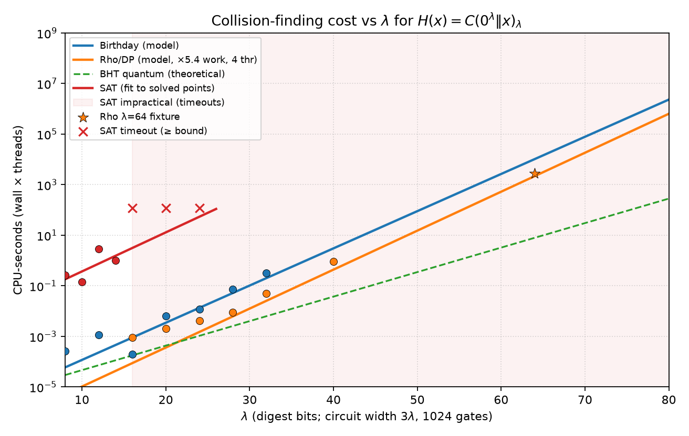

# 2λ→λ collisions on random reversible circuits

Parameterize by a security length $\lambda$. Build a compressing hash from a
random reversible circuit $C$ on $3\lambda$ wires:

$$
H(x) = C(0^{\lambda} \Vert x)_{\lambda},
\qquad x \in \{0,1\}^{2\lambda}.
$$

So the circuit is always $3\lambda$ bits wide, with $2\lambda$-bit inputs and
$\lambda$-bit outputs (output half the input size). Wire 0 is the LSB.

| Fixture | $\lambda$ | Wires ($3\lambda$) | Gates | Hash ($2\lambda\to\lambda$) |
| --- | ---: | ---: | ---: | --- |
| `c96_g1024` | 32 | 96 | 1024 | 64→32 |
| `c192_g1024` | 64 | 192 | 1024 | 128→64 |

A collision is a pair $x_1 \neq x_2$ with $H(x_1)=H(x_2)$.

## Attack choice

| $\lambda$ | Method | Why |
| ---: | --- | --- |
| 32 | Hash-table birthday | ~$2^{16}$ evals, tiny memory |
| 64 | Parallel DP rho (van Oorschot–Wiener) | ~$2^{32}$ evals; a full birthday table would need tens of GB |
| Larger / constrained | SAT (`collision_to_cnf`) | When sampling is impractical or inputs are restricted |

Bit-sliced evaluation of the $\lambda=64$ circuit runs at roughly 50 Meval/s on a
4-core host, so a collision is minutes, not hours.

## Generate a circuit

```bash
cargo build --release --features security-tools \
  --bin gen_collision_circuit --bin birthday_collision --bin rho_collision

target/release/gen_collision_circuit \
  security_tests/collision/fixtures/c96_g1024 96 1024 20260330
target/release/gen_collision_circuit \
  security_tests/collision/fixtures/c192_g1024 192 1024 20260330
```

Each call writes `.g57`, `.mpmct1`, and `.meta.json`. When the wire count $N$
is divisible by 3, the layout is inferred as $\lambda=N/3$
($\mathrm{pad}=\lambda$, $\mathrm{in}=2\lambda$, $\mathrm{out}=\lambda$).
Both checked-in fixtures used seed `20260330`.

### λ=32 witness (`c96_g1024.birthday.json`)

| | |
| --- | --- |
| $x_1$ | `0xf64d34a740cbd971` |
| $x_2$ | `0x741f0b81c8aaf22a` |
| digest | `0xd4fc8d7a` |
| samples | 55 618 (~138 ms) |

### λ=64 witness (`c192_g1024.rho.json`)

Search used a 64-bit message subspace (high 64 of the $2\lambda=128$ message
bits zero). That is still a valid collision for the full $128\to 64$ hash;
enlarging the domain does not raise the $\sim 2^{\lambda/2}$ cost.

| | |
| --- | --- |
| $x_1$ | `0x68032fc8c02245c7` |
| $x_2$ | `0xba217b6200edaf67` |
| digest | `0xead05de351770b3b` |
| evals | ~3.66×10¹⁰ (~11.5 min at ~53 Meval/s) |

## Birthday attack (λ=32)

```bash
mkdir -p target/security-demo/collision
target/release/birthday_collision \
  security_tests/collision/fixtures/c96_g1024.g57 \
  --pad 32 --in-bits 64 --out-bits 32 \
  --samples 300000 --seed 1 \
  --out target/security-demo/collision/birthday.json
```

## Rho / distinguished-point attack (λ=64)

```bash
target/release/rho_collision \
  security_tests/collision/fixtures/c192_g1024.g57 \
  --pad 64 --out-bits 64 --dp-bits 16 --seed 1 \
  --out target/security-demo/collision/rho64.json
```

`--self-check` compares bit-sliced lanes against scalar `u256` evaluation.
Re-check a pair with:

```bash
cargo run --release --locked -- circuit evaluate -n 192 \
  -s security_tests/collision/fixtures/c192_g1024.g57 \
  --input 0x68032fc8c02245c7
```

Compare the low 64 bits (16 hex digits) of the two outputs.

## SAT attack (optional)

```bash
mkdir -p target/security-demo/collision
g++ -std=c++17 -O3 security_tests/collision/collision_to_cnf.cpp \
  -o target/security-demo/collision/collision_to_cnf

target/security-demo/collision/collision_to_cnf \
  security_tests/collision/fixtures/c96_g1024.mpmct1 \
  target/security-demo/collision/collision.cnf \
  --in-bits 64 --pad 32 --out-bits 32

# requires an external solver on PATH, e.g. kissat
kissat --time=60 target/security-demo/collision/collision.cnf \
  > target/security-demo/collision/solver.log || true

python security_tests/collision/decode_collision_model.py \
  --circuit security_tests/collision/fixtures/c96_g1024.mpmct1 \
  --solver-output target/security-demo/collision/solver.log \
  --in-bits 64 --pad 32 --out-bits 32 \
  --out target/security-demo/collision/sat-verified.json
```

For $\lambda=64$ use `--in-bits 128 --pad 64 --out-bits 64`. On toy sizes
(`--in-bits 8 --pad 4 --out-bits 4`) the encoder is small enough for a quick
solver smoke test.

## Cost vs λ comparison

`compare_attack_costs.py` sweeps λ, measures scalar/bit-sliced throughput,
runs birthday/rho/SAT where practical, and plots **CPU-seconds**
(wall × threads) against λ. Classical models use $\sim 1.25\cdot 2^{\lambda/2}$
hash evaluations; rho includes an empirical work overhead from measured runs.
A BHT quantum reference ($\sim 2^{\lambda/3}$ oracle queries) is drawn for scale.

```bash
python3 security_tests/collision/compare_attack_costs.py \
  --out-dir target/security-demo/collision/cost_compare
```

Checked-in summary: `fixtures/cost_compare.png` and `fixtures/cost_compare.json`.



Trends from that sweep (1024-gate circuits, 4 cores for rho):

| Attack | Practical up to | Scaling hint |
| --- | --- | --- |
| Birthday | measured ≤32; model beyond | $\sim 2^{\lambda/2}$ / scalar Meval/s |
| Rho/DP | measured ≤40 + λ=64 fixture | same exponent, fewer CPU-seconds via lanes + threads |
| SAT (Glucose3) | solved ≤14; timeouts ≥16 | poor beyond small λ on this encoding |
| BHT (quantum, theoretical) | — | $\sim 2^{\lambda/3}$ if each query ≈ one eval |

## Tests

```bash
python3 -m unittest security_tests.collision.test_collision -v
```
